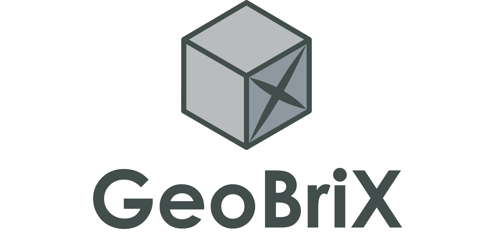
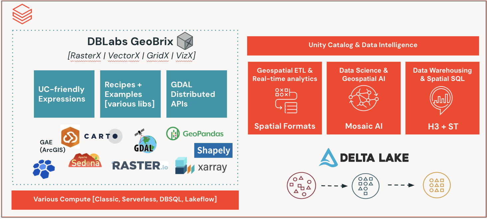
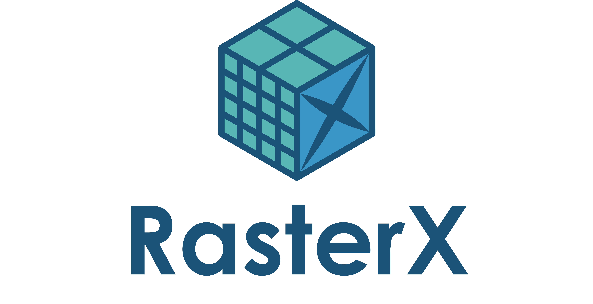
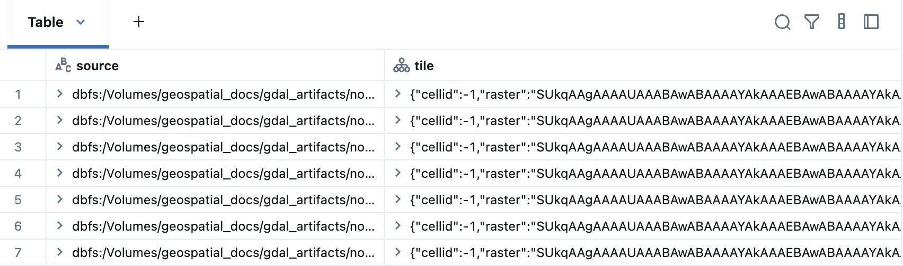
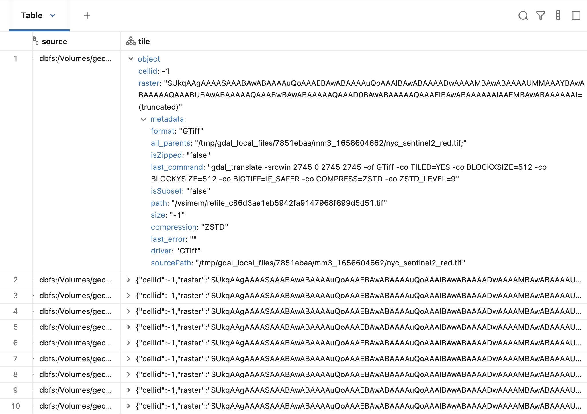
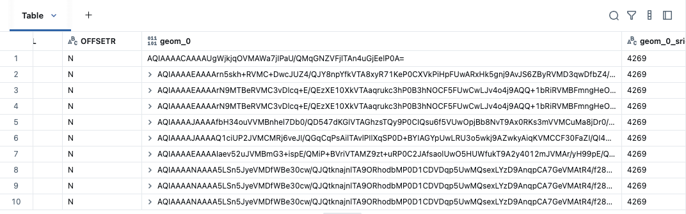
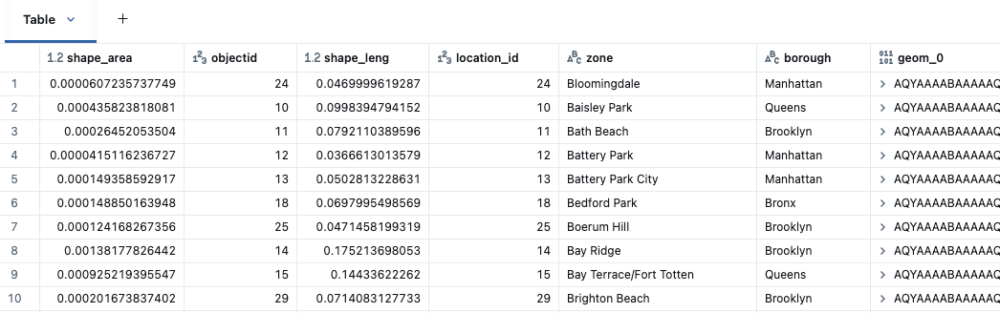
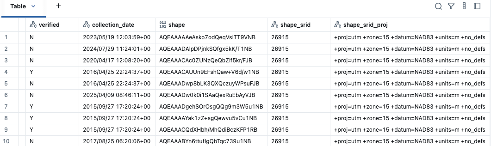
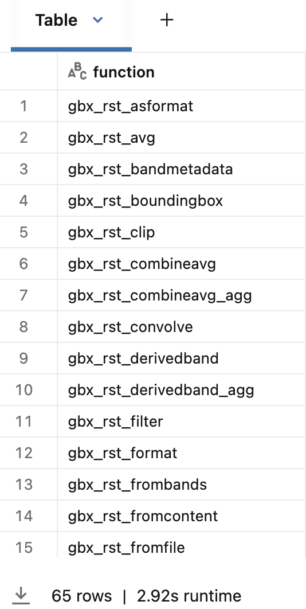
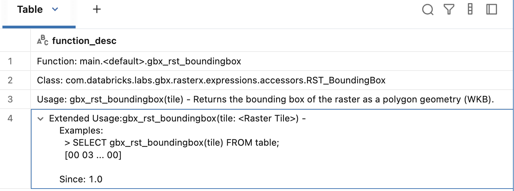

[](https://github.com/databrickslabs/geobrix/actions/workflows/build_main.yml)
[](https://codecov.io/gh/databrickslabs/geobrix)
[](https://github.com/databrickslabs/geobrix/actions/workflows/doc-tests.yml)
[](https://databrickslabs.github.io/geobrix/)
[](https://www.scala-lang.org/)
[](https://www.python.org/)
[](LICENSE)

GeoBrix is a high-performance spatial processing library. Its heavy-weight readers and functions are powered by GDAL, implemented on Apache Spark, and built to run exclusively on the Databricks Runtime (DBR).

## Background

Now that product built-in [Spatial SQL Functions](https://docs.databricks.com/aws/en/sql/language-manual/sql-ref-st-geospatial-functions) have reached public preview as of DBR17.1, we are seeking to deliver the next generation of product-augmenting capabilities to help our customers. GeoBrix project is a streamlined iteration to the existing, and quite popular, [DBLabs Mosaic](https://databrickslabs.github.io/mosaic/index.html) project. Beyond just porting existing Mosaic code, GeoBrix is modernized with expressions designed to work with our [Data Intelligence Platform](https://www.databricks.com/product/data-intelligence-platform). GeoBrix will be a combination of heavy-weight (e.g. JAR) as well as lightweight (e.g Python, SQL) code artifacts. It also will focus on techniques to use the Databricks platform more widely.

With Databricks first having acquired [MosaicML](https://www.databricks.com/company/newsroom/press-releases/databricks-completes-acquisition-mosaicml) and now having made a product line, [Mosaic AI](https://www.databricks.com/product/artificial-intelligence), it has become clear that the DBLabs Mosaic project, sharing the name, needs to be revamped in name as well as any existing Mosaic capabilities that compete with product investments. If this were not the case, we would have simply iterated on DBLabs Mosaic “in-place” keeping the same name for what is now called GeoBrix. DBLabs Mosaic is in maintenance mode. The latest/last version of Mosaic targets DBR 13.3 LTS since product introduced ST functions starting with DBR 14. As such, Mosaic does not have any awareness of advancements in recent runtimes, including product support for spatial sql and types, and will be retired with [DBR 13.3 EoS](https://docs.databricks.com/aws/en/release-notes/runtime/#supported-databricks-runtime-lts-releases) in AUG 2026.



## Packages

GeoBrix offers heavy-weight packages for Raster, Grid, and Vector that are intended to augment and compliment ongoing Databricks product initiatives. 

### RasterX



Refactor and improvement of Mosaic raster functions. Product does not (yet) support anything built-in specifically for raster, so this is a “fully” gap-filling capability.

### GridX


Refactor of Mosaic discrete global grid indexing functions. Focus has been on porting BNG for Great Britain customers.

### VectorX


Refactor of select DBLabs Mosaic vector functions that augment existing product ST Geospatial Functions. Right now, this only includes a single function to handle updating existing Mosaic geometry data to those supported by product, so that users do not need to install (older) Mosaic in order to get to using the latest spatial features.

## Readers

The following spark readers are automatically registered with the JAR on the classpath.

### Raster [“gdal”]

#### Options

* “sizeInMB”    → defaults to “16” - split the file if over the threshold
* “filterRegex”  → defaults to “.*” - filter loaded files from the provided directory

We are really only focused on [GeoTiffs](https://gdal.org/en/stable/drivers/raster/gtiff.html) right now, but you are free to try to load any available driver with something like:

```
(
  spark
    .read.format(“gdal”)
    .option("driverName", "<driver>") # if not provided, extension is used to detect
    .load("<path>")
)
```



### Named Readers

The following are available and call the “gdal” reader with some options explicitly set.

#### GeoTiff ["gtiff_gdal"]

Read GeoTIFF raster files - the most common geospatial raster format. This is a named GDAL Reader, sets “driverName” → "[GTiff](https://gdal.org/en/stable/drivers/raster/gtiff.html)":

* GDAL auto-associates GeoTiff and BigTiff extensions to this driver, e.g. __.tif__ files
* With the named reader, the driver is specified to be used regardless of extension
* Can use the other available "gdal" reader options

```commandline
(
  spark
    .read.format(“gtiff_gdal”)
    .load("<path_to_supported_files>")
)
```

The output will look something like the following, with `tile` column now ready to use with other RasterX APIs.



### Vector [“ogr”]

#### Options

* “driverName” → if not provided, GDAL uses best guess based on file extension
* “chunkSize”   → default "10000" - number of records for multi-threading per file reading
* “layerN”         → default “0” - for file formats that use layers
* “layerName”  → default “” - for file formats that use layers
* “asWKB”       → default “true” - whether to return WKB or WKT geometry results

Note: For the Beta, results are not converted to Databricks new native spatial types for [GEOMETRY](https://docs.databricks.com/aws/en/sql/language-manual/data-types/geometry-type#gsc.tab=0) / [GEOGRAPHY](https://docs.databricks.com/aws/en/sql/language-manual/data-types/geography-type), so this would be an additional step once the data has been read.

### Named Readers

The following are available and call the “ogr” reader with some options explicitly set.

#### Shapefile [“shapefile_ogr”]

This is a named OGR Reader, sets “driverName” → "[ESRI Shapefile](https://gdal.org/en/stable/drivers/vector/shapefile.html)":

* GDAL auto-associates the following extensions to this driver: __.shz__ files (ZIP files containing the .shp, .shx, .dbf and other side-car files of a single layer) and __.shp.zip__ files (ZIP files containing one or several layers)
* With the named reader, GDAL can additionally handle __.zip__ files (ZIP files containing one or several layers)

```
(
  spark
    .read.format(“shapefile_ogr”)
    .load("<path_to_supported_files>")
)
```

The output will look something like the following, maintaining attribute columns and having 3 columns for geometry: ‘geom_0’, ‘geom_0_srid’, and ‘geom_0_srid_proj’.



### GeoJSON [“geojson_ogr”]

This is a named OGR Reader.

#### Options

* “multi” → default “true”
  * when “true” set “driverName” → "[GeoJSONSeq](https://gdal.org/en/stable/drivers/vector/geojsonseq.html)"
  * otherwise | “[GeoJSON](https://gdal.org/en/stable/drivers/vector/geojson.html)”

```
(
  spark
    .read.format(“geojson_ogr”)
    .option("multi", "false") # if not provided, "true" assumed
    .load("<path_to_supported_files>")
)
```

The output will look something like the following, maintaining attribute columns and having 3 columns for geometry: ‘geom_0’, ‘geom_0_srid’, and ‘geom_0_srid_proj’.



### GeoPackage [“gpkg_ogr”]

This is a named OGR Reader, sets “driverName” → "[GPKG](https://gdal.org/en/stable/drivers/vector/gpkg.html)".

```
(
  spark
    .read.format(“gpkg_ogr”)
    .load("<path_to_supported_files>")
)
```

The output will look something like the following, maintaining attribute columns and having 3 columns for geometry: ‘shape’, ‘shape_srid’, and ‘shape_srid_proj’.



### File GeoDatabase [“file_gdb_ogr”]

This is a named OGR Reader, sets “driverName” → "[OpenFileGDB](https://gdal.org/en/stable/drivers/vector/openfilegdb.html)". You also may want to specify options “layerN” or “layerName” to read the desired layer.

```
(
  spark
    .read.format(“file_gdb_ogr”)
    .load("<path_to_supported_files>")
)
```

The output will look something like the following, maintaining attribute columns and having 3 columns for geometry: ‘SHAPE’, ‘SHAPE_srid’, and ‘SHAPE_srid_proj’. Note: column names are case insensitive.


## Support
Please note that all projects in the /databrickslabs github account are provided for your exploration only, and are not formally supported by Databricks with Service Level Agreements (SLAs). They are provided AS-IS and we do not make any guarantees of any kind. Please do not submit a support ticket relating to any issues arising from the use of these projects.

Any issues discovered through the use of this project should be filed as GitHub Issues on the Repo. They will be reviewed as time permits, but there are no formal SLAs for support.

## Installing & Using GeoBrix

GeoBrix currently offers heavy-weight, distributed APIs, primarily written in Scala for Spark with additional language bindings for PySpark and Spark SQL. See docs for more information on installing and using available readers and functions.

### Quick Start

Cluster Config

GeoBrix requires GDAL natives, which are best installed via an init script on a classic cluster

1. Add the GeoBrix JAR and Shared Object ('*.so') to the Volume - currently these are delivered via artifacts in the the [beta-dist](resources/beta-dist) directory.
3. Add [geobrix-gdal-init.sh](./scripts/geobrix-gdal-init.sh) to a chosen Databricks Volume; note: prior to copying, modify 'VOL_DIR' to the location of the artifacts in (1).
3. Add the WHL as a cluster library.

To get up and running with PySpark bindings and SQL function registration in a cluster, execute the following (note: you do not need to do this if you are just using the included readers):

```
from databricks.labs.gbx.rasterx import functions as rx

rx.register(spark)
```

You can quickly list the registered functions with a SQL command.

```
%sql
-- hint: you can sort the return column
show functions like 'gbx_rst_*'
```



Describe any registered function for more details.

```
%sql describe function extended gbx_rst_boundingbox
```



See the included examples in [beta-dist](resources/beta-dist) directory for more.

### Scala Bindings
The heavy-weight API is written in Scala with various spark optimizations implemented with best practices, including using Spark Connect to invoke the columnar expressions. The pattern for registering functions is `com.databricks.labs.gbx.<category>.functions` where ‘gbx’ is the convention for GeoBrix in classpaths:

* __VectorX__ - sample function `vx.st_legacyaswkb`.
  * `import com.databricks.labs.gbx.vectorx.{functions => vx}`
  * `vx.register(spark)`
  * `vx.<function>`
* __GridX__ (showing BNG) `import com.databricks.labs.gbx.gridx.bng.{functions => bx}` (same registrations and execution pattern as VectorX) - sample function `bx.bng_cellarea`.
* __RasterX__ `import com.databricks.labs.gbx.rasterx.{functions => rx}` (same registrations and execution pattern as VectorX) - sample functions `rx.rst_clip`.

### Python Bindings
The python bindings are a lightweight wrapper to the underlying Scala columnar expressions via Spark Connect. Functions are registered in a similar manner as with scala:

* __VectorX__
  * `from databricks.labs.gbx.vectorx import functions as vx`
  * `vx.register(spark)`
  * `vx.<function>`
* __GridX__ (showing BNG) `from databricks.labs.gbx.gridx.bng import functions as bx` (same registrations and execution pattern as VectorX)
* __RasterX__ `from databricks.labs.gbx.rasterx import functions as rx` (same registrations and execution pattern as VectorX)

### SQL
All GeoBrix SQL functions will be registered with gbx_ prefix. This reflects a lesson learned from previous experiences, where functions registered without a prefix is unattributable to any particular provider on classic compute, e.g. cannot tell whether st_<function> invoked within classic compute is from product or Sedona, etc., but usage will be easily attributable to GeoBrix when gbx_st_<function> is invoked:

* Sample vector expression: `gbx_st_legacyaswkb`
* Sample grid expression: `gbx_bng_cellarea`
* Sample raster expression: `gbx_rst_clip`

## Building | Deploying | Releasing the Project
See the [scripts](./scripts) folder for more information.

## Known Limitations
* The Beta does not yet support Databricks Spatial Types directly but is standardized to WKB or WKT where geometries are involved. In addition to content in the user guide, the provided notebooks, e.g. Shapefile Reader, have examples of converting to our built-in [GEOMETRY](https://docs.databricks.com/aws/en/sql/language-manual/data-types/geometry-type#gsc.tab=0) type and using our built-in ST Geospatial Functions.
* A handful of functions are not yet ported. For raster: `rst_dtmfromgeoms` and for vector: `st_interpolateelevation` and `st_triangulate`.
* Spatial KNN is not yet ported; neither is H3 support for Geometry-based K-Ring and K-Loop.
* Custom Gridding is not fully ported.
