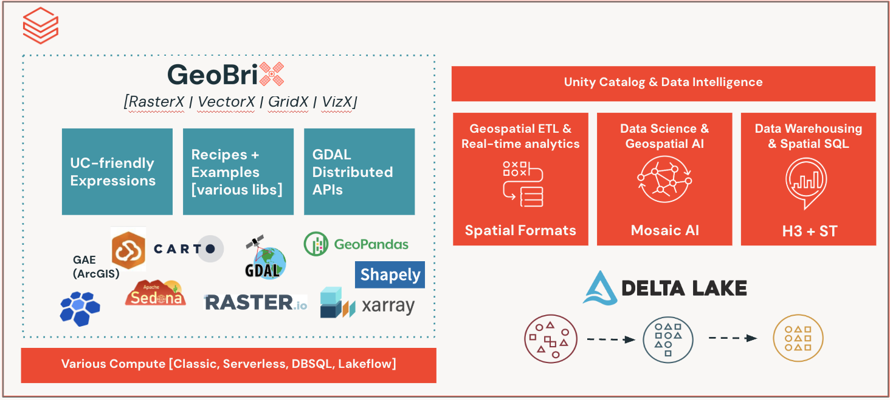

[](https://github.com/databrickslabs/geobrix/actions/workflows/build_main.yml)
[](https://codecov.io/gh/databrickslabs/geobrix)
[](https://databrickslabs.github.io/geobrix/)
[](https://www.scala-lang.org/)
[](https://www.python.org/)
[](LICENSE)

<!--
  SQL function counts — keep verbatim with docs/tests-function-info/registered_functions.txt
  (the canonical source: Functions = total lines; RasterX = gbx_rst_*, GridX =
  gbx_bng_*+gbx_custom_*+gbx_h3_*+gbx_quadbin_*, VectorX = gbx_st_*, PMTiles = gbx_pmtiles_*).
  Run `gbx:test:bindings` after changes to confirm binding parity.
  VizX is NOT a SQL package — its badge counts the public helpers in
  python/geobrix/src/databricks/labs/gbx/vizx/__init__.py __all__, and is excluded from the total.
  Update these badges if functions are added or removed.
-->


**GeoBrix** is a high-performance spatial library for Databricks that delivers the next generation of *product-augmenting* capabilities — raster, discrete global grids, and vector format I/O — and is built to drive you *deeper* into Databricks-native [`GEOMETRY`/`GEOGRAPHY` and ST/H3 functions](https://databrickslabs.github.io/geobrix/docs/databricks-spatial), not replace them. It is the modern successor to [DBLabs Mosaic](https://databrickslabs.github.io/mosaic/) (now in maintenance).

> **Full docs:** **https://databrickslabs.github.io/geobrix/** — this README is the 2-minute tour.



## Tiers

- **Lightweight tier** — pure Python (+ SQL bindings) on [rasterio](https://rasterio.readthedocs.io/)/[pyogrio](https://pyogrio.readthedocs.io/)/[shapely](https://shapely.readthedocs.io/), **no JAR, no init script, no native GDAL bundle**. Runs on **Serverless**, standard (shared), Lakeflow pipelines, and **ARM** — where the heavyweight tier can't.
- **Heavyweight tier** — Scala (Python and SQL bindings) + native GDAL for distributed processing on classic (x86) clusters. **Same function names across tiers** — switching is a one-line import change.

## Packages

  

- **[RasterX](https://databrickslabs.github.io/geobrix/docs/api/raster-functions)** — raster I/O and analytics (gap-filling; the platform has no built-in raster). **Both tiers** — lightweight `pyrx` and heavyweight Scala.
- **[GridX](https://databrickslabs.github.io/geobrix/docs/api/gridx-functions)** — BNG, Quadbin, and custom grids (pairs with native H3 for global hex). **Both tiers** — lightweight `pygx` and heavyweight Scala.
- **[VectorX](https://databrickslabs.github.io/geobrix/docs/api/vectorx-functions)** — MVT tiles, TIN surfaces, and legacy-geometry migration on top of native ST. **Both tiers** — lightweight `pyvx` and heavyweight Scala.

All SQL functions register with a `gbx_` prefix (e.g. `gbx_rst_clip`, `gbx_bng_cellarea`, `gbx_st_asmvt`) so usage is clearly attributable to GeoBrix on classic compute. Python/Scala bindings mirror the names. See [benchmarks](https://databrickslabs.github.io/geobrix/docs/api/benchmarking) for light-vs-heavy timings. 

## Supported Databricks Runtimes

GeoBrix supports both current Databricks Runtime LTS releases:

| DBR LTS | Ubuntu | Spark | Python | Scala | Java | Serverless env | GeoBrix |
|---|---|---|---|---|---|---|---|
| **17.3 LTS** | 24.04 | 4.0.0 | 3.12.3 | 2.13.16 | 17 | **5+** (Py 3.12) | ✅ Supported |
| **18 LTS** | 24.04 | 4.1.0 | 3.12.3 | 2.13.16 | 21 | **5+** (Py 3.12) | ✅ Supported |

A **single wheel + single JAR** runs on both: Scala 2.13.16 matches both runtimes, the JAR is compiled to Java-17 bytecode so it loads on both JVMs, and Spark is a `provided` dependency.

The **Serverless env** column is the minimum Serverless environment version for the lightweight tier: **version 5+** provides Python 3.12, which the `[light]` dependencies require (Python ≥ 3.11). Older environment versions (Python 3.10) can't install `geobrix[light]`. Env v5 release notes: [AWS](https://docs.databricks.com/aws/en/release-notes/serverless/environment-version/five) · [Azure](https://learn.microsoft.com/azure/databricks/release-notes/serverless/environment-version/five) · [GCP](https://docs.databricks.com/gcp/en/release-notes/serverless/environment-version/five).

> **DBR 19 LTS is coming soon**, built on **Ubuntu 26.04**. The **lightweight** tier (pure-Python, rasterio's bundled GDAL) will be unaffected; the **heavyweight** tier's native GDAL/OGR libraries are compiled against the cluster OS, so they will need to be rebuilt for the new base image.

## Quick start (lightweight)

Stage the wheel (a [Releases](https://github.com/databrickslabs/geobrix/releases) artifact, not on PyPI) in a Unity Catalog Volume, then install the `[light]` extra:

```python
%pip install "geobrix[light] @ file:///Volumes/<catalog>/<schema>/<volume>/geobrix-<version>-py3-none-any.whl"
```

> **Use the quoted `geobrix[light] @ file://…` form** (PEP 508, one argument). Don't put the extra on the path (`'/Volumes/…/…whl[light]'`) — on Serverless, `%pip` keeps the surrounding quotes and pip reads `[light]` as part of the filename, failing with *"Expected package name at the start of dependency specifier."* The named form installs cleanly on Serverless, standard/shared, and ARM.

```python
from databricks.labs.gbx.ds.register import register   # *_gbx readers/writers
from databricks.labs.gbx.pyrx import functions as rx   # gbx_rst_* functions

register(spark)
rx.register(spark)   # optional — only to call the gbx_rst_* SQL functions

# Read a GeoTIFF and compute with RasterX
rasters = spark.read.format("gtiff_gbx").load("/Volumes/<catalog>/<schema>/<volume>/*.tif")
rasters.select(rx.rst_width("tile"), rx.rst_srid("tile")).show()

# Vector read -> write (round-trips with the matching reader)
boroughs = spark.read.format("geojson_gbx").load("/Volumes/.../boroughs.geojson")
boroughs.write.format("geojson_gbx").mode("overwrite").save("/Volumes/.../out.geojson")
```

**Heavyweight** is the same code with `from databricks.labs.gbx.rasterx import functions as rx`, plus the JAR and a GDAL init script — see [Installing & Choosing a Tier](https://databrickslabs.github.io/geobrix/docs/api/execution-tiers).

## Readers & writers

Lightweight formats use the `*_gbx` suffix; heavyweight use `*_ogr` (vector) / `gdal` (raster). Light and heavy emit the **same schema**, so they are drop-in swaps. Full options and examples: [Readers](https://databrickslabs.github.io/geobrix/docs/readers/overview) · [Writers](https://databrickslabs.github.io/geobrix/docs/writers/overview).

**Raster & tiles**

| Format | Read (light / heavy) | Write (light / heavy) |
|---|---|---|
| Raster (any GDAL driver) | `raster_gbx` / `gdal` | `raster_gbx` / `gdal` |
| GeoTIFF | `gtiff_gbx` / `gtiff_gdal` | `gtiff_gbx` / `gtiff_gdal` |
| PMTiles | — | `pmtiles_gbx` / `pmtiles` |

**Vector** — single-file vector writes are lightweight-only; the **sharded GeoJSONL** writer (multi-file, one shard per partition, no driver merge — the recommended writer at any scale) is available in **both** tiers.

| Format | Read (light / heavy) | Write |
|---|---|---|
| Vector (any OGR driver) | `vector_gbx` / `ogr` | `vector_gbx` (light) |
| Shapefile | `shapefile_gbx` / `shapefile_ogr` | `shapefile_gbx` (light) |
| GeoJSON | `geojson_gbx` / `geojson_ogr` | `geojson_gbx` (light) |
| GeoPackage | `gpkg_gbx` / `gpkg_ogr` | `gpkg_gbx` (light) |
| File Geodatabase | `file_gdb_gbx` / `file_gdb_ogr` | `file_gdb_gbx` (light) ¹ |
| GeoJSONL — *sharded, multi-file* | read via `geojson_gbx` (`multi=true`) | `geojsonl_gbx` / `geojsonl` (light **and** heavy) |

¹ `file_gdb_gbx` write is a **hybrid**: it encodes the `.gdb` via the native GDAL (`osgeo`) from the heavyweight GDAL init script, because pyogrio's bundled GDAL ships a read-only OpenFileGDB driver. On compute with those natives it writes natively; otherwise it raises a clear error (use `gpkg_gbx` / `geojson_gbx`). FileGDB *reading* is lightweight-only.

Light vector readers/writers exchange geometry as **WKB/WKT** with companion `*_srid` columns — convert to/from Databricks `GEOMETRY` with `st_geomfromwkb` / `st_aswkb` (see [Databricks Spatial](https://databrickslabs.github.io/geobrix/docs/databricks-spatial)).

## Known limitations

- Native Databricks `GEOMETRY`/`GEOGRAPHY` are not produced directly yet — geometries are exchanged as **WKB/WKT** (+ `*_srid`); convert with the native ST functions ([Databricks Spatial](https://databrickslabs.github.io/geobrix/docs/databricks-spatial)).
- Spatial KNN is not yet ported; nor is H3 for geometry-based k-ring / k-loop.

## Building, deploying, releasing

See the [`scripts`](./scripts) folder and the [docs](https://databrickslabs.github.io/geobrix/docs/developers).

## Support

Databricks Labs projects are provided **AS-IS**, for exploration only, and are **not** covered by Databricks SLAs. Please file issues as [GitHub Issues](https://github.com/databrickslabs/geobrix/issues); they are reviewed as time permits. Do not file Databricks support tickets for these projects.
