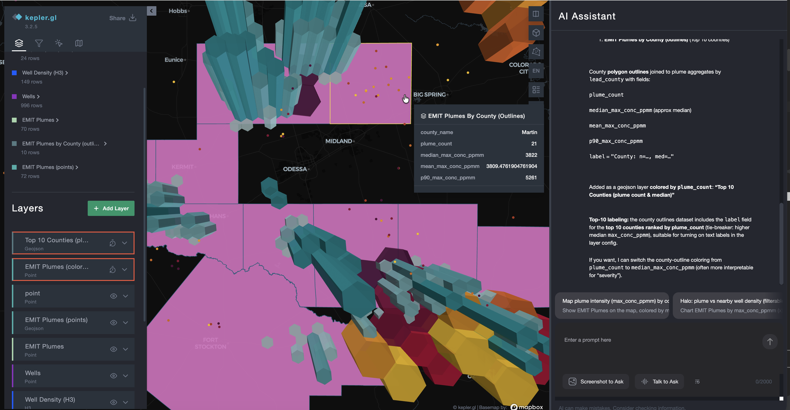
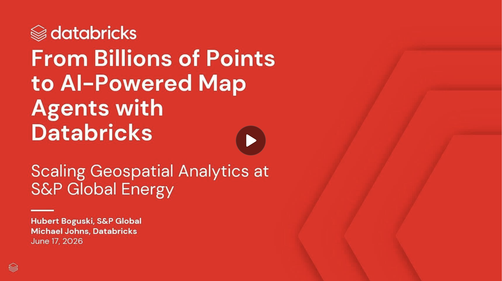

# Genie Map

A Databricks App that turns the GeoBrix-processed Permian methane gold data into
an interactive map you can explore two ways:

- **Move the map** — pan and zoom and the app runs parameterized Spark SQL for the
  current viewport, drawing H3 hexagon and point layers that redraw as you navigate.
- **Ask a question** — type a natural-language question in the AI Assistant panel and,
  when the answer carries a geometry, it renders as a map layer alongside the others.


*Ask "Chart plume concentration and let me filter the map", then brush the histogram — the
selection cross-filters the plume layer on the map (chart and map are the same dataset).*



Four layers ship out of the box: CH₄ hotspots (H3), well density (H3), individual
wells (points), and EMIT plumes (points). The H3 layers are **density-aware**: they
coarsen their hexagons where cells are crowded and refine them as you zoom in, so the
map stays readable from a basin-wide screen down to a single well pad.

The client is React + [kepler.gl](https://kepler.gl); the server is Databricks
[AppKit](https://github.com/databricks-solutions/databricks-appkit). The map reads the
`geospatial_docs.vapor_eyes_lf` gold schema produced by the
[Vapor-Eyes](https://databrickslabs.github.io/geobrix/docs/notebooks/vapor-eyes) methane
pipeline.

> **Featured at Data + AI Summit 2026 — with S&P Global.** Genie Map grew out of the
> AI-powered map-agent demo from the DAIS 2026 session
> **[Scaling Geospatial Analytics at S&P Global Energy: From Billions of Points to AI-Powered Map Agents with Databricks](https://www.databricks.com/dataaisummit/session/scaling-geospatial-analytics-sp-global-energy-billions-points-ai-powered)**,
> presented by **[Hubert Boguski](https://www.linkedin.com/in/hubertboguski/)** (S&P Global)
> and **[Michael Johns](https://www.linkedin.com/in/michaeljohns2/)** (Databricks).
>
> [](https://www.databricks.com/dataaisummit/session/scaling-geospatial-analytics-sp-global-energy-billions-points-ai-powered)
>
> ▶ **[Watch the session](https://www.databricks.com/dataaisummit/session/scaling-geospatial-analytics-sp-global-energy-billions-points-ai-powered)** on databricks.com.

## Prerequisites

Before running the app, you need:

1. **The methane gold schema materialized.** Deploy and run the Vapor-Eyes pipeline so
   `geospatial_docs.vapor_eyes_lf` exists and is populated — including
   `wells_enriched_latest`, the map-ready wells view the app reads. Verify with:

   ```sql
   SELECT count(*) FROM geospatial_docs.vapor_eyes_lf.wells_enriched_latest;
   ```

2. **A curated Genie Space** scoped to the map-ready gold tables, returning geometry as an
   `ST_ASGEOJSON(...)`-aliased column so answers can be drawn on the map. Note its id.

3. **A Mapbox access token** for the basemap.

4. **A SQL warehouse** to run the viewport queries against.

## Configure

Copy the template and fill in your values:

```bash
cp databricks.env.example databricks.env
```

Then edit `databricks.env` (it is git-ignored — never commit it) with your workspace
host and token, the SQL warehouse id, the curated Genie Space id, and your Mapbox token.
The `gbx:app:*` commands source this file into the shell before building, so the same
values reach both the client build and the server.

## Run locally

```bash
bash scripts/commands/gbx-app-dev.sh
```

This starts the app with hot reload on `http://localhost:3000`. Move the map to confirm
the CH₄ and well-density hexagons and the well/plume points draw and redraw across zoom,
and ask a spatial question to confirm the answer renders as a layer.

## Deploy

```bash
bash scripts/commands/gbx-app-deploy.sh --profile oauth-fe
```

This builds the client and server and deploys the app through its asset bundle
(`databricks.yml`, at the app root) to your workspace.

## Adding another dataset

The map is config-driven: one `DatasetConfig` in `client/src/config/datasets/` declares
its layers, and everything downstream — the SQL to run, the kepler layer to build, when
each layer is visible — is derived from it. Select the active dataset with
`VITE_ACTIVE_DATASET` in `databricks.env`. To point the map at a different scenario, add a
`DatasetConfig`; no app code changes.

## Learn more

- [`docs/SETUP.md`](docs/SETUP.md) — the end-to-end setup runbook: what the DAB bundle
  automates (app, scopes, resource grants, the Genie Space) versus the few manual steps
  (UC secret values, Genie-UI curation, first-user re-consent), each one command or copy/paste.
- [`docs/GENIE-SPACE.md`](docs/GENIE-SPACE.md) — the canonical Genie Space definition:
  the tables, and copy/paste-ready instruction + example-SQL blocks for the Genie UI.
- [`docs/BUILD.md`](docs/BUILD.md) — the full build narrative: what was adapted, the
  layer-registry contract, the density-aware dynamic H3 design, the wells gold view, the
  Genie Space curation, and a step-by-step reproduce-it runbook.
- [Genie Map example page](https://databrickslabs.github.io/geobrix/docs/examples/genie-map)
  — the user-facing overview on the GeoBrix docs site.
