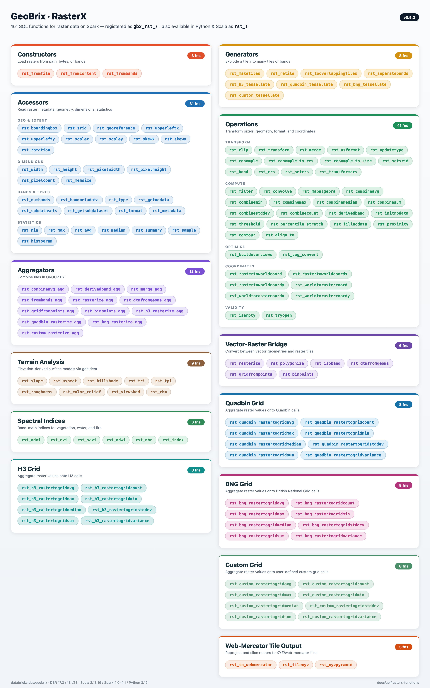

import Tabs from '@theme/Tabs';
import TabItem from '@theme/TabItem';
import CodeFromTest from '@site/src/components/CodeFromTest';
import Tier from '@site/src/components/Tier';
import { Impl } from '@site/src/components/Tier';
import RasterXIcon from '../../../resources/images/brand/RasterX.png';
import rasterxCode from '!!raw-loader!../../tests/python/api/rasterx_functions.py';
import pyrxCode from '!!raw-loader!../../tests/python/api/pyrx_functions.py';
import rasterxSqlCode from '!!raw-loader!../../tests/python/api/rasterx_functions_sql.py';
import scalaApiExamplesCode from '!!raw-loader!../../tests/scala/api/ScalaApiExamples.scala';
import rasterxLightCode from '!!raw-loader!../../tests/python/api/rasterx_functions_python_light.py';
import rasterxAccessorsLightCode from '!!raw-loader!../../tests/python/api/rasterx_accessors_python_light.py';
import rasterxTileopsLightCode from '!!raw-loader!../../tests/python/api/rasterx_tileops_python_light.py';
import rasterxAggregatorsLightCode from '!!raw-loader!../../tests/python/api/rasterx_aggregators_python_light.py';
import rasterxBandmathLightCode from '!!raw-loader!../../tests/python/api/rasterx_bandmath_python_light.py';
import rasterxTerrainLightCode from '!!raw-loader!../../tests/python/api/rasterx_terrain_python_light.py';
import rasterxTransformsLightCode from '!!raw-loader!../../tests/python/api/rasterx_transforms_python_light.py';
import rasterxGeneratorsLightCode from '!!raw-loader!../../tests/python/api/rasterx_generators_python_light.py';
import rasterxGridaggLightCode from '!!raw-loader!../../tests/python/api/rasterx_gridagg_python_light.py';
import FunctionExamples from '@site/src/components/FunctionExamples';
import VirtualTileOverrides from '../_partials/_virtual-tile-overrides.mdx';

#  Function Reference

RasterX functions run in two execution tiers — **lightweight** (pure-Python `pyrx`) and **heavyweight** (`rasterx`). As of v0.4.0, **every RasterX function is available in both tiers** (badged `<Tier both/>` per function below); per-function notes call out where the lightweight implementation differs. See [Choosing an Execution Tier](./execution-tiers) for the comparison and the lightweight install.

Complete reference for all RasterX functions with detailed descriptions, parameters, return values, and examples.

:::tip Built on rasterio
RasterX's lightweight tier is, in large part, **distributed rasterio** + a best-of-breed raster stack. See [Rasterio Distributed](./rasterio-distributed) for the coverage matrix and honest gaps.
:::

## Overview

RasterX is GeoBrix's raster data processing package, providing comprehensive tools for working with raster datasets such as satellite imagery, elevation models, and other gridded spatial data. It is a refactor and improvement of Mosaic raster functions, extended in v0.4.0 with terrain analysis, spectral indices, vector-raster bridging, web-mercator tile output, and quadbin grid aggregations. Since the Databricks product does not (yet) support anything built-in specifically for raster processing, RasterX provides a gap-filling capability for raster operations on the Databricks platform.

## Key Features

- **GDAL-Powered**: Leverages GDAL for robust raster format support
- **Distributed Processing**: Built on Spark for scalable raster operations
- **Multiple Format Support**: GeoTIFF, COG, NetCDF, and other GDAL-supported formats
- **Metadata Extraction**: Comprehensive raster metadata access
- **Raster Operations**: Clipping, resampling, transformations, map algebra
- **Band Operations**: Multi-band raster support, single-band extraction
- **Terrain Analysis**: Slope, aspect, hillshade, TRI, TPI, roughness, color-relief
- **Spectral Indices**: EVI, SAVI, NDWI, NBR, NDVI, plus a generic dispatcher
- **Vector-Raster Bridge**: Rasterize geometries, polygonize value regions
- **Tile Publishing**: Web-mercator XYZ tile generation (PNG / JPEG / WebP)
- **Grid Aggregations**: H3 and CARTO quadbin v0 cell aggregations

## Function Categories

RasterX exposes 87+ SQL functions (registered as `gbx_rst_*`; available in Python and Scala as `rst_*`), organized into the following categories (see [rasterx/functions.scala](https://github.com/databrickslabs/geobrix/blob/main/src/main/scala/com/databricks/labs/gbx/rasterx/functions.scala)):



- **Accessor Functions**: Read raster properties and metadata (bounds, dimensions, CRS, bands, pixel size, georeference, format, type, NoData, subdatasets, summary, etc.)
- **Aggregator Functions**: Combine or merge rasters in group-by (combineavg_agg, derivedband_agg, merge_agg, h3_rasterize_agg)
- **Constructor Functions**: Create or load rasters from paths, binary content, or bands
- **Generator Functions**: Produce multiple tiles or bands (h3_tessellate, maketiles, retile, separatebands, tooverlappingtiles)
- **Grid Functions (H3)**: Aggregate raster values to H3 cells (rastertogrid avg/count/max/min/median/sum/variance/stddev)
- **Grid Functions (quadbin)**: Aggregate raster values to CARTO quadbin v0 cells (rastertogrid avg/count/max/min/median/sum/variance/stddev; tessellate; rasterize_agg)
- **Grid Functions (BNG)**: Aggregate raster values to British National Grid cells (rastertogrid avg/count/max/min/median/sum/variance/stddev; tessellate; rasterize_agg)
- **Operations**: Transform and analyze rasters (clip, transform, merge, asformat, ndvi, filter, convolve, map algebra, coordinate conversion, isEmpty, tryOpen, initNoData, updateType, combineavg, derivedband)
- **Web-Mercator Tile Output**: Reproject to EPSG:3857 and emit slippy-map XYZ tiles (to_webmercator, tilexyz, xyzpyramid)
- **Vector-raster bridge**: Burn polygons into rasters and trace contiguous regions back to polygons (rasterize, polygonize)
- **Terrain Analysis**: DEM-derived surfaces from `gdal.DEMProcessing` (slope, aspect, hillshade, TRI, TPI, roughness, color relief)
- **Spectral Indices**: Multi-band satellite math (EVI, SAVI, NDWI, NBR, plus the generic `rst_index` dispatcher)

## Tile payload

Every RasterX (heavyweight) function returns a **materialized** tile whose `raster` field is a **self-contained, in-memory raster** (GTiff by default) — safe to serialize between Spark stages and executors, persist to Delta, hand off to `rasterio` / `gdal`, or write back out via the `gdal` writer. The bytes are never an XML reference to a per-executor `/vsimem/` tempfile or to a path that only exists on the producing node.

See **[Tile structure](./tile-structure)** for the full tile-struct schema (the shared `cellid` / `raster` / `path` / `window` / … struct), and **[Virtual Tiles](./virtual-tiles)** for the bytes-free lightweight-tier variant and how tiles move between materialized and virtual.

Functions that internally build via an intermediate VRT — `gbx_rst_merge`, `gbx_rst_merge_agg`, `gbx_rst_frombands`, `gbx_rst_combineavg`, `gbx_rst_combineavg_agg`, `gbx_rst_derivedband`, `gbx_rst_derivedband_agg` — materialize the result to GTiff before returning, so downstream stages on different executors see real raster bytes. Inspect a tile's payload format from `tile.metadata.driver`; for any of the functions above, it will read `GTiff` (not `VRT`). See [Release Notes](../release-notes#whats-new-in-v030) for the v0.3.0 correctness fix that introduced this invariant. See [Tile structure](./tile-structure) for the full tile-struct schema.

## Virtual-tile force-output params {#virtual-tile-overrides}

<VirtualTileOverrides />

## Setup

With the geobrix library already installed ([Installation](../installation)), pick your execution tier and run this once. Both tiers alias the module as `rx`, so every example below is identical regardless of tier — only this setup differs. (See [Choosing an Execution Tier](./execution-tiers) for the comparison.)

The examples on this page read from **four temp views**, each a raster loaded as a `tile` column. Point the four path placeholders at your own rasters:

| Placeholder | Sample file | Reader (light&nbsp;/&nbsp;heavy) — Temp view | Backs |
|---|---|---|---|
| `GTIFF_SAMPLE_DIR` | single-band GeoTIFF | `gtiff_gbx` / `gtiff_gdal` — `rasters` | **Default** — most accessor, tile-ops, transform, and generator examples |
| `GTIFF_MULTI_DIR` | multi-band GeoTIFF (red/NIR/green) | `gtiff_gbx` / `gtiff_gdal` — `multiband_rasters` | band-math and spectral-index examples, `rst_numbands`, `rst_bandmetadata` |
| `DTM_DIR` | digital elevation model | `gtiff_gbx` / `gtiff_gdal` — `dem_rasters` | terrain examples (`rst_slope`, `rst_aspect`, …) |
| `NETCDF_DIR` | NetCDF with subdatasets | `netcdf_gbx` / `netcdf_gdal` — `netcdf_rasters` | `rst_subdatasets`, `rst_getsubdataset` |

Each format has a named reader in **both** tiers (light `*_gbx` / heavy `*_gdal`); the setup for each tier below uses its own. The generic readers (`raster_gbx` light, `gdal` heavy) also read any raster their tier's engine supports.

The four `*_DIR` placeholders in the code below are wired to small sample rasters **committed in the GeoBrix repo** under [`src/test/resources/binary/`](https://github.com/databrickslabs/geobrix/tree/main/src/test/resources/binary) (resolved by the `_SAMPLE_PATHS[...]` / `*_path()` helpers you'll see in the snippet). To run the examples yourself, stage those sample files — or your own rasters — in a Unity Catalog Volume directory and set each placeholder to its Volume path.

The setup below loads `GTIFF_SAMPLE_DIR` into `rasters` and then loads the other three the same way — swap the path and view name (and, for NetCDF, the reader). Every example on the page assumes these four views exist.

<Tabs groupId="gbx-tier" queryString="tier" className="gbx-tier-tabs">
<TabItem value="lightweight" label="Lightweight (pyrx)">

<CodeFromTest
  language="python"
  title="Lightweight setup (pyrx)"
  source="docs/tests/python/api/pyrx_functions.py"
  testFile="python/geobrix/test/pyrx/test_docs_examples.py"
  functionName="pyrx_setup_example"
  outputConstant="pyrx_setup_example_output"
  code={pyrxCode}
/>

</TabItem>
<TabItem value="heavyweight" label="Heavyweight (rasterx)">

<CodeFromTest
  language="python"
  title="Heavyweight setup (rasterx)"
  source="docs/tests/python/api/rasterx_functions.py"
  testFile="docs/tests/python/api/test_rasterx_functions.py"
  functionName="rasterx_setup_example"
  outputConstant="rasterx_setup_example_output"
  code={rasterxCode}
/>

**Scala** uses this same heavyweight (`rasterx`) setup: create the four views with `spark.read.format("gtiff_gdal").load(...).createOrReplaceTempView("rasters")` (and `netcdf_gdal` for the NetCDF view), then each Scala example reads `val df = spark.table("multiband_rasters")`. Registration is only needed for the SQL functions — the Scala `rx.*` Column API works without it.

Prefer pure SQL? Register RasterX (Python: `rx.register(spark)`), then create the same four views directly so the SQL examples can use `FROM rasters`, `FROM multiband_rasters`, and so on:

<CodeFromTest
  language="sql"
  title="SQL view setup"
  source="docs/tests/python/api/rasterx_functions_sql.py"
  testFile="docs/tests/python/api/test_rasterx_functions_sql.py"
  functionName="RASTERX_SQL_SETUP"
  outputConstant="RASTERX_SQL_SETUP_output"
  code={rasterxSqlCode}
/>

</TabItem>
</Tabs>

## Tier availability

As of v0.4.0, **all RasterX functions run in both execution tiers** — the lightweight `pyrx` (pure-Python) and heavyweight `rasterx` tiers share the same `rst_*` / `gbx_rst_*` names, and each function below carries a `:::note Lightweight tier (pyrx)` admonition with its backing library and any behavioral differences. For the heavyweight VRT Python pixel-function configuration (used by `gbx_rst_combineavg` / `gbx_rst_derivedband`), see **[VRT Python pixel functions](#vrt-python-pixel-functions)** at the end of this page.

## Examples — Conventions

Every function on this page shows one example, expressed identically across four tabs. This section defines the shared setup so each function tab contains only its invocation — nothing more.

### Canonical sample files

Each function uses one of four canonical files, chosen by what the function demonstrates:

| File | What it demonstrates | Used by |
|---|---|---|
| `nyc_sentinel2_red.tif` | Single-band GeoTIFF (Sentinel-2 red band, NYC area) | **Default** — most accessor, tile-ops, transform, and generator functions |
| `rgb_nir_small.tif` | 3-band GeoTIFF with per-band metadata (red, NIR, green — 8×8 px) | Band-math and spectral-index functions (`rst_ndvi`, `rst_evi`, …), `rst_numbands`, `rst_bandmetadata` |
| `srtm_n40w073.tif` | Digital Elevation Model (SRTM, NYC area) | Terrain functions (`rst_slope`, `rst_aspect`, `rst_hillshade`, …) |
| CMIP5 NetCDF (`prAdjust_day_…nc`) | Multi-variable NetCDF with two subdatasets | `rst_subdatasets`, `rst_getsubdataset` only |

### The `tile`-column convention

In every example on this page:

- **SQL:** `rasters` is a temporary view whose `tile` column holds the canonical sample loaded via the reader. `FROM rasters` means "the sample as tiles."
- **Python (light and heavy):** `df` is a DataFrame with a `tile` column loaded from the canonical file. `df.select(...)` means "apply this function to the sample tiles."
- **Scala:** `rasters` is a DataFrame with the same `tile` column. `rasters.select(...)` is identical in intent to the Python form.

Each function's example therefore shows only the invocation — the load is the convention, not the code.

### How to read the four tabs

| Tab | Tier | Color |
|---|---|---|
| **SQL** | Both (default) | — |
| **Python (light)** | `pyrx` lightweight tier | — |
| **Python (heavy)** | `rasterx` heavyweight tier | Blue badge |
| **Scala** | `rasterx` heavyweight tier | Blue badge |

All four tabs show the **same operation** on the **same file**. Where a tier's output genuinely differs in form, a short note explains why — for example:

- Geometry-returning functions (`rst_boundingbox`, `rst_georeference`): SQL returns WKT; Python and Scala return a binary column. The note reads `...` `(WKB binary)`.
- Subdataset maps (`rst_subdatasets`): SQL returns `map<string,string>`; rendered as `{SUBDATASET_1_NAME -> ..., SUBDATASET_1_DESC -> ...}`. A note clarifies the key pattern.
- Band-metadata maps (`rst_bandmetadata`): similarly noted where the rendering differs between tiers.

Scalar values are **identical across all tabs** — same fixture, same function, same result.

Tile-returning functions (`rst_clip`, `rst_resample`, `rst_transform`, the aggregators, the constructors, …) return a **[v2 Tile](./tile-structure)**. Their output is shown as a representative struct — `{0, <raster bytes>, <virtual path>, {driver -> GTiff, ...}}` — rather than a literal byte dump. Tiles loaded via `rst_fromcontent` / `rst_fromfile` (as in [Setup](#setup)) are **materialized**: the `raster` field holds the encoded bytes and `path` is null. [**Virtual tiles**](./virtual-tiles) — a populated `path` with lazily-read bytes — arise from the force-output parameters, not from the default load.

**SQL naming and arguments:** in the SQL tab, RasterX functions carry the **`gbx_`** prefix (e.g. `gbx_rst_boundingbox`, `gbx_rst_width`); Python and Scala use the bare `rst_*` name via `rx`. In the lightweight tier the registered `gbx_rst_*` SQL functions require **every argument to be passed explicitly** — optional defaults are honored only through the Python `rx.*` API. See [Language Bindings](./language-bindings) for more.

### Per-function notes

Functions that use a non-default fixture (multiband GeoTIFF, DEM, or NetCDF) carry a one-line note immediately before their code example flagging the file. Functions that produce a tile rather than consuming one (constructors: `rst_fromfile`, `rst_fromcontent`, `rst_frombands`, …) show a fuller load/build example with a note — the bare-invocation model does not apply when there is no input `tile` yet.

## Accessor Functions

Functions to read raster properties and metadata (29 total).

### rst_avg

<Tier both/>

:::note Lightweight tier (pyrx)
Powered by **rasterio** + **NumPy**. Per-band mean over valid (non-NoData) pixels.
:::

**Signature:** `rst_avg(tile: Column): Column` — Per-band average pixel values.

Returns `NULL` for a band with zero valid pixels (all NoData) on both tiers.

_Examples use the multiband fixture (`rgb_nir_small.tif`, 3 bands: red, NIR, green); the canonical single-band sentinel2 tile is all-NoData for this function._

<FunctionExamples
  name="rst_avg"
  sql={rasterxSqlCode}                  sqlSource="docs/tests/python/api/rasterx_functions_sql.py"
  pythonLight={rasterxAccessorsLightCode} pythonLightSource="docs/tests/python/api/rasterx_accessors_python_light.py"
  pythonHeavy={rasterxCode}             pythonHeavySource="docs/tests/python/api/rasterx_functions.py"
  scala={scalaApiExamplesCode}          scalaSource="docs/tests/scala/api/ScalaApiExamples.scala"
  testFile="docs/tests/python/api/test_rasterx_functions_sql.py"
/>

### rst_bandmetadata

<Tier both/>

:::note Lightweight tier (pyrx)
Powered by **rasterio**.
:::

**Signature:** `rst_bandmetadata(tile: Column, band: Column): Column` — Band metadata map.

_Examples use the multiband fixture (`rgb_nir_small.tif`, 3 bands with per-band GDAL metadata tags); plain single-band GeoTIFFs without tags return an empty map `{}`._

<FunctionExamples
  name="rst_bandmetadata"
  sql={rasterxSqlCode}                  sqlSource="docs/tests/python/api/rasterx_functions_sql.py"
  pythonLight={rasterxAccessorsLightCode} pythonLightSource="docs/tests/python/api/rasterx_accessors_python_light.py"
  pythonHeavy={rasterxCode}             pythonHeavySource="docs/tests/python/api/rasterx_functions.py"
  scala={scalaApiExamplesCode}          scalaSource="docs/tests/scala/api/ScalaApiExamples.scala"
  testFile="docs/tests/python/api/test_rasterx_functions_sql.py"
/>

### rst_boundingbox

<Tier both/>

:::note Lightweight tier (pyrx)
Powered by **rasterio**.
:::

**Signature:** `rst_boundingbox(tile: Column): Column` — Bounding box geometry.

<FunctionExamples
  name="rst_boundingbox"
  sql={rasterxSqlCode}                  sqlSource="docs/tests/python/api/rasterx_functions_sql.py"
  pythonLight={rasterxAccessorsLightCode} pythonLightSource="docs/tests/python/api/rasterx_accessors_python_light.py"
  pythonHeavy={rasterxCode}             pythonHeavySource="docs/tests/python/api/rasterx_functions.py"
  scala={scalaApiExamplesCode}          scalaSource="docs/tests/scala/api/ScalaApiExamples.scala"
  testFile="docs/tests/python/api/test_rasterx_functions_sql.py"
/>

### rst_crs

<Tier both/>

:::note Lightweight tier (pyrx)
Powered by **rasterio** + **pyproj**.
:::

**Signature:** `rst_crs(tile: Column): Column` — the tile's CRS as a string (authority string like `EPSG:4326` / `ESRI:54008`, else WKT); **always** returns a value, including for non-EPSG rasters where `rst_srid` is NULL. See [Coordinate Reference Systems](./coordinate-reference-systems).

Returns the authority string (`AUTHORITY:CODE`, e.g. `EPSG:4326` or `ESRI:54008`) when the CRS has one, otherwise its WKT. Unlike `rst_srid` (which returns the integer EPSG code, or `NULL`/`0` for a CRS with no EPSG code), `rst_crs` always returns a value — including for non-EPSG rasters defined by an ESRI code, WKT, or PROJ4 string.

:::tip CRS: SRID int vs CRS string
- **`rst_srid`** returns the integer EPSG code (e.g. `4326`); `NULL` (lightweight) or `0` (heavyweight) when the CRS has no EPSG code. Use it when you need the numeric SRID for the native ST bridge or an EPSG-only workflow.
- **`rst_crs`** returns the CRS string and never loses a non-EPSG CRS.
- **`rst_setcrs`** / **`rst_transformcrs`** take a CRS *string*. An int-castable string is treated as an EPSG SRID (`'4326'` behaves like SRID `4326`); otherwise the string is parsed as an authority code (`EPSG:`/`ESRI:`), WKT, or PROJ4. This is how ESRI codes, WKT, and PROJ4 definitions survive a round trip.
:::

<FunctionExamples
  name="rst_crs"
  sql={rasterxSqlCode}                  sqlSource="docs/tests/python/api/rasterx_functions_sql.py"
  pythonLight={rasterxAccessorsLightCode} pythonLightSource="docs/tests/python/api/rasterx_accessors_python_light.py"
  pythonHeavy={rasterxCode}             pythonHeavySource="docs/tests/python/api/rasterx_functions.py"
  scala={scalaApiExamplesCode}          scalaSource="docs/tests/scala/api/ScalaApiExamples.scala"
  testFile="docs/tests/python/api/test_rasterx_functions_sql.py"
/>

### rst_format

<Tier both/>

:::note Lightweight tier (pyrx)
Powered by **rasterio**.
:::

**Signature:** `rst_format(tile: Column): Column` — GDAL format name.

<FunctionExamples
  name="rst_format"
  sql={rasterxSqlCode}                  sqlSource="docs/tests/python/api/rasterx_functions_sql.py"
  pythonLight={rasterxAccessorsLightCode} pythonLightSource="docs/tests/python/api/rasterx_accessors_python_light.py"
  pythonHeavy={rasterxCode}             pythonHeavySource="docs/tests/python/api/rasterx_functions.py"
  scala={scalaApiExamplesCode}          scalaSource="docs/tests/scala/api/ScalaApiExamples.scala"
  testFile="docs/tests/python/api/test_rasterx_functions_sql.py"
/>

### rst_georeference

<Tier both/>

:::note Lightweight tier (pyrx)
Powered by **rasterio**.
:::

**Signature:** `rst_georeference(tile: Column): Column` — Georeference parameters as a map.

The result is a **MapType** with the following keys, corresponding to [GDAL's 6-element geotransform](https://gdal.org/en/stable/tutorials/geotransforms_tut.html):

| Key | Geotransform index | Meaning |
|-----|--------------------|---------|
| `upperLeftX` | GT(0) | X of the upper-left corner of the upper-left pixel |
| `upperLeftY` | GT(3) | Y of the upper-left corner of the upper-left pixel |
| `scaleX` | GT(1) | Pixel width (west–east resolution) |
| `scaleY` | GT(5) | Pixel height (north–south resolution; often negative for north-up) |
| `skewX` | GT(2) | Row rotation (typically 0) |
| `skewY` | GT(4) | Column rotation (typically 0) |

See the [GDAL geotransform tutorial](https://gdal.org/en/stable/tutorials/geotransforms_tut.html) and [raster data model](https://gdal.org/en/stable/user/raster_data_model.html) for details.

<FunctionExamples
  name="rst_georeference"
  sql={rasterxSqlCode}                  sqlSource="docs/tests/python/api/rasterx_functions_sql.py"
  pythonLight={rasterxAccessorsLightCode} pythonLightSource="docs/tests/python/api/rasterx_accessors_python_light.py"
  pythonHeavy={rasterxCode}             pythonHeavySource="docs/tests/python/api/rasterx_functions.py"
  scala={scalaApiExamplesCode}          scalaSource="docs/tests/scala/api/ScalaApiExamples.scala"
  testFile="docs/tests/python/api/test_rasterx_functions_sql.py"
/>

### rst_getnodata

<Tier both/>

:::note Lightweight tier (pyrx)
Powered by **rasterio**. Returns the dataset NoData value repeated once per band.
:::

**Signature:** `rst_getnodata(tile: Column): Column` — NoData values per band.

<FunctionExamples
  name="rst_getnodata"
  sql={rasterxSqlCode}                  sqlSource="docs/tests/python/api/rasterx_functions_sql.py"
  pythonLight={rasterxAccessorsLightCode} pythonLightSource="docs/tests/python/api/rasterx_accessors_python_light.py"
  pythonHeavy={rasterxCode}             pythonHeavySource="docs/tests/python/api/rasterx_functions.py"
  scala={scalaApiExamplesCode}          scalaSource="docs/tests/scala/api/ScalaApiExamples.scala"
  testFile="docs/tests/python/api/test_rasterx_functions_sql.py"
/>

### rst_getsubdataset

<Tier both/>

:::note Lightweight tier (pyrx)
Powered by **rasterio**. Subdataset availability depends on rasterio's bundled GDAL driver set.
:::

**Signature:** `rst_getsubdataset(tile: Column, subsetName: Column): Column` — Extract subdataset.

_Examples use the CMIP5 NetCDF fixture (`prAdjust_day_HadGEM2-CC_*.nc`) which has two subdatasets: `time_bnds` and `prAdjust`. Subdatasets require a multi-layer format such as NetCDF; plain GeoTIFFs return no subdatasets._

<FunctionExamples
  name="rst_getsubdataset"
  sql={rasterxSqlCode}                  sqlSource="docs/tests/python/api/rasterx_functions_sql.py"
  pythonLight={rasterxAccessorsLightCode} pythonLightSource="docs/tests/python/api/rasterx_accessors_python_light.py"
  pythonHeavy={rasterxCode}             pythonHeavySource="docs/tests/python/api/rasterx_functions.py"
  scala={scalaApiExamplesCode}          scalaSource="docs/tests/scala/api/ScalaApiExamples.scala"
  testFile="docs/tests/python/api/test_rasterx_functions_sql.py"
/>

### rst_height

<Tier both/>

:::note Lightweight tier (pyrx)
Powered by **rasterio**.
:::

**Signature:** `rst_height(tile: Column): Column` — Height in pixels.

<FunctionExamples
  name="rst_height"
  sql={rasterxSqlCode}                  sqlSource="docs/tests/python/api/rasterx_functions_sql.py"
  pythonLight={rasterxAccessorsLightCode} pythonLightSource="docs/tests/python/api/rasterx_accessors_python_light.py"
  pythonHeavy={rasterxCode}             pythonHeavySource="docs/tests/python/api/rasterx_functions.py"
  scala={scalaApiExamplesCode}          scalaSource="docs/tests/scala/api/ScalaApiExamples.scala"
  testFile="docs/tests/python/api/test_rasterx_functions_sql.py"
/>

### rst_max

<Tier both/>

:::note Lightweight tier (pyrx)
Powered by **rasterio** + **NumPy**. Per-band maximum over valid (non-NoData) pixels.
:::

**Signature:** `rst_max(tile: Column): Column` — Maximum pixel values per band.

Returns `NULL` for a band with zero valid pixels (all NoData) on both tiers.

_Examples use the multiband fixture (`rgb_nir_small.tif`, 3 bands); the canonical single-band sentinel2 tile is all-NoData for this function._

<FunctionExamples
  name="rst_max"
  sql={rasterxSqlCode}                  sqlSource="docs/tests/python/api/rasterx_functions_sql.py"
  pythonLight={rasterxAccessorsLightCode} pythonLightSource="docs/tests/python/api/rasterx_accessors_python_light.py"
  pythonHeavy={rasterxCode}             pythonHeavySource="docs/tests/python/api/rasterx_functions.py"
  scala={scalaApiExamplesCode}          scalaSource="docs/tests/scala/api/ScalaApiExamples.scala"
  testFile="docs/tests/python/api/test_rasterx_functions_sql.py"
/>

### rst_median

<Tier both/>

:::note Lightweight tier (pyrx)
Powered by **rasterio** + **NumPy**. Per-band median over valid (non-NoData) pixels.
:::

**Signature:** `rst_median(tile: Column): Column` — Median pixel values per band.

Returns `NULL` for a band with zero valid pixels (all NoData) on both tiers.

_Examples use the multiband fixture (`rgb_nir_small.tif`, 3 bands); the canonical single-band sentinel2 tile is all-NoData for this function._

<FunctionExamples
  name="rst_median"
  sql={rasterxSqlCode}                  sqlSource="docs/tests/python/api/rasterx_functions_sql.py"
  pythonLight={rasterxAccessorsLightCode} pythonLightSource="docs/tests/python/api/rasterx_accessors_python_light.py"
  pythonHeavy={rasterxCode}             pythonHeavySource="docs/tests/python/api/rasterx_functions.py"
  scala={scalaApiExamplesCode}          scalaSource="docs/tests/scala/api/ScalaApiExamples.scala"
  testFile="docs/tests/python/api/test_rasterx_functions_sql.py"
/>

### rst_memsize

<Tier both/>

:::note Lightweight tier (pyrx)
Powered by **rasterio**. Returns the serialized raster size in bytes.
:::

**Signature:** `rst_memsize(tile: Column): Column` — In-memory size in bytes.

<FunctionExamples
  name="rst_memsize"
  sql={rasterxSqlCode}                  sqlSource="docs/tests/python/api/rasterx_functions_sql.py"
  pythonLight={rasterxAccessorsLightCode} pythonLightSource="docs/tests/python/api/rasterx_accessors_python_light.py"
  pythonHeavy={rasterxCode}             pythonHeavySource="docs/tests/python/api/rasterx_functions.py"
  scala={scalaApiExamplesCode}          scalaSource="docs/tests/scala/api/ScalaApiExamples.scala"
  testFile="docs/tests/python/api/test_rasterx_functions_sql.py"
/>

### rst_metadata

<Tier both/>

:::note Lightweight tier (pyrx)
Powered by **rasterio**.
:::

**Signature:** `rst_metadata(tile: Column): Column` — Metadata map.

<FunctionExamples
  name="rst_metadata"
  sql={rasterxSqlCode}                  sqlSource="docs/tests/python/api/rasterx_functions_sql.py"
  pythonLight={rasterxAccessorsLightCode} pythonLightSource="docs/tests/python/api/rasterx_accessors_python_light.py"
  pythonHeavy={rasterxCode}             pythonHeavySource="docs/tests/python/api/rasterx_functions.py"
  scala={scalaApiExamplesCode}          scalaSource="docs/tests/scala/api/ScalaApiExamples.scala"
  testFile="docs/tests/python/api/test_rasterx_functions_sql.py"
/>

### rst_min

<Tier both/>

:::note Lightweight tier (pyrx)
Powered by **rasterio** + **NumPy**. Per-band minimum over valid (non-NoData) pixels.
:::

**Signature:** `rst_min(tile: Column): Column` — Minimum pixel values per band.

Returns `NULL` for a band with zero valid pixels (all NoData) on both tiers.

_Examples use the multiband fixture (`rgb_nir_small.tif`, 3 bands); the canonical single-band sentinel2 tile is all-NoData for this function._

<FunctionExamples
  name="rst_min"
  sql={rasterxSqlCode}                  sqlSource="docs/tests/python/api/rasterx_functions_sql.py"
  pythonLight={rasterxAccessorsLightCode} pythonLightSource="docs/tests/python/api/rasterx_accessors_python_light.py"
  pythonHeavy={rasterxCode}             pythonHeavySource="docs/tests/python/api/rasterx_functions.py"
  scala={scalaApiExamplesCode}          scalaSource="docs/tests/scala/api/ScalaApiExamples.scala"
  testFile="docs/tests/python/api/test_rasterx_functions_sql.py"
/>

### rst_numbands

<Tier both/>

:::note Lightweight tier (pyrx)
Powered by **rasterio**.
:::

**Signature:** `rst_numbands(tile: Column): Column` — Number of bands.

_Examples use the multiband fixture (`rgb_nir_small.tif`, 3 bands: red, NIR, green)._

<FunctionExamples
  name="rst_numbands"
  sql={rasterxSqlCode}                  sqlSource="docs/tests/python/api/rasterx_functions_sql.py"
  pythonLight={rasterxAccessorsLightCode} pythonLightSource="docs/tests/python/api/rasterx_accessors_python_light.py"
  pythonHeavy={rasterxCode}             pythonHeavySource="docs/tests/python/api/rasterx_functions.py"
  scala={scalaApiExamplesCode}          scalaSource="docs/tests/scala/api/ScalaApiExamples.scala"
  testFile="docs/tests/python/api/test_rasterx_functions_sql.py"
/>

### rst_pixelcount

<Tier both/>

:::note Lightweight tier (pyrx)
Powered by **rasterio** + **NumPy**. Per-band count of valid (non-NoData) pixels.
:::

**Signature:** `rst_pixelcount(tile: Column): Column` — Total pixel count.

_Examples use the multiband fixture (`rgb_nir_small.tif`, 8×8, 3 bands, no NoData set), yielding 64 valid pixels per band; the canonical single-band sentinel2 tile has NoData=0 with all pixels equal zero, returning `[0]`._

<FunctionExamples
  name="rst_pixelcount"
  sql={rasterxSqlCode}                  sqlSource="docs/tests/python/api/rasterx_functions_sql.py"
  pythonLight={rasterxAccessorsLightCode} pythonLightSource="docs/tests/python/api/rasterx_accessors_python_light.py"
  pythonHeavy={rasterxCode}             pythonHeavySource="docs/tests/python/api/rasterx_functions.py"
  scala={scalaApiExamplesCode}          scalaSource="docs/tests/scala/api/ScalaApiExamples.scala"
  testFile="docs/tests/python/api/test_rasterx_functions_sql.py"
/>

### rst_pixelheight

<Tier both/>

:::note Lightweight tier (pyrx)
Powered by **rasterio**.
:::

**Signature:** `rst_pixelheight(tile: Column): Column` — Pixel height in ground units.

<FunctionExamples
  name="rst_pixelheight"
  sql={rasterxSqlCode}                  sqlSource="docs/tests/python/api/rasterx_functions_sql.py"
  pythonLight={rasterxAccessorsLightCode} pythonLightSource="docs/tests/python/api/rasterx_accessors_python_light.py"
  pythonHeavy={rasterxCode}             pythonHeavySource="docs/tests/python/api/rasterx_functions.py"
  scala={scalaApiExamplesCode}          scalaSource="docs/tests/scala/api/ScalaApiExamples.scala"
  testFile="docs/tests/python/api/test_rasterx_functions_sql.py"
/>

### rst_pixelwidth

<Tier both/>

:::note Lightweight tier (pyrx)
Powered by **rasterio**.
:::

**Signature:** `rst_pixelwidth(tile: Column): Column` — Pixel width in ground units.

<FunctionExamples
  name="rst_pixelwidth"
  sql={rasterxSqlCode}                  sqlSource="docs/tests/python/api/rasterx_functions_sql.py"
  pythonLight={rasterxAccessorsLightCode} pythonLightSource="docs/tests/python/api/rasterx_accessors_python_light.py"
  pythonHeavy={rasterxCode}             pythonHeavySource="docs/tests/python/api/rasterx_functions.py"
  scala={scalaApiExamplesCode}          scalaSource="docs/tests/scala/api/ScalaApiExamples.scala"
  testFile="docs/tests/python/api/test_rasterx_functions_sql.py"
/>

### rst_rotation

<Tier both/>

:::note Lightweight tier (pyrx)
Powered by **rasterio**.
:::

**Signature:** `rst_rotation(tile: Column): Column` — Rotation in radians.

<FunctionExamples
  name="rst_rotation"
  sql={rasterxSqlCode}                  sqlSource="docs/tests/python/api/rasterx_functions_sql.py"
  pythonLight={rasterxAccessorsLightCode} pythonLightSource="docs/tests/python/api/rasterx_accessors_python_light.py"
  pythonHeavy={rasterxCode}             pythonHeavySource="docs/tests/python/api/rasterx_functions.py"
  scala={scalaApiExamplesCode}          scalaSource="docs/tests/scala/api/ScalaApiExamples.scala"
  testFile="docs/tests/python/api/test_rasterx_functions_sql.py"
/>

### rst_scalex / rst_scaley

<Tier both/>

:::note Lightweight tier (pyrx)
Powered by **rasterio**.
:::

**Signature:** `rst_scalex(tile: Column): Column`, `rst_scaley(tile: Column): Column` — Scale (pixel size) in X/Y.

<FunctionExamples
  name="rst_scalex"
  sql={rasterxSqlCode}                  sqlSource="docs/tests/python/api/rasterx_functions_sql.py"
  pythonLight={rasterxAccessorsLightCode} pythonLightSource="docs/tests/python/api/rasterx_accessors_python_light.py"
  pythonHeavy={rasterxCode}             pythonHeavySource="docs/tests/python/api/rasterx_functions.py"
  scala={scalaApiExamplesCode}          scalaSource="docs/tests/scala/api/ScalaApiExamples.scala"
  testFile="docs/tests/python/api/test_rasterx_functions_sql.py"
/>

<FunctionExamples
  name="rst_scaley"
  sql={rasterxSqlCode}                  sqlSource="docs/tests/python/api/rasterx_functions_sql.py"
  pythonLight={rasterxAccessorsLightCode} pythonLightSource="docs/tests/python/api/rasterx_accessors_python_light.py"
  pythonHeavy={rasterxCode}             pythonHeavySource="docs/tests/python/api/rasterx_functions.py"
  scala={scalaApiExamplesCode}          scalaSource="docs/tests/scala/api/ScalaApiExamples.scala"
  testFile="docs/tests/python/api/test_rasterx_functions_sql.py"
/>

### rst_skewx / rst_skewy

<Tier both/>

:::note Lightweight tier (pyrx)
Powered by **rasterio**.
:::

**Signature:** `rst_skewx(tile: Column): Column`, `rst_skewy(tile: Column): Column` — Skew in X/Y.

<FunctionExamples
  name="rst_skewx"
  sql={rasterxSqlCode}                  sqlSource="docs/tests/python/api/rasterx_functions_sql.py"
  pythonLight={rasterxAccessorsLightCode} pythonLightSource="docs/tests/python/api/rasterx_accessors_python_light.py"
  pythonHeavy={rasterxCode}             pythonHeavySource="docs/tests/python/api/rasterx_functions.py"
  scala={scalaApiExamplesCode}          scalaSource="docs/tests/scala/api/ScalaApiExamples.scala"
  testFile="docs/tests/python/api/test_rasterx_functions_sql.py"
/>

<FunctionExamples
  name="rst_skewy"
  sql={rasterxSqlCode}                  sqlSource="docs/tests/python/api/rasterx_functions_sql.py"
  pythonLight={rasterxAccessorsLightCode} pythonLightSource="docs/tests/python/api/rasterx_accessors_python_light.py"
  pythonHeavy={rasterxCode}             pythonHeavySource="docs/tests/python/api/rasterx_functions.py"
  scala={scalaApiExamplesCode}          scalaSource="docs/tests/scala/api/ScalaApiExamples.scala"
  testFile="docs/tests/python/api/test_rasterx_functions_sql.py"
/>

### rst_srid

<Tier both/>

:::note Lightweight tier (pyrx)
Powered by **rasterio**.
:::

**Signature:** `rst_srid(tile: Column): Column` — the stored spatial reference ID integer (an EPSG or ESRI code), or NULL when the tile has none. Returns the code as stored; it is classified only when applied. See [Coordinate Reference Systems](./coordinate-reference-systems) for the SRID-vs-CRS-string model and the epsg→esri resolution rule.

<FunctionExamples
  name="rst_srid"
  sql={rasterxSqlCode}                  sqlSource="docs/tests/python/api/rasterx_functions_sql.py"
  pythonLight={rasterxAccessorsLightCode} pythonLightSource="docs/tests/python/api/rasterx_accessors_python_light.py"
  pythonHeavy={rasterxCode}             pythonHeavySource="docs/tests/python/api/rasterx_functions.py"
  scala={scalaApiExamplesCode}          scalaSource="docs/tests/scala/api/ScalaApiExamples.scala"
  testFile="docs/tests/python/api/test_rasterx_functions_sql.py"
/>

### rst_subdatasets

<Tier both/>

:::note Lightweight tier (pyrx)
Powered by **rasterio**. Empty for single-dataset rasters (e.g. a plain GeoTIFF).
:::

**Signature:** `rst_subdatasets(tile: Column): Column` — List of subdataset names.

_Examples use the CMIP5 NetCDF fixture (`prAdjust_day_HadGEM2-CC_*.nc`) which has two subdatasets: `time_bnds` and `prAdjust`. Subdatasets require a multi-layer format; plain GeoTIFFs return an empty map._

<FunctionExamples
  name="rst_subdatasets"
  sql={rasterxSqlCode}                  sqlSource="docs/tests/python/api/rasterx_functions_sql.py"
  pythonLight={rasterxAccessorsLightCode} pythonLightSource="docs/tests/python/api/rasterx_accessors_python_light.py"
  pythonHeavy={rasterxCode}             pythonHeavySource="docs/tests/python/api/rasterx_functions.py"
  scala={scalaApiExamplesCode}          scalaSource="docs/tests/scala/api/ScalaApiExamples.scala"
  testFile="docs/tests/python/api/test_rasterx_functions_sql.py"
/>

### rst_summary

<Tier both/>

:::note Lightweight tier (pyrx)
Powered by **rasterio** + **NumPy**. Returns a JSON summary (driver, size, CRS, geotransform, per-band statistics); the lightweight JSON shape differs from the heavyweight `gdalinfo -json` output.
:::

**Signature:** `rst_summary(tile: Column): Column` — Statistical summary of values.

_Examples use the multiband fixture (`rgb_nir_small.tif`, 3 bands) which has real pixel data._

<FunctionExamples
  name="rst_summary"
  sql={rasterxSqlCode}                  sqlSource="docs/tests/python/api/rasterx_functions_sql.py"
  pythonLight={rasterxAccessorsLightCode} pythonLightSource="docs/tests/python/api/rasterx_accessors_python_light.py"
  pythonHeavy={rasterxCode}             pythonHeavySource="docs/tests/python/api/rasterx_functions.py"
  scala={scalaApiExamplesCode}          scalaSource="docs/tests/scala/api/ScalaApiExamples.scala"
  testFile="docs/tests/python/api/test_rasterx_functions_sql.py"
/>

### rst_type

<Tier both/>

:::note Lightweight tier (pyrx)
Powered by **rasterio**.
:::

**Signature:** `rst_type(tile: Column): Column` — Data type per band.

_Examples use the multiband fixture (`rgb_nir_small.tif`, 3 bands, `UInt16`)._

<FunctionExamples
  name="rst_type"
  sql={rasterxSqlCode}                  sqlSource="docs/tests/python/api/rasterx_functions_sql.py"
  pythonLight={rasterxAccessorsLightCode} pythonLightSource="docs/tests/python/api/rasterx_accessors_python_light.py"
  pythonHeavy={rasterxCode}             pythonHeavySource="docs/tests/python/api/rasterx_functions.py"
  scala={scalaApiExamplesCode}          scalaSource="docs/tests/scala/api/ScalaApiExamples.scala"
  testFile="docs/tests/python/api/test_rasterx_functions_sql.py"
/>

### rst_upperleftx / rst_upperlefty

<Tier both/>

:::note Lightweight tier (pyrx)
Powered by **rasterio**.
:::

**Signature:** `rst_upperleftx(tile: Column): Column`, `rst_upperlefty(tile: Column): Column` — Upper-left corner coordinates.

<FunctionExamples
  name="rst_upperleftx"
  sql={rasterxSqlCode}                  sqlSource="docs/tests/python/api/rasterx_functions_sql.py"
  pythonLight={rasterxAccessorsLightCode} pythonLightSource="docs/tests/python/api/rasterx_accessors_python_light.py"
  pythonHeavy={rasterxCode}             pythonHeavySource="docs/tests/python/api/rasterx_functions.py"
  scala={scalaApiExamplesCode}          scalaSource="docs/tests/scala/api/ScalaApiExamples.scala"
  testFile="docs/tests/python/api/test_rasterx_functions_sql.py"
/>

<FunctionExamples
  name="rst_upperlefty"
  sql={rasterxSqlCode}                  sqlSource="docs/tests/python/api/rasterx_functions_sql.py"
  pythonLight={rasterxAccessorsLightCode} pythonLightSource="docs/tests/python/api/rasterx_accessors_python_light.py"
  pythonHeavy={rasterxCode}             pythonHeavySource="docs/tests/python/api/rasterx_functions.py"
  scala={scalaApiExamplesCode}          scalaSource="docs/tests/scala/api/ScalaApiExamples.scala"
  testFile="docs/tests/python/api/test_rasterx_functions_sql.py"
/>

### rst_width

<Tier both/>

:::note Lightweight tier (pyrx)
Powered by **rasterio**.
:::

**Signature:** `rst_width(tile: Column): Column` — Width in pixels.

<FunctionExamples
  name="rst_width"
  sql={rasterxSqlCode}                  sqlSource="docs/tests/python/api/rasterx_functions_sql.py"
  pythonLight={rasterxAccessorsLightCode} pythonLightSource="docs/tests/python/api/rasterx_accessors_python_light.py"
  pythonHeavy={rasterxCode}             pythonHeavySource="docs/tests/python/api/rasterx_functions.py"
  scala={scalaApiExamplesCode}          scalaSource="docs/tests/scala/api/ScalaApiExamples.scala"
  testFile="docs/tests/python/api/test_rasterx_functions_sql.py"
/>

---

## Aggregator Functions

Combine or merge rasters in group-by (7 total).

### rst_bng_rasterize_agg

<Tier both/> <Impl groupedAgg/>

:::note Lightweight tier (pyrx)
The lightweight implementation is backed by `pygx._bng` cell math and `rasterio`. BNG cell IDs (**STRING**) are parsed via `pygx._bng` to EPSG:27700-native cell geometries and burned into the output band — the output canvas is EPSG:27700 throughout with no warp step (this aggregator takes cellid+value rows, not a raster tile).
:::

:::warning NoData sentinel is -9999.0
Pixels not covered by any geometry in the group are set to **`-9999.0`** (band-registered NoData). Filter or mask downstream via `gbx_rst_getnodata` or `IS NULL` on the extracted band value.
:::

Streaming aggregator that burns BNG cell geometry/value pairs (one row per cell) into a single rasterized tile per group. The input raster is automatically reprojected to **EPSG:27700** (British National Grid) before rasterization. BNG cell IDs are **STRING**. The inverse of `rst_bng_rastertogrid*`: where those functions reduce raster pixels to per-cell statistics, this one synthesizes a raster from per-cell values.

`gbx_rst_bng_rasterize_agg` returns a tile **`STRUCT<cellid, raster, path, window, clip_polygon, clip_crs, crs, metadata>`** (the v2 8-field tile).

**Signature:** `rst_bng_rasterize_agg(cellid: Column, value: Column, out_srid: Column, pixel_size: Column, xmin: Column, ymin: Column, xmax: Column, ymax: Column, width: Column, height: Column, mode: Column, kring_pad: Column): Column`

**Parameters:** `geom` — WKB geometry to burn (one per row); `value` — numeric burn value; `xmin/ymin/xmax/ymax` — output extent in EPSG:27700 metres; `width/height` — output raster dimensions in pixels; `srid` — EPSG code for the output CRS (typically `27700`)

_Multi-row fixture: 3 BNG 1km STRING cell rows near central London (EPSG:27700) with burn values 1.0/2.0/3.0. All tabs use the same grouped-agg rasterize invocation._

<FunctionExamples
  name="rst_bng_rasterize_agg"
  sql={rasterxSqlCode}                  sqlSource="docs/tests/python/api/rasterx_functions_sql.py"
  pythonLight={rasterxAggregatorsLightCode} pythonLightSource="docs/tests/python/api/rasterx_aggregators_python_light.py"
  pythonHeavy={rasterxCode}             pythonHeavySource="docs/tests/python/api/rasterx_functions.py"
  scala={scalaApiExamplesCode}          scalaSource="docs/tests/scala/api/ScalaApiExamples.scala"
  testFile="docs/tests/python/api/test_rasterx_aggregators_python_light.py"
/>

---

### rst_combineavg_agg

<Tier both/> <Impl groupedAgg/>

:::note Lightweight tier (pyrx)
Powered by **rasterio** + **NumPy**. Aggregate — `groupBy(...).agg(rx.rst_combineavg_agg("tile"))` returns the NoData-aware per-pixel mean as one tile per group; input tiles must share the same grid (shape/extent/CRS).
:::

:::warning Lightweight SQL returns BINARY (not the tile struct)
Heavyweight `gbx_rst_combineavg_agg` returns a tile **`STRUCT<cellid, raster, path, window, clip_polygon, clip_crs, crs, metadata>`** (the v2 8-field tile); the lightweight **SQL** function returns **`BINARY`** (the raster bytes). A PySpark grouped-aggregate `pandas_udf` cannot return a `StructType`, so the lightweight SQL aggregate returns the raster payload as BINARY. The lightweight **Python** wrapper `rx.rst_combineavg_agg(...)` returns the full tile struct (it composes the aggregate with a tile-wrapping step), so only raw SQL differs. To rebuild the tile-struct equivalent in SQL, select the group key as `cellid` and wrap the BINARY with `gbx_rst_fromcontent`:

```sql
-- Lightweight SQL: rebuild the (cellid, raster) the heavyweight struct would carry
SELECT
  group_key AS cellid,
  gbx_rst_fromcontent(gbx_rst_combineavg_agg(tile), 'GTiff') AS tile
FROM tiles
GROUP BY group_key
```
:::

**Signature:** `rst_combineavg_agg(tile: Column): Column` — Average tiles per group.

_Multi-tile fixture: 3 per-band rows from `rgb_nir_small.tif` (same grid). All tabs use the same grouped-agg invocation on multiple `tile` rows._

<FunctionExamples
  name="rst_combineavg_agg"
  sql={rasterxSqlCode}                  sqlSource="docs/tests/python/api/rasterx_functions_sql.py"
  pythonLight={rasterxAggregatorsLightCode} pythonLightSource="docs/tests/python/api/rasterx_aggregators_python_light.py"
  pythonHeavy={rasterxCode}             pythonHeavySource="docs/tests/python/api/rasterx_functions.py"
  scala={scalaApiExamplesCode}          scalaSource="docs/tests/scala/api/ScalaApiExamples.scala"
  testFile="docs/tests/python/api/test_rasterx_aggregators_python_light.py"
/>

### rst_derivedband_agg

<Tier both/> <Impl groupedAgg/>

:::note Lightweight tier (pyrx)
Powered by **rasterio** with GDAL VRT Python pixel functions. Aggregate — `groupBy(...).agg(rx.rst_derivedband_agg("tile", pyfunc, funcName))` stacks the group's tiles as bands and applies your pixel function, returning one tile per group.
:::

:::warning Lightweight SQL returns BINARY (not the tile struct)
Heavyweight `gbx_rst_derivedband_agg` returns a tile **`STRUCT<cellid, raster, path, window, clip_polygon, clip_crs, crs, metadata>`** (the v2 8-field tile); the lightweight **SQL** function returns **`BINARY`** (the raster bytes). A PySpark grouped-aggregate `pandas_udf` cannot return a `StructType`, so the lightweight SQL aggregate returns the raster payload as BINARY. The lightweight **Python** wrapper `rx.rst_derivedband_agg(...)` returns the full tile struct (it composes the aggregate with a tile-wrapping step), so only raw SQL differs. To rebuild the tile-struct equivalent in SQL, select the group key as `cellid` and wrap the BINARY with `gbx_rst_fromcontent`:

```sql
-- Lightweight SQL: rebuild the (cellid, raster) the heavyweight struct would carry
SELECT
  group_key AS cellid,
  gbx_rst_fromcontent(gbx_rst_derivedband_agg(tile, 'def f(a,b): return a+b', 'f'), 'GTiff') AS tile
FROM tiles
GROUP BY group_key
```
:::

**Signature:** `rst_derivedband_agg(tile: Column, pyfunc: String, funcName: String): Column` — Apply Python UDF to tiles per group.

_Multi-tile fixture: 3 per-band rows from `rgb_nir_small.tif`. All tabs use the same grouped-agg invocation; pixel function selects band 0 (identity)._

<FunctionExamples
  name="rst_derivedband_agg"
  sql={rasterxSqlCode}                  sqlSource="docs/tests/python/api/rasterx_functions_sql.py"
  pythonLight={rasterxAggregatorsLightCode} pythonLightSource="docs/tests/python/api/rasterx_aggregators_python_light.py"
  pythonHeavy={rasterxCode}             pythonHeavySource="docs/tests/python/api/rasterx_functions.py"
  scala={scalaApiExamplesCode}          scalaSource="docs/tests/scala/api/ScalaApiExamples.scala"
  testFile="docs/tests/python/api/test_rasterx_aggregators_python_light.py"
/>

### rst_dtmfromgeoms_agg

<Tier both/> <Impl groupedAgg/>

:::note Lightweight tier (pyrx)
Powered by **rasterio** + **SciPy** (`scipy.spatial.Delaunay`). Aggregate — builds one TIN DTM tile per group from the group's Z-valued points via barycentric interpolation over an **unconstrained** Delaunay triangulation; `breaklines`, `merge_tolerance`, and `snap_tolerance` are accepted but not enforced (the heavyweight tier builds a constrained TIN).
:::

:::warning Lightweight SQL returns BINARY (not the tile struct)
Heavyweight `gbx_rst_dtmfromgeoms_agg` returns a tile **`STRUCT<cellid, raster, path, window, clip_polygon, clip_crs, crs, metadata>`** (the v2 8-field tile); the lightweight **SQL** function returns **`BINARY`** (the raster bytes). A PySpark grouped-aggregate `pandas_udf` cannot return a `StructType`, so the lightweight SQL aggregate returns the raster payload as BINARY. The lightweight **Python** wrapper `rx.rst_dtmfromgeoms_agg(...)` returns the full tile struct (it composes the aggregate with a tile-wrapping step), so only raw SQL differs. To rebuild the tile-struct equivalent in SQL, select the group key as `cellid` and wrap the BINARY with `gbx_rst_fromcontent`:

```sql
-- Lightweight SQL: rebuild the (cellid, raster) the heavyweight struct would carry
SELECT
  group_key AS cellid,
  gbx_rst_fromcontent(
    gbx_rst_dtmfromgeoms_agg(point, null, 0.0, 0.0, 0,0,10,10, 8,8, 32633),
    'GTiff'
  ) AS tile
FROM observations
GROUP BY group_key
```
:::

Streaming aggregator that accepts one Z-valued point WKB per row and produces a TIN/Delaunay DTM raster tile per group; breaklines are supplied as a per-group constant array to enforce hard terrain edges.

**Signature:** `rst_dtmfromgeoms_agg(point: Column, breaklines: Column, mergeTolerance: Column, snapTolerance: Column, xmin: Column, ymin: Column, xmax: Column, ymax: Column, width: Column, height: Column, out_srid: Column): Column`

**Parameters:** `point` — WKB point geometry with Z coordinate (one per row); `breaklines` — constant WKB array of breakline geometries per group (pass `null` or empty array if unused); remaining parameters match `rst_dtmfromgeoms`

_Multi-row fixture: 4 Z-valued WKB POINT rows (elevation 100–250 m) over a `[0,0,1,1]` EPSG:4326 extent. All tabs use the same grouped-agg invocation._

<FunctionExamples
  name="rst_dtmfromgeoms_agg"
  sql={rasterxSqlCode}                  sqlSource="docs/tests/python/api/rasterx_functions_sql.py"
  pythonLight={rasterxAggregatorsLightCode} pythonLightSource="docs/tests/python/api/rasterx_aggregators_python_light.py"
  pythonHeavy={rasterxCode}             pythonHeavySource="docs/tests/python/api/rasterx_functions.py"
  scala={scalaApiExamplesCode}          scalaSource="docs/tests/scala/api/ScalaApiExamples.scala"
  testFile="docs/tests/python/api/test_rasterx_aggregators_python_light.py"
/>

### rst_frombands_agg

<Tier both/> <Impl groupedAgg/>

:::note Lightweight tier (pyrx)
Powered by **rasterio**. Aggregate — `groupBy(...).agg(rx.rst_frombands_agg("tile", "band_index"))` stacks the group's tiles into one multi-band tile ordered by ascending `band_index`.
:::

:::warning Lightweight SQL returns BINARY (not the tile struct)
Heavyweight `gbx_rst_frombands_agg` returns a tile **`STRUCT<cellid, raster, path, window, clip_polygon, clip_crs, crs, metadata>`** (the v2 8-field tile); the lightweight **SQL** function returns **`BINARY`** (the raster bytes). A PySpark grouped-aggregate `pandas_udf` cannot return a `StructType`, so the lightweight SQL aggregate returns the raster payload as BINARY. The lightweight **Python** wrapper `rx.rst_frombands_agg(...)` returns the full tile struct (it composes the aggregate with a tile-wrapping step), so only raw SQL differs. To rebuild the tile-struct equivalent in SQL, select the group key as `cellid` and wrap the BINARY with `gbx_rst_fromcontent`:

```sql
-- Lightweight SQL: rebuild the (cellid, raster) the heavyweight struct would carry
SELECT
  group_key AS cellid,
  gbx_rst_fromcontent(gbx_rst_frombands_agg(tile, band_index), 'GTiff') AS tile
FROM bands
GROUP BY group_key
```
:::

Streaming aggregator that collects ordered per-band tiles (one row per band) into a single multi-band raster tile per group; use when bands arrive as separate rows rather than a pre-built array.

**Signature:** `rst_frombands_agg(tile: Column, bandIndex: Column): Column`

**Parameters:** `tile` — Single-band raster tile; `bandIndex` — 1-based band position within the output raster

_Multi-tile fixture: 3 per-band rows from `rgb_nir_small.tif` with `band_index` 1/2/3. All tabs stack via the same grouped-agg invocation._

<FunctionExamples
  name="rst_frombands_agg"
  sql={rasterxSqlCode}                  sqlSource="docs/tests/python/api/rasterx_functions_sql.py"
  pythonLight={rasterxAggregatorsLightCode} pythonLightSource="docs/tests/python/api/rasterx_aggregators_python_light.py"
  pythonHeavy={rasterxCode}             pythonHeavySource="docs/tests/python/api/rasterx_functions.py"
  scala={scalaApiExamplesCode}          scalaSource="docs/tests/scala/api/ScalaApiExamples.scala"
  testFile="docs/tests/python/api/test_rasterx_aggregators_python_light.py"
/>

### rst_gridfrompoints_agg

<Tier both/> <Impl groupedAgg/>

:::note Lightweight tier (pyrx)
Powered by **rasterio** + **SciPy** (`cKDTree` IDW). Aggregate — `groupBy(...).agg(rx.rst_gridfrompoints_agg(...))` inverse-distance-interpolates the group's points into one Float64 grid tile (NoData −9999).
:::

:::warning Lightweight SQL returns BINARY (not the tile struct)
Heavyweight `gbx_rst_gridfrompoints_agg` returns a tile **`STRUCT<cellid, raster, path, window, clip_polygon, clip_crs, crs, metadata>`** (the v2 8-field tile); the lightweight **SQL** function returns **`BINARY`** (the raster bytes). A PySpark grouped-aggregate `pandas_udf` cannot return a `StructType`, so the lightweight SQL aggregate returns the raster payload as BINARY. The lightweight **Python** wrapper `rx.rst_gridfrompoints_agg(...)` returns the full tile struct (it composes the aggregate with a tile-wrapping step), so only raw SQL differs. To rebuild the tile-struct equivalent in SQL, select the group key as `cellid` and wrap the BINARY with `gbx_rst_fromcontent`:

```sql
-- Lightweight SQL: rebuild the (cellid, raster) the heavyweight struct would carry
SELECT
  group_key AS cellid,
  gbx_rst_fromcontent(
    gbx_rst_gridfrompoints_agg(point, value, 0,0,10,10, 8,8, 32633, 2.0, 12),
    'GTiff'
  ) AS tile
FROM observations
GROUP BY group_key
```
:::

Streaming IDW-interpolation aggregator that accepts one point geometry and one scalar value per row and produces a Float64 GeoTIFF tile per group; use when observations arrive one per row rather than as pre-built arrays.

**Signature:** `rst_gridfrompoints_agg(point: Column, value: Column, xmin: Column, ymin: Column, xmax: Column, ymax: Column, widthPx: Column, heightPx: Column, out_srid: Column, power: Column, maxPts: Column): Column`

**Parameters:** `point` — WKB point geometry (one per row); `value` — scalar observation for the point; `xmin/ymin/xmax/ymax` — output extent in CRS units (constant per group); `widthPx/heightPx` — output dimensions in pixels; `srid` — EPSG code; `power` — IDW distance-decay exponent (2.0 is standard); `maxPts` — maximum nearest neighbours considered per output pixel

_Multi-row fixture: 4 WKB POINT rows with observations 10–40 over a `[0,0,1,1]` EPSG:4326 extent. All tabs use the same grouped-agg IDW invocation._

<FunctionExamples
  name="rst_gridfrompoints_agg"
  sql={rasterxSqlCode}                  sqlSource="docs/tests/python/api/rasterx_functions_sql.py"
  pythonLight={rasterxAggregatorsLightCode} pythonLightSource="docs/tests/python/api/rasterx_aggregators_python_light.py"
  pythonHeavy={rasterxCode}             pythonHeavySource="docs/tests/python/api/rasterx_functions.py"
  scala={scalaApiExamplesCode}          scalaSource="docs/tests/scala/api/ScalaApiExamples.scala"
  testFile="docs/tests/python/api/test_rasterx_aggregators_python_light.py"
/>

### rst_h3_rasterize_agg

<Tier both/> <Impl groupedAgg/>

:::note Lightweight tier (pyrx)
Powered by **rasterio** + **h3**. Aggregate — `groupBy(...).agg(rx.rst_h3_rasterize_agg("cellid", "value", ...))` burns each H3 cell's centroid pixel (or spatial-envelope pixels with `mode='spatial_envelope'`) into one raster tile per group. When `value` is omitted or null, all burned pixels carry `1.0` (presence mask). The extent and pixel size are derived automatically from the H3 resolution unless explicit bounds are supplied; `kring_pad` (default 1) expands the canvas by that many rings to avoid clipping edge cells.
:::

:::warning Lightweight SQL returns BINARY (not the tile struct)
Heavyweight `gbx_rst_h3_rasterize_agg` returns a tile **`STRUCT<cellid, raster, path, window, clip_polygon, clip_crs, crs, metadata>`** (the v2 8-field tile); the lightweight **SQL** function returns **`BINARY`** (the raster bytes). A PySpark grouped-aggregate `pandas_udf` cannot return a `StructType`, so the lightweight SQL aggregate returns the raster payload as BINARY. The lightweight **Python** wrapper `rx.rst_h3_rasterize_agg(...)` returns the full tile struct (it composes the aggregate with a tile-wrapping step), so only raw SQL differs. To rebuild the tile-struct equivalent in SQL, select the group key as `cellid` and wrap the BINARY with `gbx_rst_fromcontent`:

```sql
-- Lightweight SQL: rebuild the (cellid, raster) the heavyweight struct would carry
SELECT
  region_id AS cellid,
  gbx_rst_fromcontent(
    gbx_rst_h3_rasterize_agg(cellid, burn_value, 4326, null, null,null,null,null, null,null, 'centroids', 1),
    'GTiff'
  ) AS tile
FROM h3_cell_values
GROUP BY region_id
```
:::

Streaming aggregator that burns H3 cell centroid pixels (or spatial-envelope pixels) into one raster tile per group. This is the **inverse** of [`rst_h3_rastertogrid*`](#rst_h3_rastertogridavg): where those functions reduce raster pixels to per-cell statistics, `rst_h3_rasterize_agg` reconstructs a raster from per-cell values. Use [`rst_frombands_agg`](#rst_frombands_agg) to stack per-threshold rasters (each produced by one `rst_h3_rasterize_agg` call) into a single multi-band output.

:::tip Worked example
The [H3 Rasterize notebook](../notebooks/h3-rasterize) walks this through end to end on a San Francisco Bay Area DEM: elevation isobands → H3 polyfill → a shared canvas from [`rst_h3_gridspec`](#h3-grid) → per-band `rst_h3_rasterize_agg` → multi-band stack via [`rst_frombands_agg`](#rst_frombands_agg), visualized with the [`gbx.vizx`](./vizx) helpers. The same pattern maps directly to a telco multi-threshold signal-coverage stack.
:::

**Signature:** `rst_h3_rasterize_agg(cellid: Column, value: Column, out_srid: Column, pixel_size: Column, xmin: Column, ymin: Column, xmax: Column, ymax: Column, width: Column, height: Column, mode: Column, kring_pad: Column): Column`

**Parameters:**
- `cellid` — H3 cell ID (BIGINT or STRING) to burn (one per row)
- `value` — numeric burn value; pass `null` for a presence mask (all pixels → `1.0`)
- `srid` — EPSG code for the output CRS; defaults to `4326` (WGS 84)
- `pixel_size` — ground resolution in CRS units (derives from H3 resolution when `null`)
- `xmin/ymin/xmax/ymax` — output canvas extent; auto-computed from cell bounds + `kring_pad` when `null`
- `width/height` — output raster dimensions in pixels; auto-derived from extent + pixel_size when `null`
- `mode` — `'centroids'` (default, burns the cell-centroid pixel only) or `'spatial_envelope'` (burns all pixels inside the hexagon envelope)
- `kring_pad` — ring count by which to expand the auto-computed canvas (default `1`)

_Multi-row fixture: 3 H3 resolution-9 cell rows with burn values 1.0/2.0/3.0. All tabs use the same grouped-agg rasterize invocation._

<FunctionExamples
  name="rst_h3_rasterize_agg"
  sql={rasterxSqlCode}                  sqlSource="docs/tests/python/api/rasterx_functions_sql.py"
  pythonLight={rasterxAggregatorsLightCode} pythonLightSource="docs/tests/python/api/rasterx_aggregators_python_light.py"
  pythonHeavy={rasterxCode}             pythonHeavySource="docs/tests/python/api/rasterx_functions.py"
  scala={scalaApiExamplesCode}          scalaSource="docs/tests/scala/api/ScalaApiExamples.scala"
  testFile="docs/tests/python/api/test_rasterx_aggregators_python_light.py"
/>

### rst_merge_agg

<Tier both/> <Impl groupedAgg/>

:::note Lightweight tier (pyrx)
Powered by **rasterio** (`rasterio.merge`). Aggregate — `groupBy(...).agg(rx.rst_merge_agg("tile"))` merges the group's tiles into one mosaic tile (output spans the union extent).
:::

:::warning Lightweight SQL returns BINARY (not the tile struct)
Heavyweight `gbx_rst_merge_agg` returns a tile **`STRUCT<cellid, raster, path, window, clip_polygon, clip_crs, crs, metadata>`** (the v2 8-field tile); the lightweight **SQL** function returns **`BINARY`** (the raster bytes). A PySpark grouped-aggregate `pandas_udf` cannot return a `StructType`, so the lightweight SQL aggregate returns the raster payload as BINARY. The lightweight **Python** wrapper `rx.rst_merge_agg(...)` returns the full tile struct (it composes the aggregate with a tile-wrapping step), so only raw SQL differs. To rebuild the tile-struct equivalent in SQL, select the group key as `cellid` and wrap the BINARY with `gbx_rst_fromcontent`:

```sql
-- Lightweight SQL: rebuild the (cellid, raster) the heavyweight struct would carry
SELECT
  group_key AS cellid,
  gbx_rst_fromcontent(gbx_rst_merge_agg(tile), 'GTiff') AS tile
FROM tiles
GROUP BY group_key
```
:::

**Signature:** `rst_merge_agg(tile: Column): Column` — Merge tiles per group.

_Multi-tile fixture: 3 per-band rows from `rgb_nir_small.tif`. All tabs use the same grouped-agg mosaic invocation._

<FunctionExamples
  name="rst_merge_agg"
  sql={rasterxSqlCode}                  sqlSource="docs/tests/python/api/rasterx_functions_sql.py"
  pythonLight={rasterxAggregatorsLightCode} pythonLightSource="docs/tests/python/api/rasterx_aggregators_python_light.py"
  pythonHeavy={rasterxCode}             pythonHeavySource="docs/tests/python/api/rasterx_functions.py"
  scala={scalaApiExamplesCode}          scalaSource="docs/tests/scala/api/ScalaApiExamples.scala"
  testFile="docs/tests/python/api/test_rasterx_aggregators_python_light.py"
/>

### rst_quadbin_rasterize_agg

<Tier both/> <Impl groupedAgg/>

:::note Lightweight tier (pyrx)
The lightweight implementation is backed by `pygx._quadbin` cell math and `rasterio` — it burns each quadbin cell's geometry/value into the output band via `rasterio.features.rasterize`, matching the heavyweight cell set and burn values exactly.
:::

:::warning NoData sentinel is -9999.0
Pixels not covered by any geometry in the group are set to **`-9999.0`** (band-registered NoData). Filter or mask downstream via `gbx_rst_getnodata` or `IS NULL` on the extracted band value.
:::

Streaming aggregator that burns quadbin cell geometry/value pairs (one row per cell) into a single rasterized tile per group. The input raster is interpreted as EPSG:4326 (lon/lat); resolution is the quadbin zoom level (0..26). The inverse of `rst_quadbin_rastertogrid*`: where those functions reduce raster pixels to per-cell statistics, this one synthesizes a raster from per-cell values.

`gbx_rst_quadbin_rasterize_agg` returns a tile **`STRUCT<cellid, raster, path, window, clip_polygon, clip_crs, crs, metadata>`** (the v2 8-field tile).

**Signature:** `rst_quadbin_rasterize_agg(cellid: Column, value: Column, out_srid: Column, pixel_size: Column, xmin: Column, ymin: Column, xmax: Column, ymax: Column, width: Column, height: Column, mode: Column, kring_pad: Column): Column`

**Parameters:** `geom` — WKB geometry to burn (one per row); `value` — numeric burn value; `xmin/ymin/xmax/ymax` — output extent (in the target CRS); `width/height` — output raster dimensions in pixels; `srid` — EPSG code for the output CRS

_Multi-row fixture: 3 quadbin zoom-12 cell rows near central London with burn values 1.0/2.0/3.0. All tabs use the same grouped-agg rasterize invocation._

<FunctionExamples
  name="rst_quadbin_rasterize_agg"
  sql={rasterxSqlCode}                  sqlSource="docs/tests/python/api/rasterx_functions_sql.py"
  pythonLight={rasterxAggregatorsLightCode} pythonLightSource="docs/tests/python/api/rasterx_aggregators_python_light.py"
  pythonHeavy={rasterxCode}             pythonHeavySource="docs/tests/python/api/rasterx_functions.py"
  scala={scalaApiExamplesCode}          scalaSource="docs/tests/scala/api/ScalaApiExamples.scala"
  testFile="docs/tests/python/api/test_rasterx_aggregators_python_light.py"
/>

### rst_rasterize_agg

<Tier both/> <Impl groupedAgg/>

:::note Lightweight tier (pyrx)
Powered by **rasterio** (`rasterio.features`). Aggregate — burns the group's `(geom, value)` rows into one tile over the given extent/size/SRID (last-wins on overlap).
:::

:::warning Lightweight SQL returns BINARY (not the tile struct)
Heavyweight `gbx_rst_rasterize_agg` returns a tile **`STRUCT<cellid, raster, path, window, clip_polygon, clip_crs, crs, metadata>`** (the v2 8-field tile); the lightweight **SQL** function returns **`BINARY`** (the raster bytes). A PySpark grouped-aggregate `pandas_udf` cannot return a `StructType`, so the lightweight SQL aggregate returns the raster payload as BINARY. The lightweight **Python** wrapper `rx.rst_rasterize_agg(...)` returns the full tile struct (it composes the aggregate with a tile-wrapping step), so only raw SQL differs. To rebuild the tile-struct equivalent in SQL, select the group key as `cellid` and wrap the BINARY with `gbx_rst_fromcontent`:

```sql
-- Lightweight SQL: rebuild the (cellid, raster) the heavyweight struct would carry
SELECT
  group_key AS cellid,
  gbx_rst_fromcontent(
    gbx_rst_rasterize_agg(geom, value, 0,0,10,10, 8,8, 32633),
    'GTiff'
  ) AS tile
FROM features
GROUP BY group_key
```
:::

Streaming aggregator that burns geometry/value pairs (one row per feature) into a single rasterized tile per group; use when features arrive as individual rows rather than as a pre-built collection.

**Signature:** `rst_rasterize_agg(geom: Column, value: Column, xmin: Column, ymin: Column, xmax: Column, ymax: Column, width: Column, height: Column, out_srid: Column): Column`

**Parameters:** `geom` — WKB geometry to burn; `value` — numeric burn value; `xmin/ymin/xmax/ymax` — output extent (in the target CRS); `width/height` — output raster dimensions in pixels; `srid` — EPSG code for the output CRS

_Multi-row fixture: 3 polygon rows burned at values 1.0/2.0/3.0 over a `[0,0,4,4]` EPSG:4326 extent. All tabs use the same grouped-agg burn invocation._

<FunctionExamples
  name="rst_rasterize_agg"
  sql={rasterxSqlCode}                  sqlSource="docs/tests/python/api/rasterx_functions_sql.py"
  pythonLight={rasterxAggregatorsLightCode} pythonLightSource="docs/tests/python/api/rasterx_aggregators_python_light.py"
  pythonHeavy={rasterxCode}             pythonHeavySource="docs/tests/python/api/rasterx_functions.py"
  scala={scalaApiExamplesCode}          scalaSource="docs/tests/scala/api/ScalaApiExamples.scala"
  testFile="docs/tests/python/api/test_rasterx_aggregators_python_light.py"
/>

## Constructor Functions

Create or load rasters from path, binary content, or bands (4 total).

### rst_dtmfromgeoms

<Tier both/>

:::note Lightweight tier (pyrx)
Powered by **rasterio** + **SciPy** (`scipy.spatial.Delaunay`). Barycentric interpolation over an **unconstrained** Delaunay TIN; cells outside the convex hull are NoData. `breaklines`, `merge_tolerance`, and `snap_tolerance` are accepted for signature parity but not enforced — the heavyweight tier builds a constrained TIN that honors them.
:::

Create a DTM raster tile via TIN/Delaunay interpolation from an array of Z-valued point WKB geometries, with an optional array of breakline WKB geometries to preserve sharp terrain transitions.

**Signature:** `rst_dtmfromgeoms(points_array: Column, breaklines_array: Column, merge_tolerance: Column, snap_tolerance: Column, xmin: Column, ymin: Column, xmax: Column, ymax: Column, width_px: Column, height_px: Column, out_srid: Column, [no_data: Column, out_crs: Column = null]): Column` — output CRS via `out_srid` (int) or `out_crs` (string, wins); input points assumed already in the output CRS. See [Coordinate Reference Systems](./coordinate-reference-systems#source-crs-vs-output-crs).

**Parameters:** `points_array` — Array of WKB point geometries with Z coordinates; `breaklines_array` — Array of WKB line/polygon geometries enforcing hard edges (pass `null` or empty array if unused); `merge_tolerance`/`snap_tolerance` — Delaunay triangulation tolerances (vertex-merge distance and snapping distance; small values such as `0.0` and `0.01` are typical); `xmin`/`ymin`/`xmax`/`ymax` — output extent in CRS units; `width_px`/`height_px` — output raster dimensions in pixels (for N-metre cells set `width_px = round((xmax-xmin)/N)`); `out_srid` — EPSG code for the output CRS. An optional trailing `no_data` argument overrides the default fill for cells outside the triangulated hull.

<FunctionExamples
  name="rst_dtmfromgeoms"
  sql={rasterxSqlCode}                  sqlSource="docs/tests/python/api/rasterx_functions_sql.py"
  pythonLight={rasterxTerrainLightCode} pythonLightSource="docs/tests/python/api/rasterx_terrain_python_light.py"
  pythonHeavy={rasterxCode}             pythonHeavySource="docs/tests/python/api/rasterx_functions.py"
  scala={scalaApiExamplesCode}          scalaSource="docs/tests/scala/api/ScalaApiExamples.scala"
  testFile="docs/tests/python/api/test_rasterx_terrain_python_light.py"
/>

---

### rst_frombands

<Tier both/>

:::note Lightweight tier (pyrx)
Powered by **rasterio**. Stacks an `ARRAY` of single-band tiles into one multi-band tile in array order (element 0 → band 1), preserving georeference/CRS/dtype/NoData from the first.
:::

Create a raster from an array of band tiles.

**Signature:** `rst_frombands(bands: Column): Column`

_Constructor — stacks per-band tiles into a multi-band tile. Example splits the multiband fixture into per-band tiles via `rst_band`, then re-stacks them into a 3-band tile._

<FunctionExamples
  name="rst_frombands"
  sql={rasterxSqlCode}                  sqlSource="docs/tests/python/api/rasterx_functions_sql.py"
  pythonLight={rasterxTileopsLightCode}  pythonLightSource="docs/tests/python/api/rasterx_tileops_python_light.py"
  pythonHeavy={rasterxCode}             pythonHeavySource="docs/tests/python/api/rasterx_functions.py"
  scala={scalaApiExamplesCode}          scalaSource="docs/tests/scala/api/ScalaApiExamples.scala"
  testFile="docs/tests/python/api/test_rasterx_tileops_python_light.py"
/>

---

### rst_fromcontent

<Tier both/>

:::note Lightweight tier (pyrx)
Powered by **rasterio**. The driver defaults to GTiff when unspecified and outputs are re-encoded as GeoTIFF; readable input formats are limited to the GDAL build bundled with rasterio.
:::

Create a raster from binary content.

**Signature:** `rst_fromcontent(content: Column, driver: Column): Column`

**Parameters:** `content` — Binary column; `driver` — GDAL driver name

**Returns:** Binary raster tile data

_Constructor — builds a tile from binary content. Example uses Spark's `binaryFile` reader to load bytes, then `rst_fromcontent` to decode them — this is the canonical tier-agnostic pattern (works on any compute including Serverless)._

<FunctionExamples
  name="rst_fromcontent"
  sql={rasterxSqlCode}                  sqlSource="docs/tests/python/api/rasterx_functions_sql.py"
  pythonLight={rasterxTileopsLightCode}  pythonLightSource="docs/tests/python/api/rasterx_tileops_python_light.py"
  pythonHeavy={rasterxCode}             pythonHeavySource="docs/tests/python/api/rasterx_functions.py"
  scala={scalaApiExamplesCode}          scalaSource="docs/tests/scala/api/ScalaApiExamples.scala"
  testFile="docs/tests/python/api/test_rasterx_tileops_python_light.py"
/>

---

### rst_fromfile

<Tier light/>

:::tip Loading rasters at scale? Use the [Raster Reader](../readers/raster).
`rst_fromfile` is a **convenience** for pulling columnar raster paths into a tile column inline. To ingest rasters as a normal Spark job — partitioned parallel reads, optional tiling (`sizeInMB`), and FUSE-safe Volume staging — use the **[Raster Reader](../readers/raster)** (`raster_gbx` / `gtiff_gbx`, or heavyweight `gdal` / `gtiff_gdal`): `spark.read.format("raster_gbx").load(path)`.
:::

:::note Lightweight tier only (pyrx) — callable from Python and SQL
Powered by **rasterio**. Opens the raster at `path` and re-encodes it as a GeoTIFF tile; the `driver` arg is a format hint (rasterio auto-detects on open). A missing/unreadable path returns null. Requires `geobrix[light]`.

`gbx_rst_fromfile` has **no heavyweight (JVM) implementation**. On Databricks the executor JVM cannot read a Unity Catalog Volume (`/Volumes/...`) FUSE path — the UC credential is held only by Spark's managed Python worker — so the function is registered as a Python UDF even when you call it from SQL. With `geobrix[light]` installed it is available in SQL (`SELECT gbx_rst_fromfile(...)`) and in Python (`rx.rst_fromfile(...)`); without `[light]` it is not registered, and the Python binding raises with guidance.
:::

Load a raster from a file path.

**Signature:** `rst_fromfile(path: Column, driver: Column): Column`

**Parameters:** `path` — File path; `driver` — GDAL driver name (e.g. `GTiff`)

**Returns:** Binary raster tile data

_Constructor — loads a tile from a file path. Light (pyrx) and SQL only; no Scala/JVM form (JVM executors cannot read UC Volume FUSE paths). For a tier-agnostic alternative use `binaryFile` + `rst_fromcontent`._

<FunctionExamples
  name="rst_fromfile"
  sql={rasterxSqlCode}                  sqlSource="docs/tests/python/api/rasterx_functions_sql.py"
  pythonLight={rasterxTileopsLightCode}  pythonLightSource="docs/tests/python/api/rasterx_tileops_python_light.py"
  pythonHeavy={rasterxCode}             pythonHeavySource="docs/tests/python/api/rasterx_functions.py"
  scala={scalaApiExamplesCode}          scalaSource="docs/tests/scala/api/ScalaApiExamples.scala"
  testFile="docs/tests/python/api/test_rasterx_tileops_python_light.py"
/>

:::tip Portable alternative — `binaryFile` + `rst_fromcontent`
If `geobrix[light]` is not installed, or you want a tier-agnostic path that works on any compute, read the bytes with Spark's built-in `binaryFile` reader and build the tile from content. This reads `/Volumes` reliably (the reader runs in Spark, which holds the credential) and works in both tiers:

```python
df = (
    spark.read.format("binaryFile")
    .load("/Volumes/main/geobrix_samples/geobrix-examples/nyc/*.tif")
    .selectExpr("path", "gbx_rst_fromcontent(content, 'GTiff') AS tile")
)
```

```sql
SELECT path, gbx_rst_fromcontent(content, 'GTiff') AS tile
FROM read_files('/Volumes/main/geobrix_samples/geobrix-examples/nyc/', format => 'binaryFile')
```
:::

---

### rst_gridfrompoints

<Tier both/>

:::note Lightweight tier (pyrx)
Powered by **rasterio** + **SciPy** (`cKDTree` IDW). Inverse-distance interpolation (`power`, `max_pts`) to a single-band Float64 grid; NoData −9999. Matches the heavyweight `invdist` defaults (`power=2.0`, `max_pts=12`).
:::

IDW-interpolate an array of Z-valued point geometries to a Float64 GeoTIFF tile covering an explicit bounding box and pixel grid. Supply the points and their scalar values as arrays in a single row; use `rst_gridfrompoints_agg` when points arrive one per row.

**Signature:** `rst_gridfrompoints(points_array: Column, values_array: Column, xmin: Column, ymin: Column, xmax: Column, ymax: Column, width_px: Column, height_px: Column, out_srid: Column, [power: Column, [max_pts: Column, [out_crs: Column = null]]]): Column` — output CRS via `out_srid` (int) or `out_crs` (string, wins); input points are assumed already in the output CRS. See [Coordinate Reference Systems](./coordinate-reference-systems#source-crs-vs-output-crs).

**Parameters:** `points_array` — `ARRAY<BINARY>` of WKB point geometries; `values_array` — `ARRAY<DOUBLE>` of scalar observations, one per point; `xmin`/`ymin`/`xmax`/`ymax` — output extent in CRS units; `width_px`/`height_px` — output dimensions in pixels; `out_srid` — EPSG code; `power` — IDW distance-decay exponent (2.0 is the standard); `max_pts` — maximum nearest neighbours considered per output pixel

<FunctionExamples
  name="rst_gridfrompoints"
  sql={rasterxSqlCode}                  sqlSource="docs/tests/python/api/rasterx_functions_sql.py"
  pythonLight={rasterxTerrainLightCode} pythonLightSource="docs/tests/python/api/rasterx_terrain_python_light.py"
  pythonHeavy={rasterxCode}             pythonHeavySource="docs/tests/python/api/rasterx_functions.py"
  scala={scalaApiExamplesCode}          scalaSource="docs/tests/scala/api/ScalaApiExamples.scala"
  testFile="docs/tests/python/api/test_rasterx_terrain_python_light.py"
/>

---

## Generator Functions

Produce multiple tiles or bands (7 total).

### rst_bng_tessellate

<Tier both/> <Impl udtf/>

:::note Lightweight tier (pyrx)
The lightweight implementation is backed by `pygx._bng` cell math and `rasterio`. It auto-warps the input to **EPSG:27700** via `rasterio.warp`, enumerates the overlapping BNG cells, and clips one tile per cell — rendering **STRING** BNG cell IDs at the row boundary and matching the heavyweight cell set and clip windows.
:::

Tessellate a raster to British National Grid (BNG) cells — one row per overlapping cell, each clipped to that cell's extent. The raster is automatically reprojected to **EPSG:27700** (British National Grid) before tessellation, so any projected or geographic input is handled transparently. Resolution accepts integer indices **±1..±6** (1 = 100 km, 2 = 10 km, 3 = 1 km, 4 = 100 m, 5 = 10 m, 6 = 1 m; negative indices address quadrant sub-cells) or string keys from `BNG.resolutionMap` (e.g. `"1km"`, `"100m"`). Cell IDs are **STRING** (e.g. `"TQ28"`, `"SU3412"`).

Natural fit for CV image-tiling workflows that require Ordnance Survey–scale cells aligned to the national grid — for example tiling aerial or satellite imagery into 1 km BNG cells for object-detection model inference. See issue [#49](https://github.com/databrickslabs/geobrix/issues/49) for the background.

**Signature:** `rst_bng_tessellate(tile: Column, resolution: Column): Column`

**SQL:**

<FunctionExamples
  name="rst_bng_tessellate"
  sql={rasterxSqlCode}                  sqlSource="docs/tests/python/api/rasterx_functions_sql.py"
  pythonLight={rasterxTransformsLightCode} pythonLightSource="docs/tests/python/api/rasterx_transforms_python_light.py"
  pythonHeavy={rasterxCode}             pythonHeavySource="docs/tests/python/api/rasterx_functions.py"
  scala={scalaApiExamplesCode}          scalaSource="docs/tests/scala/api/ScalaApiExamples.scala"
  testFile="docs/tests/python/api/test_rasterx_transforms_python_light.py"
/>

### rst_h3_tessellate

<Tier both/> <Impl udtf/>

:::note Lightweight tier (pyrx)
Powered by **rasterio** + **h3**. Clips the raster to each overlapping H3 cell at `resolution`, returning one row per cell via streaming UDTF (matches the heavyweight generator behavior).
:::

**Signature:** `rst_h3_tessellate(tile: Column, resolution: Column, mode: Column = "covering"): Column` — Tessellate raster to H3 cells. `mode` is `"covering"` (default — every overlapping cell, clipped) or `"centroid"` (pixel-centroid single-assignment partition). See [H3 Raster Tessellation](./h3-raster-tessellation) for the full mode guide.

Covering mode uses a **positive-area overlap** rule (shared by all three grids — `rst_h3_tessellate`, `rst_quadbin_tessellate`, `rst_bng_tessellate`): a cell is emitted **iff its geometry has greater-than-zero area overlap** with the raster. A cell that merely touches the raster along a boundary edge or corner (zero pixel overlap — common on grid-aligned tiles where the raster edges land on cell boundaries) is **excluded**. A within-extent cell whose pixels are all NoData **is** emitted — NoData renders in place, it does not punch a gap into the mosaic. This rule is identical on the lightweight and heavyweight tiers, so covering-mode cell sets match exactly across tiers.

<FunctionExamples
  name="rst_h3_tessellate"
  sql={rasterxSqlCode}                  sqlSource="docs/tests/python/api/rasterx_functions_sql.py"
  pythonLight={rasterxTransformsLightCode} pythonLightSource="docs/tests/python/api/rasterx_transforms_python_light.py"
  pythonHeavy={rasterxCode}             pythonHeavySource="docs/tests/python/api/rasterx_functions.py"
  scala={scalaApiExamplesCode}          scalaSource="docs/tests/scala/api/ScalaApiExamples.scala"
  testFile="docs/tests/python/api/test_rasterx_transforms_python_light.py"
/>

### rst_maketiles

<Tier both/> <Impl udtf/>

:::note Lightweight tier (pyrx)
Powered by **rasterio**. Streams one tile row per subdivided region via streaming UDTF. It derives a square tile size from the MB budget and always partitions; it does not honor the heavyweight `size_in_mb = -1` (single tile) or `0` (64 MB) sentinels or the power-of-four split, so tile counts and dimensions differ.
:::

**Signature:** `rst_maketiles(tile: Column, sizeInMB: Column): Column` — Subdivide into smaller tiles by approximate size in MB.

**SQL:**

<FunctionExamples
  name="rst_maketiles"
  sql={rasterxSqlCode}                  sqlSource="docs/tests/python/api/rasterx_functions_sql.py"
  pythonLight={rasterxGeneratorsLightCode} pythonLightSource="docs/tests/python/api/rasterx_generators_python_light.py"
  pythonHeavy={rasterxCode}             pythonHeavySource="docs/tests/python/api/rasterx_functions.py"
  scala={scalaApiExamplesCode}          scalaSource="docs/tests/scala/api/ScalaApiExamples.scala"
  testFile="docs/tests/python/api/test_rasterx_generators_python_light.py"
/>

### rst_quadbin_tessellate

<Tier both/> <Impl udtf/>

:::note Lightweight tier (pyrx)
The lightweight implementation is backed by `pygx._quadbin` cell math and `rasterio`. It enumerates the overlapping quadbin cells for the raster bbox and clips one tile per cell, matching the heavyweight cell set and clip windows.
:::

Tessellate a raster to CARTO quadbin v0 cells — one row per overlapping cell, each clipped to that cell's extent. The input raster must be in EPSG:4326 (lon/lat); reproject upstream with `rst_transform` if your source CRS differs. Resolution is the quadbin zoom level (0..26). Each output row carries the quadbin cell ID (`BIGINT`) and the clipped tile struct.

**Signature:** `rst_quadbin_tessellate(tile: Column, resolution: Column): Column`

**SQL:**

<FunctionExamples
  name="rst_quadbin_tessellate"
  sql={rasterxSqlCode}                  sqlSource="docs/tests/python/api/rasterx_functions_sql.py"
  pythonLight={rasterxTransformsLightCode} pythonLightSource="docs/tests/python/api/rasterx_transforms_python_light.py"
  pythonHeavy={rasterxCode}             pythonHeavySource="docs/tests/python/api/rasterx_functions.py"
  scala={scalaApiExamplesCode}          scalaSource="docs/tests/scala/api/ScalaApiExamples.scala"
  testFile="docs/tests/python/api/test_rasterx_transforms_python_light.py"
/>

### rst_retile

<Tier both/> <Impl udtf/>

:::note Lightweight tier (pyrx)
Powered by **rasterio**. Streams one tile row per retiled region via streaming UDTF (matches the heavyweight generator behavior).
:::

**Signature:** `rst_retile(tile: Column, tileWidth: Column, tileHeight: Column): Column` — Retile to uniform dimensions.

**SQL:**

<FunctionExamples
  name="rst_retile"
  sql={rasterxSqlCode}                  sqlSource="docs/tests/python/api/rasterx_functions_sql.py"
  pythonLight={rasterxGeneratorsLightCode} pythonLightSource="docs/tests/python/api/rasterx_generators_python_light.py"
  pythonHeavy={rasterxCode}             pythonHeavySource="docs/tests/python/api/rasterx_functions.py"
  scala={scalaApiExamplesCode}          scalaSource="docs/tests/scala/api/ScalaApiExamples.scala"
  testFile="docs/tests/python/api/test_rasterx_generators_python_light.py"
/>

### rst_separatebands

<Tier both/> <Impl udtf/>

:::note Lightweight tier (pyrx)
Powered by **rasterio**. Streams one band-tile row per band via streaming UDTF — O(1) worker memory regardless of band count (matches the heavyweight generator behavior).
:::

**Signature:** `rst_separatebands(tile: Column): Column` — Split multi-band into array of bands.

**SQL:**

<FunctionExamples
  name="rst_separatebands"
  sql={rasterxSqlCode}                  sqlSource="docs/tests/python/api/rasterx_functions_sql.py"
  pythonLight={rasterxGeneratorsLightCode} pythonLightSource="docs/tests/python/api/rasterx_generators_python_light.py"
  pythonHeavy={rasterxCode}             pythonHeavySource="docs/tests/python/api/rasterx_functions.py"
  scala={scalaApiExamplesCode}          scalaSource="docs/tests/scala/api/ScalaApiExamples.scala"
  testFile="docs/tests/python/api/test_rasterx_generators_python_light.py"
/>

### rst_tooverlappingtiles

<Tier both/> <Impl udtf/>

:::note Lightweight tier (pyrx)
Powered by **rasterio**. Streams one tile row per overlapping region via streaming UDTF (matches the heavyweight generator behavior).
:::

**Signature:** `rst_tooverlappingtiles(tile: Column, tileWidth: Column, tileHeight: Column, overlap: Column): Column` — Create overlapping tiles.

**SQL:**

<FunctionExamples
  name="rst_tooverlappingtiles"
  sql={rasterxSqlCode}                  sqlSource="docs/tests/python/api/rasterx_functions_sql.py"
  pythonLight={rasterxGeneratorsLightCode} pythonLightSource="docs/tests/python/api/rasterx_generators_python_light.py"
  pythonHeavy={rasterxCode}             pythonHeavySource="docs/tests/python/api/rasterx_functions.py"
  scala={scalaApiExamplesCode}          scalaSource="docs/tests/scala/api/ScalaApiExamples.scala"
  testFile="docs/tests/python/api/test_rasterx_generators_python_light.py"
/>

---

## Grid Functions (H3) {#h3-grid}

Aggregate raster values to H3 grid cells, and utility functions for H3-based canvas setup (9 total).

### gbx_h3_cell_bbox

<Tier both/>

:::note Lightweight tier (pyrx)
Powered by **h3**. Returns a `STRUCT<xmin DOUBLE, ymin DOUBLE, xmax DOUBLE, ymax DOUBLE>` bounding box for the given H3 cell in the requested `srid`. In `'centroids'` mode the box tightly wraps the centroid point; in `'spatial_envelope'` mode it wraps the full hexagon outline. When `kring_pad > 0` the k-ring of that radius is computed first and the bounding box covers all cells in the ring. The lightweight SQL function requires all four arguments explicitly; the Python API (`rx.h3_cell_bbox(cellid, srid, mode, kring_pad)`) honors the same defaults as the Scala implementation.
:::

Scalar function — returns the bounding box `STRUCT<xmin, ymin, xmax, ymax>` for one H3 cell in the given CRS. Use this to drive the `xmin/ymin/xmax/ymax` and grid-size parameters of [`rst_h3_rasterize_agg`](#rst_h3_rasterize_agg) when you need a consistent per-cell canvas, or to clip and inspect cell extents in downstream queries.

**Signature:** `h3_cell_bbox(cellid: Column, srid: Column, mode: Column, kring_pad: Column): Column`

**Parameters:**
- `cellid` — H3 cell ID (BIGINT or STRING)
- `srid` — EPSG code; `4326` for WGS 84 lon/lat
- `mode` — `'centroids'` (centroid point envelope) or `'spatial_envelope'` (hexagon boundary envelope)
- `kring_pad` — expand by this many k-rings before computing the bounding box; `0` = no expansion

**Returns:** `STRUCT<xmin DOUBLE, ymin DOUBLE, xmax DOUBLE, ymax DOUBLE>`

**SQL:**

<CodeFromTest language="sql" source="docs/tests/python/api/rasterx_functions_sql.py" testFile="docs/tests/python/api/test_rasterx_functions_sql.py" functionName="h3_cell_bbox_sql_example" outputConstant="h3_cell_bbox_sql_example_output" code={rasterxSqlCode} />

### rst_h3_gridspec (Python / DataFrame helper)

:::note Lightweight (pyrx) Python helper only
`rst_h3_gridspec` is **not registered as a SQL function** and is **not available in the heavyweight tier**. It is a pure-Python / PySpark DataFrame helper in the `pyrx` package.

For the heavyweight tier, compose the equivalent shared canvas using the registered scalar `gbx_h3_cell_bbox(cellid, srid, mode, kring_pad)` with native Spark `min`/`max` aggregates and the same floor/ceil snap arithmetic:
```sql
SELECT min(cell_bbox.xmin), min(cell_bbox.ymin),
       max(cell_bbox.xmax), max(cell_bbox.ymax)
FROM   (SELECT gbx_h3_cell_bbox(cellid, 4326, 'centroids', 1) AS cell_bbox FROM cells)
```
:::

`rst_h3_gridspec` computes the shared, snapped canvas (extent + pixel size) that a group of H3 cells should use so that per-threshold rasters align on a common grid and can be stacked via `rst_frombands_agg` or mosaicked via `rst_merge_agg`.

**Signature:**
```python
rx.rst_h3_gridspec(df, cell_col="cellid", *group_cols,
                   srid=4326, pixel_size=None,
                   mode="centroids", kring_pad=1)
```

**Typical multi-threshold workflow:**

1. Call `rx.rst_h3_gridspec(df, cell_col="cellid", srid=4326, mode='centroids', kring_pad=1)` once on the distinct cell set. It returns the grouped DataFrame with a `grid` struct column — one row per group containing the shared canvas.
2. For each threshold band, run `rst_h3_rasterize_agg` with those fixed bounds — all output tiles share the same origin and pixel grid.
3. Stack aligned bands with `rst_frombands_agg` (ordered by `band_index`), or mosaic per-cell tiles with `rst_merge_agg`.

**Parameters:**
- `df` — input Spark DataFrame containing H3 cell IDs
- `cell_col` — column name holding H3 cell IDs (integer or string); default `"cellid"`
- `*group_cols` — additional grouping columns (e.g. a transmitter ID, year, month); one grid spec row is produced per group
- `srid` — EPSG code for the output CRS; `4326` for WGS 84 (default)
- `pixel_size` — ground resolution in CRS units; `None` = auto-derived from the H3 resolution via an edge-length heuristic (default)
- `mode` — `'centroids'` (default) or `'spatial_envelope'`
- `kring_pad` — k-ring expansion applied per cell before computing its bounding box (default `1`)

**Returns:** the grouped DataFrame with a `grid` column of type:
```
STRUCT<xmin DOUBLE, ymin DOUBLE, xmax DOUBLE, ymax DOUBLE,
       pixel_size DOUBLE, width INT, height INT, srid INT>
```

---

### rst_h3_rastertogridavg

<Tier both/> <Impl udtf/>

:::note Lightweight tier (pyrx)
Powered by **rasterio** + **h3**. Returns an `ARRAY` (one element per band) of `ARRAY<struct(cellID, measure)>`. The raster is interpreted as EPSG:4326 lon/lat — reproject upstream with `rst_transform` if your source CRS differs.
:::

**Signature:** `rst_h3_rastertogridavg(tile: Column, resolution: Column): Column`

**SQL:**

<FunctionExamples
  name="rst_h3_rastertogridavg"
  sql={rasterxSqlCode}                  sqlSource="docs/tests/python/api/rasterx_functions_sql.py"
  pythonLight={rasterxGridaggLightCode} pythonLightSource="docs/tests/python/api/rasterx_gridagg_python_light.py"
  pythonHeavy={rasterxCode}             pythonHeavySource="docs/tests/python/api/rasterx_functions.py"
  scala={scalaApiExamplesCode}          scalaSource="docs/tests/scala/api/ScalaApiExamples.scala"
  testFile="docs/tests/python/api/test_rasterx_gridagg_python_light.py"
/>

### rst_h3_rastertogridcount

<Tier both/> <Impl udtf/>

:::note Lightweight tier (pyrx)
Powered by **rasterio** + **h3**. Returns an `ARRAY` (one element per band) of `ARRAY<struct(cellID, measure)>`, where `measure` is the per-cell pixel count (integer). The raster is interpreted as EPSG:4326 lon/lat — reproject upstream with `rst_transform` if your source CRS differs.
:::

**Signature:** `rst_h3_rastertogridcount(tile: Column, resolution: Column): Column` — Pixel count per H3 cell.

**SQL:**

<FunctionExamples
  name="rst_h3_rastertogridcount"
  sql={rasterxSqlCode}                  sqlSource="docs/tests/python/api/rasterx_functions_sql.py"
  pythonLight={rasterxGridaggLightCode} pythonLightSource="docs/tests/python/api/rasterx_gridagg_python_light.py"
  pythonHeavy={rasterxCode}             pythonHeavySource="docs/tests/python/api/rasterx_functions.py"
  scala={scalaApiExamplesCode}          scalaSource="docs/tests/scala/api/ScalaApiExamples.scala"
  testFile="docs/tests/python/api/test_rasterx_gridagg_python_light.py"
/>

### rst_h3_rastertogridmax

<Tier both/> <Impl udtf/>

:::note Lightweight tier (pyrx)
Powered by **rasterio** + **h3**. Returns an `ARRAY` (one element per band) of `ARRAY<struct(cellID, measure)>`. The raster is interpreted as EPSG:4326 lon/lat — reproject upstream with `rst_transform` if your source CRS differs.
:::

**Signature:** `rst_h3_rastertogridmax(tile: Column, resolution: Column): Column` — Max value per H3 cell.

**SQL:**

<FunctionExamples
  name="rst_h3_rastertogridmax"
  sql={rasterxSqlCode}                  sqlSource="docs/tests/python/api/rasterx_functions_sql.py"
  pythonLight={rasterxGridaggLightCode} pythonLightSource="docs/tests/python/api/rasterx_gridagg_python_light.py"
  pythonHeavy={rasterxCode}             pythonHeavySource="docs/tests/python/api/rasterx_functions.py"
  scala={scalaApiExamplesCode}          scalaSource="docs/tests/scala/api/ScalaApiExamples.scala"
  testFile="docs/tests/python/api/test_rasterx_gridagg_python_light.py"
/>

### rst_h3_rastertogridmedian

<Tier both/> <Impl udtf/>

:::note Lightweight tier (pyrx)
Powered by **rasterio** + **h3**. Returns an `ARRAY` (one element per band) of `ARRAY<struct(cellID, measure)>`. The raster is interpreted as EPSG:4326 lon/lat — reproject upstream with `rst_transform` if your source CRS differs.
:::

**Signature:** `rst_h3_rastertogridmedian(tile: Column, resolution: Column): Column` — Median value per H3 cell.

**SQL:**

<FunctionExamples
  name="rst_h3_rastertogridmedian"
  sql={rasterxSqlCode}                  sqlSource="docs/tests/python/api/rasterx_functions_sql.py"
  pythonLight={rasterxGridaggLightCode} pythonLightSource="docs/tests/python/api/rasterx_gridagg_python_light.py"
  pythonHeavy={rasterxCode}             pythonHeavySource="docs/tests/python/api/rasterx_functions.py"
  scala={scalaApiExamplesCode}          scalaSource="docs/tests/scala/api/ScalaApiExamples.scala"
  testFile="docs/tests/python/api/test_rasterx_gridagg_python_light.py"
/>

### rst_h3_rastertogridmin

<Tier both/> <Impl udtf/>

:::note Lightweight tier (pyrx)
Powered by **rasterio** + **h3**. Returns an `ARRAY` (one element per band) of `ARRAY<struct(cellID, measure)>`. The raster is interpreted as EPSG:4326 lon/lat — reproject upstream with `rst_transform` if your source CRS differs.
:::

**Signature:** `rst_h3_rastertogridmin(tile: Column, resolution: Column): Column` — Min value per H3 cell.

**SQL:**

<FunctionExamples
  name="rst_h3_rastertogridmin"
  sql={rasterxSqlCode}                  sqlSource="docs/tests/python/api/rasterx_functions_sql.py"
  pythonLight={rasterxGridaggLightCode} pythonLightSource="docs/tests/python/api/rasterx_gridagg_python_light.py"
  pythonHeavy={rasterxCode}             pythonHeavySource="docs/tests/python/api/rasterx_functions.py"
  scala={scalaApiExamplesCode}          scalaSource="docs/tests/scala/api/ScalaApiExamples.scala"
  testFile="docs/tests/python/api/test_rasterx_gridagg_python_light.py"
/>

### rst_h3_rastertogridstddev

<Tier both/> <Impl udtf/>

:::note Lightweight tier (pyrx)
Powered by **rasterio** + **h3**. Returns an `ARRAY` (one element per band) of `ARRAY<struct(cellID, measure)>`, where `measure` is the population standard deviation (`sqrt` of the population variance) of the valid pixel values in each cell — a single-pixel cell yields `0.0`. The raster is interpreted as EPSG:4326 lon/lat — reproject upstream with `rst_transform` if your source CRS differs.
:::

**Signature:** `rst_h3_rastertogridstddev(tile: Column, resolution: Column): Column` — Population standard deviation of pixel values per H3 cell.

**SQL:**

<FunctionExamples
  name="rst_h3_rastertogridstddev"
  sql={rasterxSqlCode}                  sqlSource="docs/tests/python/api/rasterx_functions_sql.py"
  pythonLight={rasterxGridaggLightCode} pythonLightSource="docs/tests/python/api/rasterx_gridagg_python_light.py"
  pythonHeavy={rasterxCode}             pythonHeavySource="docs/tests/python/api/rasterx_functions.py"
  scala={scalaApiExamplesCode}          scalaSource="docs/tests/scala/api/ScalaApiExamples.scala"
  testFile="docs/tests/python/api/test_rasterx_gridagg_python_light.py"
/>

### rst_h3_rastertogridsum

<Tier both/> <Impl udtf/>

:::note Lightweight tier (pyrx)
Powered by **rasterio** + **h3**. Returns an `ARRAY` (one element per band) of `ARRAY<struct(cellID, measure)>`, where `measure` is the total of the valid pixel values in each cell. The raster is interpreted as EPSG:4326 lon/lat — reproject upstream with `rst_transform` if your source CRS differs.
:::

**Signature:** `rst_h3_rastertogridsum(tile: Column, resolution: Column): Column` — Sum of pixel values per H3 cell.

**SQL:**

<FunctionExamples
  name="rst_h3_rastertogridsum"
  sql={rasterxSqlCode}                  sqlSource="docs/tests/python/api/rasterx_functions_sql.py"
  pythonLight={rasterxGridaggLightCode} pythonLightSource="docs/tests/python/api/rasterx_gridagg_python_light.py"
  pythonHeavy={rasterxCode}             pythonHeavySource="docs/tests/python/api/rasterx_functions.py"
  scala={scalaApiExamplesCode}          scalaSource="docs/tests/scala/api/ScalaApiExamples.scala"
  testFile="docs/tests/python/api/test_rasterx_gridagg_python_light.py"
/>

### rst_h3_rastertogridvariance

<Tier both/> <Impl udtf/>

:::note Lightweight tier (pyrx)
Powered by **rasterio** + **h3**. Returns an `ARRAY` (one element per band) of `ARRAY<struct(cellID, measure)>`, where `measure` is the population variance (`÷ n`, two-pass) of the valid pixel values in each cell — a single-pixel cell yields `0.0`. The raster is interpreted as EPSG:4326 lon/lat — reproject upstream with `rst_transform` if your source CRS differs.
:::

**Signature:** `rst_h3_rastertogridvariance(tile: Column, resolution: Column): Column` — Population variance of pixel values per H3 cell.

**SQL:**

<FunctionExamples
  name="rst_h3_rastertogridvariance"
  sql={rasterxSqlCode}                  sqlSource="docs/tests/python/api/rasterx_functions_sql.py"
  pythonLight={rasterxGridaggLightCode} pythonLightSource="docs/tests/python/api/rasterx_gridagg_python_light.py"
  pythonHeavy={rasterxCode}             pythonHeavySource="docs/tests/python/api/rasterx_functions.py"
  scala={scalaApiExamplesCode}          scalaSource="docs/tests/scala/api/ScalaApiExamples.scala"
  testFile="docs/tests/python/api/test_rasterx_gridagg_python_light.py"
/>

## Grid Functions (quadbin)

Aggregate raster values to CARTO quadbin v0 grid cells (8 reducers). Each reducer returns an array (one entry per band) of `struct<cellID: BIGINT, measure: DOUBLE>` rows; explode the array element you want to drive per-cell rows. Resolution is the quadbin zoom (0..26). See also [`rst_quadbin_tessellate`](#rst_quadbin_tessellate) (Generator Functions) and [`rst_quadbin_rasterize_agg`](#rst_quadbin_rasterize_agg) (Aggregator Functions) for the remaining quadbin raster-grid surface.

### rst_quadbin_rastertogridavg

<Tier both/> <Impl udtf/>

:::note Lightweight tier (pyrx)
Powered by **rasterio** + **quadbin**. Returns an `ARRAY` (one element per band) of `ARRAY<struct(cellID, measure)>`. The raster is interpreted as EPSG:4326 lon/lat — reproject upstream with `rst_transform` if your source CRS differs.
:::

**Signature:** `rst_quadbin_rastertogridavg(tile: Column, resolution: Column): Column` — Mean pixel value per quadbin cell.

**SQL:**

<FunctionExamples
  name="rst_quadbin_rastertogridavg"
  sql={rasterxSqlCode}                  sqlSource="docs/tests/python/api/rasterx_functions_sql.py"
  pythonLight={rasterxGridaggLightCode} pythonLightSource="docs/tests/python/api/rasterx_gridagg_python_light.py"
  pythonHeavy={rasterxCode}             pythonHeavySource="docs/tests/python/api/rasterx_functions.py"
  scala={scalaApiExamplesCode}          scalaSource="docs/tests/scala/api/ScalaApiExamples.scala"
  testFile="docs/tests/python/api/test_rasterx_gridagg_python_light.py"
/>

### rst_quadbin_rastertogridcount

<Tier both/> <Impl udtf/>

:::note Lightweight tier (pyrx)
Powered by **rasterio** + **quadbin**. Returns an `ARRAY` (one element per band) of `ARRAY<struct(cellID, measure)>`, where `measure` is the per-cell pixel count (integer). The raster is interpreted as EPSG:4326 lon/lat — reproject upstream with `rst_transform` if your source CRS differs.
:::

**Signature:** `rst_quadbin_rastertogridcount(tile: Column, resolution: Column): Column` — Pixel count per quadbin cell.

**SQL:**

<FunctionExamples
  name="rst_quadbin_rastertogridcount"
  sql={rasterxSqlCode}                  sqlSource="docs/tests/python/api/rasterx_functions_sql.py"
  pythonLight={rasterxGridaggLightCode} pythonLightSource="docs/tests/python/api/rasterx_gridagg_python_light.py"
  pythonHeavy={rasterxCode}             pythonHeavySource="docs/tests/python/api/rasterx_functions.py"
  scala={scalaApiExamplesCode}          scalaSource="docs/tests/scala/api/ScalaApiExamples.scala"
  testFile="docs/tests/python/api/test_rasterx_gridagg_python_light.py"
/>

### rst_quadbin_rastertogridmax

<Tier both/> <Impl udtf/>

:::note Lightweight tier (pyrx)
Powered by **rasterio** + **quadbin**. Returns an `ARRAY` (one element per band) of `ARRAY<struct(cellID, measure)>`. The raster is interpreted as EPSG:4326 lon/lat — reproject upstream with `rst_transform` if your source CRS differs.
:::

**Signature:** `rst_quadbin_rastertogridmax(tile: Column, resolution: Column): Column` — Max pixel value per quadbin cell.

**SQL:**

<FunctionExamples
  name="rst_quadbin_rastertogridmax"
  sql={rasterxSqlCode}                  sqlSource="docs/tests/python/api/rasterx_functions_sql.py"
  pythonLight={rasterxGridaggLightCode} pythonLightSource="docs/tests/python/api/rasterx_gridagg_python_light.py"
  pythonHeavy={rasterxCode}             pythonHeavySource="docs/tests/python/api/rasterx_functions.py"
  scala={scalaApiExamplesCode}          scalaSource="docs/tests/scala/api/ScalaApiExamples.scala"
  testFile="docs/tests/python/api/test_rasterx_gridagg_python_light.py"
/>

### rst_quadbin_rastertogridmedian

<Tier both/> <Impl udtf/>

:::note Lightweight tier (pyrx)
Powered by **rasterio** + **quadbin**. Returns an `ARRAY` (one element per band) of `ARRAY<struct(cellID, measure)>`. The raster is interpreted as EPSG:4326 lon/lat — reproject upstream with `rst_transform` if your source CRS differs.
:::

**Signature:** `rst_quadbin_rastertogridmedian(tile: Column, resolution: Column): Column` — Median pixel value per quadbin cell.

**SQL:**

<FunctionExamples
  name="rst_quadbin_rastertogridmedian"
  sql={rasterxSqlCode}                  sqlSource="docs/tests/python/api/rasterx_functions_sql.py"
  pythonLight={rasterxGridaggLightCode} pythonLightSource="docs/tests/python/api/rasterx_gridagg_python_light.py"
  pythonHeavy={rasterxCode}             pythonHeavySource="docs/tests/python/api/rasterx_functions.py"
  scala={scalaApiExamplesCode}          scalaSource="docs/tests/scala/api/ScalaApiExamples.scala"
  testFile="docs/tests/python/api/test_rasterx_gridagg_python_light.py"
/>

### rst_quadbin_rastertogridmin

<Tier both/> <Impl udtf/>

:::note Lightweight tier (pyrx)
Powered by **rasterio** + **quadbin**. Returns an `ARRAY` (one element per band) of `ARRAY<struct(cellID, measure)>`. The raster is interpreted as EPSG:4326 lon/lat — reproject upstream with `rst_transform` if your source CRS differs.
:::

**Signature:** `rst_quadbin_rastertogridmin(tile: Column, resolution: Column): Column` — Min pixel value per quadbin cell.

**SQL:**

<FunctionExamples
  name="rst_quadbin_rastertogridmin"
  sql={rasterxSqlCode}                  sqlSource="docs/tests/python/api/rasterx_functions_sql.py"
  pythonLight={rasterxGridaggLightCode} pythonLightSource="docs/tests/python/api/rasterx_gridagg_python_light.py"
  pythonHeavy={rasterxCode}             pythonHeavySource="docs/tests/python/api/rasterx_functions.py"
  scala={scalaApiExamplesCode}          scalaSource="docs/tests/scala/api/ScalaApiExamples.scala"
  testFile="docs/tests/python/api/test_rasterx_gridagg_python_light.py"
/>

### rst_quadbin_rastertogridstddev

<Tier both/> <Impl udtf/>

:::note Lightweight tier (pyrx)
Powered by **rasterio** + **quadbin**. Returns an `ARRAY` (one element per band) of `ARRAY<struct(cellID, measure)>`, where `measure` is the population standard deviation (`sqrt` of the population variance) of the valid pixel values in each cell — a single-pixel cell yields `0.0`. The raster is interpreted as EPSG:4326 lon/lat — reproject upstream with `rst_transform` if your source CRS differs.
:::

**Signature:** `rst_quadbin_rastertogridstddev(tile: Column, resolution: Column): Column` — Population standard deviation of pixel values per quadbin cell.

**SQL:**

<FunctionExamples
  name="rst_quadbin_rastertogridstddev"
  sql={rasterxSqlCode}                  sqlSource="docs/tests/python/api/rasterx_functions_sql.py"
  pythonLight={rasterxGridaggLightCode} pythonLightSource="docs/tests/python/api/rasterx_gridagg_python_light.py"
  pythonHeavy={rasterxCode}             pythonHeavySource="docs/tests/python/api/rasterx_functions.py"
  scala={scalaApiExamplesCode}          scalaSource="docs/tests/scala/api/ScalaApiExamples.scala"
  testFile="docs/tests/python/api/test_rasterx_gridagg_python_light.py"
/>

---

### rst_quadbin_rastertogridsum

<Tier both/> <Impl udtf/>

:::note Lightweight tier (pyrx)
Powered by **rasterio** + **quadbin**. Returns an `ARRAY` (one element per band) of `ARRAY<struct(cellID, measure)>`, where `measure` is the total of the valid pixel values in each cell. The raster is interpreted as EPSG:4326 lon/lat — reproject upstream with `rst_transform` if your source CRS differs.
:::

**Signature:** `rst_quadbin_rastertogridsum(tile: Column, resolution: Column): Column` — Sum of pixel values per quadbin cell.

**SQL:**

<FunctionExamples
  name="rst_quadbin_rastertogridsum"
  sql={rasterxSqlCode}                  sqlSource="docs/tests/python/api/rasterx_functions_sql.py"
  pythonLight={rasterxGridaggLightCode} pythonLightSource="docs/tests/python/api/rasterx_gridagg_python_light.py"
  pythonHeavy={rasterxCode}             pythonHeavySource="docs/tests/python/api/rasterx_functions.py"
  scala={scalaApiExamplesCode}          scalaSource="docs/tests/scala/api/ScalaApiExamples.scala"
  testFile="docs/tests/python/api/test_rasterx_gridagg_python_light.py"
/>

### rst_quadbin_rastertogridvariance

<Tier both/> <Impl udtf/>

:::note Lightweight tier (pyrx)
Powered by **rasterio** + **quadbin**. Returns an `ARRAY` (one element per band) of `ARRAY<struct(cellID, measure)>`, where `measure` is the population variance (`÷ n`, two-pass) of the valid pixel values in each cell — a single-pixel cell yields `0.0`. The raster is interpreted as EPSG:4326 lon/lat — reproject upstream with `rst_transform` if your source CRS differs.
:::

**Signature:** `rst_quadbin_rastertogridvariance(tile: Column, resolution: Column): Column` — Population variance of pixel values per quadbin cell.

**SQL:**

<FunctionExamples
  name="rst_quadbin_rastertogridvariance"
  sql={rasterxSqlCode}                  sqlSource="docs/tests/python/api/rasterx_functions_sql.py"
  pythonLight={rasterxGridaggLightCode} pythonLightSource="docs/tests/python/api/rasterx_gridagg_python_light.py"
  pythonHeavy={rasterxCode}             pythonHeavySource="docs/tests/python/api/rasterx_functions.py"
  scala={scalaApiExamplesCode}          scalaSource="docs/tests/scala/api/ScalaApiExamples.scala"
  testFile="docs/tests/python/api/test_rasterx_gridagg_python_light.py"
/>

## Grid Functions (BNG) {#bng-grid}

Aggregate raster values to British National Grid (BNG) cells (8 total). BNG functions automatically reproject the input raster to **EPSG:27700** before sampling — no `rst_transform` needed upstream. Resolution accepts integer indices **±1..±6** (1 = 100 km, 2 = 10 km, 3 = 1 km, 4 = 100 m, 5 = 10 m, 6 = 1 m; negative indices address quadrant sub-cells) or string keys (e.g. `"1km"`, `"100m"`). Cell IDs are **STRING**.

:::note Lightweight tier (pyrx)
The BNG raster-grid reducers are available in both tiers. The lightweight implementation is backed by `pygx._bng` cell math and `rasterio`: it auto-warps the input to **EPSG:27700** via `rasterio.warp`, samples pixels per cell, and renders **STRING** BNG cell IDs — matching the heavyweight cell set and measures exactly.
:::

:::warning NoData and NULL
A cell that covers only NoData pixels returns **`NULL`** for the measure (not `0` or `NaN`) — the same behavior as the H3 and quadbin reducers. `NULL` is safe to filter (`WHERE measure IS NULL`) and is excluded by SQL aggregates like `MAX`/`MIN`/`AVG`.
:::

### rst_bng_rastertogridavg

<Tier both/> <Impl udtf/>

Mean pixel value per BNG cell. The raster is reprojected to EPSG:27700 internally before sampling.

**Signature:** `rst_bng_rastertogridavg(tile: Column, resolution: Column): Column` — Mean pixel value per BNG cell.

**SQL:**

<FunctionExamples
  name="rst_bng_rastertogridavg"
  sql={rasterxSqlCode}                  sqlSource="docs/tests/python/api/rasterx_functions_sql.py"
  pythonLight={rasterxGridaggLightCode} pythonLightSource="docs/tests/python/api/rasterx_gridagg_python_light.py"
  pythonHeavy={rasterxCode}             pythonHeavySource="docs/tests/python/api/rasterx_functions.py"
  scala={scalaApiExamplesCode}          scalaSource="docs/tests/scala/api/ScalaApiExamples.scala"
  testFile="docs/tests/python/api/test_rasterx_gridagg_python_light.py"
/>

### rst_bng_rastertogridcount

<Tier both/> <Impl udtf/>

Valid (non-NoData) pixel count per BNG cell.

**Signature:** `rst_bng_rastertogridcount(tile: Column, resolution: Column): Column` — Pixel count per BNG cell.

**SQL:**

<FunctionExamples
  name="rst_bng_rastertogridcount"
  sql={rasterxSqlCode}                  sqlSource="docs/tests/python/api/rasterx_functions_sql.py"
  pythonLight={rasterxGridaggLightCode} pythonLightSource="docs/tests/python/api/rasterx_gridagg_python_light.py"
  pythonHeavy={rasterxCode}             pythonHeavySource="docs/tests/python/api/rasterx_functions.py"
  scala={scalaApiExamplesCode}          scalaSource="docs/tests/scala/api/ScalaApiExamples.scala"
  testFile="docs/tests/python/api/test_rasterx_gridagg_python_light.py"
/>

### rst_bng_rastertogridmax

<Tier both/> <Impl udtf/>

Maximum pixel value per BNG cell.

**Signature:** `rst_bng_rastertogridmax(tile: Column, resolution: Column): Column` — Max pixel value per BNG cell.

**SQL:**

<FunctionExamples
  name="rst_bng_rastertogridmax"
  sql={rasterxSqlCode}                  sqlSource="docs/tests/python/api/rasterx_functions_sql.py"
  pythonLight={rasterxGridaggLightCode} pythonLightSource="docs/tests/python/api/rasterx_gridagg_python_light.py"
  pythonHeavy={rasterxCode}             pythonHeavySource="docs/tests/python/api/rasterx_functions.py"
  scala={scalaApiExamplesCode}          scalaSource="docs/tests/scala/api/ScalaApiExamples.scala"
  testFile="docs/tests/python/api/test_rasterx_gridagg_python_light.py"
/>

### rst_bng_rastertogridmedian

<Tier both/> <Impl udtf/>

Median pixel value per BNG cell.

**Signature:** `rst_bng_rastertogridmedian(tile: Column, resolution: Column): Column` — Median pixel value per BNG cell.

**SQL:**

<FunctionExamples
  name="rst_bng_rastertogridmedian"
  sql={rasterxSqlCode}                  sqlSource="docs/tests/python/api/rasterx_functions_sql.py"
  pythonLight={rasterxGridaggLightCode} pythonLightSource="docs/tests/python/api/rasterx_gridagg_python_light.py"
  pythonHeavy={rasterxCode}             pythonHeavySource="docs/tests/python/api/rasterx_functions.py"
  scala={scalaApiExamplesCode}          scalaSource="docs/tests/scala/api/ScalaApiExamples.scala"
  testFile="docs/tests/python/api/test_rasterx_gridagg_python_light.py"
/>

### rst_bng_rastertogridmin

<Tier both/> <Impl udtf/>

Minimum pixel value per BNG cell.

**Signature:** `rst_bng_rastertogridmin(tile: Column, resolution: Column): Column` — Min pixel value per BNG cell.

**SQL:**

<FunctionExamples
  name="rst_bng_rastertogridmin"
  sql={rasterxSqlCode}                  sqlSource="docs/tests/python/api/rasterx_functions_sql.py"
  pythonLight={rasterxGridaggLightCode} pythonLightSource="docs/tests/python/api/rasterx_gridagg_python_light.py"
  pythonHeavy={rasterxCode}             pythonHeavySource="docs/tests/python/api/rasterx_functions.py"
  scala={scalaApiExamplesCode}          scalaSource="docs/tests/scala/api/ScalaApiExamples.scala"
  testFile="docs/tests/python/api/test_rasterx_gridagg_python_light.py"
/>

### rst_bng_rastertogridstddev

<Tier both/> <Impl udtf/>

Population standard deviation (`sqrt` of the population variance) of pixel values per BNG cell — a single-pixel cell yields `0.0`.

**Signature:** `rst_bng_rastertogridstddev(tile: Column, resolution: Column): Column` — Population standard deviation of pixel values per BNG cell.

**SQL:**

<FunctionExamples
  name="rst_bng_rastertogridstddev"
  sql={rasterxSqlCode}                  sqlSource="docs/tests/python/api/rasterx_functions_sql.py"
  pythonLight={rasterxGridaggLightCode} pythonLightSource="docs/tests/python/api/rasterx_gridagg_python_light.py"
  pythonHeavy={rasterxCode}             pythonHeavySource="docs/tests/python/api/rasterx_functions.py"
  scala={scalaApiExamplesCode}          scalaSource="docs/tests/scala/api/ScalaApiExamples.scala"
  testFile="docs/tests/python/api/test_rasterx_gridagg_python_light.py"
/>

---

### rst_bng_rastertogridsum

<Tier both/> <Impl udtf/>

Sum of pixel values per BNG cell.

**Signature:** `rst_bng_rastertogridsum(tile: Column, resolution: Column): Column` — Sum of pixel values per BNG cell.

**SQL:**

<FunctionExamples
  name="rst_bng_rastertogridsum"
  sql={rasterxSqlCode}                  sqlSource="docs/tests/python/api/rasterx_functions_sql.py"
  pythonLight={rasterxGridaggLightCode} pythonLightSource="docs/tests/python/api/rasterx_gridagg_python_light.py"
  pythonHeavy={rasterxCode}             pythonHeavySource="docs/tests/python/api/rasterx_functions.py"
  scala={scalaApiExamplesCode}          scalaSource="docs/tests/scala/api/ScalaApiExamples.scala"
  testFile="docs/tests/python/api/test_rasterx_gridagg_python_light.py"
/>

### rst_bng_rastertogridvariance

<Tier both/> <Impl udtf/>

Population variance (`÷ n`, two-pass) of pixel values per BNG cell — a single-pixel cell yields `0.0`.

**Signature:** `rst_bng_rastertogridvariance(tile: Column, resolution: Column): Column` — Population variance of pixel values per BNG cell.

**SQL:**

<FunctionExamples
  name="rst_bng_rastertogridvariance"
  sql={rasterxSqlCode}                  sqlSource="docs/tests/python/api/rasterx_functions_sql.py"
  pythonLight={rasterxGridaggLightCode} pythonLightSource="docs/tests/python/api/rasterx_gridagg_python_light.py"
  pythonHeavy={rasterxCode}             pythonHeavySource="docs/tests/python/api/rasterx_functions.py"
  scala={scalaApiExamplesCode}          scalaSource="docs/tests/scala/api/ScalaApiExamples.scala"
  testFile="docs/tests/python/api/test_rasterx_gridagg_python_light.py"
/>

## Operations

Transform and analyze rasters (20 total).

### rst_asformat

<Tier both/>

:::note Lightweight tier (pyrx)
Powered by **rasterio**. Output formats are limited to rasterio's bundled-GDAL writable driver set; the tile is re-encoded in the requested format.
:::

**Signature:** `rst_asformat(tile: Column, newFormat: Column): Column` — Convert to another format.

<FunctionExamples
  name="rst_asformat"
  sql={rasterxSqlCode}                  sqlSource="docs/tests/python/api/rasterx_functions_sql.py"
  pythonLight={rasterxTileopsLightCode}  pythonLightSource="docs/tests/python/api/rasterx_tileops_python_light.py"
  pythonHeavy={rasterxCode}             pythonHeavySource="docs/tests/python/api/rasterx_functions.py"
  scala={scalaApiExamplesCode}          scalaSource="docs/tests/scala/api/ScalaApiExamples.scala"
  testFile="docs/tests/python/api/test_rasterx_tileops_python_light.py"
/>

### rst_clip

<Tier both/>

:::note Lightweight tier (pyrx)
Powered by **rasterio** (`rasterio.mask`). The clip geometry is assumed to be in the raster's CRS; the heavyweight tier has additional SRID-inheritance fallbacks.
:::

**Signature:** `rst_clip(tile: Column, clip: Column, cutlineAllTouched: Column, [clip_crs: Column = null]): Column` — Clip by geometry. The `clip` argument must be **WKT** (string), **EWKT** (SRID-prefixed string), **WKB** (binary), or **EWKB** (SRID-embedded binary); do not use `st_geomfromtext()` or other DBR native geometry. Optional `clip_crs` (string, source role) declares the CRS of a plain WKB/WKT cutline — an EWKB/EWKT embedded SRID wins, absent → assumed already in the raster CRS. See [Coordinate Reference Systems](./coordinate-reference-systems#source-crs-vs-output-crs).

**CRS handling:**
- **EWKT** (`SRID=4326;POLYGON(...)`) or **EWKB** (SRID encoded in the byte header) — the SRID is read, and if it differs from the raster's CRS the cutline is reprojected before clipping. Use this form whenever the geometry and raster may be in different CRSs.
- **Plain WKT / WKB** (no SRID) — the geometry is assumed to already be in the raster's CRS. If that assumption is wrong (for example, lon/lat polygons against a UTM raster), the cutline will land outside the raster and you'll get an empty or blank output. Either switch to EWKT/EWKB, or reproject the geometry to the raster's CRS first.

_Example clip geometry: a WKT polygon in the raster's native CRS (EPSG:32618, no SRID prefix). To clip with a WGS84 geometry use EWKT: `SRID=4326;POLYGON(...)` — the embedded SRID triggers auto-reprojection to the raster's CRS._

<FunctionExamples
  name="rst_clip"
  sql={rasterxSqlCode}                  sqlSource="docs/tests/python/api/rasterx_functions_sql.py"
  pythonLight={rasterxTileopsLightCode}  pythonLightSource="docs/tests/python/api/rasterx_tileops_python_light.py"
  pythonHeavy={rasterxCode}             pythonHeavySource="docs/tests/python/api/rasterx_functions.py"
  scala={scalaApiExamplesCode}          scalaSource="docs/tests/scala/api/ScalaApiExamples.scala"
  testFile="docs/tests/python/api/test_rasterx_tileops_python_light.py"
/>

### rst_combineavg

<Tier both/>

:::note Lightweight tier (pyrx)
Powered by **rasterio** + **NumPy**. Takes an `ARRAY<tile>` and returns the NoData-aware per-pixel mean; input tiles must share the same grid (shape/extent/CRS). cellid is preserved when all inputs share one, else −1.
:::

**Signature:** `rst_combineavg(tiles: Column): Column` — Average multiple tiles (e.g. temporal composite).

<FunctionExamples
  name="rst_combineavg"
  sql={rasterxSqlCode}                  sqlSource="docs/tests/python/api/rasterx_functions_sql.py"
  pythonLight={rasterxBandmathLightCode} pythonLightSource="docs/tests/python/api/rasterx_bandmath_python_light.py"
  pythonHeavy={rasterxCode}             pythonHeavySource="docs/tests/python/api/rasterx_functions.py"
  scala={scalaApiExamplesCode}          scalaSource="docs/tests/scala/api/ScalaApiExamples.scala"
  testFile="docs/tests/python/api/test_rasterx_bandmath_python_light.py"
/>

### rst_convolve

<Tier both/>

:::note Lightweight tier (pyrx)
Powered by **SciPy** (`scipy.ndimage`). Output is Float64 and border pixels are filled by edge-replication; the heavyweight tier preserves the input dtype and leaves border pixels unchanged.
:::

**Signature:** `rst_convolve(tile: Column, kernel: Column): Column` — Apply convolution kernel.

_Example kernel: 3×3 identity (`[[0,0,0],[0,1,0],[0,0,0]]`), which passes pixels through unchanged._

<FunctionExamples
  name="rst_convolve"
  sql={rasterxSqlCode}                  sqlSource="docs/tests/python/api/rasterx_functions_sql.py"
  pythonLight={rasterxTileopsLightCode}  pythonLightSource="docs/tests/python/api/rasterx_tileops_python_light.py"
  pythonHeavy={rasterxCode}             pythonHeavySource="docs/tests/python/api/rasterx_functions.py"
  scala={scalaApiExamplesCode}          scalaSource="docs/tests/scala/api/ScalaApiExamples.scala"
  testFile="docs/tests/python/api/test_rasterx_tileops_python_light.py"
/>

### rst_derivedband

<Tier both/>

:::note Lightweight tier (pyrx)
Powered by **rasterio** with GDAL VRT Python pixel functions. A pixel function authored for one tier runs unchanged in the other.
:::

**Signature:** `rst_derivedband(tile: Column, pyfunc: String, funcName: String): Column` — Apply Python UDF to derive band.

<FunctionExamples
  name="rst_derivedband"
  sql={rasterxSqlCode}                  sqlSource="docs/tests/python/api/rasterx_functions_sql.py"
  pythonLight={rasterxBandmathLightCode} pythonLightSource="docs/tests/python/api/rasterx_bandmath_python_light.py"
  pythonHeavy={rasterxCode}             pythonHeavySource="docs/tests/python/api/rasterx_functions.py"
  scala={scalaApiExamplesCode}          scalaSource="docs/tests/scala/api/ScalaApiExamples.scala"
  testFile="docs/tests/python/api/test_rasterx_bandmath_python_light.py"
/>

### rst_filter

<Tier both/>

:::note Lightweight tier (pyrx)
Powered by **SciPy** (`scipy.ndimage`). The averaging filter is named `'mean'` (not `'avg'`) and `'mode'` is unavailable; the averaging output is Float32 and near-edge values may differ slightly from the heavyweight tier.
:::

**Signature:** `rst_filter(tile: Column, kernelSize: Column, operation: Column): Column` — Spatial filter (e.g. median, avg).

<FunctionExamples
  name="rst_filter"
  sql={rasterxSqlCode}                  sqlSource="docs/tests/python/api/rasterx_functions_sql.py"
  pythonLight={rasterxTileopsLightCode}  pythonLightSource="docs/tests/python/api/rasterx_tileops_python_light.py"
  pythonHeavy={rasterxCode}             pythonHeavySource="docs/tests/python/api/rasterx_functions.py"
  scala={scalaApiExamplesCode}          scalaSource="docs/tests/scala/api/ScalaApiExamples.scala"
  testFile="docs/tests/python/api/test_rasterx_tileops_python_light.py"
/>

### rst_initnodata

<Tier both/>

:::note Lightweight tier (pyrx)
Powered by **rasterio**. When no NoData is set it assigns -9999.0; the heavyweight tier assigns a data-type-appropriate sentinel per band, so the NoData value can differ for integer or byte rasters.
:::

**Signature:** `rst_initnodata(tile: Column): Column` — Initialize NoData values.

<FunctionExamples
  name="rst_initnodata"
  sql={rasterxSqlCode}                  sqlSource="docs/tests/python/api/rasterx_functions_sql.py"
  pythonLight={rasterxTileopsLightCode}  pythonLightSource="docs/tests/python/api/rasterx_tileops_python_light.py"
  pythonHeavy={rasterxCode}             pythonHeavySource="docs/tests/python/api/rasterx_functions.py"
  scala={scalaApiExamplesCode}          scalaSource="docs/tests/scala/api/ScalaApiExamples.scala"
  testFile="docs/tests/python/api/test_rasterx_tileops_python_light.py"
/>

### rst_isempty

<Tier both/>

:::note Lightweight tier (pyrx)
Powered by **rasterio**.
:::

**Signature:** `rst_isempty(tile: Column): Column` — Check if raster is empty.

Returns `true` when the raster has no size **or** every band is entirely NoData.

_Examples use the multiband fixture (`rgb_nir_small.tif`, 3 bands with real pixel data); the canonical single-band sentinel2 tile has NoData=0 with all pixels equal zero, returning `true`._

<FunctionExamples
  name="rst_isempty"
  sql={rasterxSqlCode}                  sqlSource="docs/tests/python/api/rasterx_functions_sql.py"
  pythonLight={rasterxAccessorsLightCode} pythonLightSource="docs/tests/python/api/rasterx_accessors_python_light.py"
  pythonHeavy={rasterxCode}             pythonHeavySource="docs/tests/python/api/rasterx_functions.py"
  scala={scalaApiExamplesCode}          scalaSource="docs/tests/scala/api/ScalaApiExamples.scala"
  testFile="docs/tests/python/api/test_rasterx_functions_sql.py"
/>

### rst_mapalgebra

<Tier both/>

:::note Lightweight tier (pyrx)
Powered by **NumExpr**. Bands map to `A`, `B`, `C`, … and the `calc` expression is evaluated with NumExpr (no `gdal_calc` NumPy builtins); single-band Float32 output.
:::

**Signature:** `rst_mapalgebra(tiles: Column, expression: Column): Column` — Map algebra expression (e.g. `A - B`).

**How the inputs bind.** `tiles` is an `ARRAY<tile>`. By default, band 1 of each tile, **in array order**, binds to the variables `A`, `B`, `C`, … (`A` = first tile, `B` = second, …). The result is a single-band Float32 tile on the first input's georeference.

**Spec format (same on both tiers).** The expression is accepted in **either** of two forms — identical across SQL, Scala, and both Python tiers:

- **JSON envelope** (recommended; the `gdal_calc` spec shape): a JSON object with a `calc` expression — `'{"calc": "A * 2"}'`.
- **Bare expression string**: the calc expression on its own — `"A * 2"`.


**Selecting a specific band or raster per variable (`A_index` / `A_band`).** You do **not** need to decompose a multiband raster to do band math. The JSON envelope's per-variable keys — `A_index` / `A_band` (and `B_`, `C_`, …) — map each variable to a chosen **raster** (0-based, into the `tiles` array) and a chosen **1-based band**, mirroring `gdal_calc`. For example, **NDVI from bands 4 (NIR) and 3 (Red) of a single raster**:

```json
{"calc": "(A - B) / (A + B)", "A_index": 0, "B_index": 0, "A_band": 4, "B_band": 3}
```

Both `A` and `B` read raster `0` (the one tile in the array), with `A` = band 4 and `B` = band 3 — the direct equivalent of `gdal_calc -A in.tif --A_band=4 -B in.tif --B_band=3 --calc="(A - B) / (A + B)"`. A variable with no `*_index`/`*_band` keeps the default (its ordinal raster, band 1). **This works on both tiers.**

The only `gdal_calc` envelope key the lightweight tier does **not** support is `extra_options` (raw CLI flags with no NumExpr equivalent); it raises a clear error rather than dropping it silently. The heavy tier honors `extra_options` as well.

:::caution Expression language differs by engine
The **envelope** is portable, but the **calc expression language is not fully portable** because each tier uses a different evaluator: the heavy tier shells out to GDAL's `gdal_calc` (NumPy expression syntax); the lightweight tier evaluates with [NumExpr](https://numexpr.readthedocs.io/). They agree on ordinary arithmetic and comparisons (`A * 2`, `(A - B) / (A + B)`, `A > 0`), so those expressions run **unchanged on both tiers**. They diverge on function spellings — e.g. `gdal_calc` accepts NumPy calls like `numpy.where(A > 0, A, 0)`, whereas NumExpr wants `where(A > 0, A, 0)`. Keep expressions to basic arithmetic for cross-tier portability. For the heavy tier's full syntax and options, see the GDAL raster calculator reference: [gdal_raster_calc](https://gdal.org/en/stable/programs/gdal_raster_calc.html#gdal-raster-calc).
:::

<FunctionExamples
  name="rst_mapalgebra"
  sql={rasterxSqlCode}                  sqlSource="docs/tests/python/api/rasterx_functions_sql.py"
  pythonLight={rasterxBandmathLightCode} pythonLightSource="docs/tests/python/api/rasterx_bandmath_python_light.py"
  pythonHeavy={rasterxCode}             pythonHeavySource="docs/tests/python/api/rasterx_functions.py"
  scala={scalaApiExamplesCode}          scalaSource="docs/tests/scala/api/ScalaApiExamples.scala"
  testFile="docs/tests/python/api/test_rasterx_bandmath_python_light.py"
/>

### rst_merge

<Tier both/>

:::note Lightweight tier (pyrx)
Powered by **rasterio** (`rasterio.merge`). Takes an `ARRAY<tile>` (in one row) and mosaics them into a single tile spanning the union extent (first-tile-wins on overlap, in array order).
:::

**Signature:** `rst_merge(tiles: Column): Column` — Merge tiles into mosaic.

<FunctionExamples
  name="rst_merge"
  sql={rasterxSqlCode}                  sqlSource="docs/tests/python/api/rasterx_functions_sql.py"
  pythonLight={rasterxBandmathLightCode} pythonLightSource="docs/tests/python/api/rasterx_bandmath_python_light.py"
  pythonHeavy={rasterxCode}             pythonHeavySource="docs/tests/python/api/rasterx_functions.py"
  scala={scalaApiExamplesCode}          scalaSource="docs/tests/scala/api/ScalaApiExamples.scala"
  testFile="docs/tests/python/api/test_rasterx_bandmath_python_light.py"
/>

### rst_ndvi

<Tier both/>

:::note Lightweight tier (pyrx)
Powered by **rasterio** + **NumPy**. Valid pixels match the heavyweight tier; pixels with a zero denominator are set to NoData (-9999) rather than left as non-finite values.
:::

**Signature:** `rst_ndvi(tile: Column, redBand: Column, nirBand: Column): Column` — NDVI from band indices.

<FunctionExamples
  name="rst_ndvi"
  sql={rasterxSqlCode}                  sqlSource="docs/tests/python/api/rasterx_functions_sql.py"
  pythonLight={rasterxBandmathLightCode} pythonLightSource="docs/tests/python/api/rasterx_bandmath_python_light.py"
  pythonHeavy={rasterxCode}             pythonHeavySource="docs/tests/python/api/rasterx_functions.py"
  scala={scalaApiExamplesCode}          scalaSource="docs/tests/scala/api/ScalaApiExamples.scala"
  testFile="docs/tests/python/api/test_rasterx_bandmath_python_light.py"
/>

### rst_rastertoworldcoord

<Tier both/>

:::note Lightweight tier (pyrx)
Powered by **rasterio**.
:::

**Signature:** `rst_rastertoworldcoord(tile: Column, pixelX: Column, pixelY: Column): Column` — Pixel to world coordinates as a struct with `.x` and `.y` fields.

<FunctionExamples
  name="rst_rastertoworldcoord"
  sql={rasterxSqlCode}                  sqlSource="docs/tests/python/api/rasterx_functions_sql.py"
  pythonLight={rasterxTransformsLightCode} pythonLightSource="docs/tests/python/api/rasterx_transforms_python_light.py"
  pythonHeavy={rasterxCode}             pythonHeavySource="docs/tests/python/api/rasterx_functions.py"
  scala={scalaApiExamplesCode}          scalaSource="docs/tests/scala/api/ScalaApiExamples.scala"
  testFile="docs/tests/python/api/test_rasterx_transforms_python_light.py"
/>

### rst_rastertoworldcoordx / rst_rastertoworldcoordy

<Tier both/>

:::note Lightweight tier (pyrx)
Powered by **rasterio**.
:::

**Signature:** `rst_rastertoworldcoordx(tile: Column, pixelX: Column, pixelY: Column): Column`, `rst_rastertoworldcoordy(tile: Column, pixelX: Column, pixelY: Column): Column` — World X / Y coordinate of a pixel.

<FunctionExamples
  name="rst_rastertoworldcoordx"
  sql={rasterxSqlCode}                  sqlSource="docs/tests/python/api/rasterx_functions_sql.py"
  pythonLight={rasterxTransformsLightCode} pythonLightSource="docs/tests/python/api/rasterx_transforms_python_light.py"
  pythonHeavy={rasterxCode}             pythonHeavySource="docs/tests/python/api/rasterx_functions.py"
  scala={scalaApiExamplesCode}          scalaSource="docs/tests/scala/api/ScalaApiExamples.scala"
  testFile="docs/tests/python/api/test_rasterx_transforms_python_light.py"
/>

### rst_resample

<Tier both/>

:::note Lightweight tier (pyrx)
Powered by **rasterio** (`rasterio.warp`).
:::

Resample a raster tile by a multiplicative factor via `gdal.Warp -r`, scaling pixel dimensions up or down relative to the source.

**Signature:** `rst_resample(tile: Column, factor: Column, algorithm: Column): Column`

**Parameters:** `factor` — multiplicative scale factor applied to both width and height (e.g. `2.0` doubles the pixel grid); `algorithm` — gdalwarp resampling method name (e.g. `bilinear`, `near`, `cubic`, `cubicspline`, `lanczos`, `average`)

**SQL:**

<FunctionExamples
  name="rst_resample"
  sql={rasterxSqlCode}                  sqlSource="docs/tests/python/api/rasterx_functions_sql.py"
  pythonLight={rasterxTileopsLightCode}  pythonLightSource="docs/tests/python/api/rasterx_tileops_python_light.py"
  pythonHeavy={rasterxCode}             pythonHeavySource="docs/tests/python/api/rasterx_functions.py"
  scala={scalaApiExamplesCode}          scalaSource="docs/tests/scala/api/ScalaApiExamples.scala"
  testFile="docs/tests/python/api/test_rasterx_tileops_python_light.py"
/>

### rst_resample_to_res

<Tier both/>

:::note Lightweight tier (pyrx)
Powered by **rasterio** (`rasterio.warp`).
:::

Resample a raster tile to an explicit ground resolution in CRS units via `gdal.Warp -tr`.

**Signature:** `rst_resample_to_res(tile: Column, xRes: Column, yRes: Column, algorithm: Column): Column`

**Parameters:** `xRes` — target pixel width in CRS units (e.g. metres for a metric projection); `yRes` — target pixel height in CRS units; `algorithm` — gdalwarp resampling method name (e.g. `average`, `bilinear`, `near`)

**SQL:**

<FunctionExamples
  name="rst_resample_to_res"
  sql={rasterxSqlCode}                  sqlSource="docs/tests/python/api/rasterx_functions_sql.py"
  pythonLight={rasterxTileopsLightCode}  pythonLightSource="docs/tests/python/api/rasterx_tileops_python_light.py"
  pythonHeavy={rasterxCode}             pythonHeavySource="docs/tests/python/api/rasterx_functions.py"
  scala={scalaApiExamplesCode}          scalaSource="docs/tests/scala/api/ScalaApiExamples.scala"
  testFile="docs/tests/python/api/test_rasterx_tileops_python_light.py"
/>

### rst_resample_to_size

<Tier both/>

:::note Lightweight tier (pyrx)
Powered by **rasterio** (`rasterio.warp`).
:::

Resample a raster tile to an explicit pixel grid size via `gdal.Warp -ts`.

**Signature:** `rst_resample_to_size(tile: Column, widthPx: Column, heightPx: Column, algorithm: Column): Column`

**Parameters:** `widthPx` — target output width in pixels; `heightPx` — target output height in pixels; `algorithm` — gdalwarp resampling method name (e.g. `near` for categorical rasters, `bilinear` for continuous)

**SQL:**

<FunctionExamples
  name="rst_resample_to_size"
  sql={rasterxSqlCode}                  sqlSource="docs/tests/python/api/rasterx_functions_sql.py"
  pythonLight={rasterxTileopsLightCode}  pythonLightSource="docs/tests/python/api/rasterx_tileops_python_light.py"
  pythonHeavy={rasterxCode}             pythonHeavySource="docs/tests/python/api/rasterx_functions.py"
  scala={scalaApiExamplesCode}          scalaSource="docs/tests/scala/api/ScalaApiExamples.scala"
  testFile="docs/tests/python/api/test_rasterx_tileops_python_light.py"
/>

### rst_transform

<Tier both/>

:::note Lightweight tier (pyrx)
Powered by **rasterio** (`rasterio.warp`). Reprojection uses the GDAL build bundled with rasterio, whose projection database and driver set may be narrower than the heavyweight tier.
:::

**Signature:** `rst_transform(tile: Column, targetSrid: Column): Column` — Reproject to a target SRID (a positive EPSG or ESRI code, classified at apply time); `0` or a code in neither registry is rejected with a clear error. Use `rst_transformcrs` to reproject to a target given as a CRS string. See [Coordinate Reference Systems](./coordinate-reference-systems).

<FunctionExamples
  name="rst_transform"
  sql={rasterxSqlCode}                  sqlSource="docs/tests/python/api/rasterx_functions_sql.py"
  pythonLight={rasterxTileopsLightCode}  pythonLightSource="docs/tests/python/api/rasterx_tileops_python_light.py"
  pythonHeavy={rasterxCode}             pythonHeavySource="docs/tests/python/api/rasterx_functions.py"
  scala={scalaApiExamplesCode}          scalaSource="docs/tests/scala/api/ScalaApiExamples.scala"
  testFile="docs/tests/python/api/test_rasterx_tileops_python_light.py"
/>

### rst_transformcrs

<Tier both/>

:::note Lightweight tier (pyrx)
Powered by **rasterio** (`rasterio.warp`) + **pyproj**. Reprojection uses the GDAL build bundled with rasterio, whose projection database and driver set may be narrower than the heavyweight tier.
:::

**Signature:** `rst_transformcrs(tile: Column, targetCrs: Column): Column` — reproject to a target CRS given as a *string* (`EPSG:x` / `ESRI:x` / WKT / PROJ4; an int-castable string is treated as a SRID). See [Coordinate Reference Systems](./coordinate-reference-systems).

Distinct from `rst_transform` (integer EPSG only): `rst_transformcrs` accepts any CRS string — an authority code (`EPSG:3857`, `ESRI:54008`), WKT, or PROJ4 — so you can reproject to a non-EPSG target. An int-castable string (`'3857'`) is treated as an EPSG SRID. See the [CRS: SRID int vs CRS string](#rst_crs) note above.

<FunctionExamples
  name="rst_transformcrs"
  sql={rasterxSqlCode}                  sqlSource="docs/tests/python/api/rasterx_functions_sql.py"
  pythonLight={rasterxTileopsLightCode}  pythonLightSource="docs/tests/python/api/rasterx_tileops_python_light.py"
  pythonHeavy={rasterxCode}             pythonHeavySource="docs/tests/python/api/rasterx_functions.py"
  scala={scalaApiExamplesCode}          scalaSource="docs/tests/scala/api/ScalaApiExamples.scala"
  testFile="docs/tests/python/api/test_rasterx_tileops_python_light.py"
/>

### rst_tryopen

<Tier both/>

:::note Lightweight tier (pyrx)
Powered by **rasterio**.
:::

**Signature:** `rst_tryopen(tile: Column): Column` — Validate raster can be opened.

_Examples use the multiband fixture (`rgb_nir_small.tif`, committed to the repo, always openable)._

<FunctionExamples
  name="rst_tryopen"
  sql={rasterxSqlCode}                  sqlSource="docs/tests/python/api/rasterx_functions_sql.py"
  pythonLight={rasterxAccessorsLightCode} pythonLightSource="docs/tests/python/api/rasterx_accessors_python_light.py"
  pythonHeavy={rasterxCode}             pythonHeavySource="docs/tests/python/api/rasterx_functions.py"
  scala={scalaApiExamplesCode}          scalaSource="docs/tests/scala/api/ScalaApiExamples.scala"
  testFile="docs/tests/python/api/test_rasterx_functions_sql.py"
/>

### rst_updatetype

<Tier both/>

:::note Lightweight tier (pyrx)
Powered by **rasterio**. Output is re-encoded as GeoTIFF; a NoData value that is not representable in the target type is dropped.
:::

**Signature:** `rst_updatetype(tile: Column, newType: Column): Column` — Convert raster data type.

<FunctionExamples
  name="rst_updatetype"
  sql={rasterxSqlCode}                  sqlSource="docs/tests/python/api/rasterx_functions_sql.py"
  pythonLight={rasterxTileopsLightCode}  pythonLightSource="docs/tests/python/api/rasterx_tileops_python_light.py"
  pythonHeavy={rasterxCode}             pythonHeavySource="docs/tests/python/api/rasterx_functions.py"
  scala={scalaApiExamplesCode}          scalaSource="docs/tests/scala/api/ScalaApiExamples.scala"
  testFile="docs/tests/python/api/test_rasterx_tileops_python_light.py"
/>

### rst_worldtorastercoord

<Tier both/>

:::note Lightweight tier (pyrx)
Powered by **rasterio**.
:::

**Signature:** `rst_worldtorastercoord(tile: Column, worldX: Column, worldY: Column): Column` — World to pixel coordinates as a struct with `.x` and `.y` fields.

<FunctionExamples
  name="rst_worldtorastercoord"
  sql={rasterxSqlCode}                  sqlSource="docs/tests/python/api/rasterx_functions_sql.py"
  pythonLight={rasterxTransformsLightCode} pythonLightSource="docs/tests/python/api/rasterx_transforms_python_light.py"
  pythonHeavy={rasterxCode}             pythonHeavySource="docs/tests/python/api/rasterx_functions.py"
  scala={scalaApiExamplesCode}          scalaSource="docs/tests/scala/api/ScalaApiExamples.scala"
  testFile="docs/tests/python/api/test_rasterx_transforms_python_light.py"
/>

### rst_worldtorastercoordx / rst_worldtorastercoordy

<Tier both/>

:::note Lightweight tier (pyrx)
Powered by **rasterio**.
:::

**Signature:** `rst_worldtorastercoordx(tile: Column, worldX: Column, worldY: Column): Column`, `rst_worldtorastercoordy(tile: Column, worldX: Column, worldY: Column): Column` — Pixel column / row for a world coordinate.

<FunctionExamples
  name="rst_worldtorastercoordx"
  sql={rasterxSqlCode}                  sqlSource="docs/tests/python/api/rasterx_functions_sql.py"
  pythonLight={rasterxTransformsLightCode} pythonLightSource="docs/tests/python/api/rasterx_transforms_python_light.py"
  pythonHeavy={rasterxCode}             pythonHeavySource="docs/tests/python/api/rasterx_functions.py"
  scala={scalaApiExamplesCode}          scalaSource="docs/tests/scala/api/ScalaApiExamples.scala"
  testFile="docs/tests/python/api/test_rasterx_transforms_python_light.py"
/>

---

## Web-Mercator Tile Output

Reproject rasters to EPSG:3857 (Web Mercator) and emit slippy-map XYZ tiles. Pair with [`gbx_pmtiles_agg`](./pmtiles-functions#pmtiles_agg) or the [PMTiles writer](../writers/pmtiles) to publish a raster pyramid as a single `.pmtiles` archive. See the [Helios notebooks](../notebooks/helios) for a worked example: NAIP aerial scenes are reprojected and pyramided into a PMTiles archive in NB02.

### rst_tilexyz

<Tier both/>

:::note Lightweight tier (pyrx)
Powered by **rio-tiler** + **morecantile**. Out-of-extent tiles return a transparent PNG (never null); available output formats depend on rasterio's bundled GDAL build.
:::

**Signature:** `rst_tilexyz(tile: Column, z: Column, x: Column, y: Column, format: Column, tileSize: Column, resampling: Column): Column` — Render a single web-mercator XYZ tile from a raster as encoded image bytes (e.g. PNG, JPEG, WebP) at the given tile coordinates and pixel size.

:::note Display RGB(A) output (both tiers)
The output is a display web-map tile, not the source's raw bands. **PNG and WebP** are **RGBA** (4-band); **JPEG** is **RGB** (3-band, no alpha). The alpha channel is a binary transparency mask derived from the source's valid-data footprint, so a pixel that is NoData — whether outside the raster or an internal hole — renders **transparent**, and both the lightweight and heavyweight tiers agree on which pixels are transparent. Band mapping matches the lightweight tier: a single-band source becomes greyscale RGB (`R=G=B`), a two-band source uses band 1 as greyscale RGB and band 2 as the alpha channel, three bands map to R, G, B, an existing fourth band is treated as alpha, and five-or-more-band sources use the first three bands as RGB. Non-8-bit sources are contrast-rescaled to 8-bit per the `rescale` argument (default `"auto"`; see the `rescale` note above). WebP alpha requires GDAL WebP-alpha support in the runtime; where absent, WebP falls back to RGB.
:::

<FunctionExamples
  name="rst_tilexyz"
  sql={rasterxSqlCode}                  sqlSource="docs/tests/python/api/rasterx_functions_sql.py"
  pythonLight={rasterxTransformsLightCode} pythonLightSource="docs/tests/python/api/rasterx_transforms_python_light.py"
  pythonHeavy={rasterxCode}             pythonHeavySource="docs/tests/python/api/rasterx_functions.py"
  scala={scalaApiExamplesCode}          scalaSource="docs/tests/scala/api/ScalaApiExamples.scala"
  testFile="docs/tests/python/api/test_rasterx_transforms_python_light.py"
/>

### rst_to_webmercator

<Tier both/>

:::note Lightweight tier (pyrx)
Powered by **rasterio** (`rasterio.warp`). Uses rasterio's bundled GDAL build, whose projection and driver coverage may be narrower than the heavyweight tier.
:::

**Signature:** `rst_to_webmercator(tile: Column): Column` — Reproject a raster to EPSG:3857 (Web Mercator) using bilinear resampling by default. The returned tile carries `srid = 3857`.

<FunctionExamples
  name="rst_to_webmercator"
  sql={rasterxSqlCode}                  sqlSource="docs/tests/python/api/rasterx_functions_sql.py"
  pythonLight={rasterxTransformsLightCode} pythonLightSource="docs/tests/python/api/rasterx_transforms_python_light.py"
  pythonHeavy={rasterxCode}             pythonHeavySource="docs/tests/python/api/rasterx_functions.py"
  scala={scalaApiExamplesCode}          scalaSource="docs/tests/scala/api/ScalaApiExamples.scala"
  testFile="docs/tests/python/api/test_rasterx_transforms_python_light.py"
/>

### rst_xyzpyramid

<Tier both/> <Impl udtf/>

:::note Lightweight tier (pyrx)
Powered by **rio-tiler** + **morecantile**. Streams one XYZ tile row per intersecting tile via streaming UDTF. Bounded by `max_z <= 20` and at most 1,000,000 candidate tiles.
:::

**Signature:** `rst_xyzpyramid(tile: Column, minZoom: Column, maxZoom: Column): Column` — Generator: explode a raster into one row per intersecting `(z, x, y)` tile across a zoom range, producing PNG bytes per tile. Use `LATERAL VIEW` to materialize the rows; the output struct exposes `z`, `x`, `y`, and `bytes`. Each tile is rendered by `rst_tilexyz`, so the per-tile PNG is display **RGBA** with the same band mapping and binary NoData alpha described above.

<FunctionExamples
  name="rst_xyzpyramid"
  sql={rasterxSqlCode}                  sqlSource="docs/tests/python/api/rasterx_functions_sql.py"
  pythonLight={rasterxTransformsLightCode} pythonLightSource="docs/tests/python/api/rasterx_transforms_python_light.py"
  pythonHeavy={rasterxCode}             pythonHeavySource="docs/tests/python/api/rasterx_functions.py"
  scala={scalaApiExamplesCode}          scalaSource="docs/tests/scala/api/ScalaApiExamples.scala"
  testFile="docs/tests/python/api/test_rasterx_transforms_python_light.py"
/>

---

## Vector↔raster bridge {#vector-bridge}

Move data between the raster (`tile`) and vector (`geom`) worlds.

### rst_polygonize

<Tier both/> <Impl udtf/>

:::note Lightweight tier (pyrx)
Powered by **rasterio** (`rasterio.features`). In pyrx, `gbx_rst_polygonize` is a
streaming Python UDTF — invoke it as a SQL LATERAL table function to stream polygon
rows without buffering (avoids OOM on rasters with unbounded polygon fan-out):

```sql
SELECT t.geom_wkb, t.value
FROM <table>, LATERAL gbx_rst_polygonize(tile, band, connectedness) t
```
:::

**Signature (heavyweight):** `rst_polygonize(tile: Column, band: Column, connectedness: Column): Column` — Trace contiguous-value regions of a tile into an array of features. Each feature carries the source pixel value as the `value` field.

**SQL:**

<FunctionExamples
  name="rst_polygonize"
  sql={rasterxSqlCode}                  sqlSource="docs/tests/python/api/rasterx_functions_sql.py"
  pythonLight={rasterxGeneratorsLightCode} pythonLightSource="docs/tests/python/api/rasterx_generators_python_light.py"
  pythonHeavy={rasterxCode}             pythonHeavySource="docs/tests/python/api/rasterx_functions.py"
  scala={scalaApiExamplesCode}          scalaSource="docs/tests/scala/api/ScalaApiExamples.scala"
  testFile="docs/tests/python/api/test_rasterx_generators_python_light.py"
/>

---

### rst_rasterize

<Tier both/>

:::note Lightweight tier (pyrx)
Powered by **rasterio** (`rasterio.features`).
:::

**Signature:** `rst_rasterize(geom: Column, burnValue: Column, xMin: Column, yMin: Column, xMax: Column, yMax: Column, width: Column, height: Column, [out_srid: Column = null, out_crs: Column = null]): Column` — Burn a polygon (WKB) into a fresh GeoTIFF tile at the given extent and pixel dimensions. Pixels inside the polygon carry `burnValue`; pixels outside are NoData. Output CRS (`out_crs` string wins over the int `out_srid`; both → error; neither → the geometry's carried source CRS); the geometry is reprojected from its source CRS into the output CRS before burning. See [Coordinate Reference Systems](./coordinate-reference-systems#source-crs-vs-output-crs).

**SQL:**

<FunctionExamples
  name="rst_rasterize"
  sql={rasterxSqlCode}                  sqlSource="docs/tests/python/api/rasterx_functions_sql.py"
  pythonLight={rasterxGeneratorsLightCode} pythonLightSource="docs/tests/python/api/rasterx_generators_python_light.py"
  pythonHeavy={rasterxCode}             pythonHeavySource="docs/tests/python/api/rasterx_functions.py"
  scala={scalaApiExamplesCode}          scalaSource="docs/tests/scala/api/ScalaApiExamples.scala"
  testFile="docs/tests/python/api/test_rasterx_generators_python_light.py"
/>

## Terrain Analysis {#terrain}

Thin wrappers around `gdal.DEMProcessing` for digital elevation model (DEM) derivatives. Each function takes a single-band DEM tile and returns a derived tile of the same footprint. See the [Helios notebooks](../notebooks/helios) for a worked example: `gbx_rst_slope`, `gbx_rst_aspect`, and `gbx_rst_hillshade` are applied to 3DEP DEMs in NB03 to produce terrain layers and a per-H3-cell solar score.

### rst_aspect

<Tier both/>

:::note Lightweight tier (pyrx)
Powered by **NumPy** — a reimplementation of GDAL `gdaldem`; results are close but not bit-identical to the heavyweight tier (edge pixels are filled and NoData is not excluded from the 3×3 window).
:::

**Signature:** `rst_aspect(tile: Column, trigonometric: Column, zeroForFlat: Column): Column` — Compass direction of steepest descent in degrees (0=N, 90=E, 180=S, 270=W). Flat areas return `-9999` unless `zeroForFlat = true`. Set `trigonometric = true` for mathematical convention (0=E, counter-clockwise).

<FunctionExamples
  name="rst_aspect"
  sql={rasterxSqlCode}                  sqlSource="docs/tests/python/api/rasterx_functions_sql.py"
  pythonLight={rasterxTerrainLightCode} pythonLightSource="docs/tests/python/api/rasterx_terrain_python_light.py"
  pythonHeavy={rasterxCode}             pythonHeavySource="docs/tests/python/api/rasterx_functions.py"
  scala={scalaApiExamplesCode}          scalaSource="docs/tests/scala/api/ScalaApiExamples.scala"
  testFile="docs/tests/python/api/test_rasterx_terrain_python_light.py"
/>

### rst_color_relief

<Tier both/>

:::note Cross-tier output differs (both tiers, by design)
The two tiers use **different color interpolation engines**, so their pixel values are close but **not identical** and are not byte-comparable: the heavyweight tier calls GDAL `gdal.DEMProcessing` color-relief (GDAL's native C interpolation), while the lightweight (`pyrx`) tier is a **NumPy** reimplementation using per-channel `np.interp`. Two known differences on the lightweight tier: the `gdaldem` `default` color keyword is **not supported** (it is skipped; out-of-range elevations are clamped to the nearest color stop by `np.interp` instead), and boundary/edge interpolation may differ slightly. Both tiers emit an RGB or RGBA Byte tile (RGBA when any color-table entry carries an alpha column). Because the outputs diverge, this function is not cross-tier fingerprint-compared in benchmarks (measured `timing-only`); pick the tier by your pipeline (heavyweight for `gdaldem`-exact output, lightweight for the pure-Python/Serverless path).
:::

**Signature:** `rst_color_relief(tile: Column, colorTablePath: Column): Column` — Apply a `gdaldem` color table (`elevation R G B [A]` per line) to produce an RGB(A) visualization tile. Special values `nv` (NoData color), `0%`, and `100%` (percentages of the band value range) are honored on both tiers; the `default` keyword is honored only on the heavyweight tier (see the tier note above).

<FunctionExamples
  name="rst_color_relief"
  sql={rasterxSqlCode}                  sqlSource="docs/tests/python/api/rasterx_functions_sql.py"
  pythonLight={rasterxTerrainLightCode} pythonLightSource="docs/tests/python/api/rasterx_terrain_python_light.py"
  pythonHeavy={rasterxCode}             pythonHeavySource="docs/tests/python/api/rasterx_functions.py"
  scala={scalaApiExamplesCode}          scalaSource="docs/tests/scala/api/ScalaApiExamples.scala"
  testFile="docs/tests/python/api/test_rasterx_terrain_python_light.py"
/>

---

### rst_hillshade

<Tier both/>

:::note Lightweight tier (pyrx)
Powered by **NumPy** — a reimplementation of GDAL `gdaldem`; results are close but not bit-identical to the heavyweight tier (edge pixels are filled and NoData is not excluded from the 3×3 window).
:::

**Signature:** `rst_hillshade(tile: Column, azimuth: Column, altitude: Column, zFactor: Column): Column` — 8-bit (0..255) shaded relief image. Common values: NW sun azimuth `315.0`, altitude `45.0`, `zFactor = 1.0`.

<FunctionExamples
  name="rst_hillshade"
  sql={rasterxSqlCode}                  sqlSource="docs/tests/python/api/rasterx_functions_sql.py"
  pythonLight={rasterxTerrainLightCode} pythonLightSource="docs/tests/python/api/rasterx_terrain_python_light.py"
  pythonHeavy={rasterxCode}             pythonHeavySource="docs/tests/python/api/rasterx_functions.py"
  scala={scalaApiExamplesCode}          scalaSource="docs/tests/scala/api/ScalaApiExamples.scala"
  testFile="docs/tests/python/api/test_rasterx_terrain_python_light.py"
/>

### rst_roughness

<Tier both/>

:::note Lightweight tier (pyrx)
Powered by **NumPy** — a reimplementation of GDAL `gdaldem`; results are close but not bit-identical to the heavyweight tier (edge pixels are filled and NoData is not excluded from the 3×3 window).
:::

**Signature:** `rst_roughness(tile: Column): Column` — Largest absolute difference between a pixel and any of its 8 neighbours in a 3×3 window.

<FunctionExamples
  name="rst_roughness"
  sql={rasterxSqlCode}                  sqlSource="docs/tests/python/api/rasterx_functions_sql.py"
  pythonLight={rasterxTerrainLightCode} pythonLightSource="docs/tests/python/api/rasterx_terrain_python_light.py"
  pythonHeavy={rasterxCode}             pythonHeavySource="docs/tests/python/api/rasterx_functions.py"
  scala={scalaApiExamplesCode}          scalaSource="docs/tests/scala/api/ScalaApiExamples.scala"
  testFile="docs/tests/python/api/test_rasterx_terrain_python_light.py"
/>

### rst_slope

<Tier both/>

:::note Lightweight tier (pyrx)
Powered by **NumPy** — a reimplementation of GDAL `gdaldem`. Results are close but not bit-identical: edge pixels are filled by replicating the border (gdaldem leaves them NoData) and NoData cells are not excluded from the 3×3 window.
:::

**Signature:** `rst_slope(tile: Column, unit: Column, xscale: Column, yscale: Column): Column` — Compute slope per pixel. `unit` is `'degrees'` or `'percent'`; `xscale` and `yscale` are the elevation/horizontal unit ratio per axis (supply both or neither; when omitted, GDAL 3.11+ auto-derives from the raster CRS). For isotropic scaling pass the same value to both (e.g. `1.0, 1.0` for a projected CRS in metres).

<FunctionExamples
  name="rst_slope"
  sql={rasterxSqlCode}                  sqlSource="docs/tests/python/api/rasterx_functions_sql.py"
  pythonLight={rasterxTerrainLightCode} pythonLightSource="docs/tests/python/api/rasterx_terrain_python_light.py"
  pythonHeavy={rasterxCode}             pythonHeavySource="docs/tests/python/api/rasterx_functions.py"
  scala={scalaApiExamplesCode}          scalaSource="docs/tests/scala/api/ScalaApiExamples.scala"
  testFile="docs/tests/python/api/test_rasterx_terrain_python_light.py"
/>

### rst_tpi

<Tier both/>

:::note Lightweight tier (pyrx)
Powered by **NumPy** — a reimplementation of GDAL `gdaldem`; results are close but not bit-identical to the heavyweight tier (edge pixels are filled and NoData is not excluded from the 3×3 window).
:::

**Signature:** `rst_tpi(tile: Column): Column` — Topographic Position Index — pixel value minus the mean of its 8 neighbours. Positive values are ridges, negative values are valleys.

<FunctionExamples
  name="rst_tpi"
  sql={rasterxSqlCode}                  sqlSource="docs/tests/python/api/rasterx_functions_sql.py"
  pythonLight={rasterxTerrainLightCode} pythonLightSource="docs/tests/python/api/rasterx_terrain_python_light.py"
  pythonHeavy={rasterxCode}             pythonHeavySource="docs/tests/python/api/rasterx_functions.py"
  scala={scalaApiExamplesCode}          scalaSource="docs/tests/scala/api/ScalaApiExamples.scala"
  testFile="docs/tests/python/api/test_rasterx_terrain_python_light.py"
/>

### rst_tri

<Tier both/>

:::note Lightweight tier (pyrx)
Powered by **NumPy** — a reimplementation of GDAL `gdaldem`; results are close but not bit-identical to the heavyweight tier (edge pixels are filled and NoData is not excluded from the 3×3 window).
:::

**Signature:** `rst_tri(tile: Column): Column` — Terrain Ruggedness Index — mean absolute difference between a pixel and its 8 neighbours. Useful for landscape-ecology habitat scoring.

<FunctionExamples
  name="rst_tri"
  sql={rasterxSqlCode}                  sqlSource="docs/tests/python/api/rasterx_functions_sql.py"
  pythonLight={rasterxTerrainLightCode} pythonLightSource="docs/tests/python/api/rasterx_terrain_python_light.py"
  pythonHeavy={rasterxCode}             pythonHeavySource="docs/tests/python/api/rasterx_functions.py"
  scala={scalaApiExamplesCode}          scalaSource="docs/tests/scala/api/ScalaApiExamples.scala"
  testFile="docs/tests/python/api/test_rasterx_terrain_python_light.py"
/>

## Spectral Indices

Multi-band satellite math built on `gbx_rst_mapalgebra`. Band arguments are 1-based GDAL band indices; the output is always a single-band Float32 GeoTIFF tile. `gbx_rst_ndvi` is documented under [Operations](#rst_ndvi).

### rst_evi

<Tier both/>

:::note Lightweight tier (pyrx)
Powered by **rasterio** + **NumPy**. Valid pixels match the heavyweight tier; pixels with a zero denominator are set to NoData (-9999) rather than left as non-finite values.
:::

**Signature:** `rst_evi(tile: Column, redBand: Column, nirBand: Column, blueBand: Column): Column` — Enhanced Vegetation Index. Formula: `G * (NIR - Red) / (NIR + C1*Red - C2*Blue + L)` with MODIS canonical coefficients `G=2.5, L=1.0, C1=6.0, C2=7.5`.

<FunctionExamples
  name="rst_evi"
  sql={rasterxSqlCode}                  sqlSource="docs/tests/python/api/rasterx_functions_sql.py"
  pythonLight={rasterxBandmathLightCode} pythonLightSource="docs/tests/python/api/rasterx_bandmath_python_light.py"
  pythonHeavy={rasterxCode}             pythonHeavySource="docs/tests/python/api/rasterx_functions.py"
  scala={scalaApiExamplesCode}          scalaSource="docs/tests/scala/api/ScalaApiExamples.scala"
  testFile="docs/tests/python/api/test_rasterx_bandmath_python_light.py"
/>

### rst_index

<Tier both/>

:::note Lightweight tier (pyrx)
Powered by **rasterio** + **NumExpr**. Generic named-index dispatcher over a `band_map`; single-band Float32. Zero-denominator pixels are set to NoData (−9999).
:::

**Signature:** `rst_index(tile: Column, indexName: Column, bandMap: Column): Column` — Generic dispatcher that picks a built-in formula by name and wires bands via a `MAP<STRING, INT>` (e.g. `map('red', 1, 'nir', 2)`). Built-in names: `ndvi`, `gndvi`, `msavi`, `ndvi_re`, `ndmi`, `ndsi`.

<FunctionExamples
  name="rst_index"
  sql={rasterxSqlCode}                  sqlSource="docs/tests/python/api/rasterx_functions_sql.py"
  pythonLight={rasterxBandmathLightCode} pythonLightSource="docs/tests/python/api/rasterx_bandmath_python_light.py"
  pythonHeavy={rasterxCode}             pythonHeavySource="docs/tests/python/api/rasterx_functions.py"
  scala={scalaApiExamplesCode}          scalaSource="docs/tests/scala/api/ScalaApiExamples.scala"
  testFile="docs/tests/python/api/test_rasterx_bandmath_python_light.py"
/>

---

### rst_nbr

<Tier both/>

:::note Lightweight tier (pyrx)
Powered by **rasterio** + **NumPy**. Valid pixels match the heavyweight tier; pixels with a zero denominator are set to NoData (-9999) rather than left as non-finite values.
:::

**Signature:** `rst_nbr(tile: Column, nirBand: Column, swirBand: Column): Column` — Normalized Burn Ratio. Formula: `(NIR - SWIR) / (NIR + SWIR)`. The pre-/post-fire difference (`dNBR`) is the canonical burn-severity index.

<FunctionExamples
  name="rst_nbr"
  sql={rasterxSqlCode}                  sqlSource="docs/tests/python/api/rasterx_functions_sql.py"
  pythonLight={rasterxBandmathLightCode} pythonLightSource="docs/tests/python/api/rasterx_bandmath_python_light.py"
  pythonHeavy={rasterxCode}             pythonHeavySource="docs/tests/python/api/rasterx_functions.py"
  scala={scalaApiExamplesCode}          scalaSource="docs/tests/scala/api/ScalaApiExamples.scala"
  testFile="docs/tests/python/api/test_rasterx_bandmath_python_light.py"
/>

### rst_ndwi

<Tier both/>

:::note Lightweight tier (pyrx)
Powered by **rasterio** + **NumPy**. Valid pixels match the heavyweight tier; pixels with a zero denominator are set to NoData (-9999) rather than left as non-finite values.
:::

**Signature:** `rst_ndwi(tile: Column, greenBand: Column, nirBand: Column): Column` — Normalized Difference Water Index (McFeeters 1996). Formula: `(Green - NIR) / (Green + NIR)`. Positive values typically indicate open water.

<FunctionExamples
  name="rst_ndwi"
  sql={rasterxSqlCode}                  sqlSource="docs/tests/python/api/rasterx_functions_sql.py"
  pythonLight={rasterxBandmathLightCode} pythonLightSource="docs/tests/python/api/rasterx_bandmath_python_light.py"
  pythonHeavy={rasterxCode}             pythonHeavySource="docs/tests/python/api/rasterx_functions.py"
  scala={scalaApiExamplesCode}          scalaSource="docs/tests/scala/api/ScalaApiExamples.scala"
  testFile="docs/tests/python/api/test_rasterx_bandmath_python_light.py"
/>

### rst_savi

<Tier both/>

:::note Lightweight tier (pyrx)
Powered by **rasterio** + **NumPy**. Valid pixels match the heavyweight tier; pixels with a zero denominator are set to NoData (-9999) rather than left as non-finite values.
:::

**Signature:** `rst_savi(tile: Column, redBand: Column, nirBand: Column, l: Column): Column` — Soil-Adjusted Vegetation Index. Formula: `(NIR - Red) / (NIR + Red + L) * (1 + L)`. `L = 0.5` (the canonical default) is a balanced soil/vegetation tradeoff; `L = 0` reduces SAVI to NDVI.

<FunctionExamples
  name="rst_savi"
  sql={rasterxSqlCode}                  sqlSource="docs/tests/python/api/rasterx_functions_sql.py"
  pythonLight={rasterxBandmathLightCode} pythonLightSource="docs/tests/python/api/rasterx_bandmath_python_light.py"
  pythonHeavy={rasterxCode}             pythonHeavySource="docs/tests/python/api/rasterx_functions.py"
  scala={scalaApiExamplesCode}          scalaSource="docs/tests/scala/api/ScalaApiExamples.scala"
  testFile="docs/tests/python/api/test_rasterx_bandmath_python_light.py"
/>

## Pixel ops + extraction

Per-pixel transformations and band-level extraction.

### rst_band

<Tier both/>

:::note Lightweight tier (pyrx)
Powered by **rasterio**.
:::

**Signature:** `rst_band(tile: Column, bandIndex: Column): Column` — Extract a single band from a multi-band raster as a new single-band tile (`gdal.Translate -b N`). 1-based band index.

_Example uses the multiband fixture (`rgb_nir_small.tif`, 3 bands) to demonstrate extraction; result has `num_bands = 1`._

<FunctionExamples
  name="rst_band"
  sql={rasterxSqlCode}                  sqlSource="docs/tests/python/api/rasterx_functions_sql.py"
  pythonLight={rasterxTileopsLightCode}  pythonLightSource="docs/tests/python/api/rasterx_tileops_python_light.py"
  pythonHeavy={rasterxCode}             pythonHeavySource="docs/tests/python/api/rasterx_functions.py"
  scala={scalaApiExamplesCode}          scalaSource="docs/tests/scala/api/ScalaApiExamples.scala"
  testFile="docs/tests/python/api/test_rasterx_tileops_python_light.py"
/>

### rst_buildoverviews

<Tier both/>

:::note Lightweight tier (pyrx)
Powered by **rasterio**. Builds internal GeoTIFF overviews.
:::

**Signature:** `rst_buildoverviews(tile: Column, levels: Column, [resampling: Column = lit("average")]): Column` — Add pyramid overview levels to a tile via `ds.BuildOverviews`. `levels` is an `ARRAY<INT>` (e.g. `array(2, 4, 8, 16)`); `resampling` is one of `nearest`, `average`, `gauss`, `cubic`, `cubicspline`, `lanczos`, `bilinear`, `mode`.

<FunctionExamples
  name="rst_buildoverviews"
  sql={rasterxSqlCode}                  sqlSource="docs/tests/python/api/rasterx_functions_sql.py"
  pythonLight={rasterxTileopsLightCode}  pythonLightSource="docs/tests/python/api/rasterx_tileops_python_light.py"
  pythonHeavy={rasterxCode}             pythonHeavySource="docs/tests/python/api/rasterx_functions.py"
  scala={scalaApiExamplesCode}          scalaSource="docs/tests/scala/api/ScalaApiExamples.scala"
  testFile="docs/tests/python/api/test_rasterx_tileops_python_light.py"
/>

### rst_fillnodata

<Tier both/>

:::note Lightweight tier (pyrx)
Powered by **rasterio** (`rasterio.fill`).
:::

**Signature:** `rst_fillnodata(tile: Column, [maxSearchDist: Column = lit(100), smoothingIter: Column = lit(0)]): Column` — Fill NoData pixels via `gdal.FillNodata` using inverse-distance interpolation from neighbors within `maxSearchDist` pixels. `smoothingIter` applies an optional post-fill 3×3 smoothing pass.

<FunctionExamples
  name="rst_fillnodata"
  sql={rasterxSqlCode}                  sqlSource="docs/tests/python/api/rasterx_functions_sql.py"
  pythonLight={rasterxTileopsLightCode}  pythonLightSource="docs/tests/python/api/rasterx_tileops_python_light.py"
  pythonHeavy={rasterxCode}             pythonHeavySource="docs/tests/python/api/rasterx_functions.py"
  scala={scalaApiExamplesCode}          scalaSource="docs/tests/scala/api/ScalaApiExamples.scala"
  testFile="docs/tests/python/api/test_rasterx_tileops_python_light.py"
/>

### rst_histogram

<Tier both/>

:::note Lightweight tier (pyrx)
Powered by **rasterio** + **NumPy**. Per-band bucket counts via `numpy.histogram`; map keys are `band_<i>` (1-based).
:::

**Signature:** `rst_histogram(tile: Column, [bands: Column = null, nBuckets: Column = lit(256), min: Column = null, max: Column = null, includeNodata: Column = lit(false)]): Column` — Compute per-band histograms via `band.GetHistogram`. Returns `MAP<STRING, ARRAY<LONG>>` keyed by `"band_<n>"` with bucket counts. If `bands` is null, all bands are processed; if `min` / `max` are null, GDAL auto-detects the range.

_Examples use the multiband fixture (`rgb_nir_small.tif`, 3 bands) so the histogram has entries for each band._

<FunctionExamples
  name="rst_histogram"
  sql={rasterxSqlCode}                  sqlSource="docs/tests/python/api/rasterx_functions_sql.py"
  pythonLight={rasterxAccessorsLightCode} pythonLightSource="docs/tests/python/api/rasterx_accessors_python_light.py"
  pythonHeavy={rasterxCode}             pythonHeavySource="docs/tests/python/api/rasterx_functions.py"
  scala={scalaApiExamplesCode}          scalaSource="docs/tests/scala/api/ScalaApiExamples.scala"
  testFile="docs/tests/python/api/test_rasterx_functions_sql.py"
/>

### rst_sample

<Tier both/>

:::note Lightweight tier (pyrx)
Powered by **rasterio**. Point geometries only; the point is assumed to be in the raster's CRS.
:::

**Signature:** `rst_sample(tile: Column, geom: Column, [crs: Column = null]): Column` — Sample the raster at the geometry's location(s). For a `POINT`, returns `ARRAY<DOUBLE>` of one value per band at the nearest pixel. The point is reprojected from its source CRS to the raster CRS: an EWKB/EWKT embedded SRID wins, else the optional `crs` (string, source role), else assumed already aligned. See [Coordinate Reference Systems](./coordinate-reference-systems#source-crs-vs-output-crs).

<FunctionExamples
  name="rst_sample"
  sql={rasterxSqlCode}                  sqlSource="docs/tests/python/api/rasterx_functions_sql.py"
  pythonLight={rasterxTerrainLightCode} pythonLightSource="docs/tests/python/api/rasterx_terrain_python_light.py"
  pythonHeavy={rasterxCode}             pythonHeavySource="docs/tests/python/api/rasterx_functions.py"
  scala={scalaApiExamplesCode}          scalaSource="docs/tests/scala/api/ScalaApiExamples.scala"
  testFile="docs/tests/python/api/test_rasterx_terrain_python_light.py"
/>

### rst_setcrs

<Tier both/>

:::note Lightweight tier (pyrx)
Powered by **rasterio** + **pyproj**. Stamps the CRS without reprojecting.
:::

**Signature:** `rst_setcrs(tile: Column, crs: Column): Column` — Stamp a CRS onto a raster that lacks (or has a wrong) spatial reference, from a CRS *string* (`EPSG:x` / `ESRI:x` / WKT / PROJ4; an int-castable string is treated as a SRID). Does NOT reproject — only rewrites the CRS metadata. Use `rst_transformcrs` when you need an actual reprojection. See [Coordinate Reference Systems](./coordinate-reference-systems).

Distinct from `rst_setsrid` (integer EPSG only): `rst_setcrs` accepts any CRS string — an authority code (`EPSG:3857`, `ESRI:54008`), WKT, or PROJ4 — so a non-EPSG CRS can be applied. An int-castable string (`'4326'`) behaves like `rst_setsrid(tile, 4326)`. See the [CRS: SRID int vs CRS string](#rst_crs) note above.

<FunctionExamples
  name="rst_setcrs"
  sql={rasterxSqlCode}                  sqlSource="docs/tests/python/api/rasterx_functions_sql.py"
  pythonLight={rasterxTileopsLightCode}  pythonLightSource="docs/tests/python/api/rasterx_tileops_python_light.py"
  pythonHeavy={rasterxCode}             pythonHeavySource="docs/tests/python/api/rasterx_functions.py"
  scala={scalaApiExamplesCode}          scalaSource="docs/tests/scala/api/ScalaApiExamples.scala"
  testFile="docs/tests/python/api/test_rasterx_tileops_python_light.py"
/>

### rst_setsrid

<Tier both/>

:::note Lightweight tier (pyrx)
Powered by **rasterio**. Stamps the CRS without reprojecting.
:::

**Signature:** `rst_setsrid(tile: Column, srid: Column): Column` — Stamp a SRID (`>= 0`; an EPSG or ESRI code) onto a raster that lacks (or has a wrong) spatial reference; `0` clears the CRS. Does NOT reproject — only rewrites the CRS metadata. A negative SRID is rejected, and a positive code that is neither EPSG nor ESRI raises when stamped. Use `rst_transform` when you need an actual reprojection, or `rst_setcrs` to stamp from a CRS string. See [Coordinate Reference Systems](./coordinate-reference-systems).

<FunctionExamples
  name="rst_setsrid"
  sql={rasterxSqlCode}                  sqlSource="docs/tests/python/api/rasterx_functions_sql.py"
  pythonLight={rasterxTileopsLightCode}  pythonLightSource="docs/tests/python/api/rasterx_tileops_python_light.py"
  pythonHeavy={rasterxCode}             pythonHeavySource="docs/tests/python/api/rasterx_functions.py"
  scala={scalaApiExamplesCode}          scalaSource="docs/tests/scala/api/ScalaApiExamples.scala"
  testFile="docs/tests/python/api/test_rasterx_tileops_python_light.py"
/>

### rst_threshold

<Tier both/>

:::note Lightweight tier (pyrx)
Powered by **NumPy**. This tier keeps each passing pixel's original value and sets failing pixels to NoData; the heavyweight tier instead returns a 0/1 binary mask (Float32). Choose the tier that matches the output you need.
:::

**Signature:** `rst_threshold(tile: Column, op: Column, value: Column): Column` — Binarize the raster: pixels matching `op value` get `1`, others get `0`. `op` is one of `>`, `>=`, `<`, `<=`, `==`, `!=`. Output is a `Byte` raster (0/1) sized to the input extent. Implemented as a `gbx_rst_mapalgebra` template.

<FunctionExamples
  name="rst_threshold"
  sql={rasterxSqlCode}                  sqlSource="docs/tests/python/api/rasterx_functions_sql.py"
  pythonLight={rasterxTileopsLightCode}  pythonLightSource="docs/tests/python/api/rasterx_tileops_python_light.py"
  pythonHeavy={rasterxCode}             pythonHeavySource="docs/tests/python/api/rasterx_functions.py"
  scala={scalaApiExamplesCode}          scalaSource="docs/tests/scala/api/ScalaApiExamples.scala"
  testFile="docs/tests/python/api/test_rasterx_tileops_python_light.py"
/>

## Analysis

Higher-level analytical transforms wrapping single GDAL primitives — COG layout publishing, proximity surfaces, contour extraction, and viewshed analysis. See the [Helios notebooks](../notebooks/helios) for a worked example of `gbx_rst_cog_convert` converting 3DEP DEMs to COGs and cataloging them in a STAC Delta table (NB03).

### rst_cog_convert

<Tier both/>

:::note Lightweight tier (pyrx)
Re-encodes the tile as a Cloud Optimized GeoTIFF (validated with `cog_validate`). `compression` defaults to `"auto"` — a **size-adaptive ZSTD** level with a dtype-matched predictor (the GeoBrix materialize baseline; see [Materialized Compression](./materialized-compression)) — or an explicit codec name (`zstd`, `deflate`, `lzw`, `lerc`, `jpeg`, `webp`, `none`). The tile's `metadata.driver` is `GTiff` (a COG is a valid GeoTIFF).
:::

**Signature:** `rst_cog_convert(tile: Column, [compression: Column, blocksize: Column = lit(512), overviewResampling: Column = lit("AVERAGE")]): Column` — Re-layout a raster tile as a Cloud Optimized GeoTIFF via `gdal.Translate -of COG`. Both tiers use a **ZSTD + dtype-predictor** baseline. `compression` accepts an explicit codec on either tier — `ZSTD`, `DEFLATE`, `LZW`, `NONE`, `LERC`, `JPEG`, `WEBP` — and its default is `ZSTD` on the heavyweight tier. The **lightweight tier additionally accepts `AUTO`** (its default): a size-adaptive ZSTD level with the dtype predictor. `blocksize` is the internal tile size in pixels (square). `overviewResampling` is the algorithm for the auto-generated overview pyramid. Output is a GTiff-on-disk variant suitable for HTTP range serving. See [Materialized Compression](./materialized-compression) for the codec/level details and when to override. See [Materialized Compression](./materialized-compression) for the codec/level details and when to override.

<FunctionExamples
  name="rst_cog_convert"
  sql={rasterxSqlCode}                  sqlSource="docs/tests/python/api/rasterx_functions_sql.py"
  pythonLight={rasterxTileopsLightCode}  pythonLightSource="docs/tests/python/api/rasterx_tileops_python_light.py"
  pythonHeavy={rasterxCode}             pythonHeavySource="docs/tests/python/api/rasterx_functions.py"
  scala={scalaApiExamplesCode}          scalaSource="docs/tests/scala/api/ScalaApiExamples.scala"
  testFile="docs/tests/python/api/test_rasterx_tileops_python_light.py"
/>

### rst_contour

<Tier both/>

:::note Lightweight tier (pyrx)
Powered by **scikit-image** (`measure.find_contours`). Returns `ARRAY<struct(geom_wkb, value)>` of contour LineStrings (in the raster CRS) at each fixed `level`, or at `base + k*interval` across the data range when `levels` is empty; NoData is masked before tracing. The marching-squares line geometry differs slightly from the heavyweight GDAL contours.
:::

**Signature:** `rst_contour(tile: Column, levels: Column, [interval: Column = lit(0.0), base: Column = lit(0.0), attrField: Column = lit("elev")]): Column` — Generate contour LineString features via `gdal.ContourGenerateEx`. Pass a non-empty `levels` `ARRAY<DOUBLE>` for fixed contour values, or pass `array()` and set `interval` (>0) for equal-step contours at `base + n*interval`. Returns `ARRAY<struct(geom_wkb BINARY, value DOUBLE)>` — one entry per contour line in the source raster's CRS.

<FunctionExamples
  name="rst_contour"
  sql={rasterxSqlCode}                  sqlSource="docs/tests/python/api/rasterx_functions_sql.py"
  pythonLight={rasterxTerrainLightCode} pythonLightSource="docs/tests/python/api/rasterx_terrain_python_light.py"
  pythonHeavy={rasterxCode}             pythonHeavySource="docs/tests/python/api/rasterx_functions.py"
  scala={scalaApiExamplesCode}          scalaSource="docs/tests/scala/api/ScalaApiExamples.scala"
  testFile="docs/tests/python/api/test_rasterx_terrain_python_light.py"
/>

### rst_proximity

<Tier both/>

:::note Lightweight tier (pyrx)
Powered by **SciPy** (`scipy.ndimage.distance_transform_edt`). Distance to the nearest source pixel (`target_values`, or any non-zero pixel by default), in `GEO` (CRS units) or `PIXEL` units; pixels beyond `max_distance` → NoData −1.0. Single-band Float32.
:::

**Signature:** `rst_proximity(tile: Column, [targetValues: Column = null, distUnits: Column = lit("GEO"), maxDistance: Column = null]): Column` — Compute a Float32 raster where each pixel holds the distance to the nearest source pixel via `gdal.ComputeProximity`. `targetValues` is a comma-separated list of source-pixel values (e.g. `"1,2,3"`); `null` means any non-NoData pixel is a target. `distUnits` is `"GEO"` (CRS ground units, default) or `"PIXEL"`. `maxDistance` caps the output; pixels beyond it get the NoData sentinel `-1.0`.

<FunctionExamples
  name="rst_proximity"
  sql={rasterxSqlCode}                  sqlSource="docs/tests/python/api/rasterx_functions_sql.py"
  pythonLight={rasterxTerrainLightCode} pythonLightSource="docs/tests/python/api/rasterx_terrain_python_light.py"
  pythonHeavy={rasterxCode}             pythonHeavySource="docs/tests/python/api/rasterx_functions.py"
  scala={scalaApiExamplesCode}          scalaSource="docs/tests/scala/api/ScalaApiExamples.scala"
  testFile="docs/tests/python/api/test_rasterx_terrain_python_light.py"
/>

### rst_viewshed

<Tier both/>

:::note Lightweight tier (pyrx)
Powered by **xarray-spatial** (`xrspatial.viewshed`). Returns a Byte tile (255 visible / 0 invisible) from a DEM tile and a POINT observer. The CPU line-of-sight scan differs from the heavyweight GDAL sweep (no earth-curvature correction), but the binary visible/invisible classification matches. Pulls `numba` — the heaviest pyrx dependency.
:::

**Signature:** `rst_viewshed(tile: Column, observerGeom: Column, observerHeight: Column, [targetHeight: Column = lit(1.6), maxDistance: Column = null]): Column` — Compute a binary viewshed Byte raster (`255` = visible, `0` = invisible / out-of-range) from a DEM tile and an observer POINT via `gdal.ViewshedGenerate`. `observerGeom` is WKB / WKT POINT; it is reprojected from its source CRS to the raster CRS (an EWKB/EWKT embedded SRID wins, else the optional `crs` argument, else assumed already aligned). Non-POINT geometries raise an error at execution time. Heights are above the DEM at each pixel. `maxDistance` clips the search radius; `null` = unlimited. See [Coordinate Reference Systems](./coordinate-reference-systems#source-crs-vs-output-crs).

<FunctionExamples
  name="rst_viewshed"
  sql={rasterxSqlCode}                  sqlSource="docs/tests/python/api/rasterx_functions_sql.py"
  pythonLight={rasterxTerrainLightCode} pythonLightSource="docs/tests/python/api/rasterx_terrain_python_light.py"
  pythonHeavy={rasterxCode}             pythonHeavySource="docs/tests/python/api/rasterx_functions.py"
  scala={scalaApiExamplesCode}          scalaSource="docs/tests/scala/api/ScalaApiExamples.scala"
  testFile="docs/tests/python/api/test_rasterx_terrain_python_light.py"
/>

---

## Heavyweight-tier specifics

Every RasterX function runs in both execution tiers, so the per-function reference above applies regardless of tier. This section documents one heavyweight-tier execution detail: the GDAL VRT Python pixel-function configuration used by `gbx_rst_combineavg` / `gbx_rst_derivedband` (and their `_agg` forms).

### VRT Python pixel functions

`gbx_rst_combineavg`, `gbx_rst_combineavg_agg`, `gbx_rst_derivedband`, and `gbx_rst_derivedband_agg` evaluate a Python expression on each pixel via GDAL's [VRT Python pixel-function API](https://gdal.org/en/stable/drivers/raster/vrt.html#using-derived-bands-with-pixel-functions-in-python). That API is gated behind the GDAL config option `GDAL_VRT_ENABLE_PYTHON`, which **GeoBrix sets to `NO` at executor startup** (see [Security - Restrict GDAL drivers](../security#6-vrt-python-pixel-functions-off-by-default-by-design)). When you call one of the four functions above, GeoBrix flips the option to `YES` for the duration of that call only — via the internal `GDALManager.withVrtPython` bracket — and restores `NO` immediately on return. You don't need to set anything on the cluster or in your notebook to use the built-in functions.

#### When you need to enable it yourself

If you're invoking the GDAL Python bindings (`from osgeo import gdal`) **directly** — outside the built-in RasterX functions — and you read a VRT that declares a `<PixelFunctionLanguage>Python</...>` band, you'll get an empty/null read unless you enable the option in the same process. Pick one of:

**Python — programmatic, scoped to your read.** Recommended in all cases. Mirrors what GeoBrix does internally, works for both driver-side `pyspark.sql` calls and inside `mapPartitions` / `mapInPandas` UDFs that load VRT-with-pyfunc via `osgeo.gdal`, and survives interleaving with GeoBrix built-in calls (each GeoBrix call resets the option to `NO` on exit, so re-set it on every read):

```python
from osgeo import gdal

gdal.SetConfigOption("GDAL_VRT_ENABLE_PYTHON", "YES")
try:
    ds = gdal.Open("/path/to/your/vrt-with-pixel-function.vrt")
    arr = ds.GetRasterBand(1).ReadAsArray()
    ds = None
finally:
    gdal.SetConfigOption("GDAL_VRT_ENABLE_PYTHON", "NO")
```

**Cluster env var — for Python-worker processes only.** Setting `spark.executorEnv.GDAL_VRT_ENABLE_PYTHON YES` on the cluster works for Python UDF workers (a separate process from the JVM, where GDAL initializes from env vars). It does **not** help JVM-side reads — GeoBrix calls `gdal.SetConfigOption("GDAL_VRT_ENABLE_PYTHON", "NO")` at executor JVM startup, and `SetConfigOption` takes precedence over the env var. Prefer the programmatic form above unless you have a strong reason to globally enable.

**Scala / JVM code.** If you're writing custom Spark expressions that consume Python-pixel VRTs, wrap the read/translate in the same helper GeoBrix uses internally — it refcounts the option so concurrent tasks on the same executor JVM compose safely:

```scala
import com.databricks.labs.gbx.rasterx.gdal.GDALManager

val result = GDALManager.withVrtPython {
    val ds = org.gdal.gdal.gdal.Open(vrtPath)
    // ... GDAL reads / translates here see the Python pixel function ...
    ds
}
```

#### Trusted-modules variant

GDAL also accepts `GDAL_VRT_ENABLE_PYTHON=TRUSTED_MODULES` plus a `GDAL_VRT_PYTHON_TRUSTED_MODULES` allowlist if you want pixel-function code restricted to specific Python module prefixes. GeoBrix uses the plain `YES` form because the pixel-function source is constructed in-process from trusted (geobrix-generated) strings, never from user-supplied VRT XML on disk. If your custom code path reads VRTs whose `<PixelFunctionCode>` originates from less-trusted sources, switch to the `TRUSTED_MODULES` form and allowlist only what you intend to load.

---

## Escape hatches

When a raster operation isn't in the `rst_*` surface, drop down to rasterio/NumPy per tile (lightweight tier). These are **Python-only** helpers on `databricks.labs.gbx.pyrx.functions` — not SQL functions, and not registered as `gbx_rst_*`.

### tile_to_numpy

```python
from databricks.labs.gbx.pyrx.functions import tile_to_numpy

arr = tile_to_numpy(tile_or_bytes)   # -> np.ndarray, shape (bands, rows, cols)
```

Read a tile's raster into a NumPy array (all bands). Accepts either a tile struct (a `Row`/dict with a `raster` field) or raw `bytes`. Useful when you've collected a tile to the driver, or inside your own UDF.

### rst_apply

```python
from pyspark.sql.types import DoubleType
from databricks.labs.gbx.pyrx.functions import rst_apply

df.select(
    rst_apply("tile", lambda ds: float(ds.read(1).mean()), returnType=DoubleType()).alias("band1_mean")
)
```

Apply your own function to each tile's open rasterio dataset, returning one scalar per row. `fn` receives a rasterio `DatasetReader`; the return value must match `returnType` (default `DoubleType()`; any Spark `DataType`). A null/empty tile yields null. This is the "GeoBrix doesn't have function X — run my own rasterio per tile" path; it returns a scalar (raster→raster transforms are the domain of `rst_mapalgebra` / `rst_derivedband`).

For rendering tiles and building maps from results, see the [Visualization (`gbx.vizx`)](./vizx) page.

---

## Next Steps

- [GridX Function Reference](./gridx-functions)
- [VectorX Function Reference](./vectorx-functions)
- [PMTiles Function Reference](./pmtiles-functions) — Aggregator (`gbx_pmtiles_agg`) for publishing tile pyramids
- [PMTiles Writer](../writers/pmtiles) — DataSource for streaming large pyramids to a single `.pmtiles` file
- [RasterX Readers](../readers/raster)
- [Helios notebooks](../notebooks/helios) — worked end-to-end example: Web Mercator reprojection, XYZ pyramid generation, COG conversion, and terrain analytics packaged into PMTiles archives over San Francisco.

