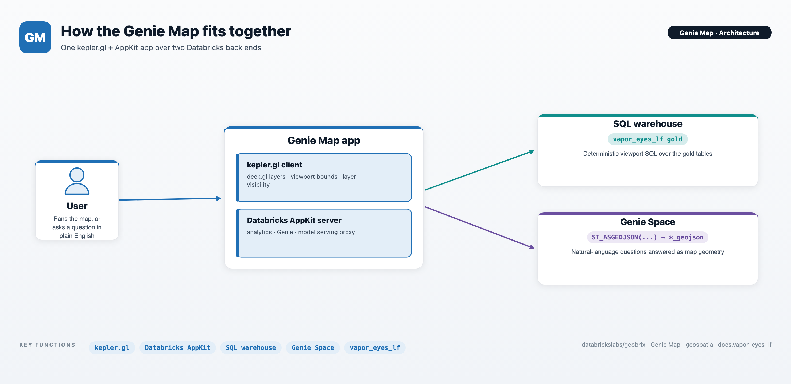
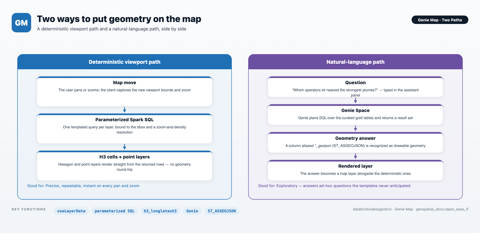
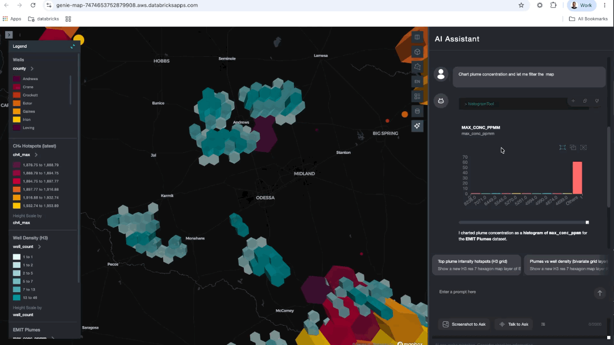
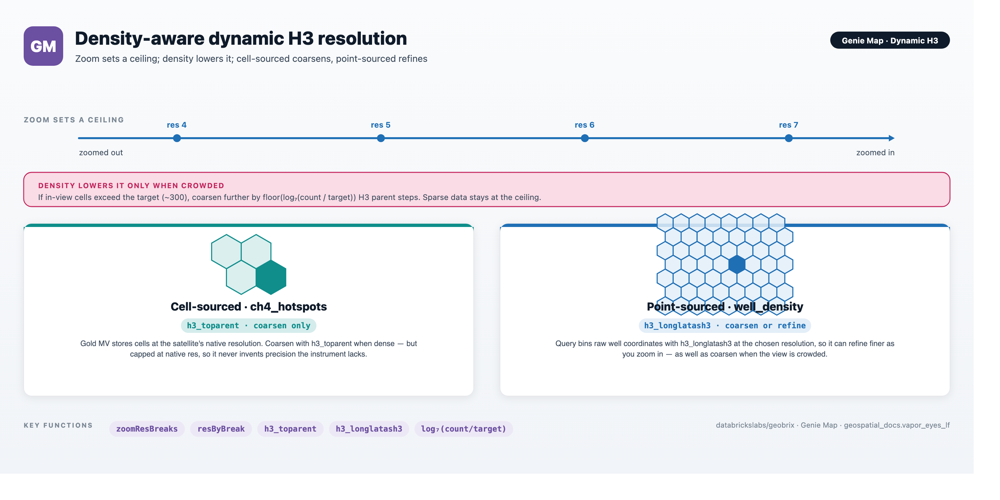
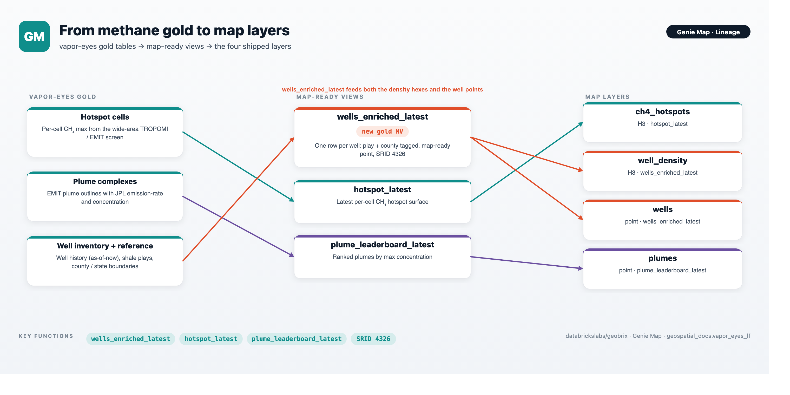
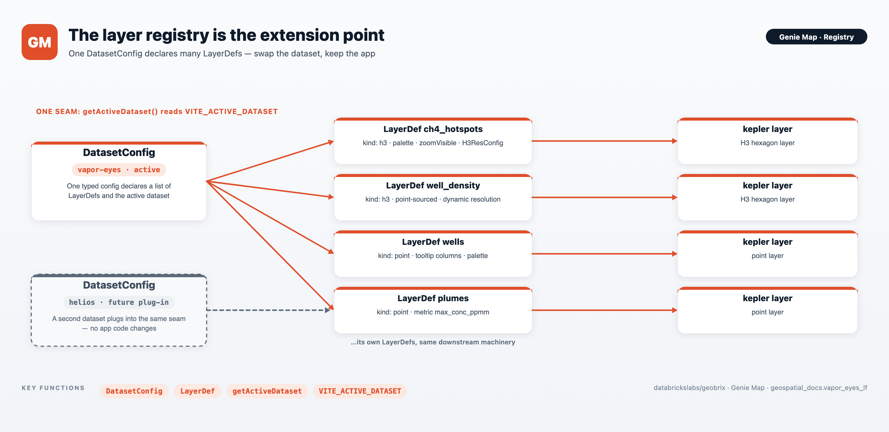

# Genie Map

Genie Map is a Databricks App that turns the GeoBrix-processed Permian methane gold data
into an interactive map. It sits on top of the
[Vapor-Eyes](../notebooks/vapor-eyes) methane pipeline: where that pipeline detects and
attributes methane over the Permian Basin, Genie Map is where you go to *look* at the
result and interrogate it. The client is React + [kepler.gl](https://kepler.gl); the
server is Databricks [AppKit](https://github.com/databricks-solutions/databricks-appkit);
the data is the `geospatial_docs.vapor_eyes_lf` gold schema.

:::tip View on GitHub
**[apps/genie_map](https://github.com/databrickslabs/geobrix/tree/main/apps/genie_map)** — the React + kepler.gl client, the AppKit server, and full setup instructions live here. See its [README](https://github.com/databrickslabs/geobrix/tree/main/apps/genie_map/README.md) for the quickstart — prerequisites, environment setup, and the local-dev and deploy commands — and [docs/BUILD.md](https://github.com/databrickslabs/geobrix/tree/main/apps/genie_map/docs/BUILD.md) for the full build narrative if you want to rebuild it or adapt it to another dataset.
:::

## Two ways to explore

Genie Map answers the same data two ways, side by side.

**Move the map.** Every pan and zoom runs parameterized Spark SQL for the current
viewport and redraws the layers. This path is deterministic: the same view always yields
the same query and the same hexagons and points. Four layers ship:

| Layer | Shape | What it shows |
|---|---|---|
| CH₄ hotspots | H3 hexagons | Peak methane concentration per cell |
| Well density | H3 hexagons | How many wells fall in each cell |
| Wells | Points | Individual wells, with operator and play |
| EMIT plumes | Points | Detected plumes, by peak concentration |

**Ask a question.** Type a natural-language question in the AI Assistant panel — for
example, *"which operators have wells near the strongest plumes?"* The panel routes the
question to a curated Genie Space, and the shape of the answer decides how it lands on the
canvas. There are two kinds of result, and it helps to ask with the one you want in mind.

### Two kinds of question result

| You want… | Ask for… | What the result must contain | What you get |
|---|---|---|---|
| **A new map layer** | *"Show / map / plot …"* — e.g. *"Show the latest plumes, strongest first"* | one `ST_ASGEOJSON(...)` geometry column (aliased `*_geojson`) | Genie's answer is drawn as a new layer beside the others |
| **An interactive chart that filters the map** | *"Chart … and let me filter the map"* — e.g. *"Chart plume concentration and let me filter the map"* | **one row per feature**, carrying **both** a `*_geojson` geometry **and** chartable attributes (a number like `max_conc_ppmm`, plus categoricals like `lead_operator`) | a chart whose selection highlights the matching features on the map, and vice-versa |

The distinction is the row grain. A **map-layer** answer just needs geometry. The
**interactive chart** needs geometry *and* per-feature attributes on the same rows —
because the chart and the map layer are the same dataset, and selecting chart elements
cross-filters the layer by row. A pre-aggregated rollup (one row per operator, per county,
per H3 cell) still charts fine, but with no per-feature geometry it can't cross-filter the
map — so when you want that interactivity, ask for the individual features, not the
summary.

The charts plot **numeric** values (a histogram or box plot of a measure like
`max_conc_ppmm`), so ask for a number to chart. To slice by a category such as operator,
chart the number and add a kepler.gl **filter** on the category column — that filter drives
the map too. (Asking to chart a category directly *on an axis* — "concentration **by
operator**" as a scatter — doesn't produce a usable chart, since operator isn't numeric.)

Either way, a spoken question and a drawn map answer share one canvas.

Above: the interactive-chart path. The user asks *"Chart plume concentration and let me
filter the map"*; brushing a range on the resulting histogram filters the plume layer on
the map to just that concentration band — the chart and map are the same dataset, so a
selection in one cross-filters the other.

Above: the "new map layer" path in action. The user asked the assistant to map EMIT plumes
by county; it joined the county polygons to plume aggregates by `lead_county`, added the
result as a geojson layer colored by `plume_count`, and left the CH₄ hotspot and well
layers in place — a natural-language question and its drawn answer on one canvas.

## Density-aware dynamic H3

The map's standout behavior is how its hexagon layers pick their resolution. Keying
resolution to zoom alone misbehaves on real data — a handful of hexagons blown up to a
continental scale tells you nothing. So Genie Map chooses resolution from **both** zoom and
data density.

- **Zoom sets a ceiling** — the maximum resolution allowed at the current zoom.
- **Density lowers it only when crowded** — when a view holds far more cells than the map
  can usefully show, the hexagons coarsen a step at a time. Sparse views stay at the
  ceiling, with no pointless coarsening.

The two hexagon layers differ in how far they can go. The CH₄ hotspots come from cells
stored at the satellite's native resolution, so they coarsen when dense but never go finer
than the instrument measured. The well-density layer bins raw well coordinates on the fly,
so it can both coarsen when crowded and **refine as you zoom in**. The result reads
naturally end to end: a basin-wide screen of coarse hexagons that resolves into fine cells
and individual well pads as you close in.

## One map-ready wells view

Both the well-density hexagons and the individual well points read one gold view,
`wells_enriched_latest`. It takes the current well inventory and spatially tags each well
with its shale play and its county and state, carrying the operator, lease, field, and a
map-ready point — one row per well.

## Built to be re-pointed

Genie Map is config-driven. One dataset configuration declares the list of layers, and
everything downstream — the SQL each layer runs, the kepler layer it draws, when it is
visible — is derived from that one declaration. Pointing the map at a different scenario is
a matter of adding a configuration, not editing app code.

