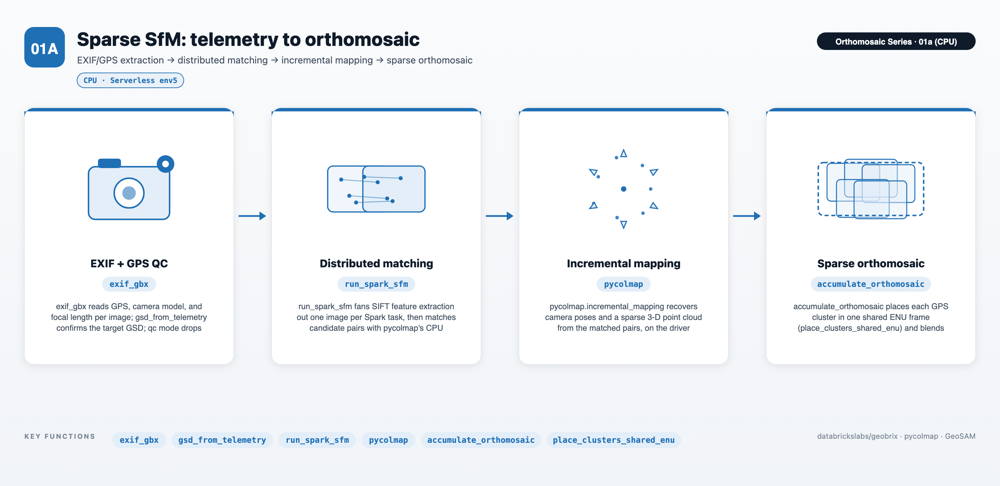
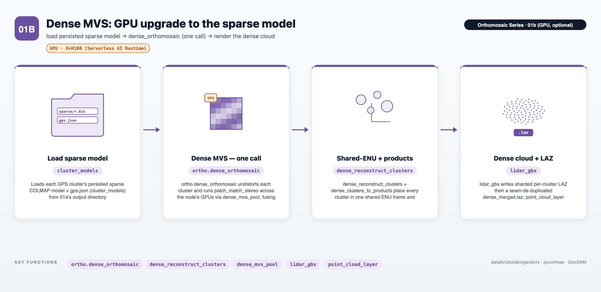
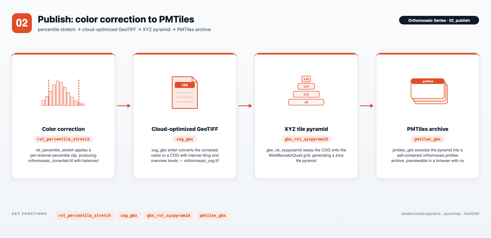
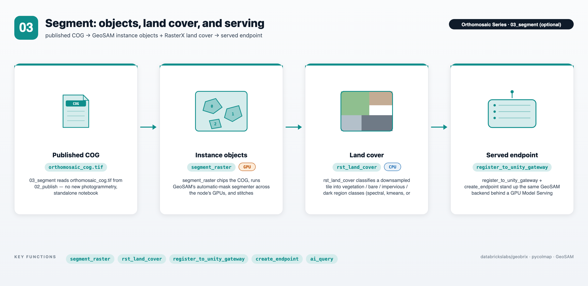

import Tabs from '@theme/Tabs';
import TabItem from '@theme/TabItem';

# Orthomosaic Photogrammetry — Drone Survey to Georeferenced Map

A notebook series that takes a **raw drone image dataset** end-to-end through
EXIF/GPS telemetry extraction, quality screening, Structure-from-Motion (SfM)
reconstruction, georeferenced orthomosaic production, and object + land-cover
classification — from individual JPEGs to a cloud-optimized GeoTIFF ready for tile
serving, and on to georeferenced object polygons and a land-cover region map. Sparse
reconstruction runs on CPU; an optional dense pass and the object-segmentation part of
the capstone run on GPU (land cover runs on CPU).


The pipeline reads EXIF metadata and GPS telemetry per-image with the GeoBrix `exif_gbx`
reader, computes per-image GSD and (optionally) sharpness metrics, then runs incremental
SfM with `pycolmap` on a **Serverless environment 5 (CPU)** cluster (`01a`). An optional
GPU notebook (`01b`) adds dense MVS for a higher-fidelity orthomosaic. The orthomosaic is
written as a GeoTIFF, converted to a COG with the `cog_gbx` writer, and packaged as a
PMTiles archive for interactive map preview. An optional capstone notebook (`03_segment`)
then derives two complementary views of the published COG: georeferenced **object**
polygons with GeoSAM (`gbx.models`) — in-notebook across 1..N GPUs, or behind a served
Unity Gateway GPU Model Serving endpoint — and a **land-cover** region map with RasterX's
`rst_land_cover`, entirely on CPU. See [Geospatial Models](../models/overview),
[GeoSAM](../models/geosam), and [RasterX functions](../api/raster-functions#rst_land_cover).

:::tip View on GitHub
**[notebooks/examples/orthomosaic](https://github.com/databrickslabs/geobrix/tree/main/notebooks/examples/orthomosaic)** — download the folder and import the numbered notebooks into your Databricks workspace to run.
:::

:::info Runtime — Serverless environment 5 (CPU, sparse SfM)
The series runs on **Serverless environment 5** (Python 3.11, CPU only). Install via:

```
geobrix[light_env5,photogrammetry,vizx] @ file:///Volumes/.../geobrix-0.5.2-py3-none-any.whl
```

The `photogrammetry` extra brings `pycolmap >= 4.0.0`, `rasterio`, `rio-cogeo`, and the
PMTiles toolchain. No JAR or GDAL init script is needed.

**`01a` runs sparse SfM on CPU.** An optional dense pass (`01b`) runs COLMAP
`patch_match_stereo` on the **Serverless GPU AI Runtime** (`pycolmap-cuda12`, CUDA 12),
producing a dense orthomosaic, DSM, and LAZ point cloud. The sparse ortho alone is
suitable for GSD estimation, visual inspection, and georeferenced tile serving; the dense
pass adds fidelity for measurement workflows. `02_publish` uses whichever orthomosaic is
present (dense if `01b` ran, else sparse).

**`03_segment` (optional) turns the published COG into objects AND a land-cover map.** It
installs its own extras — `geobrix[light_env5,models_gpu_env5,vizx]` — rather than
`photogrammetry`, since its **instance-objects** section needs GeoSAM's
`torch`/`segment-geospatial`, not `pycolmap`, and runs on the **Serverless GPU AI Runtime**
(environment 5). Its **land-cover** section is plain RasterX (`rst_land_cover`, CPU-only) and
needs no GPU. The notebook is standalone (no `%run ./config_nb`) and can run any time after
`02_publish` has written `orthomosaic_cog.tif`.
:::

---

## The notebooks

### `config_nb` — shared configuration and helpers

Shared imports, pipeline parameters (`GSD_CM`, `MAX_ORTHO_WORKERS`, `GROUP_KEY_COL`),
and the SfM helper functions used by the numbered notebooks. Import once; the numbered
notebooks run `%run ./config_nb`.

### `01a_sfm_orthomosaic` — telemetry → SfM → orthomosaic



The core pipeline:

1. **EXIF extraction** — `exif_gbx` reader scans the image directory, emitting one row
   per image with GPS coordinates, camera model, focal length, and pixel dimensions.
2. **GSD estimation** — `gsd_from_telemetry(focal_length_mm, altitude, image_width,
   sensor_width_mm)` computes ground sampling distance (cm/pixel) per image.
3. **Optional QC screen** — if `QC_MODE=True`, re-reads with `mode="qc"` to append
   `sharpness` and `brightness`; blurry images below `MIN_SHARPNESS` are dropped before
   reconstruction.
4. **Distributed feature extraction** — SIFT features are extracted per-image as a
   Spark map operation (one task per image, Serverless fan-out via `repartition`).
5. **Pair matching** — exhaustive or sequential matching with `pycolmap`'s GPU-free CPU
   matcher; results are collected to the driver for the reconstruction step.
6. **Incremental mapping** — `pycolmap.incremental_mapping` recovers camera poses and a
   sparse 3-D point cloud on the driver.
7. **Orthomosaic projection** — each registered image is back-projected onto the estimated
   ground plane; contributions are blended by overlap count into a georeferenced RGB
   GeoTIFF (`orthomosaic.tif`).

### `01b_sfm_orthomosaic_gpu` (optional) — dense MVS on GPU



An optional GPU notebook that upgrades the sparse result to a **dense** reconstruction. It
loads the persisted sparse model from `01a` and, per group, makes one call —
`ortho.dense_orthomosaic` — that reconstructs every GPS cluster (undistort, COLMAP
`patch_match_stereo` across the node's GPUs via a driver-side GPU-slot scheduler sized by
`recommend_dense_allocation`, and fuse to a per-cluster `fused.ply`, with per-cluster
checkpointing) and then georeferences the result into a dense RGB orthomosaic, DSM, and
LAZ point cloud (per-cluster and merged); see the `pyrx.ortho` module reference further
down this page for its full API. Runs on the **Serverless GPU AI Runtime** (environment 5,
`pycolmap-cuda12`, CUDA 12); `01a` is the CPU peer that produces the sparse model it
consumes. `02_publish` automatically uses the dense orthomosaic when present.

### `02_publish` — color correction → COG → PMTiles



A single publish notebook that turns `orthomosaic.tif` into web-ready deliverables in
three checkpointed stages:

1. **Color correction** — a per-channel percentile stretch (configurable low/high clip
   percentiles) produces `orthomosaic_corrected.tif` with balanced contrast, persisted so
   the served COG and PMTiles carry it.
2. **Cloud-optimized GeoTIFF** — the `cog_gbx` writer converts the corrected raster to a
   COG with internal tiling and overview levels, producing `orthomosaic_cog.tif` for
   efficient range-request reads downstream.
3. **PMTiles** — the COG is warped onto the WebMercatorQuad grid with `gbx_rst_xyzpyramid`
   and encoded into a self-contained `orthomosaic.pmtiles` archive by the `pmtiles_gbx`
   writer, previewable in a browser (PMTiles + MapLibre GL or Leaflet) with no tile server.

Each stage is checkpointed per group; set `FORCE_CORRECTED` / `FORCE_COG` /
`FORCE_PMTILES` in `config_nb` to recompute a stage.

### `03_segment` (optional) — objects + land cover capstone



A capstone notebook that derives two complementary views of `02_publish`'s orthomosaic
COG — discrete **objects** and a **land-cover** region map — then serves the object model.
It runs no new photogrammetry; it only reads `orthomosaic_cog.tif`.

1. **Instance objects (GPU)** — a single [`segment_raster`](../models/geosam) call chips
   the COG into an overlapping grid, runs GeoSAM's automatic-mask segmenter across the
   node's GPU(s) (`gpus="all"`), stitches each chip's label mask into whole-object polygons
   using its own true per-window georeferencing, and returns a `pandas.DataFrame` of
   `label` (int), `geom` (WKB bytes), and `score` (float). Automatic-mask GeoSAM is
   class-agnostic (instance segmentation) — each object gets an id, not a semantic type —
   so the preview colors objects by instance id with a legend.
2. **Land cover (CPU)** — the complementary view: partition the *whole scene* into
   contiguous region classes (vegetation / bare / impervious / dark) with RasterX's
   [`rst_land_cover`](../api/raster-functions#rst_land_cover), composed from the existing
   `rst_*` family — `rst_fromfile` → `rst_resample` (downsample so a single tile fits
   worker memory) → `rst_land_cover` (an Int32 class-mask tile) → `gbx_rst_polygonize` →
   labeled polygons, filtered to regions at or above a metric minimum area via
   `core.crs.area_m2`. The notebook runs both `method="spectral"` (fixed thresholds) and
   `method="kmeans"` (adaptive clustering) side by side so the two can be compared —
   `method="hybrid"` (`rst_land_cover`'s default) is the pragmatic blend of the two.
3. **Served endpoint** — the same GeoSAM backend wrapped as an MLflow pyfunc
   (`build_geosam_pyfunc`), registered to the Unity Catalog model registry
   (`register_to_unity_gateway`), and stood up behind a GPU [Model Serving
   endpoint](../models/serving) (`create_endpoint`, `scale_to_zero=True` by default) for
   programmatic, notebook-free access.

The **instance-objects** section needs a GPU cluster — GeoSAM's SAM backbone is
CUDA-bound — so it runs on the **Serverless GPU AI Runtime** (environment 5). The
**land-cover** section is CPU-only RasterX and needs no GPU. The serving section
(registration, endpoint creation, querying) is API calls that can run from any cluster
with `mlflow` installed.

### Calling the served endpoint — four ways

Once registered to Unity Catalog and served behind the Unity Gateway, the endpoint is a
standard **[Databricks Model Serving](https://docs.databricks.com/aws/en/machine-learning/model-serving)**
REST endpoint — callable from a notebook, an app, a job, or SQL with no GeoBrix package
and no GPU attached on the calling side. All four forms below hit the same
`.../serving-endpoints/geosam-ortho-endpoint/invocations` URL with the same `image_b64`
input and get back the same shape:

```json
{"predictions": {"geojson": "{\"type\": \"FeatureCollection\", \"features\": [{\"type\": \"Feature\", \"geometry\": {\"type\": \"Polygon\", \"coordinates\": [[[-121.9744, 36.9744], ...]]}, \"properties\": {\"label\": 0, \"score\": 1.0}}]}"}}
```

`predictions` is a **dict** `{"geojson": ...}`, not a list. The decoded `geojson` value
is a GeoJSON `FeatureCollection` string with one `Polygon` **Feature** per detected
object, carrying `properties.label` (int) and `properties.score` (float).

<Tabs groupId="gbx-serving-call">
<TabItem value="curl" label="curl">

```bash
curl \
  -u token:$DATABRICKS_TOKEN \
  -X POST \
  -H "Content-Type: application/json" \
  -d@data.json \
  https://e2-demo-field-eng.cloud.databricks.com/serving-endpoints/geosam-ortho-endpoint/invocations
```

`data.json` holds the request body, e.g.
`{"dataframe_records": [{"image_b64": "<base64 GeoTIFF tile>"}]}`. The quickest smoke
test for the endpoint, and it works from any language that can shell out to `curl`.

</TabItem>
<TabItem value="python-json" label="Python (JSON)">

```python
import os
import requests
import numpy as np
import pandas as pd
import json

def create_tf_serving_json(data):
    return {'inputs': {name: data[name].tolist() for name in data.keys()} if isinstance(data, dict) else data.tolist()}

def score_model(dataset):
    url = 'https://e2-demo-field-eng.cloud.databricks.com/serving-endpoints/geosam-ortho-endpoint/invocations'
    headers = {'Authorization': f'Bearer {os.environ.get("DATABRICKS_TOKEN")}', 'Content-Type': 'application/json'}
    ds_dict = {'dataframe_split': dataset.to_dict(orient='split')} if isinstance(dataset, pd.DataFrame) else create_tf_serving_json(dataset)
    data_json = json.dumps(ds_dict, allow_nan=True)
    response = requests.request(method='POST', headers=headers, url=url, data=data_json)
    if response.status_code != 200:
        raise Exception(f'Request failed with status {response.status_code}, {response.text}')
    return response.json()
```

The `dataframe_split` record shape most services call Model Serving with. GeoBrix wraps
exactly this — base64-encoding the tile and posting the request — as
[`serving.query`](../models/serving#querying-the-endpoint), so most notebook/job callers
reach for that instead of re-deriving this.

</TabItem>
<TabItem value="python-protobuf" label="Python (protobuf)">

```python
import os
import requests
import numpy as np
from tritonclient.grpc.service_pb2 import ModelInferRequest, ModelInferResponse  # KServe v2 ModelInferRequest/Response
from tritonclient.utils import np_to_triton_dtype, triton_to_np_dtype  # numpy<->KServe v2 dtype helpers

def create_kserve_request(data):
    tensors = data if isinstance(data, dict) else {'input': data}
    request = ModelInferRequest()
    for name, array in tensors.items():
        array = np.ascontiguousarray(array)
        request.inputs.add(name=name, datatype=np_to_triton_dtype(array.dtype), shape=array.shape)
        request.raw_input_contents.append(array.tobytes())
    return request

def score_model(dataset):
    url = 'https://e2-demo-field-eng.cloud.databricks.com/serving-endpoints/geosam-ortho-endpoint/invocations'
    headers = {'Authorization': f'Bearer {os.environ.get("DATABRICKS_TOKEN")}', 'Content-Type': 'application/x-protobuf'}
    request = create_kserve_request(dataset)
    response = requests.request(method='POST', headers=headers, url=url, data=request.SerializeToString())
    if response.status_code != 200:
        raise Exception(f'Request failed with status {response.status_code}, {response.text}')
    result = ModelInferResponse()
    result.ParseFromString(response.content)
    return {output.name: np.frombuffer(result.raw_output_contents[i], dtype=triton_to_np_dtype(output.datatype)).reshape(output.shape) for i, output in enumerate(result.outputs)}
```

The KServe v2 binary protocol (`application/x-protobuf`) — lower-overhead than JSON for
large tensor payloads.

</TabItem>
<TabItem value="sql" label="SQL">

```sql
SELECT ai_query('geosam-ortho-endpoint',
    request => named_struct('image_b64', <value>))
```

Calls the endpoint inline from SQL or a Lakeflow pipeline via
**[`ai_query`](https://docs.databricks.com/aws/en/sql/language-manual/functions/ai_query)**
— the columnar, at-scale path: fan segmentation out over a whole **table** of image
tiles with one query, no notebook or Python client involved.

</TabItem>
</Tabs>

See the
**[Unity Catalog model lifecycle](https://docs.databricks.com/aws/en/machine-learning/manage-model-lifecycle/)**
docs for how a registered, versioned model like this one is governed, and the
[Serving](../models/serving) reference page for GeoBrix's own wrappers —
`serving.query`, `register_to_unity_gateway`, `build_geosam_pyfunc`, and
`geosam_signature` — that `03_segment` uses to get here.

### `monitor` (optional) — live SfM progress

An optional utility notebook that polls the SfM working directory and prints incremental
reconstruction statistics (registered images, 3-D points) while `01a_sfm_orthomosaic` runs.

---

## Key GeoBrix functions shown

- **`exif_gbx` reader** — `spark.read.format("exif_gbx").option("mode", "metadata").load(path)`
  emits one row per image with GPS coordinates, camera identity, focal length, pixel dimensions,
  and a `POINT WKB` geometry column. `mode="qc"` adds `sharpness` and `brightness`. Options:
  `filterRegex`, `sensorWidthMm`, `focalLengthMm`. See [EXIF/GPS reader](../readers/exif).
- **`pyrx.gsd_from_telemetry`** — `gsd_from_telemetry(focal_length_mm, altitude, image_width,
  sensor_width_mm)` returns ground sampling distance in cm/pixel. Used to confirm the dataset
  meets the target GSD before reconstruction.
- **`cog_gbx` writer** — converts the corrected orthomosaic to Cloud-Optimized GeoTIFF
  layout (internal tiling + overviews) via GDAL's `driver="COG"` path. See
  [COG writer](../writers/cog).
- **`pmtiles_gbx` writer** — encodes the COG orthomosaic into a PMTiles archive for
  browser-based preview. See [PMTiles writer](../writers/pmtiles).
- **`gbx.vizx` helpers** — `plot_raster` renders the orthomosaic tile in the notebook
  (auto-decimation + percentile stretch, `bands=(1,2,3)` for true-color). See
  [Visualization API](../api/vizx).
- **`gbx.models.runner.segment_raster`** — chips a raster, fans GeoSAM inference across
  1..N GPUs, and stitches georeferenced object polygons back together. Used by
  `03_segment` to turn `orthomosaic_cog.tif` into a `label`/`geom`/`score` DataFrame. See
  [GeoSAM](../models/geosam).
- **`pyrx.rst_land_cover`** — classifies an RGB(+NIR) tile into land-cover class ids
  (`method="spectral"` / `"kmeans"` / `"hybrid"`), returning a single-band Int32
  class-mask tile; each pixel is an index into `land_cover.DEFAULT_CLASSES`
  (`["vegetation", "bare", "impervious", "dark"]`). Used by `03_segment` together with
  `rst_fromfile` → `rst_resample` → `gbx_rst_polygonize` to turn `orthomosaic_cog.tif`
  into a labeled region `GeoDataFrame`. Python-only — no `gbx_rst_land_cover` SQL name yet.
  See [RasterX functions](../api/raster-functions#rst_land_cover).
- **`gbx.models.serving`** — `build_geosam_pyfunc`, `register_to_unity_gateway`, and
  `create_endpoint` take the same GeoSAM backend from a notebook call to a queryable GPU
  Model Serving endpoint. See [Serving](../models/serving).

---

## The `pyrx.sfm` module

`01a`'s SIFT extraction → GPS pair discovery → matching → mapping pipeline is, like the
dense pass, not bespoke notebook code — it lives in `databricks.labs.gbx.pyrx.sfm`, a
tested library module. The module imports on the light tier with **no optional
dependency** at all; `pycolmap` is imported lazily, inside `run_sfm`'s master-DB-assembly
and mapping stage only, and raises a clear `ImportError` there if missing — install the
`photogrammetry` extra to actually run reconstruction.

### `run_sfm` — distributed sparse SfM for one group of images

```python
from databricks.labs.gbx.pyrx import sfm

result = sfm.run_sfm(
    spark,
    df_qc=df_cluster,          # Spark DataFrame: 'source' column (image paths) + GPS geometry
    image_dir=img_path,
    output_dir="/local_disk0/tmp/sfm/cluster_0",
    group_key="grp_c0",
    feature_table=f"{catalog}.{schema}.extracted_features_grp_c0",
    match_table=f"{catalog}.{schema}.verified_matches_grp_c0",
    max_pair_dist_m=50.0,
    force_features=False,
    force_matches=False,
    force_master=False,
    persist_dir="/Volumes/.../sfm_persist/cluster_0",
    serialize_extract=False,
)
# result: {"sparse_dir", "gps_json", "models", "registered"}  (or "reused": True)
```

`run_sfm` runs sparse SfM for one group (typically one GPS cluster) of drone images
end-to-end, in five stages:

1. **Distributed feature extraction** — SIFT features are extracted per-image as a Spark
   `mapInPandas` map (one task per image, fanned out via `repartition(n, "source")`) and
   written to the caller-supplied `feature_table`.
2. **GPS pair discovery** — `ST_DistanceSphere` (a Databricks-runtime built-in) filters
   candidate image pairs to those within `max_pair_dist_m` metres of each other, keeping
   pair count linear in image count instead of the exhaustive, quadratic alternative.
3. **Distributed matching** — each candidate pair is matched with `pycolmap`'s CPU matcher
   as a further `mapInPandas` map, and verified two-view geometries are written to
   `match_table`.
4. **COLMAP master-DB assembly** — the extracted features and verified matches are
   collected to the driver and assembled into one COLMAP SQLite database, including
   GPS-prior encoding and best-init-pair selection.
5. **Incremental mapping** — `pycolmap.incremental_mapping` runs on the driver over the
   assembled database, recovering camera poses and a sparse 3-D point cloud.

Parameters:

- **`spark`** — the `SparkSession`, an explicit argument rather than a notebook global.
- **`df_qc`** — a Spark DataFrame with a `source` column (full path to each JPEG) and,
  typically, a GPS geometry column as produced by the `exif_gbx` reader.
- **`image_dir`** — the POSIX path to the JPEG directory backing `df_qc`.
- **`output_dir`** — the persistent storage root for this run's SfM artifacts (the COLMAP
  master DB, the `sparse` model directory, and the GPS-prior JSON).
- **`group_key`** (optional) — a string label used only for the `master_sfm` database
  filename and log lines; pass a per-cluster id when calling `run_sfm` once per GPS
  cluster.
- **`feature_table`, `match_table`** (required, keyword-only) — caller-controlled,
  fully-qualified Delta table names (e.g. `catalog.schema.extracted_features_grp_c0`) that
  back the extracted-feature and verified-match caches. `run_sfm` reuses a non-empty table
  across calls unless the matching `force_*` flag is set; `feature_table` additionally
  treats an existing-but-empty table as stale and rebuilds it automatically, rather than
  silently producing zero matches downstream.
- **`max_pair_dist_m`** (required, keyword-only) — the GPS pairing radius, in metres, used
  by the `ST_DistanceSphere` pair-discovery query.
- **`force_features`, `force_matches`, `force_master`** — force re-extraction,
  re-matching, or re-assembly/re-mapping even when the corresponding table or artifact
  already exists.
- **`persist_dir`** (optional) — a durable storage root (typically a Unity Catalog Volume)
  for cross-run reuse of a finished sparse model. When a prior run's `sparse` directory and
  GPS-prior JSON already exist there and `force_master=False`, `run_sfm` copies them in and
  returns immediately (`reused: True`) instead of re-running mapping. The COLMAP master
  SQLite database itself cannot live on a Volume, and local scratch is ephemeral per job —
  this is the cross-run reuse path.
- **`serialize_extract`** — forces single-partition (`coalesce(1)`) feature extraction, an
  out-of-memory fallback that runs one SIFT extraction at a time instead of fanning out, at
  the cost of wall-clock time.

Returns a `dict` with `sparse_dir` (the COLMAP sparse-model directory path), `gps_json`
(the path to the persisted GPS-prior JSON), `models` (the number of reconstructions
`incremental_mapping` produced, `None` on the reuse and pre-existing-database paths), and
`registered` (the number of images registered into the model, likewise `None` on those
paths) — plus `reused: True` when the result came from the `persist_dir` short-circuit.
Raises `RuntimeError` if feature extraction yields zero images or matching yields zero
verified pairs.

`run_sfm` imports cleanly on the light (`pyrx`) tier with no `pycolmap` installed — only
reaching the master-DB-assembly/mapping stage requires it, and that import is lazy and
gated. `01a` calls `run_sfm` once per GPS cluster with per-cluster `feature_table` /
`match_table` names and a per-cluster `persist_dir` subdirectory, retrying with
`serialize_extract=True` after repeated worker out-of-memory errors.

### `image_ids_to_pair_id` — the COLMAP pair-id primitive

```python
from databricks.labs.gbx.pyrx.sfm import image_ids_to_pair_id

pair_id = image_ids_to_pair_id(image_id1, image_id2)
```

Encodes two COLMAP image ids into the single integer pair id that COLMAP's
`two_view_geometries` table keys on, matching COLMAP's own convention: the smaller id is
always ordered first (the two ids are swapped beforehand if needed), and the result is
`2147483647 * id1 + id2`. Pure integer arithmetic with no `pycolmap` dependency —
`run_sfm` uses it internally when assembling the master database's verified-match rows.

---

## The `pyrx.ortho` module

`01b`'s dense pass is not bespoke notebook code — the shared-frame alignment, cloud
rasterization, and per-cluster/merged product export live in
`databricks.labs.gbx.pyrx.ortho`, a tested library module. The module splits cleanly by
dependency: the pure math (`umeyama_sim3`, `apply_sim3`, and `rasterize_enu_ortho` when
called with `gps_tf=None`) is plain NumPy and imports with no optional dependency. The
orchestration functions that actually drive a dense reconstruction
(`place_clusters_shared_enu`, `dense_clusters_to_products`, `dense_reconstruct_clusters`,
`dense_orthomosaic`) import `pycolmap` lazily — directly, or through the primitives they
call — and raise a clear `ImportError` when it is missing — install the `photogrammetry`
extra to use them.

### `dense_orthomosaic` — dense orthomosaic in one call

```python
from databricks.labs.gbx import pyrx as rx
from databricks.labs.gbx.pyrx import ortho

used_cids, merged_laz_path = ortho.dense_orthomosaic(
    spark,
    cluster_models,        # {cid: (sparse_dir, gps_json)}
    image_dir,
    merged_ortho="/Volumes/.../orthomosaic_dense.tif",
    merged_dsm="/Volumes/.../dsm_dense.tif",
    merged_laz="/Volumes/.../dense_merged.laz",
    cluster_paths={              # {cid: {"ortho": ..., "dsm": ...}}
        cid: {"ortho": f"/Volumes/.../ortho_dense_{cid}.tif",
              "dsm": f"/Volumes/.../dsm_dense_{cid}.tif"}
        for cid in cluster_models
    },
    work_root="/local_disk0/tmp/dense",
    ply_root="/Volumes/.../dense",
    checkpoint=rx.Manifest("/Volumes/.../checkpoint.json"),
    gsd_cm=3.0,
    max_image_size=1600,
    geom_consistency=True,
)
```

`dense_orthomosaic` is the one-call entry point for dense MVS on **net-new data**:
reconstruct every GPS cluster — undistort, patch-match stereo across the node's GPUs,
fuse to a point cloud — then georeference and export the ortho/DSM/LAZ products, all in
one call. It composes two library functions: the mid-level `dense_reconstruct_clusters`
(below) for reconstruction, then `dense_clusters_to_products` (above) for shared-ENU
placement and product export.

It takes every output path (`merged_ortho`, `merged_dsm`, `merged_laz`, `cluster_paths`)
and an optional checkpoint `Manifest` as explicit arguments, and `spark` is an explicit
parameter rather than a notebook global — so, unlike a hand-wired notebook cell, it has no
dependency on notebook-specific config helpers and can be called from any context holding
a session. `checkpoint=None` disables skip/resume (always recomputes); `ply_root=None`
keeps fused point clouds local under `work_root` with no Volume copy; `force=True` bypasses
the checkpoint. It raises `RuntimeError` when every cluster's reconstruction failed (no
points to place) rather than calling `dense_clusters_to_products` with nothing. Returns
`(used_cids, path_to_dense_merged_laz)` — the same shape as `dense_clusters_to_products`.
Requires the `photogrammetry` extra (`pycolmap`).

### `dense_reconstruct_clusters` — reconstruction only

For callers who want to drive reconstruction and georeferencing/products separately — for
example, reconstructing once and rasterizing at more than one `gsd_cm`, or reconstructing
now and deferring products to a later step — the mid-level `dense_reconstruct_clusters`
(re-exported directly on `pyrx`, not `pyrx.ortho`) does just the reconstruction half that
`dense_orthomosaic` composes:

```python
plys = rx.dense_reconstruct_clusters(
    cluster_models,        # {cid: (sparse_dir, gps_json)}
    image_dir,
    work_root="/local_disk0/tmp/dense",
    ply_root="/Volumes/.../dense",
    checkpoint=rx.Manifest("/Volumes/.../checkpoint.json"),
    geom_consistency=True,
)
# plys: {cid: fused.ply path}

used_cids, merged_laz_path = ortho.dense_clusters_to_products(
    spark, cluster_models, plys,
    merged_ortho=..., merged_dsm=..., merged_laz=..., cluster_paths=..., gsd_cm=3.0,
)
```

For each cluster it undistorts against the sparse model, runs one
`recommend_dense_allocation` plus a patch-match pool over the to-do set, and fuses to
`fused.ply` — skipping clusters already checkpointed (unless `force=True`) and dropping
clusters whose patch-match failed (reported through `on_event`, when given). `geom_consistency`
threads to both the patch-match pass and the fuse step. Returns `{cid: fused.ply path}`,
including checkpointed clusters — exactly what `dense_orthomosaic` calls internally before
handing the result to `dense_clusters_to_products`.

### `dense_clusters_to_products` — the dense entry point

```python
from databricks.labs.gbx.pyrx import ortho

used_cids, merged_laz_path = ortho.dense_clusters_to_products(
    spark,
    cluster_models,        # {cid: (sparse_dir, gps_json)}
    dense_plys,             # {cid: fused.ply path}
    merged_ortho=...,
    merged_dsm=...,
    merged_laz=...,
    cluster_paths=...,      # {cid: {"ortho": ..., "dsm": ...}}
    gsd_cm=3.0,
    group="all",
)
```

This is what `01b` calls once per group, after fusing every cluster's depth maps into a
`fused.ply`. It:

1. places every cluster's dense point cloud into **one shared ENU frame** via
   `place_clusters_shared_enu`, so per-cluster clouds line up rather than merely
   overlapping visually;
2. writes a **per-cluster** ortho + DSM GeoTIFF pair for each entry in `cluster_paths`;
3. writes **sharded per-cluster LAZ parts** through the `lidar_gbx` DataSource writer, then
   folds them into one **`dense_merged.laz`** with `overlap="drop"` — a seam-de-duplicated
   union, not a raw concatenation that double-counts points in the overlap band; and
4. writes one **merged, co-registered** ortho + DSM over all clusters
   (`merged_ortho`/`merged_dsm`).

It returns the list of cluster ids that produced usable points and the path to the merged
LAZ — or, if the merge step is skipped because the cloud exceeds the merge memory budget,
the directory of sharded parts (still readable through the `lidar_gbx` reader as a
directory of parts). `spark` is an explicit parameter, not a notebook global, so the
function can be called from any context holding a session. Requires the `photogrammetry`
extra (`pycolmap`).

### `place_clusters_shared_enu` — shared-frame alignment

```python
placement = ortho.place_clusters_shared_enu(cluster_models)  # {cid: (sparse_dir, gps_json)}
# placement: {"T": {cid: (scale, R, t)}, "ref_lat", "ref_lon", "ref_alt", "gps_tf",
#             "aligned", "n_tied", "anchor", "centers", "gps", "sizes"}
```

Aligns every GPS cluster's COLMAP reconstruction into one shared ENU (east-north-up,
metres) frame. The largest cluster becomes the anchor — georeferenced to its own GPS
priors via a least-squares Sim(3) fit (`umeyama_sim3`). Each remaining cluster is then tied
to the already-placed set through cameras it **shares** with them (matching image names)
rather than fit to GPS independently, so neighboring clusters agree in the overlap band; a
cluster with no shared cameras falls back to its own GPS fit. A single-cluster input
degenerates to the anchor-only case, matching a direct GPS fit of that one cluster.
Requires `pycolmap`.

### `rasterize_enu_ortho` — ENU cloud to ortho + DSM

```python
ortho_path, dsm_path = ortho.rasterize_enu_ortho(
    xe, ye, ze, r, g, b,          # ENU-metre points + per-point color
    ref_lat, ref_lon, ref_alt,    # shared ENU reference (from place_clusters_shared_enu)
    gps_tf,                       # a pycolmap.GPSTransform, or None
    out_ortho, out_dsm,
    gsd_cm=3.0,
)
```

Top-surface-rasterizes a colored ENU point cloud into a georeferenced RGB ortho and DSM
(both EPSG:4326 GeoTIFFs). The corner used to anchor the raster's georeferencing depends on
`gps_tf`:

- **a `pycolmap.GPSTransform`** (the path `dense_clusters_to_products` uses) — the corner
  comes from `gps_tf.enu_to_ellipsoid`, an ellipsoidal conversion, for fidelity;
- **`None`** — the corner falls back to `core.crs.enu_to_lonlat`, a tier-neutral
  equirectangular (local-tangent-plane) approximation, so the function runs with **no
  optional dependency at all**. This is an approximation, not equivalent to the `gps_tf`
  path — it exists for local testability, not as an interchangeable alternative.

### Pure Sim(3) primitives

`umeyama_sim3(src, dst)` fits a least-squares similarity transform — scale, rotation, and
translation — mapping one `(N, 3)` point set onto another (Umeyama, 1991), returning
`(scale, R, t)`; it raises if fewer than 3 non-degenerate point pairs are given.
`apply_sim3(T, pts)` applies that `(scale, R, t)` tuple to an `(N, 3)` point array. Both are
plain NumPy — no `pycolmap` dependency — and are the building blocks
`place_clusters_shared_enu` composes into a multi-cluster alignment.

### Geodesy primitives (`core.crs`)

Two tier-neutral helpers in `databricks.labs.gbx.core.crs` support the ENU workflow above
and are usable on their own:

- `utm_epsg_for(lon, lat)` — the WGS84 UTM zone EPSG code (`326zz` north / `327zz` south)
  for a representative lon/lat. `dense_clusters_to_products` uses it to pick the metric
  projected CRS for the exported LAZ, so the point cloud carries real metre units instead
  of a geographic CRS forcing a coarse LAS scale in degrees.
- `enu_to_lonlat(east, north, ref_lat, ref_lon)` / `lonlat_to_enu(lon, lat, ref_lat,
  ref_lon)` — the equirectangular (local-tangent-plane) approximation converting between
  ENU metres and lon/lat around a reference point. Take scalars or NumPy arrays. This is a
  linearized approximation, not a geodesically exact projection — see
  [Coordinate Reference Systems](../api/coordinate-reference-systems) for GeoBrix's
  general CRS handling.

---

## Data flow

```text
Drone JPEGs (local or Volume)
        │
        ▼  exif_gbx (metadata mode) — one row per image
        │  GPS lat/lon/alt, camera_make/model, focal_length_mm, image_width/height
        │
        ▼  gsd_from_telemetry — cm/pixel GSD per image
        │
        ▼  (optional) exif_gbx qc mode — append sharpness, brightness; filter blurry images
        │
        ▼  distributed SIFT feature extraction (Spark map, one task per image)
        │
        ▼  pair matching (pycolmap CPU matcher, driver-side)
        │
        ▼  incremental_mapping (pycolmap, driver-side) — camera poses + sparse cloud
        │
        ▼  orthomosaic projection (back-project + blend) — orthomosaic.tif (GeoTIFF, EPSG:4326)
        │
        ▼  (optional, GPU · 01b) dense MVS — patch_match_stereo + fusion → dense ortho / DSM / LAZ
        │
        ▼  cog_gbx writer — orthomosaic_cog.tif (COG layout)   [dense if present, else sparse]
        │
        ├──▶ pmtiles_gbx writer — orthomosaic.pmtiles (browser-ready)
        │
        ├──▶ (optional, GPU · 03_segment) GeoSAM segment_raster — chip → infer → stitch →
        │    polygonize → georeferenced object polygons (label / geom WKB / score);
        │    optional Unity Gateway GPU Model Serving endpoint
        │
        └──▶ (optional, CPU · 03_segment) rst_fromfile → rst_resample → rst_land_cover →
             gbx_rst_polygonize → min-area filter (core.crs.area_m2) → labeled land-cover
             regions (spectral vs kmeans)
```

---

## Gotchas

- **Serverless fan-out requires `repartition`**. Feature extraction fans out via
  `df.repartition(n, group_col).mapInPandas(...)` — Serverless parallelism comes only from
  explicit column-based repartitioning. No `sparkContext` / `.rdd` / `_jvm` calls are used.
- **Incremental mapping runs on the driver**. `pycolmap.incremental_mapping` is not
  distributed — all matched pairs are collected to the driver before reconstruction. For
  large datasets (thousands of images), collect only the matched pair list, not the image
  bytes.
- **Sparse vs. dense**. `01a` sparse SfM recovers camera poses and a thin point cloud via
  feature matching only, and assembles the orthomosaic by back-projecting each registered
  image onto a planar ground estimate — not a true surface model. For higher-fidelity
  workflows, the optional `01b` dense pass adds MVS depth maps (`patch_match_stereo`) and
  fused point clouds on the Serverless GPU AI Runtime, yielding a dense ortho, DSM, and LAZ.
- **`exif_gbx` QC materialize cap**. In `qc` mode, each image is fully read into executor
  RAM. Images larger than the Serverless materialize cap (64 MiB) are skipped with a
  warning. Typical 12–24 MP JPEGs well within this limit; RAW or large TIFF sources may
  need a classic cluster.
- **Serverless-safe throughout**. No `spark.conf.set`, `_jvm`, `.rdd`, or `.cache()` /
  `.persist()` calls. Intermediate outputs are written to a Unity Catalog Volume; the
  pipeline re-reads them by path across cells.
- **Model Serving's request size limit**. Base64-encoding inflates a payload by roughly
  4/3, so posting a whole published COG to the `03_segment` served endpoint can exceed
  the endpoint's request limit — a real orthomosaic COG can already be close to it.
  Production callers should tile a large raster and query per-tile, as `03_segment`
  itself does when it crops a representative window before calling `serving.query`.
- **Land cover classifies one downsampled tile**. `rst_land_cover` is columnar — Spark can
  apply it per tile across a grid — but `03_segment`'s example runs it as a single call
  over an `rst_resample`-downsampled tile, sized to fit worker memory and appropriate for a
  map-preview scale. Full-resolution, tiled fan-out over a large scene (e.g. a whole city)
  is a follow-on, not what the notebook demonstrates.
- **`min_area` is not an `rst_land_cover` / `rst_polygonize` parameter**. Filter small
  land-cover regions *after* polygonizing, in metric square meters, via
  `core.crs.area_m2(geom, crs)` — a raw `geom.area` on the COG's geographic CRS is in square
  degrees and would silently drop every region against a metric threshold.

---

## Related

- **[EXIF/GPS reader](../readers/exif)** — `exif_gbx` reference: modes, options, schema.
- **[RasterX functions](../api/raster-functions)** — `rst_cog_convert`, `rst_clip`,
  `gbx_rst_xyzpyramid` for post-processing the orthomosaic, and
  [`rst_land_cover`](../api/raster-functions#rst_land_cover) /
  [`rst_polygonize`](../api/raster-functions#rst_polygonize) for `03_segment`'s land-cover
  step.
- **[PMTiles writer](../writers/pmtiles)** — encode the COG output for browser-based delivery.
- **[Geospatial Models overview](../models/overview)** — the `gbx.models` load → run →
  serve lifecycle behind `03_segment`'s GeoSAM step.
- **[GeoSAM](../models/geosam)** — `load_geosam` / `segment_raster` parameter reference
  used by `03_segment`.
- **[Serving](../models/serving)** — register a GeoSAM model to Unity Catalog and serve
  it behind a GPU Model Serving endpoint, as `03_segment`'s upsize step does.
- **[LiDAR / Wireless Coverage](../notebooks/wireless-coverage)** — the complementary
  elevation-first workflow: `lidar_gbx` + `rst_binpoints_agg` → DSM / DTM / CHM from a
  LiDAR point cloud.
