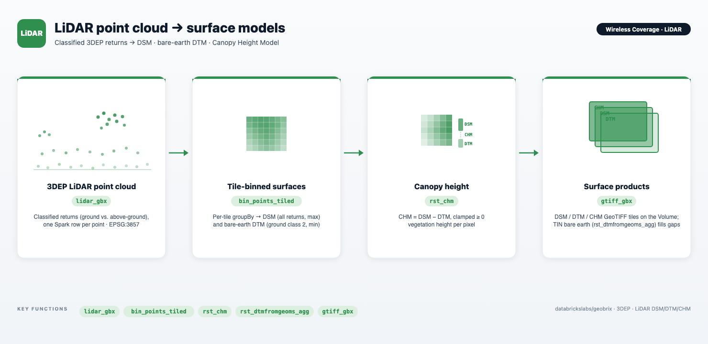

# Wireless Coverage — LiDAR Surface Foundations

A notebook series that builds the **elevation and surface data foundation** for wireless-coverage analysis directly from a USGS 3DEP **LiDAR point cloud** — data first, analytics later. The surfaces produced here (Canopy Height Model, Digital Surface Model, bare-earth Digital Terrain Model) are the inputs that later parts consume for antenna siting and line-of-sight with [`rst_viewshed`](../api/raster-functions).

Both notebooks work over **all of San Francisco** (`SF_AOI = (-122.55, 37.70, -122.35, 37.85)`), reading the staged 3DEP LiDAR (`.laz` Entwine Point Tile nodes) with the GeoBrix `lidar_gbx` reader and binning returns into 1 m rasters **per spatial tile**. A single 1 m raster over SF is ~460 M pixels, so binning is tiled and **bounded** — `rx.bin_points_tiled` bins each tile with memory proportional to the raster grid (W×H), not the point count, so a full-resolution (`DECIMATE=1`) tile never OOMs. The binned surfaces are persisted to **permanent tables** you own (a `CATALOG.SCHEMA` you set) and read back downstream.



:::tip View on GitHub
**[notebooks/examples/wireless-coverage](https://github.com/databrickslabs/geobrix/tree/main/notebooks/examples/wireless-coverage)** — download the folder and import the two numbered notebooks into your Databricks workspace to run.
:::

:::info Runs on the lightweight tier (Serverless) by default
The series uses the **lightweight tier** — pure Python/PySpark bindings (`databricks.labs.gbx.pyrx`) plus the `geobrix[light_env5,vizx]` wheel — so it runs on **Serverless environment 5** with no JAR or GDAL init script. The `laspy` / `lazrs` readers the point cloud needs ship with the light base. Visualization helpers come from `databricks.labs.gbx.vizx`. See [Execution Tiers](../api/execution-tiers).
:::

:::note Big-data by default
`DECIMATE=1` keeps **every** LiDAR return (~830 M over San Francisco) — an honest big-data run. Raise `DECIMATE` (e.g. 10) for a fast coarse pass while iterating on the visualization cells; the pipeline is identical either way.
:::

---

## The two notebooks

### Part 1 — Pure LiDAR → CHM (`01_pure_lidar_chm.ipynb`)

A classified LiDAR point cloud already carries everything a Canopy Height Model needs: every return is classified (ground vs. above-ground) and georeferenced. So the CHM is a couple of binning ops away — **no external DEM, no coverage gaps**:

- **DTM (bare earth)** — bin the **ground** returns (ASPRS class 2) → `min` elevation per pixel.
- **DSM (surface)** — bin **all** returns → `max` elevation per pixel.
- **CHM** — `rst_chm(DSM, DTM)` = DSM − DTM, clamped ≥ 0.

Part 1 is the shortest path from returns to canopy: it keeps only the CHM.

### Part 2 — Surfaces: DSM + DTM → CHM (`02_surfaces_dsm_dtm_chm.ipynb`)

Downstream coverage analytics consume **surface rasters**, not point clouds, so Part 2 persists the DSM and bare-earth DTM as reusable **permanent tables** you own (a governed Delta table of tiles in a `CATALOG.SCHEMA` you set; optional GeoTIFF export via `gtiff_gbx`), then derives the CHM from them. It also contrasts two bare-earth grounds on a sample tile:

- **Binned DTM** — `min` z of ground returns per pixel (fast; can leave tiny gaps where no ground return landed).
- **TIN DTM** — a Delaunay triangulation of the ground returns (`rst_dtmfromgeoms_agg`), barycentrically interpolated to a gap-free bare earth. The input points are built product-natively with `st_makepoint(x, y, z)`, so Z is carried through the WKB into the triangulation.

---

## Key GeoBrix functions shown

- **`lidar_gbx` reader** — `spark.read.format("lidar_gbx").option("decimate", …).load(path)` emits one Spark row per LiDAR return (`x, y, z, intensity, return_number, number_of_returns, classification, gps_time`), recursing sub-directories of staged `.laz`. Options: `classFilter`, `returnFilter`, `decimate`, `mode` (`points` / `metadata`). See [LiDAR reader](../readers/lidar).
- **`bin_points_tiled`** — bounded tiled point binning: peak memory is the raster grid (W×H), not the point count, so full-density LiDAR bins without OOM. Picks a per-pixel statistic (`max` for the DSM surface, `min` on ground returns for the bare-earth DTM) and is built on `rst_binpoints_agg`. See [RasterX › Memory & scale](../api/raster-functions#rst_binpoints_agg).
- **`rst_chm`** — differences an aligned DSM and DTM into a Canopy Height Model (`DSM − DTM`, clamped ≥ 0, NoData preserved). See [RasterX functions](../api/raster-functions).
- **`rst_dtmfromgeoms_agg`** — builds a Delaunay-TIN bare-earth surface from ground points (and optional breaklines) with barycentric interpolation — a gap-free alternative to the binned `min` DTM. Points arrive as WKB `POINT Z` from the product `st_makepoint(x, y, z)`. See [RasterX functions](../api/raster-functions).
- **`gtiff_gbx` writer** — `df.select("source", "tile").write.format("gtiff_gbx").mode("overwrite").save(dir)` writes each raster tile as a GeoTIFF (`<source>.tif`) to a Volume. See [GeoTIFF writer](../writers/geotiff).
- **`gbx.vizx` helpers** — `plot_raster` / `plot_file` render tiles and staged GeoTIFFs (auto-decimation + percentile stretch, `cmap=`). See [Visualization API](../api/vizx).

---

## Data flow

```text
Staged 3DEP LiDAR (.laz EPT nodes)  →  lidar_gbx reader  →  one row per return (x, y, z, classification, …; EPSG:3857)
        │
        ▼  assign tile keys (tx, ty) + per-tile extent columns (1024 m tiles, 1 m pixels)
        │
        ├─▼  bin_points_tiled(all returns, "max")  per tile (bounded)  →  DSM tiles
        └─▼  bin_points_tiled(class 2,      "min")  per tile (bounded)  →  DTM tiles (bare earth)
        │
        ▼  rst_chm(DSM, DTM)  (Spark, per tile)
Canopy Height Model tiles  (Float32, NoData = −9999)
        │
        ▼  (Part 2) _persist  →  DSM / DTM / CHM permanent tables (CATALOG.SCHEMA); optional gtiff_gbx GeoTIFF export
        ▼  (Part 2) rst_dtmfromgeoms_agg on st_makepoint(x, y, z) ground points  →  TIN bare earth (gap-free)
```

---

## Gotchas

- **Bin per tile, bounded.** A single 1 m raster over all of San Francisco is ~460 M pixels — far too large for one tile. `rx.bin_points_tiled` assigns per-tile extents and bins each tile with memory bounded by the grid (W×H), not the point count, so full-density (`DECIMATE=1`) binning never OOMs. (Calling `rst_binpoints_agg` directly realizes a whole tile's points and can exhaust RAM at full density — see [Memory & scale](../api/raster-functions#rst_binpoints_agg).)
- **Ground is ASPRS class 2.** The bare-earth DTM bins only classification 2 (ground); the DSM bins all returns. Filtering the point DataFrame to class 2 before the `min` bin is what makes the DTM "bare earth."
- **Z must survive to the TIN.** `rst_dtmfromgeoms_agg` needs `POINT Z` geometry. Build points with the product `st_makepoint(x, y, z)` and pass `st_asbinary(...)` — the WKB carries Z, so the triangulation interpolates real elevations rather than collapsing to 2D.
- **Thin the points that feed the TIN.** A Delaunay TIN holds **all** its points in memory to triangulate — unlike the binned DTM (memory bounded by the raster grid), a triangulation is inherently global and can't be grid-bounded. At `DECIMATE=1` a single tile's ground returns can exhaust a worker, so Part 2 samples them to a bounded count (`TIN_MAX_PTS`) before triangulating; a bare-earth TIN is near-identical from a representative subset. See [RasterX › Memory & scale](../api/raster-functions#rst_dtmfromgeoms_agg).
- **Empty / corrupt point-cloud nodes are skipped.** The `lidar_gbx` reader skips 0-byte or unreadable `.laz` files with a warning instead of failing the whole distributed read, so one bad EPT node can't take down the job.
- **Serverless-safe throughout.** No `spark.conf.set`, `_jvm`, `.rdd`, `.cache()` / `.persist()`. Surfaces are persisted to **permanent tables** you own (`CATALOG.SCHEMA`) — a governed Delta table of tiles, reused across cells and sessions rather than a session temp table. An optional `gtiff_gbx` export writes GeoTIFF files to a Volume.

---

## Related

- **DEM extra** — [H3 Rasterize](./h3-rasterize) takes the complementary path: a ready-made **10 m seamless DEM** over the Bay Area run through the full raster→H3 pipeline (`rst_clip` → `rst_isoband` → product H3 → `rst_h3_rasterize_agg` → `rst_frombands_agg`). No LiDAR required — it shows the "if the elevation raster already exists" route to the same kind of coverage-tier model.
