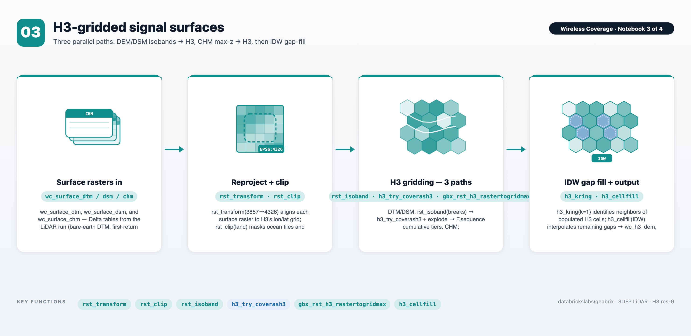

import Tabs from '@theme/Tabs';
import TabItem from '@theme/TabItem';

<Tabs groupId="wireless-coverage-flavor" queryString="flavor">
<TabItem value="lakeflow" label="Lakeflow SDP" default>

A production-ready Lakeflow Declarative Pipeline (SDP) for the Wireless Coverage workflow
is planned for a future release. It will productionize the surface-building (Parts 1–2a and 2b) and
H3-gridding (Part 3) steps into a scheduled medallion pipeline — surfaces → H3 grids →
coverage analysis — packaged as a Databricks Asset Bundle.

</TabItem>
<TabItem value="notebooks" label="Notebook Series">

# Wireless Coverage — LiDAR Surface Foundations

A notebook series that builds the **elevation and surface data foundation** for wireless-coverage analysis directly from a USGS 3DEP **LiDAR point cloud** — data first, analytics later. The surfaces produced here (Canopy Height Model, Digital Surface Model, bare-earth Digital Terrain Model) are the inputs that later parts consume for antenna siting via H3-native line-of-sight analysis.

The LiDAR path (Parts 1 and 2a) works over **all of San Francisco** (`SF_AOI = (-122.55, 37.70, -122.35, 37.85)`), reading the staged 3DEP LiDAR (`.laz` Entwine Point Tile nodes) with the GeoBrix `lidar_gbx` reader and binning returns into 1 m rasters **per spatial tile**. A single 1 m raster over SF is ~460 M pixels, so binning is tiled and **bounded** — `rx.bin_points_tiled` bins each tile with memory proportional to the raster grid (W×H), not the point count, so a full-resolution (`DECIMATE=1`) tile never OOMs. The binned surfaces are persisted to **permanent tables** you own (a `CATALOG.SCHEMA` you set) and read back downstream.


:::tip View on GitHub
**[notebooks/examples/wireless-coverage](https://github.com/databrickslabs/geobrix/tree/main/notebooks/examples/wireless-coverage)** — download the folder and import the notebooks (Parts 1, 2a, 2b, 3, and 4) into your Databricks workspace to run.
:::

:::info Runs on the lightweight tier (Serverless) by default
The series uses the **lightweight tier** — pure Python/PySpark bindings (`databricks.labs.gbx.pyrx`) plus the `geobrix[light_env6,vizx]` wheel — so it runs on **Serverless environment 6** with no JAR or GDAL init script. The `laspy` / `lazrs` readers the point cloud needs ship with the light base. Visualization helpers come from `databricks.labs.gbx.vizx`. See [Execution Tiers](../api/execution-tiers).
:::

:::note Big-data by default
`DECIMATE=1` keeps **every** LiDAR return (~830 M over San Francisco) — an honest big-data run. Raise `DECIMATE` (e.g. 10) for a fast coarse pass while iterating on the visualization cells; the pipeline is identical either way.
:::

---

## The notebooks

### Part 1 — Pure LiDAR → CHM (`01_pure_lidar_chm.ipynb`)

A classified LiDAR point cloud already carries everything a Canopy Height Model needs: every return is classified (ground vs. above-ground) and georeferenced. So the CHM is a couple of binning ops away — **no external DEM, no coverage gaps**:

- **DTM (bare earth)** — bin the **ground** returns (ASPRS class 2) → `min` elevation per pixel.
- **DSM (surface)** — bin **all** returns → `max` elevation per pixel.
- **CHM** — `rst_chm(DSM, DTM)` = DSM − DTM, clamped ≥ 0.

Part 1 is the shortest path from returns to canopy: it keeps only the CHM.

### Part 2a — Surfaces: DSM + DTM → CHM (`02a_surfaces_dsm_dtm_chm.ipynb`)

The main arc. Builds directly on the LiDAR point cloud from Part 1 and persists the complete surface stack as reusable **permanent tables** you own (a governed Delta table of tiles in a `CATALOG.SCHEMA` you set; optional GeoTIFF export via `gtiff_gbx`). The production bare-earth DTM is a **TIN surface** — a Delaunay triangulation of the classified ground returns (`rst_dtmfromgeoms_agg`), barycentrically interpolated to a gap-free raster. Because it works directly from the point cloud's own classification, it is a beyond-pixels surface: terrain reconstructed from the actual ground returns rather than approximated from raster values. The binned-`min` DTM is shown alongside for comparison:

- **TIN DTM** — a Delaunay triangulation of the ground returns (`rst_dtmfromgeoms_agg`), barycentrically interpolated to a gap-free bare earth. Points are built with `st_makepoint(x, y, z)`, so Z carries through the WKB into the triangulation. This is the production terrain.
- **Binned DTM** — `min` z of ground returns per pixel (fast; can leave tiny gaps where no ground return landed). Shown for comparison.

Writes the canonical `wc_surface_{dsm,dtm,chm}` tables and `OUT_DIR` GeoTIFFs that Parts 3 and 4 consume.

### Part 2b — Surfaces from a DSM Raster (`02b_surfaces_from_dsm.ipynb`)

An alternative on-ramp for when a LiDAR point cloud is not available. Starting from a DSM raster only, it approximates the bare-earth DTM by applying a morphological opening to the DSM — `rst_filter` min then max — and then deriving the CHM with `rst_chm`. The result is a **pixel-only approximation**: without ground-classified returns, the bare earth is estimated from the surface shape rather than reconstructed from the point cloud. The Parts 1–2a LiDAR path produces a more accurate terrain for production use; when no point cloud is available, a published terrain product such as USGS 3DEP is the recommended production alternative. Part 2b lands the same canonical `wc_surface_{dsm,dtm,chm}` tables as Part 2a, so Parts 3 and 4 work unchanged either way.

### Part 3 — H3 Gridding (`03_h3_gridding.ipynb`)



Takes the surface tables from Parts 1–2a (or 2b) and prepares them for global-grid analysis by
H3-indexing each surface at a parameterized resolution (default: H3 resolution 10, ≈65 m
edge). DEM and DSM elevation bands are extracted as contiguous isoband polygons via
`rst_isoband` and indexed to H3 cells with the Databricks product `h3_try_coverash3`;
cumulative elevation tiers give each cell a coverage-depth value. The Canopy Height Model
is aggregated to the maximum canopy height per H3 cell via `gbx_rst_h3_rastertogridmax`.
Interior gaps are filled with `h3_cellfill` (k=1, IDW, land mask re-applied after fill).
All three H3 tables — `wc_h3_dem`, `wc_h3_dsm`, `wc_h3_chm` — are prepared for
downstream analysis in Part 4.

### Part 4 — Naive H3-Native Tower Siting (`04_tower_viewsheds.ipynb`)


With the LiDAR surfaces from Parts 2a/2b and the H3 grids from Part 3 in hand, Part 4 asks the
siting question: which candidate tower locations are worth the detailed analysis? The approach is
deliberately **naive** — a baseline screen, not a final plan — and stays entirely in the H3 domain
rather than operating on pixels.

**Candidate lattice.** One tower candidate is placed at the centroid of every H3 resolution-9 cell
(≈170 m edge) that falls within the area of interest. No land-cover constraints, no placement
optimisation — just a dense, regular lattice that covers the whole AOI.

**Quick-pass rule-out.** Before paying for any detailed line-of-sight work, each candidate gets a
cheap coarse viewshed at H3 resolution 10 (≈65 m). A site that cannot achieve at least 30% coverage
of its buffer at that coarse resolution is ruled out immediately. In the Golden Gate Park demo, this
reduces 176 candidates to 62 survivors (~65% discarded) before any fine-resolution work begins.

**Exact H3 line-of-sight.** Each surviving candidate is evaluated with the library function
`h3_los_visible` (from `databricks.labs.gbx.pygx`) — a pure-Python H3 primitive that runs an exact
ray-march test for every cell in the buffer. The observer sits at the DSM surface height plus a 10 m
antenna clearance; the target is the ground surface (DTM) plus a 1.6 m receiver height. The buffer
radius is 2.5 km. The line-of-sight test uses the binned H3 surface as both the blocker map and the
ground reference, so it is a surface-relative check — the only shortcut is the H3 binning resolution,
not the line-of-sight geometry.

**Two-factor scoring.** Each site is scored on two independent factors kept as separate columns:

- **`required_mast`** — the mast height the site needs to clear its own local surface and provide
  the 10 m antenna clearance (`CHM + antenna_clearance`; lower is cheaper to build).
- **`viewshed_cells`** — the number of H3 cells the site has line of sight to (higher is better
  coverage).

Sites are ranked by `viewshed_cells` descending, then `required_mast` ascending (nulls last).
Combining the two into a single score — balancing cost against coverage — is a decision left to
the analyst.

**Nearest-ground fallback.** Where a cell has a DSM surface value but no bare-earth DTM value
(typical at water bodies or dense-canopy edges), the ground height for `required_mast` is filled
from the mean of the nearest populated H3 ring (expanding up to 3 rings). A site with no ground
anywhere in those rings keeps `required_mast` as NULL — honestly uncostable rather than guessed.

**Outputs** (all gated on `FORCE_RELOAD`; once the tables exist a re-run loads them and skips the
per-tower viewsheds):

| Table | Contents |
|---|---|
| `wc_h3_quickpass` | Every candidate's coarse coverage fraction (pre-rule-out score) |
| `wc_h3_candidate_sites` | Ranked survivors: `required_mast`, `viewshed_cells`, `viewshed_pct`, `observer_z` |
| `wc_h3_coverage` | Per-cell LOS depth: how many sited towers can see each H3 cell |
| `wc_h3_coverage_top10` | Same, aggregated over only the top-10 sites by coverage |

**Four maps** trace the rule-out funnel: (A) all candidates coloured by coarse coverage fraction;
(B) survivors that cleared the quick-pass; (C) per-cell coverage depth with all sited towers and
their 2.5 km buffers overlaid; (D) the ten best sites with their viewsheds and buffers.

**Next.** A forthcoming `land_cover` notebook adds the demand side — weighting coverage by where
people and buildings are, excluding water, parks, and no-build zones — and optimises placement
within each cell, turning this naive screen into a smarter siting tool.

---

## Key GeoBrix functions shown

- **`lidar_gbx` reader** — `spark.read.format("lidar_gbx").option("decimate", …).load(path)` emits one Spark row per LiDAR return (`x, y, z, intensity, return_number, number_of_returns, classification, gps_time`), recursing sub-directories of staged `.laz`. Options: `classFilter`, `returnFilter`, `decimate`, `mode` (`points` / `metadata`). See [LiDAR reader](../readers/lidar).
- **`bin_points_tiled`** — bounded tiled point binning: peak memory is the raster grid (W×H), not the point count, so full-density LiDAR bins without OOM. Picks a per-pixel statistic (`max` for the DSM surface, `min` on ground returns for the bare-earth DTM) and is built on `rst_binpoints_agg`. See [RasterX › Memory & scale](../api/raster-functions#rst_binpoints_agg).
- **`rst_chm`** — differences an aligned DSM and DTM into a Canopy Height Model (`DSM − DTM`, clamped ≥ 0, NoData preserved). See [RasterX functions](../api/raster-functions).
- **`rst_dtmfromgeoms_agg`** — builds a Delaunay-TIN bare-earth surface from ground points (and optional breaklines) with barycentric interpolation — a gap-free alternative to the binned `min` DTM. Points arrive as WKB `POINT Z` from the product `st_makepoint(x, y, z)`. See [RasterX functions](../api/raster-functions).
- **`gtiff_gbx` writer** — `df.select("source", "tile").write.format("gtiff_gbx").mode("overwrite").save(dir)` writes each raster tile as a GeoTIFF (`<source>.tif`) to a Volume. See [GeoTIFF writer](../writers/geotiff).
- **`gbx.vizx` helpers** — `plot_raster` / `plot_file` render tiles and staged GeoTIFFs (auto-decimation + percentile stretch, `cmap=`). See [Visualization API](../api/vizx).

---

## Data flow

```text
Staged 3DEP LiDAR (.laz EPT nodes)  →  lidar_gbx reader  →  one row per return (x, y, z, classification, …; EPSG:3857)
        │
        ▼  assign tile keys (tx, ty) + per-tile extent columns (1024 m tiles, 1 m pixels)
        │
        ├─▼  bin_points_tiled(all returns, "max")  per tile (bounded)  →  DSM tiles
        └─▼  bin_points_tiled(class 2,      "min")  per tile (bounded)  →  DTM tiles (bare earth)
        │
        ▼  rst_chm(DSM, DTM)  (Spark, per tile)
Canopy Height Model tiles  (Float32, NoData = −9999)
        │
        ▼  (Part 2a) _persist  →  DSM / DTM / CHM permanent tables (CATALOG.SCHEMA); optional gtiff_gbx GeoTIFF export
        ▼  (Part 2a) rst_dtmfromgeoms_agg on st_makepoint(x, y, z) ground points  →  TIN bare earth (gap-free)
        ▼  (Part 2b, alt) DSM raster in  →  rst_filter(min→max) morphological open  →  approximate bare earth; rst_chm  →  same surface tables (pixel-only path)
        │
        ▼  (Part 3) rst_isoband → h3_try_coverash3  →  wc_h3_dem / wc_h3_dsm elevation-tier grids
        ▼  (Part 3) gbx_rst_h3_rastertogridmax  →  wc_h3_chm max-canopy grid
        ▼  (Part 3) h3_cellfill (k=1, IDW, land mask)  →  gap-filled H3 tables
        │
        ▼  (Part 4) H3 res-9 centroid lattice  →  quick-pass rule-out (res-10, 30% threshold)
        ▼  (Part 4) h3_los_visible (res-12, 2.5 km buffer)  →  wc_h3_candidate_sites
        ▼  (Part 4) per-cell LOS depth aggregation  →  wc_h3_coverage / wc_h3_coverage_top10
```

---

## Gotchas

- **Bin per tile, bounded.** A single 1 m raster over all of San Francisco is ~460 M pixels — far too large for one tile. `rx.bin_points_tiled` assigns per-tile extents and bins each tile with memory bounded by the grid (W×H), not the point count, so full-density (`DECIMATE=1`) binning never OOMs. (Calling `rst_binpoints_agg` directly realizes a whole tile's points and can exhaust RAM at full density — see [Memory & scale](../api/raster-functions#rst_binpoints_agg).)
- **Ground is ASPRS class 2.** The bare-earth DTM bins only classification 2 (ground); the DSM bins all returns. Filtering the point DataFrame to class 2 before the `min` bin is what makes the DTM "bare earth."
- **Z must survive to the TIN.** `rst_dtmfromgeoms_agg` needs `POINT Z` geometry. Build points with the product `st_makepoint(x, y, z)` and pass `st_asbinary(...)` — the WKB carries Z, so the triangulation interpolates real elevations rather than collapsing to 2D.
- **Thin the points that feed the TIN.** A Delaunay TIN holds **all** its points in memory to triangulate — unlike the binned DTM (memory bounded by the raster grid), a triangulation is inherently global and can't be grid-bounded. At `DECIMATE=1` a single tile's ground returns can exhaust a worker, so Part 2a samples them to a bounded count (`TIN_MAX_PTS`) before triangulating; a bare-earth TIN is near-identical from a representative subset. See [RasterX › Memory & scale](../api/raster-functions#rst_dtmfromgeoms_agg).
- **Empty / corrupt point-cloud nodes are skipped.** The `lidar_gbx` reader skips 0-byte or unreadable `.laz` files with a warning instead of failing the whole distributed read, so one bad EPT node can't take down the job.
- **Serverless-safe throughout.** No `spark.conf.set`, `_jvm`, `.rdd`, `.cache()` / `.persist()`. Surfaces are persisted to **permanent tables** you own (`CATALOG.SCHEMA`) — a governed Delta table of tiles, reused across cells and sessions rather than a session temp table. An optional `gtiff_gbx` export writes GeoTIFF files to a Volume.

---

## Related

- **DEM extra** — [H3 Rasterize](./h3-rasterize) takes the complementary path: a ready-made **10 m seamless DEM** over the Bay Area run through the full raster→H3 pipeline (`rst_clip` → `rst_isoband` → product H3 → `rst_h3_rasterize_agg` → `rst_frombands_agg`). No LiDAR required — it shows the "if the elevation raster already exists" route to the same kind of coverage-tier model.

</TabItem>
</Tabs>
