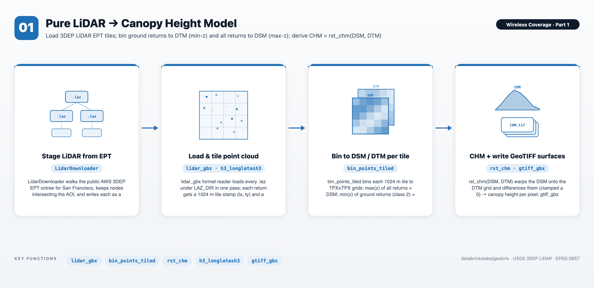
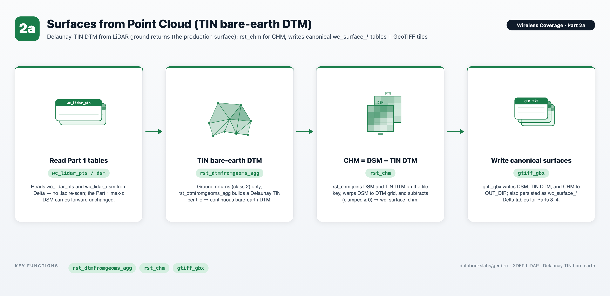
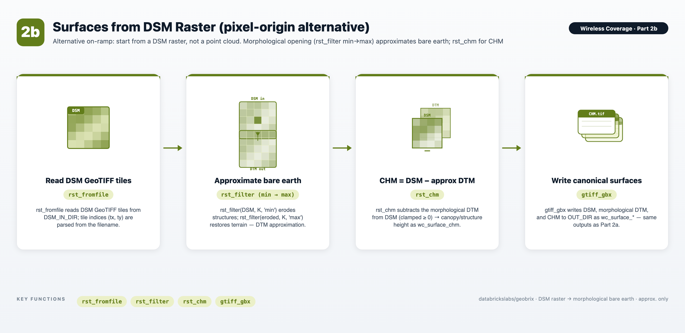
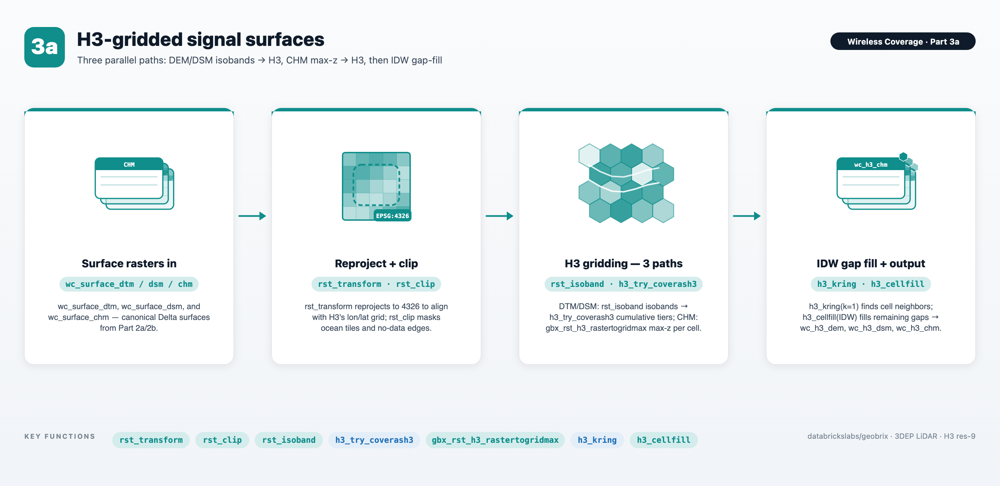
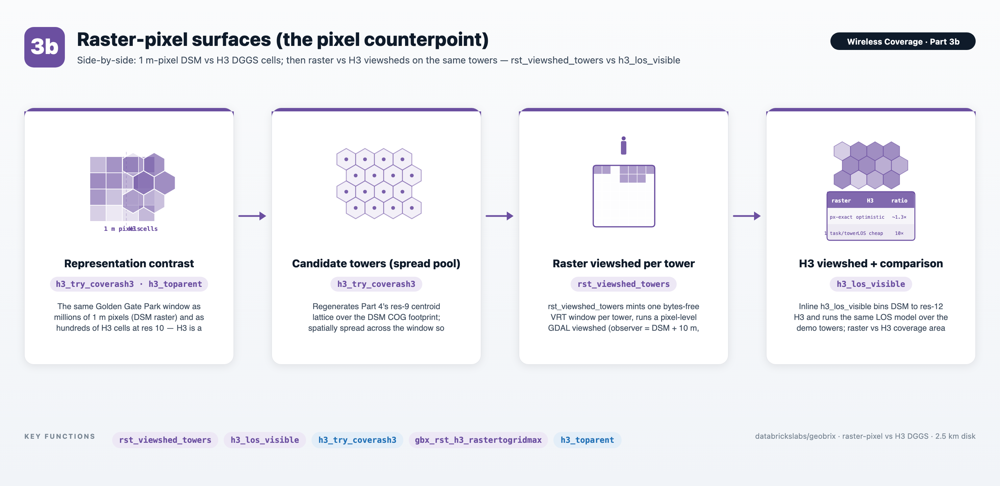
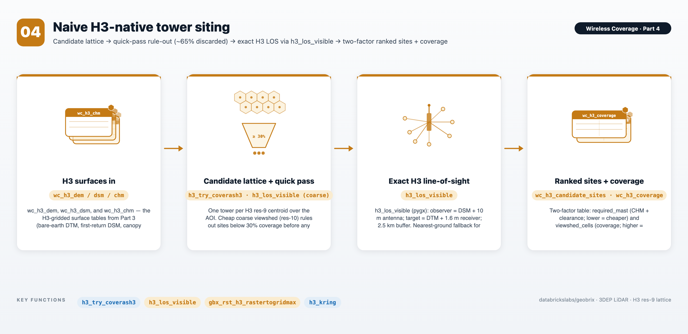

import Tabs from '@theme/Tabs';
import TabItem from '@theme/TabItem';

<Tabs groupId="wireless-coverage-flavor" queryString="flavor">
<TabItem value="lakeflow" label="Lakeflow SDP" default>

A production-ready Wireless Coverage pipeline: a [Lakeflow Declarative Pipeline](https://docs.databricks.com/aws/en/dlt/) (SDP) plus a post-pipeline tower-siting task, packaged as a [Databricks Asset Bundle](https://docs.databricks.com/aws/en/dev-tools/bundles/) and running entirely on the GeoBrix **lightweight tier** over **Serverless** compute.

This is the production counterpart to the notebook series (see the other tab) — same San Francisco AOI and USGS 3DEP LiDAR sources, but running as a scheduled medallion pipeline instead of one-off notebook outputs: a `land` downloader task stages the data, then the pipeline cascades bronze → silver → gold through declared table-to-table dependencies, a `siting` task runs the H3-native tower analysis, and a `validate` notebook confirms all outputs.

:::tip View on GitHub
**[notebooks/examples/wireless-coverage/lakeflow](https://github.com/databrickslabs/geobrix/tree/main/notebooks/examples/wireless-coverage/lakeflow)** — the bundle, pipeline transformations, siting task, validation notebook, and full setup instructions live here. See its [README](https://github.com/databrickslabs/geobrix/tree/main/notebooks/examples/wireless-coverage/lakeflow/README.md) for deploy/run steps, prerequisites, and configuration notes.
:::

:::info Runs on the lightweight tier (Serverless)
The pipeline and its `land` and `siting` tasks install the GeoBrix wheel with the extra that matches the Lakeflow runtime — **as of this example DBR 18.3**, so `geobrix[light_dbr18,vizx]` (pipeline) and `geobrix[light_env5,vizx]` (serverless job tasks), both the protobuf-5 regime — as a single pip dependency entry; pure Python/PySpark bindings (`databricks.labs.gbx.pyrx`, `pygx`), no JAR, Serverless throughout. Lakeflow pins compute by a runtime channel: check the [current Lakeflow runtime channel](https://docs.databricks.com/aws/en/release-notes/dlt/#current-databricks-runtime-channel-versions) when you deploy and switch the extra to match if it has moved (e.g. DBR 19 → `[light_dbr19]`/`[light_env6]`). The bundle **defaults to Serverless**; for heavier runs (notably full San Francisco) you can switch the pipeline and job tasks to **classic compute** (`serverless: false` + a cluster spec) for dedicated memory and throughput. See [Execution Tiers](../api/execution-tiers).
:::

## How it works: from staged LiDAR to ranked tower sites


A scheduled run takes raw USGS 3DEP LiDAR `.laz` files through six stages:

1. **Land** — a downloader task stages USGS 3DEP LiDAR EPT nodes and Overture water polygons onto a Unity Catalog Volume. Nothing is interpreted yet — data just arrives.
2. **Bronze — inventory** — Auto Loader records one row per `.laz` file as it appears, so re-runs pick up only newly staged data.
3. **Silver — surface stack** — classified returns are tile-indexed and binned into 1 m DSM and TIN DTM rasters per tile; `rst_chm` derives the Canopy Height Model.
4. **Gold — H3 grids** — the surfaces are reprojected to EPSG:4326, isobanded, and indexed to H3 cells at resolution 10. Each table carries a stable res-9 join key so downstream consumers join on one column.
5. **Siting** — a post-pipeline Spark task runs the H3-native tower-siting analysis: a res-9 candidate lattice, a coarse quick-pass to rule out weak sites, and exact res-12 H3 line-of-sight viewsheds on survivors (distributed via `h3_viewshed_towers` — one tower per Spark task).
6. **Validate** — a final notebook task confirms all output tables are populated and spot-checks quality assertions.

Each stage reads only the one before it — declared as table-to-table dependencies — so Lakeflow builds the lineage graph, runs stages in order, and recomputes only what changed.

## Table catalog

All tables land in `{catalog}.{schema}` (defaults: `geospatial_docs.wireless_coverage_lf`).

### Bronze

| Table | Description |
|---|---|
| `laz_inventory` | Auto Loader streaming table — one row per staged `.laz` EPT file (`path`, `file_size`, `_ingested_at`). |

### Silver

| Table | Description |
|---|---|
| `wc_lidar_pts` | Classified LiDAR returns, tile-indexed with a res-15 H3 cell ID (EPSG:3857). |
| `wc_surface_dsm` | DSM — max elevation of all returns per 1 m tile. |
| `wc_surface_dtm` | DTM — Delaunay-TIN bare earth over class-2 ground returns (gap-free). |
| `wc_surface_chm` | CHM — `rst_chm(DSM, DTM)`: canopy/structure height in metres, clamped ≥ 0. |

### Gold

| Table | Description |
|---|---|
| `wc_h3_dem_res10` | Bare-earth elevation-band H3 cells (res 10), land-masked, with res-9 parent join key. |
| `wc_h3_dsm_res10` | Surface elevation-band H3 cells (res 10), land-masked, with res-9 parent join key. |
| `wc_h3_chm_res10` | Max canopy/structure height per H3 cell (res 10), gap-filled, land-masked, with res-9 parent join key. |

### Siting

The siting tables are regular Delta tables, overwritten each run. Coverage outputs are H3-indexed at resolution 12 and carry the res-9 parent join key.

| Table | Description |
|---|---|
| `wc_h3_surf_r13` | H3 res-13 surface bin (DSM max elevation per cell) — finest-resolution blocker surface. |
| `wc_h3_grnd_r13` | H3 res-13 ground bin (DTM min elevation per cell) — finest-resolution bare-earth base. |
| `wc_h3_quickpass_res9` | Every res-9 candidate's coarse quick-pass coverage fraction (pre-rule-out screen). |
| `wc_h3_candidate_sites_res9` | Ranked tower survivors: `required_mast`, `viewshed_cells`, `viewshed_pct`, `observer_z`. |
| `wc_h3_coverage_res12` | Per-cell line-of-sight depth at res 12 — how many sited towers can see each cell. H3-indexed output suitable for external H3 map layers. Carries the res-9 parent join key. |
| `wc_h3_coverage_top10_res12` | Same, aggregated over only the top-10 sites by coverage. H3-indexed output suitable for external H3 map layers. Carries the res-9 parent join key. |

## Deploy and run

```bash
databricks bundle deploy
databricks bundle run wireless_coverage_lf_job
```

The bundle validates and deploys with the committed defaults in `databricks.yml` out of the box. To point it at your own workspace, copy `databricks.override.yml.example` to `databricks.override.yml` (git-ignored) and fill in your CLI profile; it is layered in automatically via `include: ["*.override.yml"]`. A fresh clone with no override file still validates/deploys.

- **Schedule**: the job ships paused (`pause_status: PAUSED`, daily at `0 0 7 * * ?` America/Chicago) — unpause it in the workspace once you've confirmed a manual run.
- **Shared LiDAR**: if you have already run the notebook series and staged the USGS 3DEP data, set `laz_dir` (and optionally `water_mask_dir`) in your override file to reuse those files and skip the ~830 MB download. See `databricks.override.yml.example` for the exact paths.
- **GeoBrix wheel**: `gbx_wheel` points at a staged `geobrix-0.5.2-py3-none-any.whl`. Stage your own build at that path or override the variable to wherever your wheel lives.

## Configuration

Bundle variables (set in `databricks.yml`; override per-workspace in `databricks.override.yml`):

| Variable | Default | Description |
|---|---|---|
| `catalog` | `geospatial_docs` | Unity Catalog catalog name. |
| `schema` | `wireless_coverage_lf` | UC schema; all pipeline and siting tables land here. |
| `volume` | `data` | UC volume; raw data lands under `{volume}/wireless-coverage-lf/`. |
| `full_aoi` | `true` | `true` for the full San Francisco AOI; `false` for the Golden Gate Park demo window. |
| `laz_dir` | _(derived)_ | Path to staged `.laz` EPT files. Leave empty to auto-derive under the Volume. Set to the notebook series' Volume path to reuse already-staged LiDAR. |
| `water_mask_dir` | _(derived)_ | Path to staged Overture water GeoParquet. Leave empty to auto-derive. |
| `gbx_wheel` | `/Volumes/geospatial_docs/geobrix/sample-data/geobrix-0.5.2-py3-none-any.whl` | Path to the staged GeoBrix wheel. |

Algorithm and resolution parameters are tunable via `wireless_coverage.*` keys in the pipeline `configuration` block. Key defaults:

| Key | Default | Description |
|---|---|---|
| `h3_res` | `10` | H3 resolution for the gold elevation/canopy grids. |
| `tower_res` | `9` | H3 resolution for the naive candidate-tower lattice. |
| `quickpass_res` | `10` | Coarse quick-pass screen resolution. |
| `viewshed_res` | `12` | Exact H3 line-of-sight resolution (coverage output). |
| `surface_bin_res` | `13` | Finest H3 "pixel" bin resolution for siting surfaces. |
| `max_dist_m` | `2500` | Line-of-sight buffer radius in metres. |
| `antenna_above_surface_m` | `10` | Observer height above the DSM surface in metres. |
| `quick_thresh_frac` | `0.30` | Minimum quick-pass coverage fraction to survive rule-out. |

## Prerequisites

- **Unity Catalog**: a catalog and schema (defaults `geospatial_docs.wireless_coverage_lf`) and a Volume named `data` under it. The pipeline creates sub-directories inside the Volume, not the Volume itself.
- **GeoBrix wheel** staged at the `gbx_wheel` path. See [Execution Tiers](../api/execution-tiers).
- **Network access**: the `land` task fetches USGS 3DEP and Overture Maps data over HTTPS — Serverless has outbound internet by default.

## Validation notebook

The `validate` task (`validate/validate_wc_lf.ipynb`) runs after the siting task completes, reads all output tables, confirms each is non-empty, and prints summary statistics. Run it manually from the workspace as a quick sanity check after a fresh deploy or configuration change.

</TabItem>
<TabItem value="notebooks" label="Notebook Series">

# Wireless Coverage — LiDAR Surface Foundations

A notebook series that builds the **elevation and surface data foundation** for wireless-coverage analysis directly from a USGS 3DEP **LiDAR point cloud** — data first, analytics later. The surfaces produced here (Canopy Height Model, Digital Surface Model, bare-earth Digital Terrain Model) are the inputs that later parts consume for antenna siting via H3-native line-of-sight analysis.

The LiDAR path (Parts 1 and 2a) works over **all of San Francisco** (`SF_AOI = (-122.55, 37.70, -122.35, 37.85)`), reading the staged 3DEP LiDAR (`.laz` Entwine Point Tile nodes) with the GeoBrix `lidar_gbx` reader and binning returns into 1 m rasters **per spatial tile**. A single 1 m raster over SF is ~460 M pixels, so binning is tiled and **bounded** — `rx.bin_points_tiled` bins each tile with memory proportional to the raster grid (W×H), not the point count, so a full-resolution (`DECIMATE=1`) tile never OOMs. The binned surfaces are persisted to **permanent tables** you own (a `CATALOG.SCHEMA` you set) and read back downstream.


:::tip View on GitHub
**[notebooks/examples/wireless-coverage](https://github.com/databrickslabs/geobrix/tree/main/notebooks/examples/wireless-coverage)** — download the folder and import the notebooks (Parts 1, 2a, 2b, 3a, 3b, and 4) into your Databricks workspace to run.
:::

:::info Runs on the lightweight tier (Serverless) by default
The series uses the **lightweight tier** — pure Python/PySpark bindings (`databricks.labs.gbx.pyrx`) plus the `geobrix[light_env6,vizx]` wheel — so it runs on **Serverless environment 6** with no JAR or GDAL init script. The `laspy` / `lazrs` readers the point cloud needs ship with the light base. Visualization helpers come from `databricks.labs.gbx.vizx`. See [Execution Tiers](../api/execution-tiers).
:::

:::note Big-data by default
`DECIMATE=1` keeps **every** LiDAR return (~830 M over San Francisco) — an honest big-data run. Raise `DECIMATE` (e.g. 10) for a fast coarse pass while iterating on the visualization cells; the pipeline is identical either way.
:::

---

## The notebooks

### Part 1 — Pure LiDAR → CHM (`01_pure_lidar_chm.ipynb`)



A classified LiDAR point cloud already carries everything a Canopy Height Model needs: every return is classified (ground vs. above-ground) and georeferenced. So the CHM is a couple of binning ops away — **no external DEM, no coverage gaps**:

- **DTM (bare earth)** — bin the **ground** returns (ASPRS class 2) → `min` elevation per pixel.
- **DSM (surface)** — bin **all** returns → `max` elevation per pixel.
- **CHM** — `rst_chm(DSM, DTM)` = DSM − DTM, clamped ≥ 0.

Part 1 is the shortest path from returns to canopy: it keeps only the CHM.

### Part 2a — Surfaces: DSM + DTM → CHM (`02a_surfaces_dsm_dtm_chm.ipynb`)



The main arc. Builds directly on the LiDAR point cloud from Part 1 and persists the complete surface stack as reusable **permanent tables** you own (a governed Delta table of tiles in a `CATALOG.SCHEMA` you set; optional GeoTIFF export via `gtiff_gbx`). The production bare-earth DTM is a **TIN surface** — a Delaunay triangulation of the classified ground returns (`rst_dtmfromgeoms_agg`), barycentrically interpolated to a gap-free raster. Because it works directly from the point cloud's own classification, it is a beyond-pixels surface: terrain reconstructed from the actual ground returns rather than approximated from raster values. The binned-`min` DTM is shown alongside for comparison:

- **TIN DTM** — a Delaunay triangulation of the ground returns (`rst_dtmfromgeoms_agg`), barycentrically interpolated to a gap-free bare earth. Points are built with `st_makepoint(x, y, z)`, so Z carries through the WKB into the triangulation. This is the production terrain.
- **Binned DTM** — `min` z of ground returns per pixel (fast; can leave tiny gaps where no ground return landed). Shown for comparison.

Writes the canonical `wc_surface_{dsm,dtm,chm}` tables and `OUT_DIR` GeoTIFFs that Parts 3a, 3b, and 4 consume.

### Part 2b — Surfaces from a DSM Raster (`02b_surfaces_from_dsm.ipynb`)



An alternative on-ramp for when a LiDAR point cloud is not available. Starting from a DSM raster only, it approximates the bare-earth DTM by applying a morphological opening to the DSM — `rst_filter` min then max — and then deriving the CHM with `rst_chm`. The result is a **pixel-only approximation**: without ground-classified returns, the bare earth is estimated from the surface shape rather than reconstructed from the point cloud. The Parts 1–2a LiDAR path produces a more accurate terrain for production use; when no point cloud is available, a published terrain product such as USGS 3DEP is the recommended production alternative. Part 2b lands the same canonical `wc_surface_{dsm,dtm,chm}` tables as Part 2a, so Parts 3 and 4 work unchanged either way.

### Part 3a — H3 Gridding (`03a_h3_gridding.ipynb`)



Takes the surface tables from Parts 1–2a (or 2b) and prepares them for global-grid analysis by
H3-indexing each surface at a parameterized resolution (default: H3 resolution 10, ≈65 m
edge). DEM and DSM elevation bands are extracted as contiguous isoband polygons via
`rst_isoband` and indexed to H3 cells with the Databricks product `h3_try_coverash3`;
cumulative elevation tiers give each cell a coverage-depth value. The Canopy Height Model
is aggregated to the maximum canopy height per H3 cell via `gbx_rst_h3_rastertogridmax`.
Interior gaps are filled with `h3_cellfill` (k=1, IDW, land mask re-applied after fill).
All three H3 tables — `wc_h3_dem`, `wc_h3_dsm`, `wc_h3_chm` — are prepared for
downstream analysis in Part 4. Each H3-cell output table carries a stable res-9 rollup join
key — `parent_cellid` (the `h3_toparent` of each cell at res 9) and `parent_cellid_res` —
so they join in one column to any external grid keyed at H3 resolution 9 (coverage, demand,
population). This key is present on the Part 3a `wc_h3_*` tables, Part 4's
`wc_h3_coverage*` tables, and Part 3b's `wc_rpx_h3_coverage` table.

H3 resolution is a choice, not a ceiling. Part 1 stored one res-15 cell per LiDAR return
(`cellid_r15`, ≈0.9 m² — sub-metre, finer than a 1 m pixel). `h3_toparent` rolls any
res-15 cell to any coarser resolution in a GROUP BY, so the same underlying data feeds
res-10 visualisation grids and res-12 viewshed buffers alike.

### Part 3b — Raster-Pixel Surfaces (`03b_raster_pixel_surfaces.ipynb`)



The honest counterpoint to Part 3a. Where Part 3a takes the LiDAR surfaces *beyond pixels*
into an H3 discrete global grid, Part 3b holds the **native 1 m raster** representation up
next to that H3 grid — and then re-runs Part 4's tower-siting question on the raster side so
you can see how the two paradigms score the same ground.

**Part A — representation contrast.** Over a 2 km window around Golden Gate Park, the same
DSM surface is rendered as 1 m-pixel tiles and as H3 cells at resolution 10. The contrast
makes the resolution-dial framing concrete: the raster is fixed at 1 m; H3 dials to *any*
resolution via `h3_toparent`. The res-15 cells stored in Part 1 (≈0.9 m² per cell — finer
than a 1 m pixel) roll to resolution 10, 12, or any other target with a GROUP BY, so H3's
resolution is a dial, not a ceiling.

**Part B — viewshed foil.** An independent spread of candidate towers over the DSM footprint
is scored with the per-tower raster viewshed (`rst_viewshed_towers`) and, inline, the same
res-12 H3 line-of-sight model (`h3_los_visible`) — so Part 3b runs standalone and the two
engines are compared head-to-head. The candidate lattice regenerates Part 4's res-9 centroid
pattern independently — Part 3b reads only the Part 2 DSM, Part 3a's H3 grids, and
`config_nb`; it never touches a Part 4 table. `rst_viewshed_towers` selects the in-radius
1 m DSM tiles for each tower, mints a bytes-free VRT, runs one pixel-level viewshed, and
histograms in-radius coverage — one tower per Spark task, the natural fan-out unit at full
San Francisco scale. No raster bytes cross a shuffle.

The trade-off is stated honestly: Part 4's H3 viewshed bins one max-height per ~17 m
res-12 cell, which smooths fine blockers that a 1 m raster line-of-sight respects. That
makes the H3 viewshed an **optimistic screening estimate** — suitable for ruling out
candidates quickly across the full lattice — while the raster viewshed is the **strict
pixel-level confirmation** of a shortlisted site's exact coverage footprint. The large
coverage gap between the two outputs is the expected signature of that resolution smoothing,
not a defect in either approach.

**Outputs** (gated on `FORCE_RELOAD`; saved under the `wc_rpx_` prefix):

| Table | Contents |
|---|---|
| `wc_rpx_raster_viewshed_demo` | Per-tower raster coverage counts (`visible_px`, `total_px`, viewshed geometry) |
| `wc_rpx_h3_viewshed_demo` | Per-tower H3 line-of-sight cell counts (the H3-engine viewshed) |
| `wc_rpx_h3_coverage_demo` | Per-cell H3 LOS coverage depth for the demo towers |
| `wc_rpx_comparison_demo` | Raster vs H3 coverage area on the shared 2.5 km-disk metric |

**Maps** — the strongest demo tower's exact 1 m-pixel viewshed next to Part 4's H3-cell
coverage depth: two paradigms, one scene.

### Part 4 — Naive H3-Native Tower Siting (`04_tower_viewsheds.ipynb`)



With the LiDAR surfaces from Parts 2a/2b and the H3 grids from Part 3a in hand, Part 4 asks the
siting question: which candidate tower locations are worth the detailed analysis? The approach is
deliberately **naive** — a baseline screen, not a final plan — and stays entirely in the H3 domain
rather than operating on pixels.

**Candidate lattice.** One tower candidate is placed at the centroid of every H3 resolution-9 cell
(≈170 m edge) that falls within the area of interest. No land-cover constraints, no placement
optimisation — just a dense, regular lattice that covers the whole AOI.

**Quick-pass rule-out.** Before paying for any detailed line-of-sight work, each candidate gets a
cheap coarse viewshed at H3 resolution 10 (≈65 m). A site that cannot achieve at least 30% coverage
of its buffer at that coarse resolution is ruled out immediately. In the Golden Gate Park demo, this
reduces 176 candidates to 62 survivors (~65% discarded) before any fine-resolution work begins.

**Exact H3 line-of-sight.** Each surviving candidate is evaluated with the library function
`h3_los_visible` (from `databricks.labs.gbx.pygx`) — a pure-Python H3 primitive that runs an exact
ray-march test for every cell in the buffer. The observer sits at the DSM surface height plus a 10 m
antenna clearance; the target is the ground surface (DTM) plus a 1.6 m receiver height. The buffer
radius is 2.5 km. The line-of-sight test uses the binned H3 surface as both the blocker map and the
ground reference, so it is a surface-relative check — the only shortcut is the H3 binning resolution,
not the line-of-sight geometry.

**Two-factor scoring.** Each site is scored on two independent factors kept as separate columns:

- **`required_mast`** — the mast height the site needs to clear its own local surface and provide
  the 10 m antenna clearance (`CHM + antenna_clearance`; lower is cheaper to build).
- **`viewshed_cells`** — the number of H3 cells the site has line of sight to (higher is better
  coverage).

Sites are ranked by `viewshed_cells` descending, then `required_mast` ascending (nulls last).
Combining the two into a single score — balancing cost against coverage — is a decision left to
the analyst.

**Nearest-ground fallback.** Where a cell has a DSM surface value but no bare-earth DTM value
(typical at water bodies or dense-canopy edges), the ground height for `required_mast` is filled
from the mean of the nearest populated H3 ring (expanding up to 3 rings). A site with no ground
anywhere in those rings keeps `required_mast` as NULL — honestly uncostable rather than guessed.

**Outputs** (all gated on `FORCE_RELOAD`; once the tables exist a re-run loads them and skips the
per-tower viewsheds):

| Table | Contents |
|---|---|
| `wc_h3_quickpass` | Every candidate's coarse coverage fraction (pre-rule-out score) |
| `wc_h3_candidate_sites` | Ranked survivors: `required_mast`, `viewshed_cells`, `viewshed_pct`, `observer_z` |
| `wc_h3_coverage` | Per-cell LOS depth: how many sited towers can see each H3 cell |
| `wc_h3_coverage_top10` | Same, aggregated over only the top-10 sites by coverage |

**Four maps** trace the rule-out funnel: (A) all candidates coloured by coarse coverage fraction;
(B) survivors that cleared the quick-pass; (C) per-cell coverage depth with all sited towers and
their 2.5 km buffers overlaid; (D) the ten best sites with their viewsheds and buffers.

**Next.** A forthcoming `land_cover` notebook adds the demand side — weighting coverage by where
people and buildings are, excluding water, parks, and no-build zones — and optimises placement
within each cell, turning this naive screen into a smarter siting tool.

---

## Key GeoBrix functions shown

- **`lidar_gbx` reader** — `spark.read.format("lidar_gbx").option("decimate", …).load(path)` emits one Spark row per LiDAR return (`x, y, z, intensity, return_number, number_of_returns, classification, gps_time`), recursing sub-directories of staged `.laz`. Options: `classFilter`, `returnFilter`, `decimate`, `mode` (`points` / `metadata`). See [LiDAR reader](../readers/lidar).
- **`bin_points_tiled`** — bounded tiled point binning: peak memory is the raster grid (W×H), not the point count, so full-density LiDAR bins without OOM. Picks a per-pixel statistic (`max` for the DSM surface, `min` on ground returns for the bare-earth DTM) and is built on `rst_binpoints_agg`. See [RasterX › Memory & scale](../api/raster-functions#rst_binpoints_agg).
- **`rst_chm`** — differences an aligned DSM and DTM into a Canopy Height Model (`DSM − DTM`, clamped ≥ 0, NoData preserved). See [RasterX functions](../api/raster-functions).
- **`rst_dtmfromgeoms_agg`** — builds a Delaunay-TIN bare-earth surface from ground points (and optional breaklines) with barycentric interpolation — a gap-free alternative to the binned `min` DTM. Points arrive as WKB `POINT Z` from the product `st_makepoint(x, y, z)`. See [RasterX functions](../api/raster-functions).
- **`gtiff_gbx` writer** — `df.select("source", "tile").write.format("gtiff_gbx").mode("overwrite").save(dir)` writes each raster tile as a GeoTIFF (`<source>.tif`) to a Volume. See [GeoTIFF writer](../writers/geotiff).
- **`gbx.vizx` helpers** — `plot_raster` / `plot_file` render tiles and staged GeoTIFFs (auto-decimation + percentile stretch, `cmap=`). See [Visualization API](../api/vizx).

---

## Data flow

```text
Staged 3DEP LiDAR (.laz EPT nodes)  →  lidar_gbx reader  →  one row per return (x, y, z, classification, …; EPSG:3857)
        │
        ▼  assign tile keys (tx, ty) + per-tile extent columns (1024 m tiles, 1 m pixels)
        │
        ├─▼  bin_points_tiled(all returns, "max")  per tile (bounded)  →  DSM tiles
        └─▼  bin_points_tiled(class 2,      "min")  per tile (bounded)  →  DTM tiles (bare earth)
        │
        ▼  rst_chm(DSM, DTM)  (Spark, per tile)
Canopy Height Model tiles  (Float32, NoData = −9999)
        │
        ▼  (Part 2a) _persist  →  DSM / DTM / CHM permanent tables (CATALOG.SCHEMA); optional gtiff_gbx GeoTIFF export
        ▼  (Part 2a) rst_dtmfromgeoms_agg on st_makepoint(x, y, z) ground points  →  TIN bare earth (gap-free)
        ▼  (Part 2b, alt) DSM raster in  →  rst_filter(min→max) morphological open  →  approximate bare earth; rst_chm  →  same surface tables (pixel-only path)
        │
        ▼  (Part 3a) rst_isoband → h3_try_coverash3  →  wc_h3_dem / wc_h3_dsm elevation-tier grids
        ▼  (Part 3a) gbx_rst_h3_rastertogridmax  →  wc_h3_chm max-canopy grid
        ▼  (Part 3a) h3_cellfill (k=1, IDW, land mask)  →  gap-filled H3 tables
        │
        ▼  (Part 3b) independent candidate lattice  →  rst_viewshed_towers (per-tower, 1 m raster)  →  wc_rpx_raster_viewshed_demo
        ▼  (Part 3b) h3_los_visible (inline, res-12, self-contained)  →  wc_rpx_h3_viewshed_demo / wc_rpx_h3_coverage_demo
        ▼  (Part 3b) raster vs H3 comparison  →  wc_rpx_comparison_demo
        │
        ▼  (Part 4) H3 res-9 centroid lattice  →  quick-pass rule-out (res-10, 30% threshold)
        ▼  (Part 4) h3_los_visible (res-12, 2.5 km buffer)  →  wc_h3_candidate_sites
        ▼  (Part 4) per-cell LOS depth aggregation  →  wc_h3_coverage / wc_h3_coverage_top10
```

---

## Gotchas

- **Bin per tile, bounded.** A single 1 m raster over all of San Francisco is ~460 M pixels — far too large for one tile. `rx.bin_points_tiled` assigns per-tile extents and bins each tile with memory bounded by the grid (W×H), not the point count, so full-density (`DECIMATE=1`) binning never OOMs. (Calling `rst_binpoints_agg` directly realizes a whole tile's points and can exhaust RAM at full density — see [Memory & scale](../api/raster-functions#rst_binpoints_agg).)
- **Ground is ASPRS class 2.** The bare-earth DTM bins only classification 2 (ground); the DSM bins all returns. Filtering the point DataFrame to class 2 before the `min` bin is what makes the DTM "bare earth."
- **Z must survive to the TIN.** `rst_dtmfromgeoms_agg` needs `POINT Z` geometry. Build points with the product `st_makepoint(x, y, z)` and pass `st_asbinary(...)` — the WKB carries Z, so the triangulation interpolates real elevations rather than collapsing to 2D.
- **Thin the points that feed the TIN.** A Delaunay TIN holds **all** its points in memory to triangulate — unlike the binned DTM (memory bounded by the raster grid), a triangulation is inherently global and can't be grid-bounded. At `DECIMATE=1` a single tile's ground returns can exhaust a worker, so Part 2a samples them to a bounded count (`TIN_MAX_PTS`) before triangulating; a bare-earth TIN is near-identical from a representative subset. See [RasterX › Memory & scale](../api/raster-functions#rst_dtmfromgeoms_agg).
- **Empty / corrupt point-cloud nodes are skipped.** The `lidar_gbx` reader skips 0-byte or unreadable `.laz` files with a warning instead of failing the whole distributed read, so one bad EPT node can't take down the job.
- **Serverless-safe throughout.** No `spark.conf.set`, `_jvm`, `.rdd`, `.cache()` / `.persist()`. Surfaces are persisted to **permanent tables** you own (`CATALOG.SCHEMA`) — a governed Delta table of tiles, reused across cells and sessions rather than a session temp table. An optional `gtiff_gbx` export writes GeoTIFF files to a Volume.

---

## Related

- **DEM extra** — [H3 Rasterize](./h3-rasterize) takes the complementary path: a ready-made **10 m seamless DEM** over the Bay Area run through the full raster→H3 pipeline (`rst_clip` → `rst_isoband` → product H3 → `rst_h3_rasterize_agg` → `rst_frombands_agg`). No LiDAR required — it shows the "if the elevation raster already exists" route to the same kind of coverage-tier model.

</TabItem>
</Tabs>
