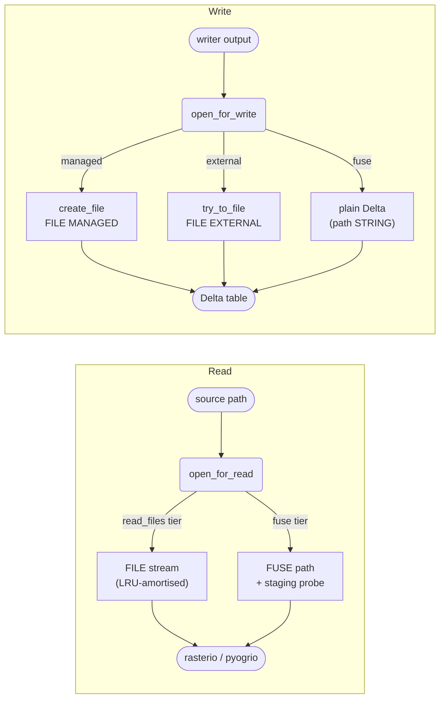

# Readers & Writers

GeoBrix provides Spark DataSource V2 **readers** and **writers** for geospatial file formats,
across both execution tiers — lightweight (`pyrx`, pure-Python, no JAR) and heavyweight
(`rasterx`, GDAL/OGR-backed). Both tiers scale by partitioning work across the cluster rather
than reading or writing sequentially on a single node.

Each lightweight `*_gbx` format pairs with a heavyweight counterpart (`*_ogr` / `gdal` /
`gtiff_gdal`), and the two tiers are held to **row-count / byte parity** as a hard gate in
benchmarking.

## Readers

Load geospatial files into a distributed DataFrame. The lightweight raster readers (`raster_gbx`, `gtiff_gbx`, `cog_gbx`) return **[virtual tiles](./api/virtual-tiles)** by default — bytes-free `(path, window)` references; pass `.option("virtualTiles", "false")` to get materialized bytes instead. See the **[Readers Overview](./readers/overview)**
for the full list, tier differences, output schemas, and options.

| Format | Lightweight | Heavyweight |
|---|---|---|
| [Raster (generic)](./readers/raster) | `raster_gbx` | `gdal` |
| [GeoTIFF](./readers/geotiff) | `gtiff_gbx` | `gtiff_gdal` |
| [COG](./readers/cog) | `cog_gbx` | — (light-only) |
| [NetCDF](./readers/netcdf) | `netcdf_gbx` | `netcdf_gdal` / `netcdf_ogr` |
| [PMTiles](./readers/pmtiles) | `pmtiles_gbx` | — (light-only) |
| [File lister](./readers/file) | `file_gbx` | — (light-only) |
| [Vector (generic)](./readers/vector) | `vector_gbx` | `ogr` |
| [Shapefile](./readers/shapefile) | `shapefile_gbx` | `shapefile_ogr` |
| [GeoJSON](./readers/geojson) | `geojson_gbx` | `geojson_ogr` |
| [GeoJSONL](./writers/geojsonl) | `geojsonl_gbx` | — (light-only reader) |
| [GeoPackage](./readers/geopackage) | `gpkg_gbx` | `gpkg_ogr` |
| [File Geodatabase](./readers/filegdb) | `file_gdb_gbx` | `file_gdb_ogr` |

## Writers

Write DataFrames back out to geospatial files. See the **[Writers Overview](./writers/overview)**
for the column contract, single-file vs sharded trade-offs, and per-format details.

| Format | Lightweight | Heavyweight |
|---|---|---|
| [Raster (generic)](./writers/raster) | `raster_gbx` | `gdal` |
| [GeoTIFF](./writers/geotiff) | `gtiff_gbx` | `gtiff_gdal` |
| [COG](./writers/cog) | `cog_gbx` | — (light-only) |
| [PMTiles](./writers/pmtiles) | `pmtiles_gbx` | `pmtiles` |
| [NetCDF](./writers/netcdf) | `netcdf_gbx` | — (light-only) |
| [Vector (generic)](./writers/vector) | `vector_gbx` | — (light-only) |
| [Shapefile](./writers/shapefile) | `shapefile_gbx` | — (light-only) |
| [GeoJSON](./writers/geojson) | `geojson_gbx` | — (light-only) |
| [GeoJSONL](./writers/geojsonl) | `geojsonl_gbx` | `geojsonl_ogr` |
| [GeoPackage](./writers/geopackage) | `gpkg_gbx` | — (light-only) |
| [File Geodatabase](./writers/filegdb) | `file_gdb_gbx` | — (hybrid; needs native GDAL) |

## Registering the lightweight tier

Heavyweight readers and writers are auto-discovered from the JAR. The lightweight Python
DataSources are **not** auto-registered — call `register(spark)` once per session before using
any `*_gbx` format:

```python
from databricks.labs.gbx.ds.register import register
register(spark)
```

## Shared file-access base {#file-gbx}

All lightweight (`*_gbx`) readers and writers share a common **file-access base** — the
`file_gbx` module — that centralises FILE and FUSE routing, directory enumeration, and
write-mode selection. This is a light-tier concern; the heavyweight (JAR-backed) readers
and writers use their own GDAL/OGR access paths.

### Capability tiers

`file_gbx` probes the runtime **once per session** and picks the best available tier:

| Tier | Available on | Capabilities |
|---|---|---|
| `read_files` | DBR 13.3 LTS + | `read_files(format=>'file')` — native FILE refs, file metadata, recursive listing |
| `list_files` | DBR 18 LTS + | `list_files(…)` — metadata + FILE refs, directory listing only |
| `fuse` | All runtimes (OSS / DBR < 13) | `os.walk` + FUSE mount — always available; no FILE column |

The **no-gating rule**: `access="auto"` (the default on every lightweight reader and writer)
silently downgrades to the best available tier and never errors. Explicitly requesting
`"managed"` or `"external"` on a FUSE-only runtime raises a clear, actionable error
describing the upgrade path. Your pipelines run on any runtime without code changes; you
only need to opt in to FILE when you want the governance and lifecycle benefits.

### Read resolver

When a lightweight reader opens a source file it calls `open_for_read(source, access="auto")`.
The resolver checks the tier and picks a strategy:

- **FILE-capable runtime (DBR 13.3+):** routes to the FILE API. Small tiled/COG files
  (≤ `GBX_STREAM_MAX_BYTES`, default 256 MiB on classic / 64 MiB on Serverless) open a
  byte-range **stream**; larger or striped files fall through to `as_local_file()` (a FUSE
  path backed by the FILE handle). Open dataset handles are held in a per-partition LRU
  cache keyed by source path, amortising the open cost across all windows of the same source.
- **FUSE fallback (OSS / DBR < 13):** resolves to the bare `/Volumes/…` path and uses a
  probe-then-stage strategy — tries random-access directly; falls back to a sequential
  copy only if the probe fails.

### Write committer

Writers call `open_for_write(spark, df, target, file_mode="auto", filespace=…, layout=…)`.
`file_mode="auto"` resolves as follows:

| Condition | Effective mode | Mechanism |
|---|---|---|
| FILE available + `filespace` given | `"managed"` | `create_file` — MANAGED FILE column |
| FILE available, no `filespace` | `"external"` | `try_to_file` — EXTERNAL FILE column |
| No FILE (fuse tier) | `"fuse"` | Plain Delta write, path STRING / raster BINARY |

Explicit modes (`"managed"`, `"external"`, `"fuse"`) override auto-selection. Requesting
`"managed"` or `"external"` on a fuse-only runtime raises a clear error.

### Layout options

The `layout` parameter controls row ordering in the output Delta table:

| Value | Behaviour |
|---|---|
| `"order"` | `ORDER BY path` at write time (default — scan-friendly) |
| `"cluster"` | `CLUSTER BY path` in the DDL (FILE-mode tables only); run `OPTIMIZE <table>` afterward for durable clustering |
| `"plain"` | No ordering — fastest write, scan order determined by the cluster |

`partitionBy` is not supported; use `layout="order"` unless you have a specific clustering need.

### File enumeration

`enumerate_files(path, *, recursive=True, include_hidden=False, extensions=None, path_glob_filter=None)`
lists files in a directory and returns a Spark DataFrame (FILE-capable tiers) or a Python list (FUSE tier),
with columns `path`, `size`, and `file` (a FILE reference when available, `None` on FUSE).

By default, files whose names start with `_` or `.` (Spark/Hadoop metadata files such as
`_SUCCESS`, `_committed_*`, `.crc`) are **skipped**. Pass `include_hidden=True` to include them.

A positive selection filter — either `extensions` (a tuple of suffixes, e.g. `(".tif", ".nc")`)
or `path_glob_filter` (an fnmatch-style glob, e.g. `"*.tif"`) — narrows which files are returned.
The two filters are **mutually exclusive** and are ANDed with `include_hidden`: for example,
`include_hidden=True` + `path_glob_filter="[!.]*"` returns underscore-named files such as
`_data.tif` but still excludes dot-named files such as `.crc`.

### Light-tier FILE flow



See [`file_gbx` Reader](./readers/file) for enumeration and read-mode details, and
[`file_gbx` Writer](./writers/file) for write-mode and ingest options.

## Next Steps

- [Readers Overview](./readers/overview) — every reader, tier differences, output schemas, options.
- [Writers Overview](./writers/overview) — the column contract, single-file vs sharded writers, per-format details.
- [Benchmarking](./api/benchmarking) — tier-vs-tier timing and parity methodology.
