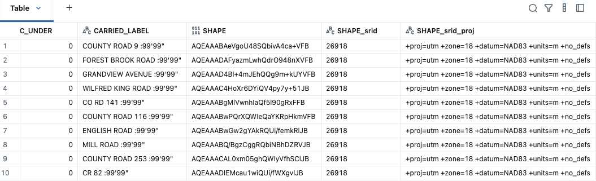

# File GeoDatabase Reader

The File GeoDatabase reader provides support for reading ESRI File Geodatabase format, a proprietary geospatial format commonly used in ArcGIS.



## Format Name

`file_gdb`

## Overview

This is a named OGR Reader that sets `driverName` to "[OpenFileGDB](https://gdal.org/en/stable/drivers/vector/openfilegdb.html)". File Geodatabases are directory-based formats that can contain multiple feature classes (layers).

## Key Features

- **Multi-layer**: Contains multiple feature classes
- **Rich Attributes**: Full attribute support with domains and subtypes
- **Topology**: Can include topology rules (read-only)
- **Relationships**: Can define relationships between feature classes

## Basic Usage

```python
# Read File Geodatabase
df = spark.read.format("file_gdb").load("/path/to/database.gdb")

df.show()
```

### Scala

```scala
// Read File Geodatabase
val df = spark.read.format("file_gdb").load("/path/to/database.gdb")

df.show()
```

### SQL

```sql
-- Read File Geodatabase
CREATE OR REPLACE TEMP VIEW features AS
SELECT * FROM file_gdb.`/path/to/database.gdb`;

SELECT * FROM features;
```

## Output Schema

The output maintains attribute columns and adds geometry columns. Note that File GeoDatabases typically use `SHAPE` as the geometry column name:

```
root
 |-- SHAPE: binary (geometry in WKB format)
 |-- SHAPE_srid: integer (spatial reference ID)
 |-- SHAPE_srid_proj: string (projection definition)
 |-- <attribute_columns>: various types
```

**Note**: Column names are case insensitive.

## Options

### Multi-Layer Support

File Geodatabases contain multiple feature classes. Use these options to specify which to read:

```python
# Read specific feature class by name
df = spark.read.format("file_gdb") \
    .option("layerName", "Buildings") \
    .load("/path/to/database.gdb")

# Read specific feature class by index (0-based)
df = spark.read.format("file_gdb") \
    .option("layerN", "2") \
    .load("/path/to/database.gdb")
```

### Other Options

All [OGR reader options](./ogr.md#options) are available:

- `chunkSize` - Records per chunk (default: "10000")
- `asWKB` - Output as WKB vs WKT (default: "true")
- `layerName` - Specific feature class to read
- `layerN` - Feature class index to read (0-based)

## Usage Examples

### Example 1: Read Single Feature Class

```python
# Read File Geodatabase (reads first/default feature class)
buildings = spark.read.format("file_gdb").load("/data/city.gdb")

# Show attributes (note: geometry column is typically 'SHAPE')
buildings.select("OBJECTID", "NAME", "HEIGHT", "SHAPE_srid").show()
```

### Example 2: Read Specific Feature Class

```python
# File Geodatabase with multiple feature classes
# Read Buildings feature class
buildings = spark.read.format("file_gdb") \
    .option("layerName", "Buildings") \
    .load("/data/city.gdb")

# Read Roads feature class
roads = spark.read.format("file_gdb") \
    .option("layerName", "Roads") \
    .load("/data/city.gdb")

# Read Parcels feature class
parcels = spark.read.format("file_gdb") \
    .option("layerName", "Parcels") \
    .load("/data/city.gdb")

buildings.show()
roads.show()
parcels.show()
```

### Example 3: Convert to Databricks GEOMETRY

```python
from pyspark.sql.functions import expr

# Read File Geodatabase
df = spark.read.format("file_gdb") \
    .option("layerName", "Boundaries") \
    .load("/data/admin.gdb")

# Convert to GEOMETRY type (SHAPE column)
geometry_df = df.select(
    "*",
    expr("st_geomfromwkb(SHAPE)").alias("geometry")
)

# Use Databricks ST functions
result = geometry_df.select(
    "NAME",
    "geometry",
    expr("st_area(geometry)").alias("area"),
    expr("st_centroid(geometry)").alias("center")
)

result.show()
```

### Example 4: Read from Cloud Storage

```python
# Read from S3
s3_gdb = spark.read.format("file_gdb") \
    .option("layerName", "Features") \
    .load("s3://bucket/path/database.gdb")

# Read from Azure Blob Storage
azure_gdb = spark.read.format("file_gdb") \
    .option("layerName", "Features") \
    .load("wasbs://container@account.blob.core.windows.net/database.gdb")

# Read from Unity Catalog Volume
volume_gdb = spark.read.format("file_gdb") \
    .option("layerName", "Features") \
    .load("/Volumes/catalog/schema/volume/database.gdb")

s3_gdb.show()
```

### Example 5: Handle Case-Insensitive Columns

```python
# File Geodatabase columns are case-insensitive
df = spark.read.format("file_gdb") \
    .option("layerName", "Parcels") \
    .load("/data/cadastral.gdb")

# These all work (adjust to your schema)
df.select("OBJECTID", "shape", "SHAPE_srid").show()
df.select("objectid", "SHAPE", "shape_srid").show()
```

## SQL Examples

### Read and Query

```sql
-- Create view from File Geodatabase
-- Note: Need to read specific layer in Python first, then register

-- In Python first:
-- parcels = spark.read.format("file_gdb").option("layerName", "Parcels").load("/data/cadastral.gdb")
-- parcels.createOrReplaceTempView("parcels")

-- Then in SQL:
SELECT
    OBJECTID,
    PARCEL_ID,
    OWNER,
    st_area(st_geomfromwkb(SHAPE)) as area_sqm,
    st_perimeter(st_geomfromwkb(SHAPE)) as perimeter_m
FROM parcels
WHERE st_area(st_geomfromwkb(SHAPE)) > 5000;
```

### Spatial Join with Multiple Feature Classes

```sql
-- In Python first, read and register views:
-- buildings = spark.read.format("file_gdb").option("layerName", "Buildings").load("/data/city.gdb")
-- buildings.createOrReplaceTempView("buildings")
-- zones = spark.read.format("file_gdb").option("layerName", "Zones").load("/data/city.gdb")
-- zones.createOrReplaceTempView("zones")

-- Then in SQL:
SELECT
    b.BUILDING_ID,
    b.BUILDING_NAME,
    z.ZONE_NAME,
    z.ZONE_TYPE
FROM buildings b
JOIN zones z
    ON st_contains(
        st_geomfromwkb(z.SHAPE),
        st_centroid(st_geomfromwkb(b.SHAPE))
    );
```

## Working with Multiple Feature Classes

### List Feature Classes

```python
# Use GDAL/OGR command line tools
import subprocess

result = subprocess.run(
    ['ogrinfo', '-al', '-so', '/path/to/database.gdb'],
    capture_output=True,
    text=True
)
print(result.stdout)
```

### Read All Feature Classes

```python
# Define feature class names (from ogrinfo or prior knowledge)
feature_classes = ["Buildings", "Roads", "Parcels", "Zones", "Points_of_Interest"]

# Read each feature class
layers = {}
for fc_name in feature_classes:
    layers[fc_name] = spark.read.format("file_gdb") \
        .option("layerName", fc_name) \
        .load("/data/city.gdb")

# Access each layer
buildings_df = layers["Buildings"]
roads_df = layers["Roads"]
```

## Common Workflows

### Workflow 1: File GeoDatabase to Delta Lake

```python
from pyspark.sql.functions import expr

# Read File Geodatabase feature class
gdb_df = spark.read.format("file_gdb") \
    .option("layerName", "Features") \
    .load("/data/source.gdb")

# Convert to GEOMETRY type
delta_df = gdb_df.select(
    "*",
    expr("st_geomfromwkb(SHAPE)").alias("geometry")
).drop("SHAPE", "SHAPE_srid", "SHAPE_srid_proj")

# Write to Delta Lake
delta_df.write.mode("overwrite").saveAsTable("catalog.schema.features")

# Optimize
spark.sql("""
    OPTIMIZE catalog.schema.features
    ZORDER BY (geometry)
""")
```

### Workflow 2: Multi-Feature Class Processing

```python
from pyspark.sql.functions import expr, lit, col

# Read multiple feature classes and combine
buildings = spark.read.format("file_gdb") \
    .option("layerName", "Buildings") \
    .load("/data/city.gdb") \
    .withColumn("feature_type", lit("building"))

roads = spark.read.format("file_gdb") \
    .option("layerName", "Roads") \
    .load("/data/city.gdb") \
    .withColumn("feature_type", lit("road"))

# Standardize schema
buildings_std = buildings.select(
    col("OBJECTID").alias("feature_id"),
    col("NAME").alias("name"),
    col("feature_type"),
    expr("st_geomfromwkb(SHAPE)").alias("geometry")
)

roads_std = roads.select(
    col("OBJECTID").alias("feature_id"),
    col("NAME").alias("name"),
    col("feature_type"),
    expr("st_geomfromwkb(SHAPE)").alias("geometry")
)

# Combine
all_features = buildings_std.union(roads_std)
all_features.write.mode("overwrite").saveAsTable("combined_features")
```

### Workflow 3: Migrate from File GeoDatabase

```python
from pyspark.sql.functions import expr

# Feature classes to migrate
feature_classes = ["Buildings", "Roads", "Parcels", "Zones"]

# Migrate each to Delta table
for fc in feature_classes:
    # Read from File GeoDatabase
    df = spark.read.format("file_gdb") \
        .option("layerName", fc) \
        .load("/data/legacy.gdb")
    
    # Convert geometry
    converted = df.select(
        "*",
        expr("st_geomfromwkb(SHAPE)").alias("geometry")
    ).drop("SHAPE", "SHAPE_srid", "SHAPE_srid_proj")
    
    # Write to Delta
    table_name = f"migrated_{fc.lower()}"
    converted.write.mode("overwrite").saveAsTable(table_name)
    
    print(f"Migrated {fc} to {table_name}")
```

### Workflow 4: Spatial Analysis

```python
from pyspark.sql.functions import expr

# Read File Geodatabase
parcels = spark.read.format("file_gdb") \
    .option("layerName", "TaxParcels") \
    .load("/data/cadastral.gdb")

# Add geometry and spatial metrics
analyzed = parcels.select(
    "*",
    expr("st_geomfromwkb(SHAPE)").alias("geometry")
).select(
    "OBJECTID",
    "PARCEL_ID",
    "OWNER",
    "LAND_USE",
    "geometry",
    expr("st_area(geometry)").alias("area_sqm"),
    expr("st_perimeter(geometry)").alias("perimeter_m"),
    expr("st_centroid(geometry)").alias("centroid"),
    expr("st_envelope(geometry)").alias("bbox")
)

# Calculate derived metrics
from pyspark.sql.functions import col

analyzed = analyzed.withColumn(
    "shape_complexity",
    col("perimeter_m") * col("perimeter_m") / col("area_sqm")
)

# Save results
analyzed.write.mode("overwrite").saveAsTable("parcel_analysis")
```

## Performance Tips

### 1. Read Specific Feature Classes

```python
# Always specify the feature class you need
df = spark.read.format("file_gdb") \
    .option("layerName", "specific_feature_class") \
    .load("/data/large.gdb")
```

### 2. Adjust Chunk Size

```python
# For large feature classes
df = spark.read.format("file_gdb") \
    .option("layerName", "large_features") \
    .option("chunkSize", "50000") \
    .load("/data/database.gdb")
```

### 3. Cache Frequently Used Data

```python
# Cache feature class data
fc_df = spark.read.format("file_gdb") \
    .option("layerName", "important_features") \
    .load("/data/database.gdb")

fc_df.cache()
```

### 4. Repartition for Processing

```python
# Repartition large feature classes
df = spark.read.format("file_gdb") \
    .option("layerName", "large_features") \
    .load("/data/database.gdb")

df = df.repartition(200)
```

## Limitations

### Read-Only Access

The OpenFileGDB driver provides read-only access:
- Cannot create or modify File Geodatabases
- Cannot write new feature classes
- Topology and relationship rules are read-only

### Format Versions

- Supports File Geodatabase versions 9.x and later
- Some advanced features may not be fully supported

## Troubleshooting

### Issue: Feature Class Not Found

```python
# Check feature class name (case matters in option, but not in columns)
df = spark.read.format("file_gdb") \
    .option("layerName", "Buildings") \
    .load("/data/city.gdb")
```

### Issue: Column Name Case

```python
# File Geodatabase columns are case-insensitive
# Use consistent casing in your code
df = spark.read.format("file_gdb") \
    .option("layerName", "Features") \
    .load("/data/database.gdb")

# Either of these work:
df.select("OBJECTID", "SHAPE").show()
df.select("objectid", "shape").show()
```

### Issue: Large Feature Class

```python
# Increase chunk size and repartition
df = spark.read.format("file_gdb") \
    .option("layerName", "large_features") \
    .option("chunkSize", "100000") \
    .load("/data/large.gdb")

df = df.repartition(100)
```

### Issue: Directory Not Found

```python
# Ensure the .gdb directory is accessible
# File Geodatabase is a directory, not a single file
from pyspark.dbutils import DBUtils
dbutils = DBUtils(spark)
dbutils.fs.ls("/path/to/database.gdb")
```

## Advantages and Use Cases

### When to Use File GeoDatabase Reader

- **Legacy ArcGIS Data**: Migrating from ArcGIS workflows
- **Multi-Layer Datasets**: Complex datasets with many related layers
- **Rich Attributes**: Need to preserve attribute domains and relationships
- **Enterprise Data**: Reading from enterprise geodatabases (file-based)

### Migration Strategy

For organizations moving from ArcGIS to Databricks:

1. **Read** File Geodatabases with GeoBrix
2. **Convert** to Databricks GEOMETRY types
3. **Store** in Delta Lake with Unity Catalog
4. **Optimize** with Z-ordering on geometry columns
5. **Query** with Databricks built-in spatial functions

## Next Steps

- [Learn about VectorX](../packages/vectorx.md)
- [View API Reference](../api/overview.md)
- [Other Readers](./overview.md)
- [Examples](../examples/overview.md)

