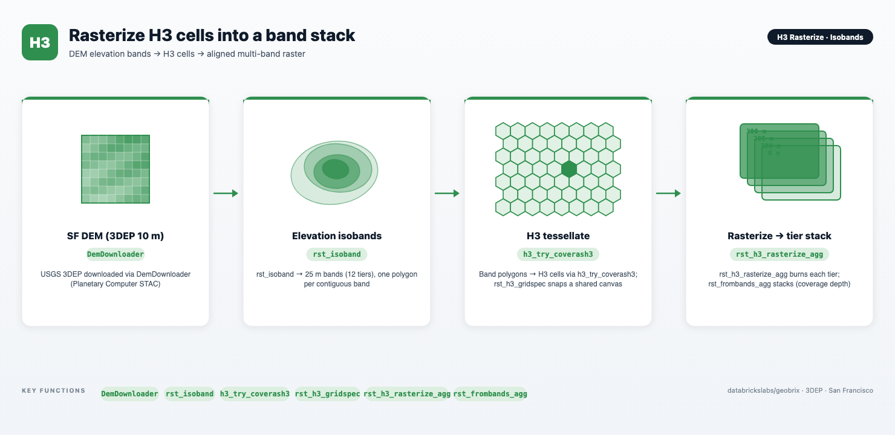

# H3 Cell Rasterize + Band Stacking — Part 1: DEM

> **Part 1 of 3** in the DEM → LiDAR → CHM series.
> Part 2 covers LiDAR point-cloud processing with `rst_binpoints`;
> Part 3 assembles a Canopy Height Model with `rst_chm`.

A self-contained notebook that runs the full DEM-to-H3-raster pipeline:
download a USGS 3DEP elevation tile, extract distributed isobands with
`rst_isoband`, index each band using Databricks built-in H3 functions
(`try_h3_polyfillash3` / `try_h3_coverash3`), burn onto a shared aligned
canvas, and assemble a multi-band GeoTIFF stack. Visualized throughout with
the `gbx.vizx` helpers.



> **Lightweight tier (Serverless) by default.** The notebook uses the lightweight
> tier — `geobrix[light_env6,vizx]` — pure Python/PySpark bindings with no JAR or GDAL
> init script required. It runs on Serverless compute or a standard cluster. See
> [Execution Tiers](https://databrickslabs.github.io/geobrix/docs/api/execution-tiers).

> **Data source: USGS 3DEP seamless 10 m DEM, San Francisco.** `DemDownloader` fetches
> the 3DEP tile for `SF_BBOX = (-122.52, 37.70, -122.35, 37.83)` from Planetary Computer
> STAC and stages it to the sample-data Unity Catalog Volume on first run (idempotent —
> skipped if the file already exists). No manual download is required.

---

## Notebooks at a glance

### h3\_rasterize\_isobands.ipynb

Five pipeline steps — DEM download, distributed isoband extraction with `rst_isoband`,
product-H3 indexing, shared-canvas computation, per-band rasterize, and multi-band stacking
— producing a multi-band GeoTIFF that stacks twelve 25 m elevation bands (0–300 m) over
San Francisco. Visualization appears after each major step: the raw DEM, per-cell
H3 footprints on the shared canvas, selected mid-elevation band shapes, and a final
coverage-depth composite.

---

## Files

| File | Purpose |
|---|---|
| `h3_rasterize_isobands.ipynb` | Complete pipeline notebook: DEM download → isoband extraction → product-H3 indexing → shared grid spec → per-band rasterize → band stack → visualization. |

---

## Prerequisites

- **Databricks Runtime 17.3 LTS / 18 LTS, or Serverless** (Python 3.12). The
  lightweight default runs on Serverless. The `CREATE TEMP TABLE` materialization
  used in Step 4 requires Serverless or DBR 18.1+ — it is **not** supported on
  dedicated/single-user clusters.
- **GeoBrix 0.5.2.** Update the `%pip install` cell to point at your staged
  `geobrix-0.5.2-py3-none-any.whl`. The `[light_env6,vizx]` extras install rasterio,
  geopandas, matplotlib, and mapclassify — no other dependencies assumed pre-staged.
- **Unity Catalog Volume.** `DemDownloader` stages the tile to
  `/Volumes/geospatial_docs/geobrix/sample-data/geobrix-examples/sf/elevation-3dep`.
  The Volume root must already exist; sub-directories are created automatically.
- **Databricks product H3.** `try_h3_polyfillash3` and `try_h3_coverash3` are
  Databricks built-in SQL functions available on Databricks Serverless and recent DBR
  runtimes (a spatial-SQL runtime is required; verified on Serverless) — no additional
  install is needed.

---

## Run order

This is a single notebook; run all cells top to bottom. The `%pip install` + `%restart_python`
pair at the top restarts the Python kernel — subsequent cells import from the freshly installed
wheel. Cells after the restart are safe to re-run individually once the wheel is installed.

1. **Install and restart** — `%pip install "geobrix[light_env6,vizx] @ file://…"` + `%restart_python`.
2. **Imports and registration** — `rx.register(spark)` and `register(spark)` install the SQL UDFs.
3. **Download the DEM** — `DemDownloader` fetches the USGS 3DEP 10 m tile for the SF bounding box
   and stages it to the Volume (idempotent; skipped if the file already exists).
4. **Steps 1–3** — `rst_isoband` extracts 12 bands at 25 m intervals (distributed Spark);
   `try_h3_polyfillash3` / `try_h3_coverash3` index each band at H3 res 10;
   `rst_h3_gridspec` computes the shared canvas.
5. **Steps 4–5** — `rst_h3_rasterize_agg` burns each band and materializes to a session temp table;
   `rst_frombands_agg` assembles the multi-band stack.

---

## Data flow

```text
DemDownloader  →  USGS 3DEP seamless 10 m  (Planetary Computer STAC → Volume)
        │
        ▼  rst_isoband  25 m breaks 0–300 m  (Spark, distributed)
Elevation isobands: 12 polygon bands, WKB output              [Step 1]
        │
        ▼  try_h3_polyfillash3 / try_h3_coverash3  @ H3 res 10  (Databricks product)
(band_level, cellid) rows                                      [Step 2]
        │
        ▼  rx.rst_h3_gridspec  (Spark)
Shared pixel-aligned canvas  (EPSG:4326)                       [Step 3]
        │
        ▼  rx.rst_h3_rasterize_agg groupBy band_level  (Spark)
Per-band presence-mask tiles → CREATE TEMP TABLE band_tiles    [Step 4]
        │
        ▼  rx.rst_frombands_agg  (Spark)
Multi-band GeoTIFF tile: 12 bands                              [Step 5]
        │
        ▼  plot_raster(composite="depth")
Coverage-depth figure: pixel = count of bands covering that location
```

---

## Key GeoBrix / Databricks functions shown

- **GeoBrix RasterX** (`rx.*`): `rst_isoband`, `rst_h3_gridspec`, `rst_h3_rasterize_agg`, `rst_frombands_agg`.
- **GeoBrix viz** (`gbx.vizx`): `plot_raster` (raw DEM render), `plot_static` (per-cell H3 footprints),
  `plot_interactive` (interactive multi-layer map), `cells_as_gdf` (H3 footprints as a GeoDataFrame;
  pass `dissolve_by="band_level"` to merge each band into one footprint polygon), `grid_as_gdf`
  (shared-canvas rectangle), `plot_mask_layers` (overlay two bands with distinct colours and a
  legend), `plot_raster` (stacked raster as `composite="depth"` coverage map).
- **Databricks product H3**: `try_h3_polyfillash3` (centroid-in cells at a given resolution),
  `try_h3_coverash3` (overlap cells at a given resolution). Both accept WKB geometry directly.
- **Full API reference**: [RasterX functions](https://databrickslabs.github.io/geobrix/docs/api/raster-functions) · [Viz helpers](https://databrickslabs.github.io/geobrix/docs/api/vizx).

---

## Gotchas

- **Temp table vs cache.** Step 4 materializes the per-band tiles into a session-scoped
  temp table (`CREATE TEMP TABLE band_tiles`) because `.cache()` / `.persist()` are
  unavailable on Serverless. The temp table is dropped automatically when the session
  ends. If you are on a dedicated/single-user cluster (which does not support temp
  tables), replace the `CREATE TEMP TABLE` block with a managed Delta table write and
  a subsequent `spark.table(...)` read.
- **Product H3 takes WKB.** `try_h3_polyfillash3` and `try_h3_coverash3` accept WKB
  geometry — exactly what `rst_isoband` produces. Do not convert to the native
  Databricks `GEOMETRY` type first; these functions require WKB input.
- **`polyfillash3` vs `coverash3`.** `polyfillash3` uses centroid containment (cells
  whose centre is inside the polygon); `coverash3` uses full overlap (all cells that
  touch the polygon). For contiguous coverage analysis `coverash3` avoids gaps along
  polygon boundaries; use `polyfillash3` when avoiding overcounting matters more.
- **Distributed by default.** `rst_isoband` and the product H3 functions run as
  distributed Spark columns — no driver-side loop is needed. For production pipelines
  ingesting many tiles, load them via `spark.read.format("gtiff_gbx")` and pass the
  whole DataFrame through; the pipeline scales without modification.
- **Volume write is serverless-safe.** `DemDownloader` stages AOI-windowed 3DEP GeoTIFFs
  to the Unity Catalog Volume using sequential I/O — idempotent and safe on Serverless.
  Do not use `seek` on Volume paths.

---

## Related resources

- [H3 Rasterize example page](https://databrickslabs.github.io/geobrix/docs/notebooks/h3-rasterize)
- [GeoBrix RasterX API](https://databrickslabs.github.io/geobrix/docs/api/raster-functions)
- [GeoBrix Viz API](https://databrickslabs.github.io/geobrix/docs/api/vizx)
- [EO-Series notebooks](../eo-series/) — STAC download, band stacking, clipping pipeline
