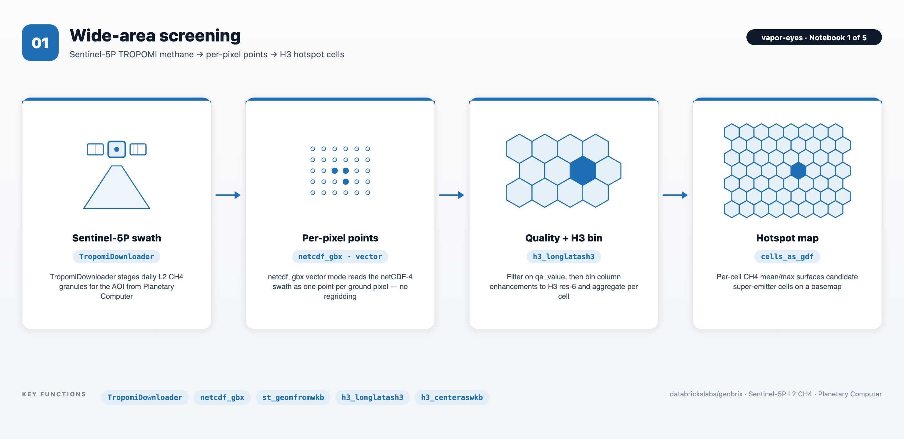
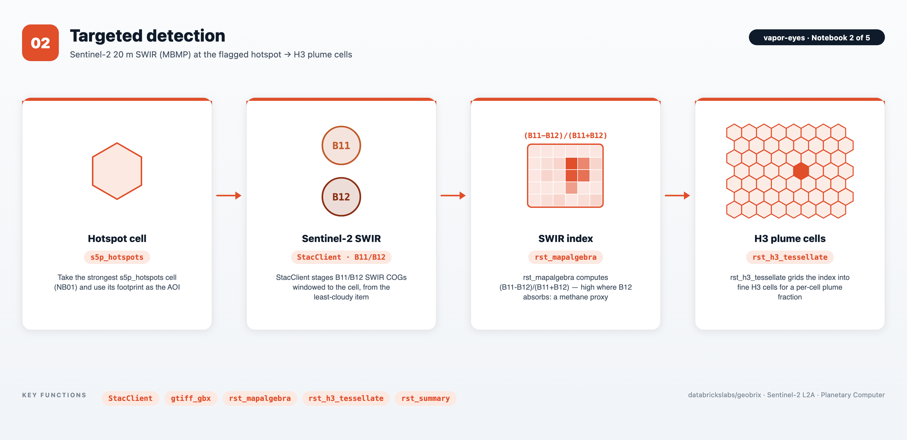
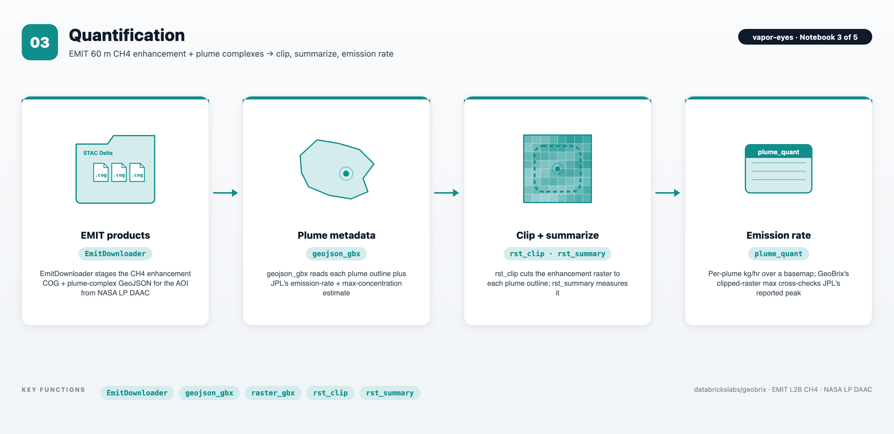
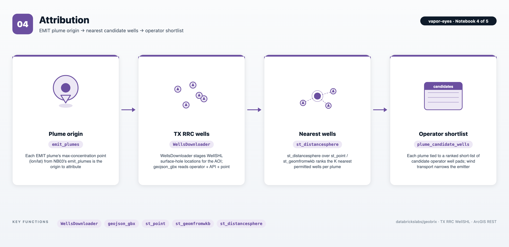
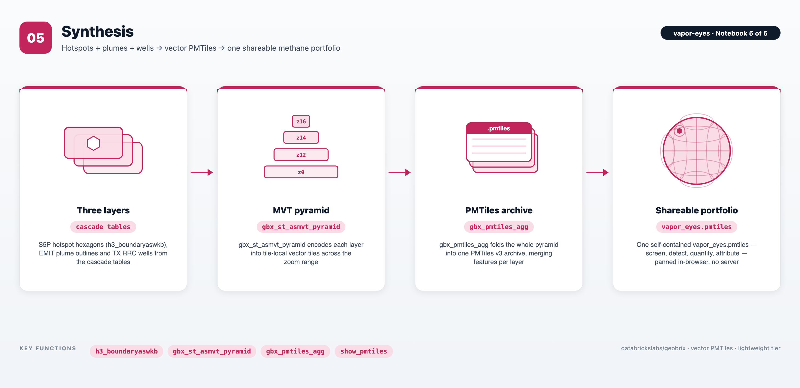

# Vapor-Eyes — Methane Detection Cascade

> ## 🏭 Two ways to run Vapor-Eyes
> **This directory is the notebook series** — an interactive, historical case study you step through cell by cell.
>
> **For the production example, see [`lakeflow/`](lakeflow/README.md).** It packages the same Permian methane idea as a standalone, production-grade [Lakeflow Declarative Pipeline](https://docs.databricks.com/aws/en/dlt/) + [AI/BI dashboard](https://docs.databricks.com/aws/en/dashboards/), shipped as a [Databricks Asset Bundle](https://docs.databricks.com/aws/en/dev-tools/bundles/): incremental medallion tables on a schedule instead of one-off notebook outputs, and a fifth source — Carbon Mapper Tanager — that makes it a *current* (through 2026) monitoring view rather than a single historical overpass.
>
> **→ [Lakeflow SDP + AI/BI example](lakeflow/README.md)**

A five-notebook series that takes one Permian (Delaware Basin) bounding box and works a satellite methane signal from a wide-area screen down to a named operator's candidate well pads — then packages the whole result as a shareable [PMTiles](https://protomaps.com/docs/pmtiles) map, using [GeoBrix](https://databrickslabs.github.io/geobrix/) on Databricks.

The notebooks follow a detection cascade, each tier narrowing and sharpening the last: **screen** the region with Sentinel-5P TROPOMI methane (NB01), **detect** a plume at the strongest hotspot with Sentinel-2 20 m SWIR (NB02), **quantify** it with EMIT 60 m imaging spectroscopy (NB03), **attribute** the plume origin to nearby Texas Railroad Commission wells and their operators (NB04), and **synthesize** the cascade into one self-contained vector PMTiles portfolio (NB05). Each step composes GeoBrix functions with Databricks-native `st_*` / `h3_*` spatial SQL.

> **Lightweight tier (Serverless) by default.** The series uses the lightweight tier — pure Python/PySpark bindings (`databricks.labs.gbx.pyrx`, `pyvx`) plus the `geobrix[light,stac,vizx]` wheel installed by `config_nb` — so it runs on Serverless with no JAR. It features the **net-new `netcdf_gbx` reader** (`databricks.labs.gbx.ds`), which transcodes the Sentinel-5P netCDF-4 swath directly to points with no regridding. To run heavyweight instead, flip the commented *option-2* (`rasterx` / `vectorx`) in `config_nb.ipynb` and attach the GeoBrix JAR + [GDAL init script](https://databrickslabs.github.io/geobrix/docs/installation) to a classic x86 cluster. See [Execution Tiers](https://databrickslabs.github.io/geobrix/docs/api/execution-tiers).

> **Data sources.** Sentinel-5P L2 CH4 (NB01, via `TropomiDownloader`) and Sentinel-2 L2A SWIR (NB02, via `StacClient`) are retrieved from the Microsoft Planetary Computer STAC API. EMIT L2B CH4 enhancement + plume-complex products (NB03, via `EmitDownloader`) come from the NASA LP DAAC through `earthaccess` and **require an Earthdata Login token** (a Unity Catalog secret; see Prerequisites). TX RRC well surface-hole locations (NB04, via `WellsDownloader`) come from the open TX RRC `WellSHL` ArcGIS REST service (no auth). All downloaders live in `databricks.labs.gbx.sample` and stage idempotently to the Volume, so a re-run skips already-valid files.

> _Note: the Sentinel-2 SWIR band-ratio (NB02) is an illustrative proxy, not an operational methane retrieval; EMIT (NB03) is the purpose-built methane instrument. Attribution (NB04) surfaces candidate wells near the plume origin — the definitive source among them depends on wind transport, not proximity alone._

---

## Notebooks at a glance

### 01 — Wide-area screening (Sentinel-5P)

- **netCDF-4 swath → points, no regridding** — the net-new `netcdf_gbx` vector reader transcodes each Sentinel-5P L2 CH4 granule to one point per ground pixel, passing `qa_value` through untouched so the notebook does the quality filtering.
- **Databricks-native H3 binning** — `st_geomfromwkb` + `st_x` / `st_y` rebuild each pixel's geometry; `h3_longlatash3` bins pixels into H3 res-6 cells, aggregated to per-cell CH4 mean/max — the candidate super-emitter surface.
- **Regional hotspot map** — `gbx.vizx.cells_as_gdf` rebuilds each H3 cell as a hexagon over a CartoDB basemap; the strongest cell feeds NB02.

### 02 — Targeted detection (Sentinel-2 SWIR)

- **Windowed COG staging** — `StacClient` queries `sentinel-2-l2a` for the least-cloudy scene over the flagged hotspot and downloads the **B11/B12 SWIR** assets windowed to the cell footprint.
- **Multi-band SWIR proxy** — `gbx_rst_mapalgebra` computes `(B11 − B12)/(B11 + B12)`, high where B12 (2.19 µm) absorbs relative to B11 (1.61 µm) — a 20 m methane proxy.
- **H3 plume cells** — the `gbx_rst_h3_tessellate` UDTF shreds the index raster into fine H3 cells; `vizx.plot_tile` drapes the strongest-absorption pixels over a basemap with a labeled colorbar.

### 03 — Quantification (EMIT)

- **`EmitDownloader` → enhancement COG + plume complexes** — searches NASA CMR for EMIT L2B CH4 enhancement + plume-complex products over the AOI (Earthdata-authenticated), staging the COG and the plume-metadata GeoJSON to the Volume; `geojson_gbx` reads each plume outline plus JPL's emission rate and max-concentration estimate.
- **GeoBrix clip + summarize** — `gbx_rst_clip` cuts the enhancement raster to each plume outline and `gbx_rst_summary` measures it; GeoBrix's clipped-raster max reproduces JPL's reported max concentration, an independent cross-check on real product data.
- **Quantified plume** — `vizx.plot_tile` renders the strongest plume's enhancement, windowed and draped over a basemap with a labeled colorbar (ppm·m).

### 04 — Attribution (TX RRC wells)

- **`WellsDownloader` → TX RRC surface holes** — pages the open `WellSHL` ArcGIS FeatureServer for wells intersecting the AOI (reprojected to WGS84), merged into one GeoJSON; `geojson_gbx` reads each well's API number, operator, lease and field.
- **Databricks-native nearest-well ranking** — `st_point` builds the plume origin, `st_geomfromwkb` each well, and `st_distancesphere` ranks the **K nearest candidate wells** per plume in metres via a window function.
- **Operator shortlist** — each plume is tied to a ranked short-list of candidate operator well pads over a basemap; the notebook is explicit that wind transport (not proximity alone) narrows the true super-emitter among the candidates.

### 05 — Synthesis (vector PMTiles portfolio)

- **Three-layer assembly** — the cascade's outputs become three layers: S5P hotspot cells as hexagons (Databricks-native `h3_boundaryaswkb`), EMIT plume outlines, and TX RRC wells.
- **MVT pyramid** — the `gbx_st_asmvt_pyramid` UDTF encodes each layer into tile-local Mapbox Vector Tiles across a basin-to-local zoom range, run per layer and unioned.
- **One shareable archive** — `gbx_pmtiles_agg` folds the whole pyramid into a single `vapor_eyes.pmtiles` v3 archive (merging features per layer); `show_pmtiles` renders it inline — a self-contained methane portfolio anyone can pan and zoom in a browser, no tile server.

---

## Files

| File | Purpose |
|---|---|
| `config_nb.ipynb` | Shared setup (`%run ./config_nb` from every main notebook). Installs the `geobrix[light,stac,vizx]` wheel (2-step: `--no-deps` first, then with extras), selects the tier (option-1 `pyrx`/`pyvx` default / option-2 heavyweight), registers functions + light readers (`netcdf_gbx`, `geojson_gbx`, `gtiff_gbx`, …), loads the `EARTHDATA_TOKEN` UC secret, sets `catalog_name` / `schema_name`, creates the `/Volumes/<cat>/<schema>/data/vapor-eyes` ETL tree, instantiates the downloaders + `StacClient`, defines the `INTERACTIVE_PLOTS`-gated `show_cells` / `show_tile` / `show_pmtiles` view helpers, and exposes the `FULL_AOI` / `FORCE_REBUILD` / `INTERACTIVE_PLOTS` toggles + the AOI bbox and date window. |
| `01_s5p_screening.ipynb` | Stages Sentinel-5P L2 CH4 for the AOI via `TropomiDownloader`, reads the netCDF-4 swath as points with the **`netcdf_gbx`** vector reader, quality-filters and bins to H3 res-6 hotspot cells (`s5p_hotspots`), and maps the regional CH4 surface. |
| `02_sentinel2_detection.ipynb` | Takes the strongest S5P hotspot, stages Sentinel-2 B11/B12 SWIR COGs via `StacClient` windowed to the cell, computes the `(B11−B12)/(B11+B12)` methane proxy with `gbx_rst_mapalgebra`, and shreds it into H3 plume cells (`s2_plume_cells`) with the `gbx_rst_h3_tessellate` UDTF. |
| `03_emit_quantification.ipynb` | Stages EMIT L2B CH4 enhancement COG + plume-complex GeoJSON via `EmitDownloader`, reads the plume metadata (`emit_plumes`) with `geojson_gbx`, clips the enhancement raster to each plume (`gbx_rst_clip`) and summarizes it (`gbx_rst_summary`) into `plume_quant` — cross-checking GeoBrix's measured enhancement against JPL's reported max concentration. |
| `04_well_attribution.ipynb` | Stages TX RRC `WellSHL` wells for the AOI via `WellsDownloader`, reads them (`geojson_gbx`, `wells_shl`), and ranks the K nearest candidate wells to each plume origin (`plume_candidate_wells`) with Databricks-native `st_distancesphere` — surfacing operator, lease and field. |
| `05_portfolio_pmtiles.ipynb` | Assembles the cascade's hotspots, plumes and wells into three MVT layers, pyramids each with the `gbx_st_asmvt_pyramid` UDTF, and folds the whole pyramid into one shareable `vapor_eyes.pmtiles` archive with `gbx_pmtiles_agg`. |
| [`lakeflow/`](lakeflow/README.md) | The production counterpart: a Databricks Asset Bundle running a Lakeflow Declarative Pipeline + AI/BI dashboard on a schedule, adding Carbon Mapper Tanager as a fifth, current-through-2026 data source. See [`lakeflow/README.md`](lakeflow/README.md). |

---

## Prerequisites

- **Databricks Runtime 17.3 LTS / 18 LTS, or Serverless** (Scala 2.13 / Spark 4 / Python 3.12). The lightweight default runs on Serverless (set Environment to version 5+); the heavyweight option requires a classic x86 cluster.
- **GeoBrix 0.4.0.** `config_nb.ipynb` `%pip`-installs `geobrix[light,stac,vizx]` from a staged Volume wheel using the 2-step pattern (force-reinstall `--no-deps` first, then with the extras to pick up dependencies). For the heavyweight option, flip *option-2* in `config_nb.ipynb` and attach the GeoBrix JAR + GDAL init script to the cluster.
- **Unity Catalog.** Edit `config_nb.ipynb` to set `catalog_name` and `schema_name`. A Volume named `data` must already exist under `<catalog>/<schema>` — the notebooks create sub-directories inside it but will not create the Volume itself.
- **Earthdata Login token (NB03 only).** EMIT is on the NASA LP DAAC and requires authentication. Create a token at [urs.earthdata.nasa.gov](https://urs.earthdata.nasa.gov/) and store it as a Unity Catalog secret named `<catalog>.<schema>.earthdata_token`; `config_nb` reads it with `dbutils.secrets.get(catalog, schema, key)` into the `EARTHDATA_TOKEN` environment variable. NB01/02/04/05 run without it.
- **Network access.** All downloaders fetch over HTTPS (Planetary Computer STAC, NASA LP DAAC, TX RRC ArcGIS) — online-only, no offline fallback. Classic cluster outbound internet is sufficient; Serverless has it by default.

---

## Run order

1. Open `config_nb.ipynb`, set `catalog_name` / `schema_name`, verify the Volume exists, and (for NB03) create the `earthdata_token` UC secret.
2. Run notebooks in numeric order: **01 → 02 → 03 → 04 → 05**. Each starts with `%run ./config_nb` so the shared state is re-established every time. NB02 reads NB01's `s5p_hotspots`; NB04 reads NB03's `emit_plumes`; NB05 reads the cascade tables from NB01/03/04.

Each notebook is safe to re-run — outputs are written with skip-guards so already-built files are not re-downloaded or re-tiled. Set `FORCE_REBUILD = True` in a cell right after `%run ./config_nb` to force a full rebuild of that notebook's outputs.

The notebooks ship with `INTERACTIVE_PLOTS = False` so the committed `.ipynb` renders fast static maps on GitHub; set `INTERACTIVE_PLOTS = True` (in `config_nb` or in a cell after `%run`) for interactive MapLibre maps.

---

## The AOI

The series is anchored on an east Delaware Basin (Texas) cluster around an EMIT-detected methane super-emitter co-located with dense TX RRC well infrastructure. The AOI bbox and date window are set in `config_nb.ipynb` (`SMALL_BBOX` / `FULL_BBOX` via the `FULL_AOI` toggle, and `DATE_WINDOW`) — retarget them to run the cascade over a different area or overpass.
