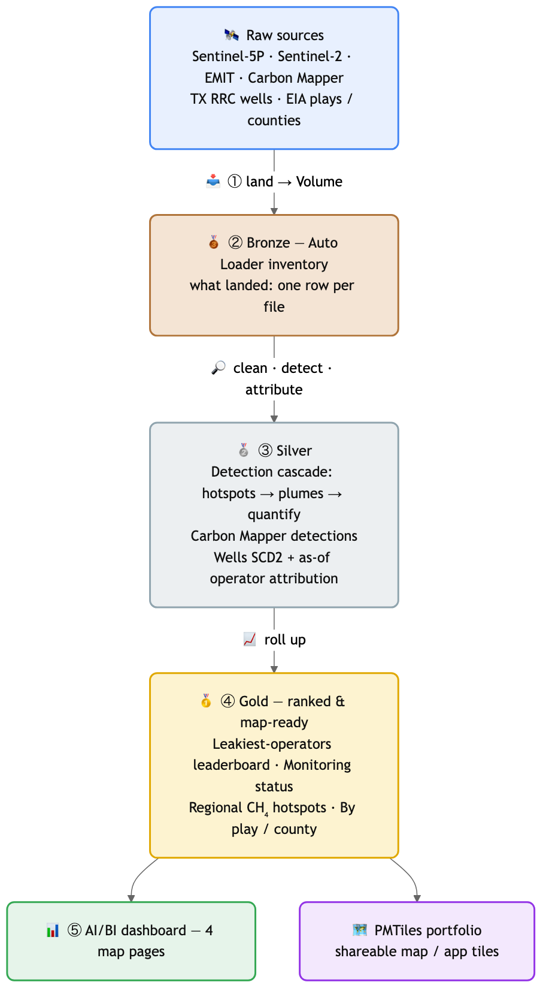
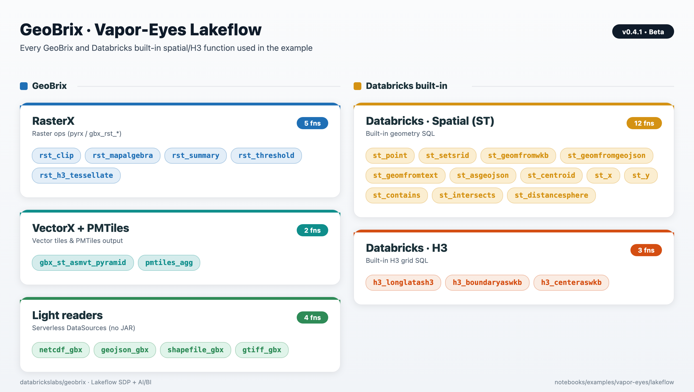
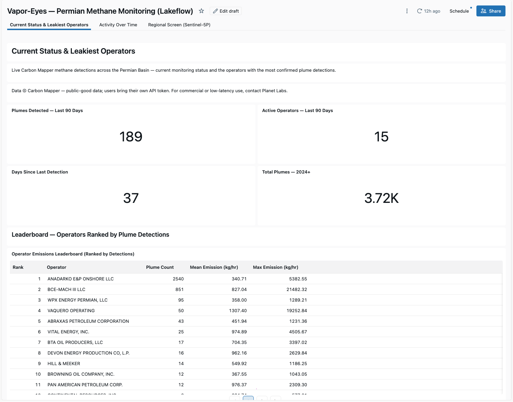
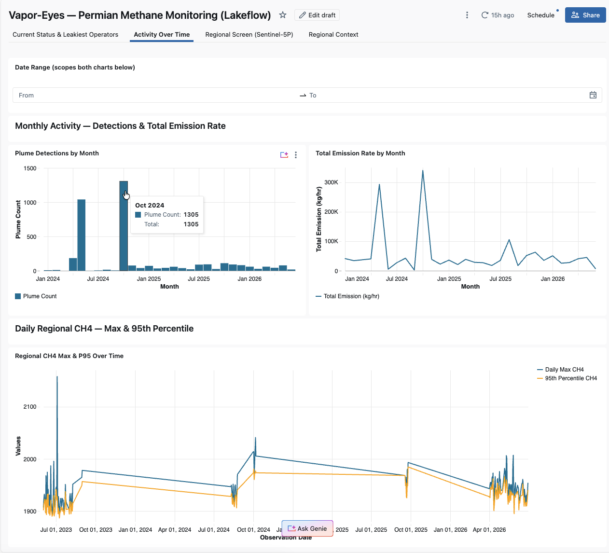
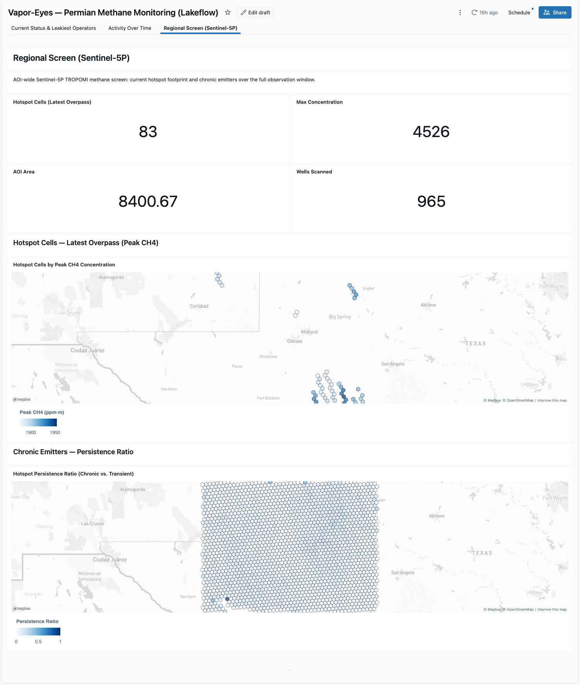
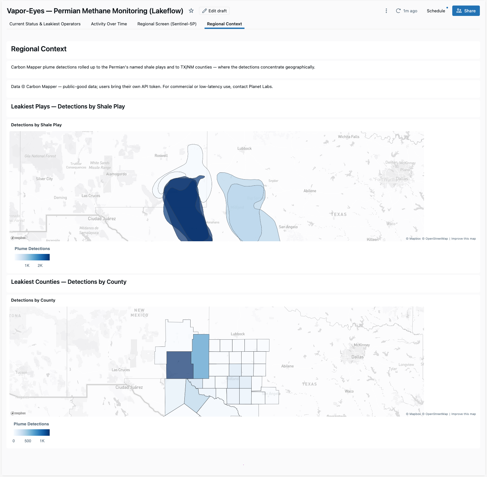

# Vapor-Eyes Lakeflow — Permian Methane Monitoring (SDP + AI/BI)

A standalone, production-grade **Permian Basin methane-monitoring pipeline**: a [Lakeflow Declarative Pipeline](https://docs.databricks.com/aws/en/dlt/) (SDP) plus an [AI/BI dashboard](https://docs.databricks.com/aws/en/dashboards/), built as a [Databricks Asset Bundle](https://docs.databricks.com/aws/en/dev-tools/bundles/) and running entirely on the GeoBrix **lightweight tier** over **Serverless** compute.

> **Requires GeoBrix 0.4.1+.** This example depends on capabilities introduced in the **0.4.1** release — the `netcdf_gbx` reader and the `TropomiDownloader` / `EmitDownloader` / `WellsDownloader` sample downloaders — so the staged wheel (`gbx_wheel`) must be `geobrix-0.4.1-py3-none-any.whl` or newer, installed with the `[light,stac,vizx]` extras.

This is not the notebook cascade documented in [`../README.md`](../README.md) — it's a different artifact with a different purpose. The notebook series is a five-step teaching walkthrough of one overpass. **This pipeline is the production shape**: it runs on a schedule, ingests incrementally across a multi-year date range, cascades bronze → silver → gold through a declared dependency graph with data-quality expectations, and serves a live dashboard off Delta tables instead of one-off notebook outputs. It also adds a fifth data source — Carbon Mapper Tanager — that the notebook cascade does not use, making it the *current* (through 2026) view of Permian methane activity rather than a single historical case study.

---

## How it works: from a raw satellite signal to a leaderboard



Every scheduled run turns raw satellite files into one ranked, map-ready answer — *who is leaking methane in the Permian, and where* — by moving the data through five stages:

1. **Land.** A downloader task pulls the period's satellite scenes, plume catalogs, and well records onto a Unity Catalog Volume. Nothing is interpreted yet — it just arrives.
2. **Bronze — what landed.** Auto Loader records one row per file as it appears, lifting the dates and IDs out of each filename. Bronze is the pipeline's memory of *what it has already seen*, so re-runs pick up only new data.
3. **Silver — the detective work.** Raw pixels become findings: Sentinel-5P screens the whole basin for CH₄ hotspots, Sentinel-2 and EMIT sharpen and quantify a plume, Carbon Mapper contributes current wind-corrected detections, and each plume is tied to the operator whose well was valid *on the day it was seen* (wells are version-tracked, so attribution doesn't drift as ownership changes).
4. **Gold — the answer, ranked and map-ready.** Silver findings roll up into the tables the dashboard reads directly: the leakiest-operators leaderboard, the "is anything active now" monitoring panel, the regional CH₄ hotspot surface, and by-play / by-county rollups — every geometry tagged so a map widget can draw it.
5. **Serve.** Gold feeds the four-page AI/BI dashboard; a parallel branch folds the same findings into a self-contained PMTiles map you can hand to anyone or drop into an app.

Each stage reads only the one before it — declared as table-to-table dependencies, not re-scans of the Volume — so Lakeflow builds the lineage graph for you, runs the stages in the right order, and recomputes only what changed. The sections below are the precise version of this same story.

---

## Spatial functions used

The pipeline composes **GeoBrix** functions with Databricks' **built-in spatial SQL and H3** — RasterX for raster ops, VectorX + PMTiles for tiles, the light-tier readers for Serverless ingest, and native `st_*` / `h3_*` for geometry and gridding.



---

## Architecture

```
databricks bundle  →  vapor_eyes_lf_job
                         ├─ Task 1 "land"      (Serverless spark_python_task)
                         │    downloads/stages all 5 sources for the configured
                         │    date window(s) to a Unity Catalog Volume
                         └─ Task 2 "pipeline"  (depends on land)
                              runs vapor_eyes_lf_pipeline (the Lakeflow SDP)
```

- **Task 1 — `land`** (`land/land.py`): a date-parameterized downloader driver. Takes `--sources`, `--window` / `--s5p-windows` / `--emit-windows` / `--cm-window`, and secret references as CLI parameters (all wired from bundle variables), and stages raw files/metadata to `/Volumes/<catalog>/<schema>/data/vapor-eyes-lf/{s5p,sentinel2,emit,wells,cm}`. Runs on its own Serverless environment (`land_env`, environment version 5) with the same GeoBrix wheel installed.
- **Task 2 — `pipeline`**: the Lakeflow Declarative Pipeline itself (`vapor_eyes_lf_pipeline`, `serverless: true`), rooted at `./transformations`. Its environment installs `${var.gbx_wheel}[light,stac,vizx]` — the GeoBrix wheel with the `light`, `stac`, and `vizx` extras — as a **single pip dependency entry**. Lakeflow resolves one `%pip install` per dependency entry, so splitting the extras into separate entries breaks pip's resolver (a rebuild is forced once `rasterio` is already pinned); the bracketed single-entry form keeps it one pass.

### Medallion layers

- **Bronze** (`transformations/bronze_ingest.py`) — Auto Loader **metadata tables**: one row per staged file/scene with the raw path payload plus hoisted fields (`item_id`, `product_type`, `band`, `granule_id`, …). Five tables: `s5p_granules`, `emit_scenes`, `wells_raw`, `cm_scenes`, `s2_swir_assets`.
- **Silver** (`transformations/silver_cascade.py`) — the cascade, wired bronze → silver by reading the bronze table (not the Volume directly), so lineage is real. Every table carries a bi-temporal pair: `observation_date` (when the underlying satellite/detection event happened) and `_ingested_at` (when GeoBrix/Lakeflow processed it) — the two diverge by design here since seasons are backfilled well after the fact. Key tables: `s5p_hotspots` (H3 CH4 screen), `s2_plume_cells`, `emit_plumes` + `plume_quant` (EMIT cross-check, with a configurable CH4-enhancement QC floor), `wells_shl` (SCD2 via `create_auto_cdc_flow`, so well operator/lease history is versioned) + `plume_candidate_wells` (as-of nearest-well attribution against the SCD2 wells at the plume's `observation_date`), and `cm_detections` + `cm_candidate_wells` (Carbon Mapper).
- **Gold** (`transformations/gold_analytics.py`) — analytics MVs described below.
- **Tiles** (`transformations/portfolio_tiles.py`) — `portfolio_mvt_tiles` (MVT pyramid per layer via `gbx_st_asmvt_pyramid`), `pmtiles_shards`, and `overview_manifest` (a shareable PMTiles portfolio, sharded for web-scale delivery — see [PMTiles spatial sharding](https://protomaps.com/docs/pmtiles) in the parent series for the single-archive version).

---

## Data sources

| Source | Provider / license | Role |
|---|---|---|
| **Sentinel-5P TROPOMI** | Copernicus (ESA), open | Regional CH4 screen — wide-area H3 hotspot surface (`s5p_hotspots`), the first-pass "where is elevated methane" signal. |
| **Sentinel-2 SWIR** | Copernicus (ESA), open | Targeted SWIR band-ratio detection (`(B11−B12)/(B11+B12)`) at the strongest hotspot — an illustrative proxy, not an operational retrieval. |
| **EMIT** | NASA LP DAAC, open — requires an Earthdata Login token (BYOT) | Spectral **validation**: JPL's plume-complex product plus a GeoBrix `rst_clip` / `rst_summary` cross-check of the enhancement raster against JPL's reported max concentration. EMIT is a science instrument on the ISS with sparse revisit and roughly a 10-month lag before plume products are published, so it validates historical detections rather than driving current status. |
| **Carbon Mapper Tanager** | Carbon Mapper, public-good — requires a free registered token (BYOT) | The **authoritative current rated-plume layer**: quantified, wind-corrected `emission_rate_kg_hr` per detection, current through 2026. This is what the dashboard's leaderboard and monitoring-status panels are built on. See [Good-citizen use](#good-citizen-use--carbon-mapper) below. |
| **TX RRC WellSHL** | Texas Railroad Commission, public (ArcGIS REST, no auth) | Attribution — nearest-well / operator lookup for plume origins. |

---

## Key analytics (gold)

- **`operator_emissions_leaderboard`** — the headline table. Operators are ranked by **number of high-confidence Carbon Mapper plume detections** (`detection_rank`, `plume_count`), with `mean_emission_kg_hr` / `max_emission_kg_hr` as the per-detection intensity columns. A detection's `emission_rate_kg_hr` is an instantaneous rate at one overpass — summing it across 2024–2026 would double-count repeat detections of the same source and is **not** a continuous flow rate, so that sum is kept only as a clearly-labeled, non-ranking secondary column (`cumulative_detected_rate_kg_hr`).
- **`cm_monitoring_status`** — single-row current-status panel: `last_detection_date`, `days_since_last_detection`, `plumes_last_90d`, `active_operators_last_90d`, `total_plumes_all_time` — the "is anything active right now" read.
- **`cm_activity_monthly`** — per-month plume count / emission-rate / active-operator counts — the activity timeline.
- **`hotspot_latest`** / **`hotspot_persistence`** — S5P H3 hexagon choropleths: the current regional CH4 screen, and a persistence view distinguishing chronic emitters (elevated on most overpasses) from transient ones.
- **`aoi_kpis_latest`** / **`regional_ch4_trend_daily`** — the Regional Screen KPI tiles and the daily basin-wide CH4 trend line. **`plume_quant`** carries the EMIT-quantified per-plume concentration cross-check.
- **`emissions_by_play`** / **`detections_by_county`** — Carbon Mapper detections rolled up to the EIA shale plays and TX/NM counties (the Regional Context choropleths).

All map-facing columns are native `GEOMETRY` (tagged `SRID 4326`) or plain lon/lat doubles — AI/BI cannot render raw WKB or H3 cell IDs directly.

### Ad-hoc analytics you can query

Four more gold materialized views are built every run but are **not wired to the dashboard** — they're the EMIT + Sentinel-5P "historical validation & intensity" lens (the dashboard headlines the *current* Carbon Mapper layer). Query them directly in the SQL editor or a notebook:

| Materialized view | What it gives you | Example |
|---|---|---|
| `operator_intensity_latest` | Operators ranked by EMIT-measured peak **concentration** (ppm·m) + candidate well count — a concentration lens complementing the detection-count leaderboard | `SELECT * FROM operator_intensity_latest ORDER BY max_peak_ppmm DESC` |
| `field_county_intensity_latest` | Plume count + peak concentration per **oil-&-gas field** and county — finer than the play/county choropleths | `SELECT * FROM field_county_intensity_latest ORDER BY plume_count DESC` |
| `plume_detection_timeline` | EMIT plume count + peak concentration **per overpass date** — the validation-era activity timeline | `SELECT * FROM plume_detection_timeline ORDER BY observation_date` |
| `hotspot_trend` | The **full temporal** S5P hotspot surface (every overpass, per H3 cell + center lon/lat), vs. `hotspot_latest`/`hotspot_persistence` which are latest-only / chronic-ratio | `SELECT observation_date, count(*) cells, max(ch4_max) peak FROM hotspot_trend GROUP BY observation_date ORDER BY observation_date` |

---

## Dashboard

`dashboards/vapor_eyes_lf.lvdash.json` — four pages, each backed by the gold MVs above, using AI/BI's native-geometry map widgets (H3 hexagon choropleths for the regional screen, region choropleths for the play/county rollups, and a point map for Carbon Mapper detections).

### Current Status & Leakiest Operators

KPI tiles from `cm_monitoring_status` (plumes in the last 90 days, active operators, days since last detection, all-time plume count), the `operator_emissions_leaderboard` table and bar chart, and a Carbon Mapper point map (`cm_plume_attributed`, colored by emission rate) with the required attribution note.



### Activity Over Time

`cm_activity_monthly` bar/line combo (plume count + emission rate by month) and the `regional_ch4_trend_daily` regional CH4 trend line, scoped by a shared date-range filter.



### Regional Screen (Sentinel-5P)

`aoi_kpis_latest` KPI tiles plus the `hotspot_latest` and `hotspot_persistence` H3 hexagon choropleths — the wide-area CH4 screen and chronic-vs-transient emitter view. No Carbon Mapper data on this page, so no attribution widget here (attribution is shown only where Carbon Mapper data appears).



### Regional Context

`emissions_by_play` and `detections_by_county` — Carbon Mapper plume detections rolled up (point-in-polygon) to the Permian's named shale plays and to its TX/NM counties, rendered as two choropleths that show where the detections concentrate geographically. Plays are ranked by detection count (Delaware and the Bone Spring / Wolfcamp section lead), and the county view is clipped to the basin so the leakiest counties stand out. Carbon Mapper attribution is shown on the page.

Two public-good context geometries feed these views, both read straight from source with the GeoBrix light vector reader (`geojson_gbx` / `shapefile_gbx`, pyogrio-backed, no JAR):

- **Shale plays** — [EIA Tight Oil & Shale Gas Plays](https://atlas.eia.gov/datasets/tight-oil-and-shale-gas-plays) (U.S. Energy Information Administration; public use), filtered to the seven Permian plays.
- **Counties** — [US Census TIGER cartographic boundaries](https://www.census.gov/geographies/mapping-files/time-series/geo/cartographic-boundary.html) (public domain), TX + NM, clipped to the area of interest.



---

## Map tiles for a custom app (MVT → PMTiles)

Alongside the dashboard, the pipeline prepares a **self-contained vector-tile product** you can drop into your own web map — no tile server, just static [PMTiles](https://protomaps.com/docs/pmtiles) archives served over HTTP range requests (`transformations/portfolio_tiles.py`). Three transforms build it from the latest cascade state:

- **`portfolio_mvt_tiles`** — a three-layer **MVT pyramid** (`hotspots` = S5P H3 hexagons, `plumes` = EMIT outlines, `wells` = current TX RRC surface holes). GeoBrix's `gbx_st_asmvt_pyramid` UDTF bins each geometry into the Web-Mercator tile grid and emits tile-local Mapbox Vector Tiles per zoom `min_z..max_z`. A `vector_layers` TileJSON block declares each layer's attribute fields so any viewer (MapLibre, Leaflet, `gbx.vizx.plot_pmtiles`) can resolve and style them.
- **`pmtiles_shards`** — a **spatial catalog** of bounded per-shard PMTiles archives (fanout at `shard_zoom = min_z`): one row per shard with its `min_lon/min_lat/max_lon/max_lat` bbox, `archive_path` on the Volume, and per-layer tile counts. An app queries this table for the shards intersecting the current viewport and fetches only those archives — the scale-out serving pattern.
- **`overview_manifest`** — one light `vapor_eyes_overview.pmtiles` archive (zoom ≤ `overview_max_z`, all three layers) — the low-zoom basin view an app loads first, before hydrating detail from the shards.

Because the archives are ordinary files under `{volume}/vapor-eyes-lf/tiles/`, an app serves them straight from cloud object storage (or a signed URL); the shard catalog is just a Delta table your backend reads to route a viewport to the right archive.

---

## Deploy and run

```bash
databricks bundle deploy
databricks bundle run vapor_eyes_lf_job
```

- The bundle validates and deploys with the committed defaults in `databricks.yml` out of the box. Set your own workspace CLI profile and SQL warehouse by copying `databricks.override.yml.example` to `databricks.override.yml` (git-ignored) and filling in your profile and `warehouse_id`; it's layered in automatically via `include: ["*.override.yml"]`. The warehouse is used both for the AI/BI dashboard and for validation queries — a fresh clone with no override file still validates/deploys, it just has no dashboard until a `warehouse_id` is set.
- **Schedule**: the job carries a daily schedule (`0 0 7 * * ?`, America/Chicago) but ships **paused** (`pause_status: PAUSED`) — unpause it in the workspace (or in `databricks.yml`) once you've confirmed a manual run.
- **Backfill**: to widen or shift the historical window, edit the `date_window`, `s5p_temporal`, `s5p_windows`, or `emit_windows` variables (in `databricks.yml` or your override file) and re-run the job. Widening the window re-downloads a correspondingly larger volume of granules — see [Caveats](#caveats).
- **The GeoBrix wheel**: `gbx_wheel` points at a wheel staged on a Volume (`geobrix-0.4.1-py3-none-any.whl`); both the pipeline and the `land` task install `${var.gbx_wheel}[light,stac,vizx]` from that path. Stage your own build there, or point the variable at wherever your wheel lives.

---

## Prerequisites

- **Unity Catalog**: a catalog/schema (default `geospatial_docs.vapor_eyes_lf`) and a Volume named `data` under it — the pipeline creates sub-directories inside the Volume but not the Volume itself.
- **Two BYOT (bring-your-own-token) UC secrets** — both referenced by bundle variables (`earthdata_secret`, `cm_secret`), defaulting to the `geospatial_docs.vapor_eyes` scope shared with the notebook cascade so you don't need a second token if you've already set one up there:
  - **`earthdata_token`** — an Earthdata Login token for EMIT. Create one at [urs.earthdata.nasa.gov](https://urs.earthdata.nasa.gov/) and store it as a UC secret.
  - **`carbon_mapper_token`** — a free Carbon Mapper API token. Register at [data.carbonmapper.org](https://data.carbonmapper.org/) and store the issued token as a UC secret. See [Good-citizen use](#good-citizen-use--carbon-mapper) below before using it.
- **Network access**: all downloaders fetch over HTTPS (Copernicus, NASA LP DAAC, Carbon Mapper, TX RRC ArcGIS) — Serverless has outbound internet by default.
- **A SQL warehouse** for the AI/BI dashboard and post-deploy validation queries (set via `warehouse_id` in your override file).

---

## Good-citizen use — Carbon Mapper

Carbon Mapper's Tanager plume catalog is a public-good dataset, and this example is built to use it responsibly:

- **Bring your own token (BYOT).** The pipeline is a client, not a redistributor: every user supplies their own free Carbon Mapper token (the `carbon_mapper_token` UC secret above), and `land.py` fetches directly from the Carbon Mapper API at run time using that token.
- **Terms of use.** Using the Carbon Mapper API means agreeing to Carbon Mapper's [Terms of Use](https://carbonmapper.org/terms-of-use) — read them before registering for a token.
- **Attribution.** The dashboard displays **"Data © Carbon Mapper"** on every page that shows Carbon Mapper-derived data (the Current Status & Leakiest Operators page).
- **Public-good / non-commercial scope.** This example is built for public-good analytics and demonstration, not commercial or low-latency operational monitoring. If you need commercial licensing or low-latency operational access to Carbon Mapper / Tanager data, contact [Planet Labs](https://www.planet.com/).
- **No data is committed to this repository.** Carbon Mapper detections are fetched at runtime and land only on your own Volume (`cm` subdirectory) — nothing from the Carbon Mapper API is ever checked into git.

---

## Caveats

- **EMIT is validation, not the current driver.** EMIT is a science mission flown on the ISS with sparse revisit and roughly a 10-month lag before JPL publishes plume-complex products — there are no EMIT plume products for 2026. Carbon Mapper is what makes the "current status" and leaderboard panels current; EMIT's role is to independently validate the CH4 enhancement measurement on the historical plumes it does cover (the `plume_quant` cross-check).
- **Concentration vs. emission rate.** Sentinel-5P and EMIT surface CH4 *concentration/enhancement* (`ch4_mean`, `max_conc_ppmm`, `gbx_max_ppmm`) — a proxy for where and how strong a signal is, not a rate. Carbon Mapper is the only source in this pipeline with a wind-corrected, quantified `emission_rate_kg_hr`; don't compare concentration columns across sources as if they were the same unit.
- **Download cost of widening the window.** `s5p_windows` / `emit_windows` / `cm_window` collectively drive a non-trivial download volume once widened — a full historical backfill (the committed default spans 2023–2026 across all three) re-fetches a meaningfully larger set of granules/scenes than a single-overpass run. Narrow the windows for a quick smoke-test deploy.

---

## Files

| Path | Purpose |
|---|---|
| `databricks.yml` | The bundle definition: variables, the `vapor_eyes_lf_pipeline` resource, the `vapor_eyes_lf_dashboard` resource, and the `vapor_eyes_lf_job` (land + pipeline tasks, schedule). |
| `databricks.override.yml.example` | Template for the git-ignored `databricks.override.yml` (workspace CLI profile, SQL warehouse, variable overrides). |
| `land/land.py`, `land/_dates.py` | The Task 1 downloader driver and date-window parsing helpers. |
| `transformations/_config.py` | Shared pipeline configuration (`cfg`, `paths`, `register_gbx`) read from `spark.conf`. |
| `transformations/bronze_ingest.py` | Auto Loader bronze metadata tables (one per source). |
| `transformations/silver_cascade.py` | The bi-temporal silver cascade (S5P, S2, EMIT, wells SCD2, Carbon Mapper). |
| `transformations/gold_analytics.py` | Gold analytics MVs (leaderboard, monitoring status, activity, hotspots, trends, play/county rollups). |
| `transformations/context_reference.py` | Context reference tables — EIA shale plays + TIGER counties, read via the GeoBrix light vector reader. |
| `transformations/portfolio_tiles.py`, `transformations/_shard.py` | MVT pyramid + sharded PMTiles portfolio output (see [Map tiles for a custom app](#map-tiles-for-a-custom-app-mvt--pmtiles)). |
| `dashboards/vapor_eyes_lf.lvdash.json` | The AI/BI dashboard definition (four pages). |
| `tests/` | Pytest unit tests for `land`/`_dates`/`_shard` pure-Python logic, plus `tests/validate/*.sql` post-deploy validation queries. |
