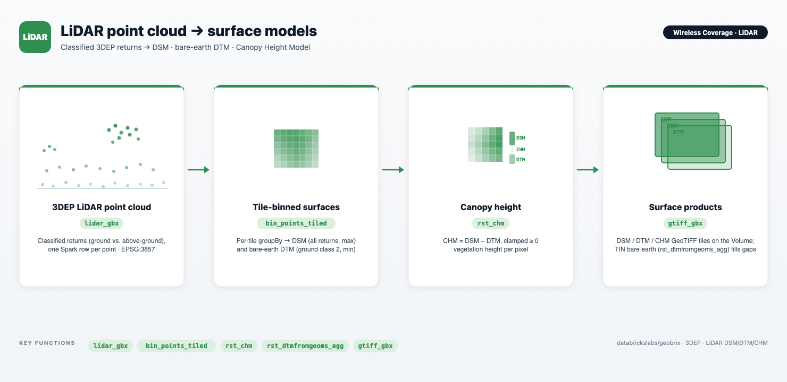

# Wireless Coverage — LiDAR surface foundations

A notebook series that builds the **elevation and surface data foundation** for wireless-coverage
analysis directly from a USGS 3DEP **LiDAR point cloud** — data first, analytics later. The surfaces
produced here (CHM, DSM, bare-earth DTM) are the inputs later parts consume for antenna siting and
line-of-sight (`rst_viewshed`).

The LiDAR notebooks (Parts 1, 2a, 3, and 4) work over **all of San Francisco** (`SF_AOI = (-122.55, 37.70, -122.35, 37.85)`), reading
the staged 3DEP LiDAR (`.laz` EPT nodes) with the GeoBrix **`lidar_gbx`** reader and binning returns into
1 m rasters **per spatial tile** with the bounded `rx.bin_points_tiled` (a single 1 m raster over SF is
~460 M pixels; the bounded binner keeps peak memory ∝ the raster grid, not the point count, so
full-density `DECIMATE=1` never OOMs). Part 2b covers the same SF area but starts from a DSM raster
rather than a point cloud. Binned surfaces are persisted to **permanent tables** you own
(a `CATALOG.SCHEMA` you set) and read back downstream.

## Notebooks

| Notebook | What it builds | Key GeoBrix functions |
|---|---|---|
| **`01_pure_lidar_chm.ipynb`** | A **Canopy Height Model straight from the point cloud** — no external DEM, no coverage gaps. Bin ground returns (ASPRS class 2) → `min` = bare-earth DTM; bin all returns → `max` = DSM; `rst_chm(DSM, DTM)` = canopy. | `lidar_gbx` reader, `bin_points_tiled`, `rst_chm` |
| **`02a_surfaces_dsm_dtm_chm.ipynb`** | The **main arc**. Builds on Part 1's LiDAR point cloud and promotes a **TIN bare-earth DTM** (`rst_dtmfromgeoms_agg`) as the production terrain — beyond pixels, gap-free from the ground returns' own classification. Persists the canonical `wc_surface_{dsm,dtm,chm}` tables and `OUT_DIR` GeoTIFFs. Includes a binned-`min` DTM comparison. | `bin_points_tiled`, `rst_dtmfromgeoms_agg` (+ product `st_makepoint`), `rst_chm`, `gtiff_gbx` |
| **`02b_surfaces_from_dsm.ipynb`** | **DSM-origin alternative** for when no LiDAR point cloud is available. Approximates a bare-earth DTM from a DSM raster via `rst_filter` morphological opening (min then max), then derives the CHM with `rst_chm`. An honest pixel-only approximation — for production use without a point cloud, a published terrain product (USGS 3DEP) is preferred. Lands the same canonical surface tables so Parts 3 and 4 work unchanged. | `rst_filter`, `rst_chm` |

In brief: **Part 1** is the shortest path from LiDAR returns to a canopy model; **Part 2a** is the
production arc — it promotes a TIN bare-earth DTM from the same point cloud and writes the permanent
surface tables Parts 3 and 4 consume; **Part 2b** is the DSM-raster alternative for when no point
cloud is on hand (a pixel-only approximation — use USGS 3DEP for production terrain without LiDAR).

## Data

- **Point cloud** — staged 3DEP LiDAR `.laz` (Entwine Point Tile nodes) under
  `/Volumes/geospatial_docs/wireless_coverage/data/lidar/sf/laz/{GoldenGate,SanFranCoast}`. The
  `lidar_gbx` reader recurses the subfolders; each `.laz` becomes one Spark partition of points
  (`x, y, z, classification, return_number, …`, EPSG:3857).
- **Surface products (Part 2a / 2b output)** — DSM / DTM / CHM GeoTIFF tiles written to
  `/Volumes/geospatial_docs/geobrix/sample-data/geobrix-examples/sf/lidar-surfaces` via the
  `gtiff_gbx` writer.

## Runtime

All notebooks run on the **lightweight tier** — `geobrix[light_env5,vizx]`, pure Python/PySpark bindings
with no JAR or GDAL init script — targeting **Databricks Serverless environment 5** (`laspy`/`lazrs` for the
LiDAR reader ship with the light base). `DECIMATE=1` keeps **every** return (~830 M over SF) — an honest
big-data run; raise `DECIMATE` (e.g. 10) for a fast coarse pass while iterating. See
[Execution Tiers](https://databrickslabs.github.io/geobrix/docs/api/execution-tiers).

## Related

- **DEM extra** — [`../h3-rasterize`](../h3-rasterize) takes the complementary path: a ready-made **10 m
  seamless DEM** over the Bay Area through the full raster→H3 pipeline (`rst_clip` → `rst_isoband` →
  product H3 → `rst_h3_rasterize_agg` → `rst_frombands_agg`). No LiDAR required.
