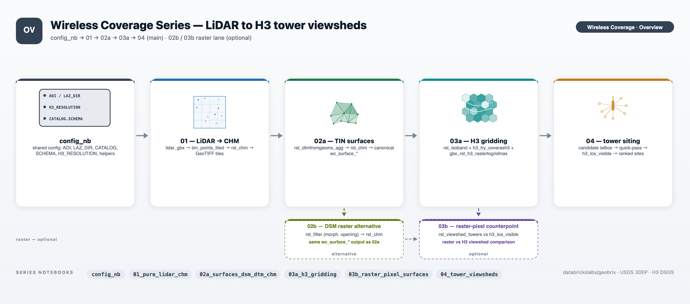

# Wireless Coverage Lakeflow — LiDAR Surfaces + Tower Siting (SDP)

A production-ready **Wireless Coverage pipeline**: a [Lakeflow Declarative Pipeline](https://docs.databricks.com/aws/en/dlt/) (SDP) plus a post-pipeline tower-siting task, built as a [Databricks Asset Bundle](https://docs.databricks.com/aws/en/dev-tools/bundles/) and running entirely on the GeoBrix **lightweight tier** over **Serverless** compute.

> **Requires GeoBrix 0.5.2+.** Both the pipeline and the siting task install `geobrix[light_env6,vizx]` from a staged wheel. The `gbx_wheel` variable must point at `geobrix-0.5.2-py3-none-any.whl` or newer, staged on a Unity Catalog Volume.

This is the production counterpart to the [Wireless Coverage notebook series](../README.md). It runs the same San Francisco AOI and USGS 3DEP LiDAR data, but as a **scheduled medallion pipeline** rather than one-off notebook outputs: a `land` downloader task stages the raw data, the Lakeflow pipeline cascades it bronze → silver → gold, a `siting` task runs the H3-native tower analysis at scale, and a `validate` notebook confirms all outputs.

---

## How it works: from staged LiDAR to ranked tower sites



A scheduled run moves raw `.laz` files through six stages:

1. **Land** — a downloader task (`land/land.py`) stages USGS 3DEP LiDAR EPT nodes and Overture water polygons onto a Unity Catalog Volume. Nothing is interpreted yet — data just arrives.
2. **Bronze — inventory** — Auto Loader records one row per `.laz` file as it appears (`laz_inventory`), so re-runs pick up only newly staged data.
3. **Silver — surface stack** — classified returns are tile-indexed (`wc_lidar_pts`) and binned into 1 m DSM and TIN DTM rasters per tile (`wc_surface_dsm`, `wc_surface_dtm`); `rst_chm` derives the Canopy Height Model (`wc_surface_chm`).
4. **Gold — H3 grids** — the surfaces are reprojected to EPSG:4326, isobanded, and indexed to H3 cells at resolution 10 (`wc_h3_dem_res10`, `wc_h3_dsm_res10`, `wc_h3_chm_res10`). Each table carries a stable res-9 join key so downstream consumers join on one column.
5. **Siting** — a post-pipeline Spark task runs the H3-native tower-siting analysis: a res-9 candidate lattice, a coarse quick-pass to rule out weak sites, and exact res-12 H3 line-of-sight viewsheds on survivors (distributed via `h3_viewshed_towers` — one tower per Spark task, Serverless fan-out). Writes six regular Delta tables.
6. **Validate** — a final notebook task confirms all six tables are populated and spot-checks key quality assertions.

Each stage reads only the one before it — declared as table-to-table dependencies — so Lakeflow builds the lineage graph, orders the stages, and recomputes only what changed.

---

## Architecture

```
databricks bundle  →  wireless_coverage_lf_job
                         ├─ Task 1 "land"       (Serverless spark_python_task)
                         │    stages USGS 3DEP LiDAR EPT nodes + Overture water
                         │    polygons to a Unity Catalog Volume
                         ├─ Task 2 "pipeline"   (depends on land)
                         │    wireless_coverage_lf_pipeline (Lakeflow SDP, serverless)
                         │    bronze laz_inventory → silver surfaces → gold H3 grids
                         ├─ Task 3 "siting"     (depends on pipeline)
                         │    siting/siting.py — Part-4 tower viewsheds at scale
                         │    (spark_python_task, Serverless)
                         └─ Task 4 "validate"   (depends on siting)
                              validate/validate_wc_lf.ipynb — confirms all outputs
```

**Task 2 — `pipeline`**: the Lakeflow Declarative Pipeline (`wireless_coverage_lf_pipeline`, `serverless: true`), rooted at `./transformations`. Its environment installs `${var.gbx_wheel}[light_env6,vizx]` as a **single pip dependency entry** (keeping pip's resolver in one pass).

**Task 3 — `siting`**: reads `wc_surface_dsm` and `wc_surface_dtm` from the pipeline, bins them to H3 at multiple resolutions, builds the naive res-9 candidate lattice, rules out weak sites with a coarse quick-pass, then runs exact res-12 H3 line-of-sight viewsheds on survivors via `h3_viewshed_towers` (distributed — one tower per Spark task). Writes six regular Delta tables overwritten each run.

---

## Table catalog

All tables land in `{catalog}.{schema}` (defaults: `geospatial_docs.wireless_coverage_lf`).

### Bronze

| Table | Description |
|---|---|
| `laz_inventory` | Auto Loader streaming table — one row per staged `.laz` EPT file (`path`, `file_size`, `_ingested_at`). |

### Silver

| Table | Description |
|---|---|
| `wc_lidar_pts` | Classified LiDAR returns, tile-indexed with a res-15 H3 cell ID (`cellid_r15`, EPSG:3857). |
| `wc_surface_dsm` | DSM — max elevation of all returns per 1 m tile (EPSG:3857). |
| `wc_surface_dtm` | DTM — Delaunay-TIN bare earth over class-2 ground returns (gap-free, EPSG:3857). |
| `wc_surface_chm` | CHM — `rst_chm(DSM, DTM)`: canopy/structure height in metres, clamped ≥ 0. |

### Gold

| Table | Description |
|---|---|
| `wc_h3_dem_res10` | Bare-earth elevation-band H3 cells (res 10), land-masked, with res-9 parent join key. |
| `wc_h3_dsm_res10` | Surface elevation-band H3 cells (res 10), land-masked, with res-9 parent join key. |
| `wc_h3_chm_res10` | Max canopy/structure height per H3 cell (res 10), gap-filled, land-masked, with res-9 parent join key. |

### Siting

Regular Delta tables, overwritten each run. Coverage outputs are H3-indexed at resolution 12 and carry the res-9 parent join key.

| Table | Description |
|---|---|
| `wc_h3_surf_r13` | H3 res-13 surface bin (DSM max elevation per cell) — finest-resolution blocker surface for the siting algorithm. |
| `wc_h3_grnd_r13` | H3 res-13 ground bin (DTM min elevation per cell) — finest-resolution bare-earth base. |
| `wc_h3_quickpass_res9` | Every res-9 candidate's coarse quick-pass coverage fraction (pre-rule-out screen). |
| `wc_h3_candidate_sites_res9` | Ranked tower survivors: `required_mast` (m), `viewshed_cells`, `viewshed_pct`, `observer_z`, `lon`, `lat`. |
| `wc_h3_coverage_res12` | Per-cell line-of-sight depth at res 12 (`tower_los_count`) — how many sited towers can see each cell. H3-indexed output suitable for external H3 map layers. Carries the res-9 parent join key (`parent_cellid`, `parent_cellid_res`). |
| `wc_h3_coverage_top10_res12` | Same as `wc_h3_coverage_res12`, aggregated over only the top-10 sites by coverage. H3-indexed output suitable for external H3 map layers. Carries the res-9 parent join key. |

---

## Deploy and run

```bash
databricks bundle deploy
databricks bundle run wireless_coverage_lf_job
```

The bundle validates and deploys with the committed defaults in `databricks.yml` out of the box. For a workspace-specific deploy, copy `databricks.override.yml.example` to `databricks.override.yml` (git-ignored) and fill in your details:

```yaml
targets:
  dev:
    workspace:
      profile: YOUR_CLI_PROFILE
    variables:
      # catalog: my_catalog
      # schema: my_wireless_coverage_lf
      # gbx_wheel: /Volumes/my_catalog/my_schema/vol/geobrix-0.5.2-py3-none-any.whl

      # Reuse already-staged LiDAR from the notebook series (skip the ~830 MB download):
      # laz_dir: /Volumes/geospatial_docs/wireless_coverage/data/lidar/sf/laz
      # water_mask_dir: /Volumes/geospatial_docs/geobrix/sample-data/geobrix-examples/sf/overture-water-bay
```

The override file is layered in automatically via `include: ["*.override.yml"]`. A fresh clone with no override file still validates/deploys.

- **Schedule**: the job ships with a daily schedule (`0 0 7 * * ?`, America/Chicago) but **paused** (`pause_status: PAUSED`) — unpause it in the workspace (or in `databricks.yml`) once you've confirmed a manual run.
- **Shared LiDAR**: if you have already run the notebook series and staged the USGS 3DEP data, set `laz_dir` (and optionally `water_mask_dir`) in your override file to reuse those files and skip the ~830 MB download.
- **GeoBrix wheel**: `gbx_wheel` defaults to a staged `geobrix-0.5.2-py3-none-any.whl`. Stage your own build at that path or override the variable to wherever your wheel lives.

---

## Configuration

### Bundle variables

| Variable | Default | Description |
|---|---|---|
| `catalog` | `geospatial_docs` | Unity Catalog catalog name. |
| `schema` | `wireless_coverage_lf` | UC schema; all pipeline and siting tables land here. |
| `volume` | `data` | UC volume; raw data lands under `{volume}/wireless-coverage-lf/`. |
| `full_aoi` | `true` | `true` for the full San Francisco AOI; `false` for the Golden Gate Park demo window. |
| `laz_dir` | _(derived)_ | Path to staged `.laz` EPT files. Leave empty to auto-derive under the Volume. Set to the notebook series' Volume path to reuse already-staged LiDAR. |
| `water_mask_dir` | _(derived)_ | Path to staged Overture water GeoParquet. Leave empty to auto-derive. |
| `gbx_wheel` | `/Volumes/geospatial_docs/geobrix/sample-data/geobrix-0.5.2-py3-none-any.whl` | Path to the staged GeoBrix wheel. |

### Algorithm and resolution parameters

Tunable via `wireless_coverage.*` keys in the pipeline `configuration` block (all other keys use the defaults in `transformations/_config.py`). Key knobs:

| Config key | Default | Description |
|---|---|---|
| `h3_res` | `10` | H3 resolution for the gold elevation/canopy grids. |
| `tower_res` | `9` | H3 resolution for the naive candidate-tower lattice. |
| `quickpass_res` | `10` | Coarse quick-pass screen resolution. |
| `viewshed_res` | `12` | Exact H3 line-of-sight resolution (coverage output). |
| `surface_bin_res` | `13` | Finest H3 "pixel" bin resolution for siting blocker/ground surfaces. |
| `max_dist_m` | `2500` | Line-of-sight buffer radius in metres. |
| `antenna_above_surface_m` | `10` | Observer height above the DSM surface in metres. |
| `target_h` | `1.6` | Receiver height above ground in metres. |
| `quick_thresh_frac` | `0.30` | Minimum coarse coverage fraction to survive the quick pass. |
| `ground_fill_k` | `3` | K-ring radius for nearest-ground fallback (required-mast computation). |

To override, add the keys to the pipeline `configuration` block in your `databricks.override.yml`:

```yaml
resources:
  pipelines:
    wireless_coverage_lf_pipeline:
      configuration:
        wireless_coverage.h3_res: "11"
        wireless_coverage.viewshed_res: "13"
```

---

## Prerequisites

- **Unity Catalog**: a catalog and schema (defaults `geospatial_docs.wireless_coverage_lf`) and a Volume named `data` under it. The pipeline creates sub-directories inside the Volume but not the Volume itself.
- **GeoBrix wheel** staged at the `gbx_wheel` path (default: `/Volumes/geospatial_docs/geobrix/sample-data/geobrix-0.5.2-py3-none-any.whl`). The pipeline and all job tasks install `${gbx_wheel}[light_env6,vizx]` from this path.
- **Network access**: the `land` task fetches from USGS 3DEP and Overture Maps over HTTPS — Serverless has outbound internet by default.

---

## Validation notebook

`validate/validate_wc_lf.ipynb` runs as the final job task after the siting task completes. It reads all six siting output tables, confirms each is non-empty, and prints summary statistics. You can also run it manually from the workspace at any point as a quick sanity check after a fresh deploy or configuration change.

---

## Files

| Path | Purpose |
|---|---|
| `databricks.yml` | Bundle definition: variables, the `wireless_coverage_lf_pipeline` resource, and the `wireless_coverage_lf_job` (land + pipeline + siting + validate tasks, schedule). |
| `databricks.override.yml.example` | Template for the git-ignored `databricks.override.yml` (workspace CLI profile and variable overrides). |
| `land/land.py` | Task 1 downloader driver — stages USGS 3DEP LiDAR EPT nodes and Overture water polygons to the Volume. |
| `transformations/_config.py` | Shared pipeline configuration (`cfg`, `paths`, `register_gbx`) read from `spark.conf`. |
| `transformations/bronze_lidar.py` | Auto Loader bronze streaming table (`laz_inventory`). |
| `transformations/silver_surfaces.py` | Silver materialized views: `wc_lidar_pts`, `wc_surface_dsm`, `wc_surface_dtm`, `wc_surface_chm`. |
| `transformations/gold_h3_grids.py` | Gold materialized views: `wc_h3_dem_res10`, `wc_h3_dsm_res10`, `wc_h3_chm_res10`. |
| `siting/siting.py` | Siting task entry point — Part-4 tower viewsheds at scale. Writes all six siting tables. |
| `validate/validate_wc_lf.ipynb` | Validation notebook — confirms all output tables are populated. |
| `tests/` | Unit tests for the siting policy helpers (`quick_survivors`, `required_mast`, `rank_candidates`). |
